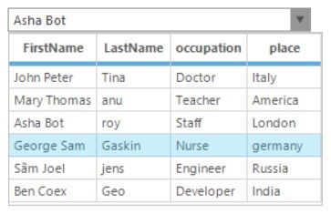

# Appearance in Windows Forms MultiColumn ComboBox

Visual styles for the [MultiColumnComboBox](https://help.syncfusion.com/cr/windowsforms/Syncfusion.Tools.Windows~Syncfusion.Windows.Forms.Tools.MultiColumnComboBox.html) control can be specified using [MultiColumnComboBox.Style](https://help.syncfusion.com/cr/windowsforms/Syncfusion.Tools.Windows~Syncfusion.Windows.Forms.Tools.MultiColumnComboBox~Style.html) property. The various styles are,

* Office2003
* OfficeXP
* VS2005
* Office2007 (with all the three color schemes).
* Metro
* Office2016Colorful
* Office2016White
* Office2016Black
* Office2016DarkGray




this.multiColumnComboBox1.Style = Syncfusion.Windows.Forms.VisualStyle.Office2007;
this.multiColumnComboBox1.Office2007ColorTheme = Syncfusion.Windows.Forms.Office2007Theme.Black;





Me.multiColumnComboBox1.Style = Syncfusion.Windows.Forms.VisualStyle.Office2007
Me.multiColumnComboBox1.Office2007ColorTheme = Syncfusion.Windows.Forms.Office2007Theme.Black




 

 

 Code snippet for setting "Office2016Colorful" style for [MultiColumnComboBox](https://help.syncfusion.com/cr/windowsforms/Syncfusion.Tools.Windows~Syncfusion.Windows.Forms.Tools.MultiColumnComboBox.html)




this.multiColumnComboBox1.Style = Syncfusion.Windows.Forms.VisualStyle.Office2016Colorful;





Me.multiColumnComboBox1.Style = Syncfusion.Windows.Forms.VisualStyle.Office2016Colorful




## Custom colors

We can also apply custom colors to the [MultiColumnComboBox](https://help.syncfusion.com/cr/windowsforms/Syncfusion.Tools.Windows~Syncfusion.Windows.Forms.Tools.MultiColumnComboBox.html) control by setting `Office2007ColorTheme` to `Managed` and specifying the custom color through the `ApplyManagedColors` method as follows.




this.multiColumnComboBox1.Office2007ColorTheme = Syncfusion.Windows.Forms.Office2007Theme.Managed;
Office2007Colors.ApplyManagedColors(this, Color.Orchid);





Me.multiColumnComboBox1.Office2007ColorTheme = Syncfusion.Windows.Forms.Office2007Theme.Managed;
Office2007Colors.ApplyManagedColors(Me, Color.Orchid)




## See Also

[How to change WinForms MultiColumnComboBox row colors?](https://www.syncfusion.com/forums/152520/how-to-change-winforms-multicolumncombobox-row-colors)