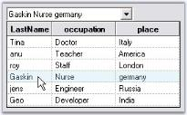

# How to Display Multiple Members in a MultiColumnComboBox

This section deals with displaying multiple members in a [MultiColumnComboBox](https://help.syncfusion.com/cr/windowsforms/Syncfusion.Tools.Windows~Syncfusion.Windows.Forms.Tools.MultiColumnComboBox.html). Follow the steps to achieve the same.

1.Initialization of the [MultiColumnComboBox](https://help.syncfusion.com/cr/windowsforms/Syncfusion.Tools.Windows~Syncfusion.Windows.Forms.Tools.MultiColumnComboBox.html).




private Syncfusion.Windows.Forms.Tools.MultiColumnComboBox multiColumnComboBox1;
this.multiColumnComboBox1=new Syncfusion.Windows.Forms.Tools.MultiColumnComboBox();
this.Controls.Add(this.multiColumnComboBox1); 





Private multiColumnComboBox1 As Syncfusion.Windows.Forms.Tools.MultiColumnComboBox
Me.multiColumnComboBox1 = New Syncfusion.Windows.Forms.Tools.MultiColumnComboBox()
Me.Controls.Add(Me.multiColumnComboBox1)




2.Populate the [MultiColumnComboBox](https://help.syncfusion.com/cr/windowsforms/Syncfusion.Tools.Windows~Syncfusion.Windows.Forms.Tools.MultiColumnComboBox.html) with data. Refer [Data Binding](https://help.syncfusion.com/windowsforms/multicolumncombobox/data-binding) topic.

3.In order to display the contents of the entire row in the [MultiColumnComboBox](https://help.syncfusion.com/cr/windowsforms/Syncfusion.Tools.Windows~Syncfusion.Windows.Forms.Tools.MultiColumnComboBox.html) instead of the using DisplayMember property, can achieve by handling the [MultiColumnComboBox.SelectedIndexChanged](https://help.syncfusion.com/cr/cref_files/windowsforms/Syncfusion.Tools.Windows~Syncfusion.Windows.Forms.Tools.ComboBoxBaseDataBound~SelectedIndexChanged_EV.html) and [MultiColumnComboBox.DropDown](https://help.syncfusion.com/cr/cref_files/windowsforms/Syncfusion.Shared.Base~Syncfusion.Windows.Forms.Tools.ComboDropDown~DropDown_EV.html) events as shown below.




bool dropDownOpened = false;

string text = "";

private void Form1_Load(object sender, EventArgs e)
{
    this.multiColumnComboBox1.SelectedIndexChanged += multiColumnComboBox1_SelectedIndexChanged;
    this.multiColumnComboBox1.DropDown += multiColumnComboBox1_DropDown;
}

private void multiColumnComboBox1_DropDown(object sender, System.EventArgs e)
{
    this.dropDownOpened = true;
}

private void multiColumnComboBox1_SelectedIndexChanged(object sender, System.EventArgs e)
{
    if (this.dropDownOpened == true)
    {
        for (int i = 1; i <= this.multiColumnComboBox1.ListBox.Grid.ColCount; i++)
        {
            text += this.multiColumnComboBox1.ListBox.Grid[this.multiColumnComboBox1.SelectedIndex + 1, i].Text + " ";
        }
        this.dropDownOpened = false;
        this.multiColumnComboBox1.Text = text;
    }
    text = "";
}




 
Private dropDownOpened As Boolean = False

Private text As String = ""

Private Sub Form1_Load(sender As Object, e As EventArgs) Handles MyBase.Load
    AddHandler Me.multiColumnComboBox1.SelectedIndexChanged, AddressOf multiColumnComboBox1_SelectedIndexChanged
    AddHandler Me.multiColumnComboBox1.DropDown, AddressOf multiColumnComboBox1_DropDown
End Sub

Private Sub multiColumnComboBox1_DropDown(ByVal sender As Object, ByVal e As System.EventArgs)
    Me.dropDownOpened = True
End Sub

Private Sub multiColumnComboBox1_SelectedIndexChanged(ByVal sender As Object, ByVal e As System.EventArgs)
    If Me.dropDownOpened = True Then
        For i As Integer = 1 To Me.multiColumnComboBox1.ListBox.Grid.ColCount
            text += Me.multiColumnComboBox1.ListBox.Grid(Me.multiColumnComboBox1.SelectedIndex + 1, i).Text & " "
        Next
        Me.dropDownOpened = False
        Me.multiColumnComboBox1.Text = text
    End If
    text = ""
End Sub




The output for the above code is shown below

[View Sample in GitHub](https://github.com/SyncfusionExamples/How-to-display-multiple-members-in-WinForms-MultiColumnComboBox)