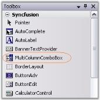

# Getting Started

The MultiColumnComboBox control provides full support for the Windows Forms designer. To use a MultiColumnComboBox control in your application, all you need to do is drag-and-drop the MultiColumnComboBox control from the toolbox onto your form. You can then set any of its properties through the property grid. 

 

The MultiColumnComboBox can be created programmatically through code as detailed below.

1. Include the required namespace.




using Syncfusion.Windows.Forms.Tools;





Imports Syncfusion.Windows.Forms.Tools




2. Create an instance of MultiColumnComboBox. Add that instance to the Form.




private Syncfusion.Windows.Forms.Tools.MultiColumnComboBox multiColumnComboBox1;
this.multiColumnComboBox1=new Syncfusion.Windows.Forms.Tools.MultiColumnComboBox();
this.Controls.Add(this.multiColumnComboBox1);





Private multiColumnComboBox1 As Syncfusion.Windows.Forms.Tools.MultiColumnComboBox
Me.multiColumnComboBox1 = New Syncfusion.Windows.Forms.Tools.MultiColumnComboBox()
Me.Controls.Add(Me.multiColumnComboBox1)




After creating MultiColumnComboBox, you can bound them using data source. Refer [DataBinding](/windowsforms/multicolumncombobox/data-binding).

