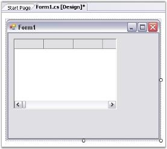
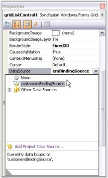

# Getting Started in Windows Forms MultiColumn ListBox (GridListControl)

This section explains creating a simple application with [WinForms MultiColumn ListBox](https://www.syncfusion.com/winforms-ui-controls/multicolumn-listbox) Control and its functionalities.

## Assembly Deployment
Refer [control dependencies](https://help.syncfusion.com/windowsforms/control-dependencies#gridlistcontrol) section to get the list of assemblies or NuGet package needs to be added as reference to use the control in any application. 

The following assemblies should be added as reference to use the GridListControl in any application.

<table>
<tr>
<th>
Required assemblies  </th><th>
Description  </th></tr>
<tr>
<td>
{{'[Syncfusion.Grid.Windows](https://help.syncfusion.com/cr/windowsforms/Syncfusion.Windows.Forms.Grid.html)'| markdownify }}  </td><td>
Contains classes that handles all UI operations, fundamentals, and base classes of the GridListControl.  </td></tr>
<tr>
<td>
{{'[Syncfusion.Shared.Base](https://help.syncfusion.com/cr/windowsforms/Syncfusion.Windows.Forms.html)'| markdownify }}  </td><td>
Contains the style related properties and various editor controls used in the GridListControl.  </td></tr>
</table>

## Creating application with GridListControl

This section provides step-by-step procedure to create a GridList control through designer and programmatic approach in a .NET application.

### Through designer

Drag the control onto the form, size it and set the desired properties if the data source is available. If it is not available, create a data source by using the following steps:

1. Drag an SqlDataAdapter from Data tab of the toolbox onto the form. Follow the steps in the wizard to select database and SQL query used to generate the table.

   

2. Click the SqlAdapter in the components tray with the right mouse button and generate a dataset for this adapter by just taking the defaults. 

    

3. In the Form_Load event handler, the Fill method will be called automatically for this SqlDataAdapter by passing dataset generated in the previous step.

    

4. Drag the GridListControl object from your toolbox and drop it onto the form.

    

5. Size and position it.
6. Go to the Properties dialog of this GridList control and set the DataSource property of this control to an appropriate object.

    

7. Run the application. 

    

This designer-created data source is available to use as the data source member of Grid List control. For a complete step-by-step tutorial on how to use the designer to create data source, see the Grid Data Bound Grid tutorial.

### Through code

The GridList control sample that ships with Essential Grid does not use the designer. It creates an ArrayList of objects that serves as a data source for the GridList control. Each state object has a LongName, ShortName, and ImageIndex properties that can be displayed in the list control.  

For the complete implementation details, refer to the sample in the following installation path:

**_<Install Location>\Syncfusion\EssentialStudio\[Version Number]\Windows\Grid.Windows\Samples\Grid List Control_**



//Sets to array list of states.
gridListBox1.DataSource = USStates;

//ImageList-the images displayed in the list.      
gridListBox1.ImageList = imageList;

//Displays multiple columns.
gridListBox1.MultiColumn = true;
gridListBox1.ShowColumnHeader = true;
gridListBox1.SelectionMode = SelectionMode.One;

//Makes the last column wide enough to fill client area.
gridListBox1.FillLastColumn = true; 


'Sets to array list of states.
gridListBox1.DataSource = USStates        

'ImageList-the images displayed in the list.       
gridListBox1.ImageList = ImageList           

'Displays multiple columns.       
gridListBox1.MultiColumn = True                
gridListBox1.ShowColumnHeader = True
gridListBox1.SelectionMode = SelectionMode.One

'Makes last column.
gridListBox1.FillLastColumn = True             



## Selection

Selection for the GridListControl can be enabled by using the SelectionMode property. The `GridListControl` supports three types of selection behaviors based on the [SelectionMode](https://help.syncfusion.com/windowsforms/multicolumn-listbox/data-binding-and-selection-modes) option. The SelectionBehaviors can be specified to one for selecting single row or multi-simple to select many rows.
