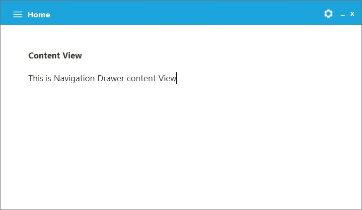
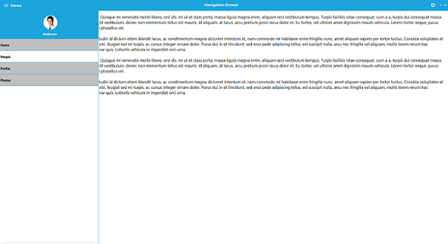
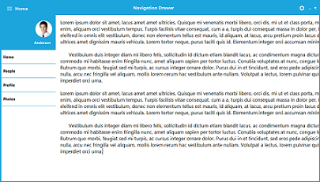
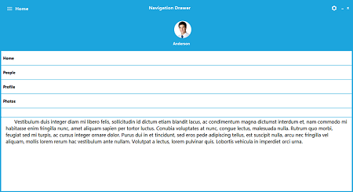

# Concepts and Features in Windows Forms Navigation Drawer

## ContentView

ContentView is the main view of the NavigationDrawer on which the desired items can be placed. For example, RichTextBox can be used in this sample.





//Creates RichTextBox instance.

RichTextBox richTextBox = new RichTextBox();

//Specifies the Text

this.richTextBox.Text = "Content View" + "\n" + "\n" + "This is Navigation Drawer content View";

//Add RichTextBox into the NavigationDrawer Container Control.

this.navigationDrawer1.ContentViewContainer.Controls.Add(richTextbox);





'Creates RichTextBox instance.

Dim richTextbox As New RichTextBox()

'Specifies the Text

Me.richTextBox.Text = ("Content View" + ("" & vbLf + ("" & vbLf + "This is Navigation Drawer content View")))

'Add RichTextBox into the NavigationDrawer Container Control.

Me.navigationDrawer1.ContentViewContainer.Controls.Add(richTextbox)





## DrawerView

DrawerView is a container, that will be displayed upon selection on top, along and below with the Content view section. This will contain below sections.

### Default color customization

The default color of item can be customized by using [DefaultColor](https://help.syncfusion.com/cr/windowsforms/Syncfusion.Windows.Forms.Tools.DrawerMenuItem.html#Syncfusion_Windows_Forms_Tools_DrawerMenuItem_DefaultColor) property of [DrawerMenuItem](https://help.syncfusion.com/cr/windowsforms/Syncfusion.Windows.Forms.Tools.DrawerMenuItem.html). The backcolor of the item will be updated based on the value of [DefaultColor](https://help.syncfusion.com/cr/windowsforms/Syncfusion.Windows.Forms.Tools.DrawerMenuItem.html#Syncfusion_Windows_Forms_Tools_DrawerMenuItem_DefaultColor).





// Back color
this.drawerMenuItem1.BackColor = System.Drawing.Color.Silver; 

// Hover color
this.drawerMenuItem1.HoverColor = System.Drawing.Color.White;           

// Default color
this.drawerMenuItem1.DefaultColor = System.Drawing.Color.Silver; 





' Back color
Me.drawerMenuItem1.BackColor = System.Drawing.Color.Silver

' Hover color
Me.drawerMenuItem1.HoverColor = System.Drawing.Color.White

' Default color
Me.drawerMenuItem1.DefaultColor = System.Drawing.Color.Silver





## Transition

This support specifies the animations for the DrawerView panel. [Transition](https://help.syncfusion.com/cr/windowsforms/Syncfusion.Windows.Forms.Tools.NavigationDrawer.html#Syncfusion_Windows_Forms_Tools_NavigationDrawer_Transition) needs to have following three options.

* SlideOnTop
* Push
* Reveal

### SlideOnTop

That draws the Drawer Content on top of the Content view content.





//Adds Transition property into NavigationDrawer

this.navigationDrawer1.Transition = Transition.SlideOnTop;





‘Adds Transition property into NavigationDrawer

Me.navigationDrawer1.Transition = Transition.SlideOnTop





### Push

This [Transition](https://help.syncfusion.com/cr/windowsforms/Syncfusion.Windows.Forms.Tools.NavigationDrawer.html#Syncfusion_Windows_Forms_Tools_NavigationDrawer_Transition) moves the Drawer and content view section simultaneously.





//Adds Transition property into NavigationDrawer

this.navigationDrawer1.Transition = Transition.Push;





'Adds Transition property into NavigationDrawer

Me.navigationDrawer1.Transition = Transition.Push





### Reveal

In this [transition](https://help.syncfusion.com/cr/windowsforms/Syncfusion.Windows.Forms.Tools.NavigationDrawer.html#Syncfusion_Windows_Forms_Tools_NavigationDrawer_Transition), the Drawer content section will be stable and the content view section will be moved to reveal the drawer content.





//Adds Transition property into NavigationDrawer

this.navigationDrawer1.Transition = Transition.Push;





'Adds Transition property into NavigationDrawer

Me.navigationDrawer1.Transition = Transition.Push





## Position

The [Position](https://help.syncfusion.com/cr/windowsforms/Syncfusion.Windows.Forms.Tools.NavigationDrawer.html#Syncfusion_Windows_Forms_Tools_NavigationDrawer_Position) property helps user to specify the sliding position of the DrawerView and it will have the following four options.

* Left – Slides from left direction.
* Right – Slides from right direction.
* Top – Slides from Top direction.
* Bottom – Slides from Bottom direction.





//Adds Position property into the NavigationDrawer

this.navigationDrawer1.Position = Position.Left;





'Adds Transition property into NavigationDrawer

Me.navigationDrawer1.Transition = Transition.Push





* Left

* Right

* Top

* Bottom

## Animation duration

The [AnimationDuration](https://help.syncfusion.com/cr/windowsforms/Syncfusion.Windows.Forms.Tools.NavigationDrawer.html#Syncfusion_Windows_Forms_Tools_NavigationDrawer_AnimationDuration) property helps to specify TimeSpan value, by which the DrawerContent can be brought to view.
 




//Sets AnimationDuration for the NavigationDrawer

 this.navigationDrawer1.AnimationDuration = 100;





'Sets AnimationDuration for the NavigationDrawer

Me.navigationDrawer1.AnimationDuration = 100





## Toggle drawer

The [ToggleDrawer](https://help.syncfusion.com/cr/windowsforms/Syncfusion.Windows.Forms.Tools.NavigationDrawer.html#Syncfusion_Windows_Forms_Tools_NavigationDrawer_ToggleDrawer().html) method helps to toggle between Sliding Panel visibility.





//Calls the ToggleDrawer function

this.navigationDrawer1.ToggleDrawer();





'Calls the ToggleDrawer function

Me.navigationDrawer1.ToggleDrawer()




