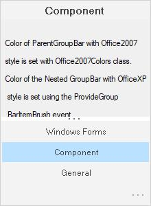
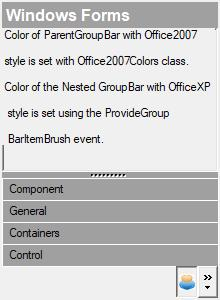
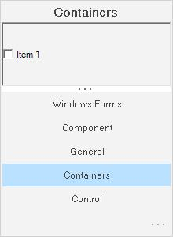

# GroupBar settings

The look and feel of the GroupBar can be controlled through the appearance properties of the control. These properties are discussed in detail in the below topics.

## Integrated scrolling

Scroll buttons can be included for the client controls in the GroupBar by setting the [IntegratedScrolling](https://help.syncfusion.com/cr/windowsforms/Syncfusion.Shared.Base~Syncfusion.Windows.Forms.Tools.GroupBar~IntegratedScrolling.html) property to `true`.





this.groupBar1.IntegratedScrolling = true;



 

Me.groupBar1.IntegratedScrolling = True 





 

## StackedGroupBar

The following are the properties available for GroupBar Items when the GroupBar is in the Stacked Mode. The Stacked Mode can be enabled by setting the [StackedMode](https://help.syncfusion.com/cr/windowsforms/Syncfusion.Shared.Base~Syncfusion.Windows.Forms.Tools.GroupBar~StackedMode.html) property to `true`.

* [InNavigationPane](https://help.syncfusion.com/cr/windowsforms/Syncfusion.Shared.Base~Syncfusion.Windows.Forms.Tools.GroupBarItem~InNavigationPane.html)
* [NavigationPaneIcon](https://help.syncfusion.com/cr/windowsforms/Syncfusion.Shared.Base~Syncfusion.Windows.Forms.Tools.GroupBarItem~NavigationPaneIcon.html)
* [NavigationPaneImage](https://help.syncfusion.com/cr/windowsforms/Syncfusion.Shared.Base~Syncfusion.Windows.Forms.Tools.GroupBarItem~NavigationPaneImage.html)
* [ShowChevron](https://help.syncfusion.com/cr/windowsforms/Syncfusion.Shared.Base~Syncfusion.Windows.Forms.Tools.GroupBar~ShowChevron.html)



  

// StackeMode set to true.

this.groupBarItem1.InNavigationPane = true;

this.groupBarItem1.NavigationPaneIcon = ((System.Drawing.Icon)(resources.GetObject("groupBarItem1.NavigationPaneIcon")));

this.groupBarItem1.NavigationPaneImage = ((System.Drawing.Image)(resources.GetObject("groupBarItem1.NavigationPaneImage")));





' StackeMode set to true.

Me.groupBarItem1.InNavigationPane = True

Me.groupBarItem1.NavigationPaneIcon = DirectCast((Resources.GetObject("groupBarItem1.NavigationPaneIcon")), System.Drawing.Icon)

Me.groupBarItem1.NavigationPaneImage = DirectCast((Resources.GetObject("groupBarItem1.NavigationPaneImage")), System.Drawing.Image)





If you want to display an icon or image for the GroupBar Item displayed in the GroupBar's navigation pane, set the [InNavigationPane](https://help.syncfusion.com/cr/windowsforms/Syncfusion.Shared.Base~Syncfusion.Windows.Forms.Tools.GroupBarItem~InNavigationPane.html) property to `true` and associate icons or images with the [NavigationPaneIcon](https://help.syncfusion.com/cr/windowsforms/Syncfusion.Shared.Base~Syncfusion.Windows.Forms.Tools.GroupBarItem~NavigationPaneIcon.html) and [NavigationPaneImage](https://help.syncfusion.com/cr/windowsforms/Syncfusion.Shared.Base~Syncfusion.Windows.Forms.Tools.GroupBarItem~NavigationPaneImage.html) 
properties respectively.

  

Stacked GroupBar Item automatically shows the Chevron, which can be made invisible by setting the [ShowChevron](https://help.syncfusion.com/cr/windowsforms/Syncfusion.Shared.Base~Syncfusion.Windows.Forms.Tools.GroupBar~ShowChevron.html) property to `false`.

N> You should set [LargeImageMode](https://help.syncfusion.com/cr/windowsforms/Syncfusion.Shared.Base~Syncfusion.Windows.Forms.Tools.GroupBarItem~LargeImageMode.html) of GroupBarItem to `true` to display the item images in the GroupBar's navigation pane.

### Navigation pane

You can set the navigation pane button width and height by using [NavigationPaneButtonWidth](https://help.syncfusion.com/cr/windowsforms/Syncfusion.Shared.Base~Syncfusion.Windows.Forms.Tools.GroupBar~NavigationPaneButtonWidth.html) and [NavigationPaneHeight](https://help.syncfusion.com/cr/windowsforms/Syncfusion.Shared.Base~Syncfusion.Windows.Forms.Tools.GroupBar~NavigationPaneHeight.html) properties respectively.



  

// StackeMode set to true.

this.groupBar1.NavigationPaneButtonWidth = 25;

this.groupBar1.NavigationPaneHeight = 35;



 

' StackeMode set to true.

Me.groupBar1.NavigationPaneButtonWidth = 25

Me.groupBar1.NavigationPaneHeight = 35





The Navigation Pane is displayed when the GroupBar is in the Stacked Mode. It's height and width can be adjusted by setting the [NavigationPaneButtonWidth](https://help.syncfusion.com/cr/windowsforms/Syncfusion.Shared.Base~Syncfusion.Windows.Forms.Tools.GroupBar~NavigationPaneButtonWidth.html) and [NavigationPaneHeight](https://help.syncfusion.com/cr/windowsforms/Syncfusion.Shared.Base~Syncfusion.Windows.Forms.Tools.GroupBar~NavigationPaneHeight.html) properties to integer values.

 
 

 
## Collapse/expand settings

This section discusses settings of a groupbar in its collapsed state.

N> [AllowCollapse](https://help.syncfusion.com/cr/windowsforms/Syncfusion.Shared.Base~Syncfusion.Windows.Forms.Tools.GroupBar~AllowCollapse.html) property should be set to `true` to effect the below settings.
 
* [Collapsed](https://help.syncfusion.com/cr/windowsforms/Syncfusion.Shared.Base~Syncfusion.Windows.Forms.Tools.GroupBar~Collapsed.html)
* [CollapsedText](https://help.syncfusion.com/cr/windowsforms/Syncfusion.Shared.Base~Syncfusion.Windows.Forms.Tools.GroupBar~CollapsedText.html)
* [CollapsedWidth](https://help.syncfusion.com/cr/windowsforms/Syncfusion.Shared.Base~Syncfusion.Windows.Forms.Tools.GroupBar~CollapsedWidth.html)





this.groupBar1.AllowCollapse = true;

this.groupBar1.Collapsed = true;

this.groupBar1.CollapsedText = "Navigation Pane";

this.groupBar1.CollapsedWidth = 45;



 

Me.groupBar1.AllowCollapse = True

Me.groupBar1.Collapsed = True

Me.groupBar1.CollapsedText = "Navigation Pane"

this.groupBar1.CollapsedWidth = 45;





### Image for collapse/expand states

The below properties set images for the collapse button based on the button states.

* [CollapseImage](https://help.syncfusion.com/cr/windowsforms/Syncfusion.Shared.Base~Syncfusion.Windows.Forms.Tools.GroupBar~CollapseImage.html)
* [ExpandImage](https://help.syncfusion.com/cr/windowsforms/Syncfusion.Shared.Base~Syncfusion.Windows.Forms.Tools.GroupBar~ExpandImage.html)



  

this.groupBar1.CollapseImage = ((System.Drawing.Image)(resources.GetObject("groupBar1.CollapseImage")));

this.groupBar1.ExpandImage = ((System.Drawing.Image)(resources.GetObject("groupBar1.ExpandImage")));



 

Me.groupBar1.CollapseImage = DirectCast((resources.GetObject("groupBar1.CollapseImage")), System.Drawing.Image) 

Me.groupBar1.ExpandImage = DirectCast((resources.GetObject("groupBar1.ExpandImage")), System.Drawing.Image) 



