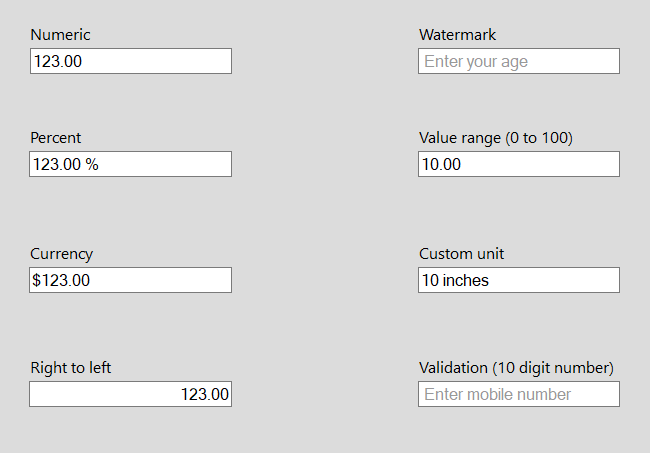

# Windows Forms Numeric TextBox (SfNumericTextBox) Overview

The **NumericTextBox** control is an advanced text box control that allows you to enter numeric values in a specific format such as numeric, currency, and percent. It also provides support to display value with custom units.

## Key Features

**Different modes** - Supports specific modes such as numeric, currency, and percent.

**Value range support** - Allows us to define and validate the value based on minimum and maximum values.

**Formatting** - Supports to format the value as users need.

**Hide trailing zeros** - Supports hiding trailing zeros.

**Watermark** - Supports to display watermark text when value is null.

**Custom units** - Supports to display values with custom units that can be appended as prefix or suffix.

## Choose between different textbox controls

Syncfusion WinForms suite comes up with the following different textboxes:

* [SfNumericTextBox](https://www.syncfusion.com/products/windows-forms/numeric-textbox)
* [CurrencyTextBox](https://help.syncfusion.com/windowsforms/currency-textbox/overview)
* [PercentTextBox](https://help.syncfusion.com/windowsforms/percent-textbox/overview)
* [IntegerTextBox](https://help.syncfusion.com/windowsforms/integer-textbox/overview)

### SfNumericTextBox

The [SfNumericTextBox](https://help.syncfusion.com/windowsforms/numeric-textbox/overview) control is an advanced textbox that allows you to enter numeric values in a specific format such as value. The currency or percent value can also be displayed with custom units. Supports hiding trailing zeros and displaying values with custom units.

### CurrencyTextBox

[CurrencyTextBox](https://help.syncfusion.com/windowsforms/currency-textbox/overview) is a textbox-derived control that implements all functionalities to format currency input and validation. Provides support for clipboard operations that are compatible with currency data.

### PercentTextBox

[PercentTextBox](https://help.syncfusion.com/windowsforms/percent-textbox/overview) is a textbox-derived control that can display double data type values in percentage. It supports display and collection of percentage values.

### IntegerTextBox

[IntegerTextBox](https://help.syncfusion.com/windowsforms/integer-textbox/overview) is derived from the Windows Forms Framework TextBox control. Displays integer data type values alone.

### SfNumericTextBox vs existing numeric textbox controls

Both SfNumericTextBox and existing numeric textbox controls (IntegerTextBox, PercentTextBox, and CurrencyTextBox) are used for the same purpose. But, the SfNumericTextBox control offers rich set of features over existing numeric textbox controls (IntegerTextBox, PercentTextBox, and CurrencyTextBox). To hide by trailing zeros and prefix or suffix and watermark text, use SfNumericTextBox.

The list of some specific API differences between SfNumericTextBox and existing numeric textbox controls (IntegerTextBox, PercentTextBox, and CurrencyTextBox) is as follows.

<table>
<tr>
<td>
{{'**SfNumericTextBox**'| markdownify }}
</td>
<td>
{{'**IntegerTextBox, PercentTextBox and CurrencyTextBox**'| markdownify }}
</td>
<td>
{{'**Description**'| markdownify }}
</td>
</tr>
<tr>
<td>
Value
</td>
<td>
Text
</td>
<td>
Displays the values in textbox.
</td>
</tr>
<tr>
<td>
WatermarkText
</td>
<td>
AllowNull
</td>
<td>
Sets the null value in textbox.
</td>
</tr>
<tr>
<td>
MaxValue
</td>
<td>
MaxValue
</td>
<td>
Sets the maximum value in textbox.
</td>
</tr>
<tr>
<td>
MinValue
</td>
<td>
MinValue
</td>
<td>
Sets the minimum value in textbox.
</td>
</tr>
<tr>
<td>
Style.BorderColor
</td>
<td>
BorderColor
</td>
<td>
Applies the color of textbox border.
</td>
</tr>
<tr>
<td>
ThemeName
</td>
<td>
Style
</td>
<td>
Applies the visual styles.
</td>
</tr>
<tr>
<td>
PositiveForeColor
</td>
<td>
PositiveColor
</td>
<td>
sets the color only in positive values.
</td>
</tr>
<tr>
<td>
NegativeForeColor
</td>
<td>
NegativeColor
</td>
<td>
sets the color only in negative values.
</td>
</tr>
<tr>
<td>
ZeroForeColor
</td>
<td>
ZeroColor
</td>
<td>
sets the color only in zero values.
</td>
</tr>
</table>

The list of features in SfNumericTextBox over existing numeric textbox controls (IntegerTextBox, PercentTextBox, and CurrencyTextBox) is as follows.

<table>
<tr>
<td>
{{'**Feature**'| markdownify }}
</td>
<td>
{{'**Description**'| markdownify }}
</td>
</tr>
<tr>
<td>
Different modes
</td>
<td>
Supports specific modes like numeric, currency, and percent. To learn more about different modes in SfNumericTextBox, refer to {{'[here](https://help.syncfusion.com/windowsforms/numeric-textbox/gettingstarted#different-types-of-format-modes)'| markdownify }}.
</td>
</tr>
<tr>
<td>
Formatting
</td>
<td>
Formats the value based on the user needs. To learn more about format modes in SfNumericTextBox, refer to {{'[here](https://help.syncfusion.com/windowsforms/numeric-textbox/formatting#formatmode)'| markdownify }}.
</td>
</tr>
<tr>
<td>
Hide trailing zeros
</td>
<td>
Hides trailing zeros. To learn more about hiding zeros in SfNumericTextBox, refer to {{'[here](https://help.syncfusion.com/windowsforms/numeric-textbox/formatting#hiding-trailing-zeros)'| markdownify }}.
</td>
</tr>
<tr>
<td>
Custom units
</td>
<td>
Displays the values with custom units which can be appended prefix or suffix. To learn more about custom units in SfNumericTextBox, refer to {{'[here](https://help.syncfusion.com/windowsforms/numeric-textbox/formatting#prefix-and-suffix)'| markdownify }}.
</td>
</tr>
</table>