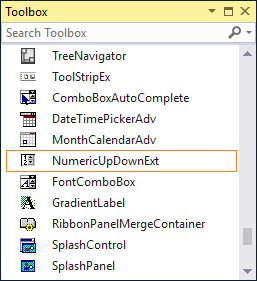
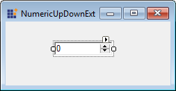

# Getting Started with Windows Forms NumericUpDown (NumericUpDownExt)

This section briefly describes how to create a new Windows Forms project in Visual Studio and add the **NumericUpDownExt** control with its basic functionalities.

## Assembly deployment

Refer to the [control dependencies](https://help.syncfusion.com/windowsforms/control-dependencies#numericupdownext) section to get the list of assemblies or the details of NuGet package that need to be added as reference to use the control in any application.

Refer to this [documentation](https://help.syncfusion.com/windowsforms/visual-studio-integration/nuget-packages) to find more details about installing NuGet packages in a Windows Forms application.

## Adding the NumericUpDownExt control via designer

1) Create a new Windows Forms application in Visual Studio.

2) Add the [NumericUpDownExt](https://help.syncfusion.com/cr/windowsforms/Syncfusion.Windows.Forms.Tools.NumericUpDownExt.html) control to an application by dragging it from the toolbox to the design view. The following dependent assemblies will be added automatically:

* Syncfusion.Grid.Base
* Syncfusion.Grid.Windows
* Syncfusion.Shared.Base
* Syncfusion.Shared.Windows
* Syncfusion.Tools.Base
* Syncfusion.Tools.Windows

The **NumericUpDownExt** allows you to display numeric values by clicking the up and down buttons.

## Adding the NumericUpDownExt control via code

The following steps describe how to create a NumericUpDownExt control programmatically:

1) Create a C# or VB application via Visual Studio.

2) Add the following assembly references to the project:

* Syncfusion.Grid.Base
* Syncfusion.Grid.Windows
* Syncfusion.Shared.Base
* Syncfusion.Shared.Windows
* Syncfusion.Tools.Base
* Syncfusion.Tools.Windows

3) Include the required namespace.





using Syncfusion.Windows.Forms.Tools;





Imports Syncfusion.Windows.Forms.Tools





4) Create an instance of the [NumericUpDownExt](https://help.syncfusion.com/cr/windowsforms/Syncfusion.Windows.Forms.Tools.NumericUpDownExt.html) control, and add it to the form.




private Syncfusion.Windows.Forms.Tools.NumericUpDownExt numericUpDownExt1;
this.numericUpDownExt1 = new Syncfusion.Windows.Forms.Tools.NumericUpDownExt();
this.Controls.Add(this.numericUpDownExt1);

this.numericUpDownExt1.Location = new System.Drawing.Point(70, 29);
this.numericUpDownExt1.Name = "numericUpDownExt1";
this.numericUpDownExt1.Size = new System.Drawing.Size(84, 20);





Private numericUpDownExt1 As Syncfusion.Windows.Forms.Tools.NumericUpDownExt
Me.numericUpDownExt1 = New Syncfusion.Windows.Forms.Tools.NumericUpDownExt()
Me.Controls.Add(Me.numericUpDownExt1)

Me.numericUpDownExt1.Location = New System.Drawing.Point(70, 29)
Me.numericUpDownExt1.Name = "numericUpDownExt1"
Me.numericUpDownExt1.Size = New System.Drawing.Size(84, 20)




## Display settings

The **NumericUpDownExt** provides the [DecimalPlaces](https://help.syncfusion.com/cr/windowsforms/Syncfusion.Windows.Forms.Tools.NumericUpDownExtActionList.html#Syncfusion_Windows_Forms_Tools_NumericUpDownExtActionList_DecimalPlaces) and [ThousandsSeparator](https://help.syncfusion.com/cr/windowsforms/Syncfusion.Windows.Forms.Tools.NumericUpDownExtActionList.html#Syncfusion_Windows_Forms_Tools_NumericUpDownExtActionList_ThousandsSeparator) properties to set the display characteristics associated with the integer value.





this.numericUpDownExt1.DecimalPlaces = 2;
this.numericUpDownExt1.ThousandsSeparator = true;





Me.numericUpDownExt1.DecimalPlaces = 2
Me.numericUpDownExt1.ThousandsSeparator = True





## Value settings

The **NumericUpDownExt** provides the following properties to control the integer value:

* [Value](https://help.syncfusion.com/cr/windowsforms/Syncfusion.Windows.Forms.Tools.NumericUpDownExtActionList.html#Syncfusion_Windows_Forms_Tools_NumericUpDownExtActionList_Value) - Sets the value assigned to the spin box.
* [Hexadecimal](https://help.syncfusion.com/cr/windowsforms/Syncfusion.Windows.Forms.Tools.NumericUpDownExtActionList.html#Syncfusion_Windows_Forms_Tools_NumericUpDownExtActionList_Hexadecimal) - Indicates whether the spin box should display the value it contains in hexadecimal format.
* [Minimum](https://help.syncfusion.com/cr/windowsforms/Syncfusion.Windows.Forms.Tools.NumericUpDownExtActionList.html#Syncfusion_Windows_Forms_Tools_NumericUpDownExtActionList_Minimum) - Sets the minimum allowed value to the spin box.
* [Increment](https://help.syncfusion.com/cr/windowsforms/Syncfusion.Windows.Forms.Tools.NumericUpDownExtActionList.html#Syncfusion_Windows_Forms_Tools_NumericUpDownExtActionList_Increment) - Increments or decrements the spin box when the up and down buttons are clicked. The default value is set to 1.





this.numericUpDownExt1.Value = new decimal(new int[] {25, 0, 0, 0});
this.numericUpDownExt1.Hexadecimal = true;
this.numericUpDownExt1.Minimum = new decimal(new int[] {50, 0, 0, 0});
this.numericUpDownExt1.Increment = new decimal(new int[] {5, 0, 0, 0});





Me.numericUpDownExt1.Value = New Decimal(New Integer() {25, 0, 0, 0})
Me.numericUpDownExt1.Hexadecimal = True
Me.numericUpDownExt1.Minimum = New Decimal(New Integer() {50, 0, 0, 0})
Me.numericUpDownExt1.Increment = New Decimal(New Integer() {5, 0, 0, 0})




