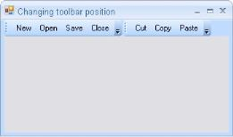

# How to change the position of toolbars at runtime?

We can change the position of toolbars at runtime using RowIndex and RowOffset properties of MainFrameBarManager as follows. 



this.mainFrameBarManager1.GetBarControl(this.bar1).RowIndex = 1;

this.mainFrameBarManager1.GetBarControl(this.bar2).RowIndex = 0;

this.mainFrameBarManager1.GetBarControl(bar2).RowOffset = 0;

this.mainFrameBarManager1.GetBarControl(bar1).RowOffset = 1;

this.mainFrameBarManager1.GetCommandBarManager().RecalcLayout();





Me.mainFrameBarManager1.GetBarControl(Me.bar1).RowIndex = 1

Me.mainFrameBarManager1.GetBarControl(Me.bar2).RowIndex = 0

Me.mainFrameBarManager1.GetBarControl(bar2).RowOffset = 0

Me.mainFrameBarManager1.GetBarControl(bar1).RowOffset = 0

Me.mainFrameBarManager1.GetCommandBarManager().RecalcLayout()



The position of toolbar1 is moved to second row as follows.

