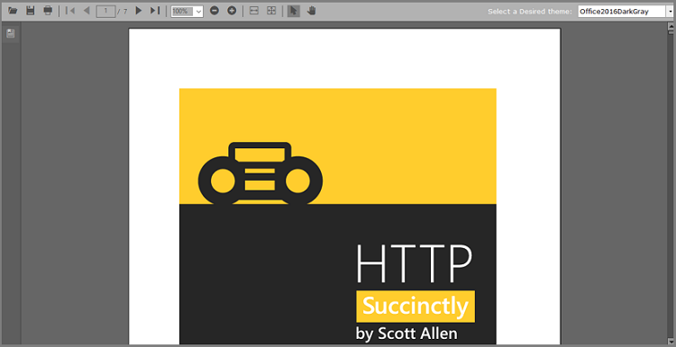
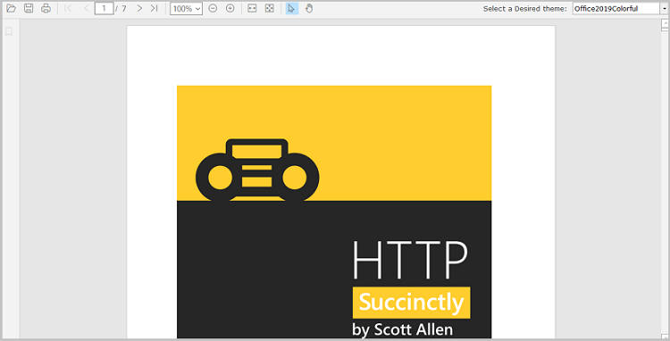
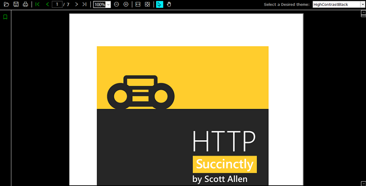

# Working with themes

PDF Viewer provides support for various built-in themes, using which the default appearance of elements that are present in the control can be customized. This can be achieved using the [ThemeName](https://help.syncfusion.com/cr/windowsforms/Syncfusion.Windows.Forms.Core.BaseControl.html#Syncfusion_Windows_Forms_Core_BaseControl_ThemeName) property of [PdfViewerControl](https://help.syncfusion.com/cr/windowsforms/Syncfusion.Windows.Forms.PdfViewer.PdfViewerControl.html).

## Assembly requirements

To set a theme to `PdfViewerControl`, the theme assemblies should be added as a reference in the application, in addition to the [control dependencies](https://help.syncfusion.com/windowsforms/control-dependencies#pdf-viewer). Refer to the following table for the additional assembly details.

<table>
	<tr>
		<th>
		Themes
		</th>
		<th>
		Assemblies required
		</th>
	</tr>
	<tr>
		<td>
		Office2016Colorful 
		Office2016Black 
		Office2016DarkGray 
		Office2016White
		</td>
		<td>
		No additional assemblies are required as the themes are included in the control assembly itself.
		</td>
	</tr>
	<tr>
		<td>
		Office2019Colorful
		</td>
		<td>
		Syncfusion.Office2019Theme.WinForms
		</td>
	</tr>
	<tr>
		<td>
		HighContrastBlack
		</td>
		<td>
		Syncfusion.HighContrastTheme.WinForms
		</td>
	</tr>
</table>

## Office 2016 themes

It provides support for applying Office 2016 themes to `PdfViewerControl` and its associated elements. Following are the Office 2016 themes that are supported in the PDF Viewer control:

* Office2016Colorful
* Office2016Black
* Office2016DarkGray
* Office2016White

Refer to the following code to apply Office 2016 dark gray theme to the `PdfViewerControl`.




this.pdfViewerControl1.ThemeName = "Office2016DarkGray";




Me.pdfViewerControl1.ThemeName = "Office2016DarkGray"




The following image illustrates the appearance of the control after Office 2016 dark gray theme is applied.

N> You can follow a similar step for all the other Office 2016 themes.

## Office 2019 theme

It provides support for applying Office 2019 theme to `PdfViewerControl` and its associated elements. Before applying this theme to the control, the `Office2016Theme` assembly should be loaded in the main entry point of the application. Refer to the following code to load the assembly using [SkinManager](https://help.syncfusion.com/cr/windowsforms/Syncfusion.Windows.Forms.SkinManager.html).




static class Program 
{ 
/// 
 
/// The main entry point for the application. 
/// 
 
[STAThread] 
static void Main() 
{ 
SkinManager.LoadAssembly(typeof(Syncfusion.WinForms.Themes.Office2019Theme).Assembly); 
Application.EnableVisualStyles(); 
Application.SetCompatibleTextRenderingDefault(false); 
Application.Run(new Form1()); 
} 
}





Module Program
''' 
 
''' The main entry point for the application. 
''' 
 
<STAThread> 
Private Sub Main()
SkinManager.LoadAssembly(GetType(Syncfusion.WinForms.Themes.Office2019Theme).Assembly) 
Application.EnableVisualStyles()
Application.SetCompatibleTextRenderingDefault(False) 
Application.Run(New Form1()) 
End Sub 
End Class




After loading the theme assembly, set the `ThemeName` to `Office2019Colorful` as explained in the following code.




this.pdfViewerControl1.ThemeName = "Office2019Colorful";
	




Me.pdfViewerControl1.ThemeName = "Office2019Colorful"




The following image illustrates the appearance of the control after this theme is applied.

## High Contrast theme

It provides support for applying high contrast theme to `PdfViewerControl` and its associated elements. Before applying this theme to the control, the `Office2016Theme` assembly should be loaded in the main entry point of the application. Refer to the following code to load the assembly using [SkinManager](https://help.syncfusion.com/cr/windowsforms/Syncfusion.Windows.Forms.SkinManager.html).




static class Program 
{ 
/// 
 
/// The main entry point for the application. 
/// 
 
[STAThread] 
static void Main() 
{ 
SkinManager.LoadAssembly(typeof(Syncfusion.WinForms.Themes.HighContrastTheme).Assembly); 
Application.EnableVisualStyles(); 
Application.SetCompatibleTextRenderingDefault(false); 
Application.Run(new Form1()); 
} 
}





Module Program
''' 
 
''' The main entry point for the application. 
''' 
 
<STAThread> 
Private Sub Main()
SkinManager.LoadAssembly(GetType(Syncfusion.WinForms.Themes.HighContrastTheme).Assembly) 
Application.EnableVisualStyles()
Application.SetCompatibleTextRenderingDefault(False) 
Application.Run(New Form1()) 
End Sub 
End Class




After loading the theme assembly, set the `ThemeName` to `HighContrastBlack` as explained in the following code.




this.pdfViewerControl1.ThemeName = "HighContrastBlack";





Me.pdfViewerControl1.ThemeName = "HighContrastBlack"




The following image illustrates the appearance of the control after this theme is applied.

## Default theme

To clear the existing theme and set default theme to the control, set the `ThemeName` to `Default` as explained in the following code.




this.pdfViewerControl1.ThemeName = "Default";





Me.pdfViewerControl1.ThemeName = "Default"




Find the sample from this [GitHub](https://github.com/syncfusion/file-formats-windows-forms-demos/tree/master/PdfViewer.Windows/Samples/Visual Styles/PDF Viewer Visual Styles) location.
