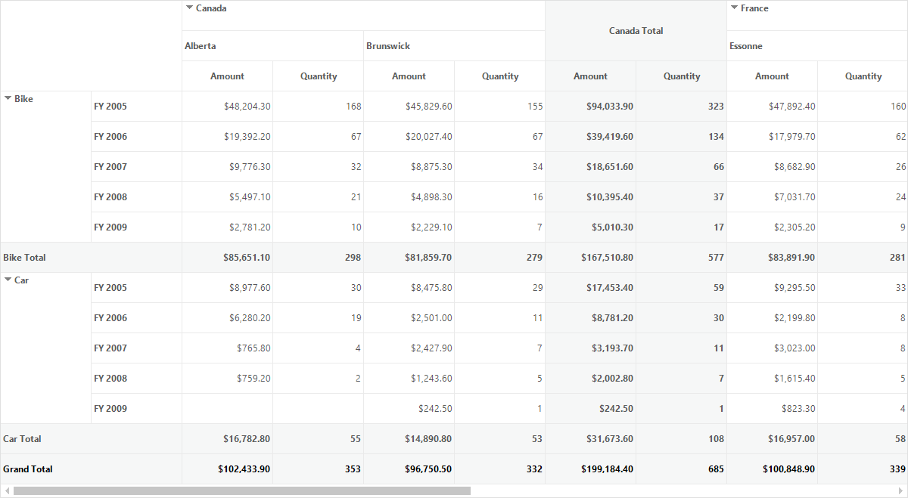

# How to Change Row Height and Column Width

The height of rows and the width of columns in the pivot grid control can be altered with the help of [RowHeights](https://help.syncfusion.com/cr/windowsforms/Syncfusion.Windows.Forms.Grid.GridModel.html#Syncfusion_Windows_Forms_Grid_GridModel_RowHeights) and [ColWidths](https://help.syncfusion.com/cr/windowsforms/Syncfusion.Windows.Forms.Grid.GridModel.html#Syncfusion_Windows_Forms_Grid_GridModel_ColWidths) properties.

Refer to the below code sample to change the default height of rows and default width of columns in pivot grid control.





public Form1()
{
    ......
    this.pivotGridControl1.TableModel.QueryCellInfo += TableModel_QueryCellInfo;
}

void TableModel_QueryCellInfo(object sender, GridQueryCellInfoEventArgs e)
{
    this.pivotGridControl1.TableModel.RowHeights[e.RowIndex] = 40;
    this.pivotGridControl1.TableModel.ColWidths[e.ColIndex] = 120;
}





Public Sub New()
  ......Me.pivotGridControl1.TableModel.QueryCellInfo += TableModel_QueryCellInfo
End Sub

Private Sub TableModel_QueryCellInfo(ByVal sender As Object, ByVal e As GridQueryCellInfoEventArgs)
    Me.pivotGridControl1.TableModel.RowHeights(e.RowIndex) = 40
    Me.pivotGridControl1.TableModel.ColWidths(e.ColIndex) = 120
End Sub





