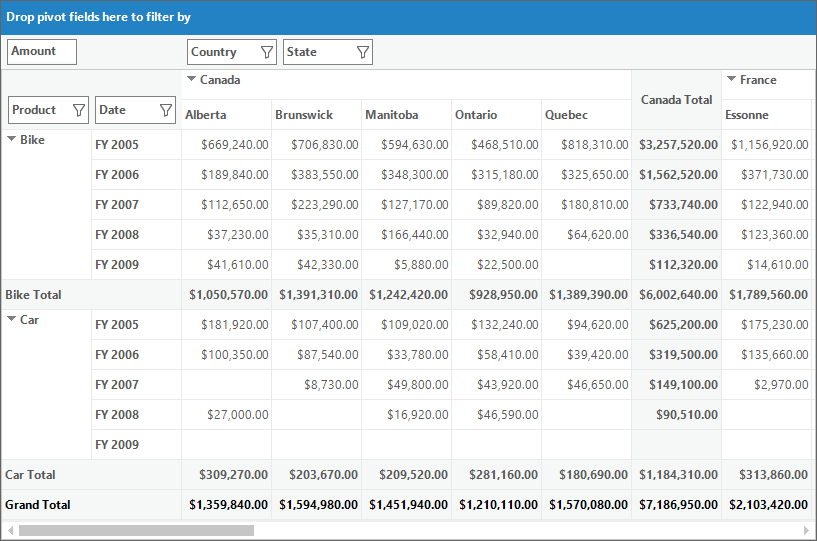
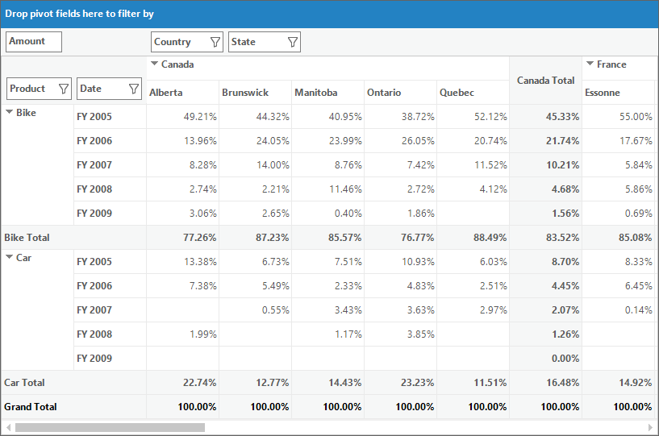
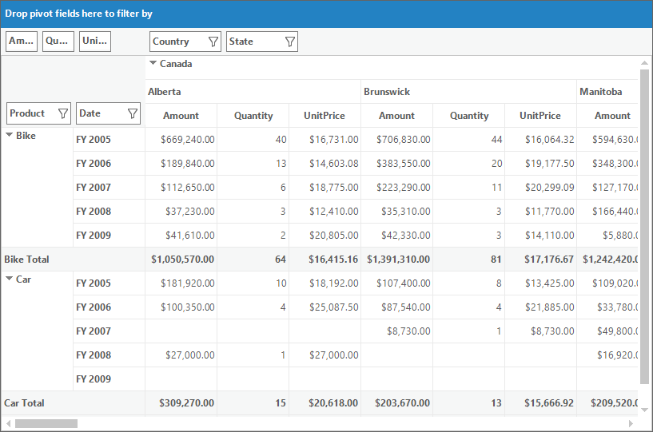

# Pivot Calculations in Windows Forms Pivot Grid

Pivot calculations are defined by using the [PivotComputationInfo](https://help.syncfusion.com/cr/windowsforms/Syncfusion.PivotAnalysis.Base.PivotComputationInfo.html) object which holds the information required for defining calculations that appear in the pivot grid control.

## Defining pivot calculations using pivot computation information

To define a pivot calculation item, the following properties of `PivotComputationInfo` object are used.

* [FieldName](https://help.syncfusion.com/cr/windowsforms/Syncfusion.PivotAnalysis.Base.PivotComputationInfo.html#Syncfusion_PivotAnalysis_Base_PivotComputationInfo_FieldName) -
Specifies the name of the field to be used for pivot calculation.
* [CalculationName](https://help.syncfusion.com/cr/windowsforms/Syncfusion.PivotAnalysis.Base.PivotComputationInfo.html#Syncfusion_PivotAnalysis_Base_PivotComputationInfo_CalculationName) - Specifies the name that is to be displayed in the pivot table if more than one calculation is included in the pivot grid.
* [Description](https://help.syncfusion.com/cr/windowsforms/Syncfusion.PivotAnalysis.Base.PivotComputationInfo.html#Syncfusion_PivotAnalysis_Base_PivotComputationInfo_Description) -
Specifies the description content of the calculation.
* [Format](https://help.syncfusion.com/cr/windowsforms/Syncfusion.PivotAnalysis.Base.PivotComputationInfo.html#Syncfusion_PivotAnalysis_Base_PivotComputationInfo_Format) -
Specifies the format string to be used to formatting the calculation values.

Refer to the below code sample for adding pivot calculation item in the pivot grid control.





// Defining PivotComputationInfo
PivotComputationInfo pivotComputationInfo = new PivotComputationInfo() { CalculationName = "Amount", FieldName = "Amount" };

// Adding PivotComputationInfo to PivotCalculations
pivotGridControl1.PivotCalculations.Add(pivotComputationInfo);





' Defining PivotComputationInfo
Dim pivotComputationInfo As New PivotComputationInfo() With {.CalculationName = "Amount", .FieldName = "Amount"}

' Adding PivotComputationInfo to PivotCalculations
pivotGridControl1.PivotCalculations.Add(pivotComputationInfo)





## Formatting calculation values

Using the [Format](https://help.syncfusion.com/cr/windowsforms/Syncfusion.PivotAnalysis.Base.PivotComputationInfo.html#Syncfusion_PivotAnalysis_Base_PivotComputationInfo_Format) property of `PivotComputationInfo` object, the calculation value can be specified with the textual equivalent value.

The following table lists some of the formats used for formatting calculation values.

<table>
<tr>
<th>
Format</th><th>
Description</th></tr>
<tr>
<td>
0.00</td><td>
Decimal</td></tr>
<tr>
<td>
C</td><td>
Currency</td></tr>
<tr>
<td>
#,##0</td><td>
Thousand Separator</td></tr>
<tr>
<td>
# ' degrees'</td><td>
Literal String Specifier</td></tr>
<tr>
<td>
D</td><td>
Long Date</td></tr>
</table>

Refer to the following code sample to set currency format for calculation values.





PivotComputationInfo pivotComputationInfo = new PivotComputationInfo()
{
    FieldName = "Amount",
    Format = "C",
    SummaryType = SummaryType.DecimalTotalSum
};





Dim pivotComputationInfo As PivotComputationInfo = New PivotComputationInfo() With
{
    .FieldName = "Amount",
    .Format = "C",
    .SummaryType = SummaryType.DecimalTotalSum
}





## Calculation types

Using the [CalculationType](https://help.syncfusion.com/cr/windowsforms/Syncfusion.PivotAnalysis.Base.PivotComputationInfo.html#Syncfusion_PivotAnalysis_Base_PivotComputationInfo_CalculationType) property of `PivotComputationInfo` object, the type of the calculation can be specified. [CalculationType](https://help.syncfusion.com/cr/windowsforms/Syncfusion.PivotAnalysis.Base.PivotComputationInfo.html#Syncfusion_PivotAnalysis_Base_PivotComputationInfo_CalculationType) enumeration contains the following options to denote the calculation type:

* **NoCalculation** - Turn off custom calculation.
* **PercentageOfGrandTotal** - Displays a value as a percentage of the grand total of all the values.
* **PercentageOfColumnTotal** - Displays all the values in each column as a percentage of the total for the column.
* **PercentageOfRowTotal** - Displays all the values in each row as a percentage of the total for the row.
* **PercentageOfParentColumnTotal** - Calculates (value for the item) / (value for the parent item on columns).
* **PercentageOfParentRowTotal** - Calculates (value for the item) / (value for the parent item on rows).
* **PercentageOfParentTotal** - Calculates (value for the item) / (value for the parent item of the selected base field).
* **Formula** - Displays a calculation based on a well formed algebraic expression involving other calculations.
* **PercentageOf** - Displays a value as a percentage of the value of the base item in the base field.
* **DifferenceFrom** - Displays a value as the difference from the value of the base item in the base field.
* **PercentageOfDifferenceFrom** - Displays a value as the percentage difference from the value of the base item in the base field.
* **RunningTotalIn** - Displays the value for successive items in the base field as a running total.
* **PercentageOfRunningTotalIn** - Displays the value as a percentage for successive items in the  field as a running total.
* **RankSmallestToLargest** - Displays the rank of selected values in a specific field, listing the smallest item in the field as 1, and each larger value will have a higher rank value.
* **RankLargestToSmallest** - Displays the rank of selected values in a specific field, listing the largest item in the field as 1, and each smaller value will have a higher rank value.
* **Distinct** - Displays the subtotals based on the distinct values of base item defined for calculation item.
* **Index** - Calculate a value as ((value in cell) x (Grand Total of Grand Totals)) / ((Grand Row Total) x (Grand Column Total))

Refer to the following code sample to denote the calculation type for pivot calculation items.





pivotGridControl1.PivotCalculations.Add(new PivotComputationInfo
{
    FieldName = "Amount",
    CalculationType=CalculationType.PercentageOfColumnTotal,
    .SummaryType = SummaryType.DecimalTotalSum
});





pivotGridControl1.PivotCalculations.Add(New PivotComputationInfo With
{
    .FieldName = "Amount",
    .CalculationType = CalculationType.PercentageOfColumnTotal,
    .SummaryType = SummaryType.DecimalTotalSum
})





### Expression field calculations

Pivot grid allows to provide expression field for calculations, despite of in-built options provided for calculations such as PercentageOfGrandTotal, PercentageOfRowTotal, RankLargestToSmallest and so on. It can be achieved by setting the calculation type as "Formula" and by specifying the appropriate formula using the [Formula](https://help.syncfusion.com/cr/windowsforms/Syncfusion.PivotAnalysis.Base.PivotComputationInfo.html#Syncfusion_PivotAnalysis_Base_PivotComputationInfo_Formula) property of `PivotComputationInfo` object.

Refer to the following code sample to specify custom formula for calculations.





pivotGridControl1.PivotCalculations.Add(new PivotComputationInfo()
{
    FieldName = "UnitPrice",
    CalculationType = CalculationType.Formula,
    Formula = "[Amount] / [Quantity]",
    Format = "C"
});





pivotGridControl1.PivotCalculations.Add(New PivotComputationInfo() With
{
    .FieldName = "UnitPrice",
    .CalculationType = CalculationType.Formula,
    .Formula = "[Amount] / [Quantity]",
     .Format = "C"
})





## Synchronizing pivot calculations

To synchronize the newly added or modified pivot calculation items with the pivot grid control, the [SynchronizeCalculations](https://help.syncfusion.com/cr/windowsforms/Syncfusion.Windows.Forms.PivotAnalysis.PivotGridControlBase.html#Syncfusion_Windows_Forms_PivotAnalysis_PivotGridControlBase_SynchronizeCalculations_System_Collections_Specialized_NotifyCollectionChangedEventArgs_) method will be used. This method will be invoked whenever the collection of pivot calculation item gets changed.

## Pivot computation information dialog

The pivot computation information dialog is used to view the information about particular pivot calculation item. It is also used to edit the header, description, value format, and calculation type of the pivot calculation item at run time. While double clicking on a calculation item in the value layout section of [pivot schema designer](https://help.syncfusion.com/windowsforms/pivotgrid/pivot-schema-designer), pivot computation information dialog containing the details of clicked pivot calculation item will be displayed.

