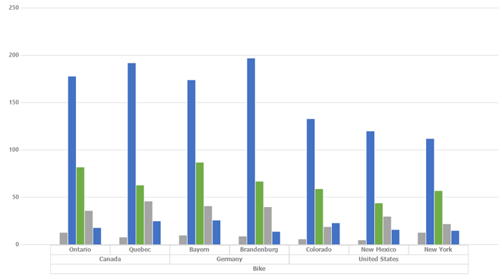
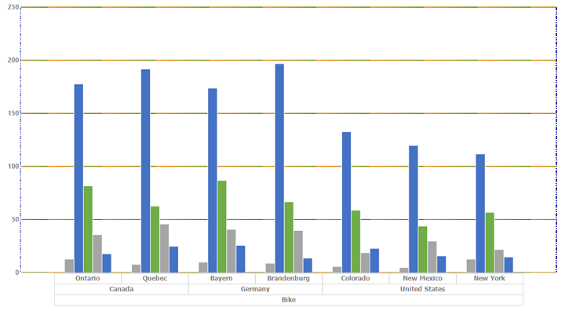

# PivotAxis

Axis is used to locate a data point inside the chart area. Generally, two axes are required along each direction to locate a data point in the chart, i.e., horizontal and vertical. PivotCharts typically have two axes that are used to measure and categorize data.

    * Vertical (y-Axis) axis
    * Horizontal (x-Axis) axis. 
    
By default, horizontal (PrimaryXAxis) axis and vertical (PrimaryYAxis) axis are added to the Chart with axis labels, gridlines and tick lines. You can also customize the axis explicitly by adding axis title or removing gridlines; tick lines that are added to the axis, by default.

The following screenshot displays the _PivotChart with Axis_

### Axis Title

PivotChart provides properties to set custom titles for the axis. You can set the title text for an axis by using *Title* property. Customize this text by using *TitleColor* and *TitleFont* properties.

<table>
<tr>
<th>
Chart Axis Properties</th><th>
Description</th></tr>
<tr>
<td>
TitleColor</td><td>
Sets the color for the title text of the axis.</td></tr>
<tr>
<td>
TitleFont</td><td>
Sets the font style for the title text.</td></tr>
</table>





    //Sets custom title for x-axis.
    this.pivotChart1.ChartControl.PrimaryXAxis.Title = "x-axis";
    this.pivotChart1.ChartControl.PrimaryXAxis.TitleColor = Color.Red;
    this.pivotChart1.ChartControl.PrimaryXAxis.TitleFont = new Font("Arial", 14);

    //Sets custom title for y-axis.
    this.pivotChart1.ChartControl.PrimaryYAxis.Title = "y-axis";
    this.pivotChart1.ChartControl.PrimaryYAxis.TitleColor = Color.Red;
    this.pivotChart1.ChartControl.PrimaryYAxis.TitleFont = new Font("Arial", 14);





    'Sets custom title for x-axis.
    Me.pivotChart1.ChartControl.PrimaryXAxis.Title = "x-axis" 
    Me.pivotChart1.ChartControl.PrimaryXAxis.TitleColor = Color.Red 
    Me.pivotChart1.ChartControl.PrimaryXAxis.TitleFont = New Font("Arial", 14)

    'Sets custom title for y-axis.
    Me.pivotChart1.ChartControl.PrimaryYAxis.Title = "y-axis" 
    Me.pivotChart1.ChartControl.PrimaryYAxis.TitleColor = Color.Red 
    Me.pivotChart1.ChartControl.PrimaryYAxis.TitleFont = New Font("Arial", 14)





*PivotChart displays the Axis with title*

## Chart Grid Line Style

The Grid Lines in the PivotChart defines the intervals in the axes that can be customized by using the following properties. 

<table>
<tr>
<th>
Chart Control Properties</th><th>
Description</th></tr>
<tr>
<td>
GridLineType.ForeColor</td><td>
ForeColor of the line.</td></tr>
<tr>
<td>
GridLineType.BackColor</td><td>
BackColor of the line.</td></tr>
<tr>
<td>
GridLineType.DashStyle</td><td>
Specifies the style of the line.</td></tr>
<tr>
<td>
GridLineType.PenType</td><td>
Specifies the type of pen that is to be used with the line.</td></tr>
<tr>
<td>
GridLineType.Width</td><td>
Thickness of the lines.</td></tr>
</table>

BackColor, DashStyle, ForeColor, PenType and the Width are specified by using the GridLineType property. The following code illustrates how to show the Grid Lines on both axes and how to customize them.





    //Customizes X-Axis Gridlines.
    this.chartControl1.PrimaryXAxis.GridLineType.BackColor = System.Drawing.Color.Transparent;
    this.chartControl1.PrimaryXAxis.GridLineType.DashStyle = System.Drawing.Drawing2D.DashStyle.DashDotDot;
    this.chartControl1.PrimaryXAxis.GridLineType.ForeColor = System.Drawing.Color.DarkBlue;
    this.chartControl1.PrimaryXAxis.GridLineType.Width = 2F;

    //Customizes Y-Axis Gridlines.
    this.chartControl1.PrimaryYAxis.GridLineType.BackColor = System.Drawing.Color.OliveDrab;
    this.chartControl1.PrimaryYAxis.GridLineType.ForeColor = System.Drawing.Color.DarkOrange;
    this.chartControl1.PrimaryYAxis.GridLineType.PenType = System.Drawing.Drawing2D.PenType.LinearGradient;
    this.chartControl1.PrimaryYAxis.GridLineType.Width = 2F;





    'Customizes X-Axis Gridlines.
    Me.chartControl1.PrimaryXAxis.GridLineType.BackColor = System.Drawing.Color.Transparent
    Me.chartControl1.PrimaryXAxis.GridLineType.DashStyle = System.Drawing.Drawing2D.DashStyle.DashDotDot
    Me.chartControl1.PrimaryXAxis.GridLineType.ForeColor = System.Drawing.Color.DarkBlue
    Me.chartControl1.PrimaryXAxis.GridLineType.Width = 2F

    'Customizes Y-Axis Gridlines.
    Me.chartControl1.PrimaryYAxis.GridLineType.BackColor = System.Drawing.Color.OliveDrab
    Me.chartControl1.PrimaryYAxis.GridLineType.ForeColor = System.Drawing.Color.DarkOrange
    Me.chartControl1.PrimaryYAxis.GridLineType.PenType = System.Drawing.Drawing2D.PenType.LinearGradient
    Me.chartControl1.PrimaryYAxis.GridLineType.Width = 2F





*PivotChart with Customized style*

## Show/Hide Axis

The visibility of PivotChart axis can be toggled by setting **IsVisible** property of either PrimaryXAxis or PrimaryYAxis.





    this.pivotChart1.ChartControl.PrimaryXAxis.IsVisible = false;
    this.pivotChart1.ChartControl.PrimaryYAxis.IsVisible = false;





    Me.pivotChart1.ChartControl.PrimaryXAxis.IsVisible = False
    Me.pivotChart1.ChartControl.PrimaryYAxis.IsVisible = False





The following screenshot displays the _PivotChart without axis_

A sample demo is available at the following location:
    
{system drive}:\Users\&lt;User Name&gt;\AppData\Local\Syncfusion\EssentialStudio\&lt;Version Number&gt;\Windows\PivotChart.Windows\Samples\Appearance\PivotChartStyles Demo