# BarItems

The various types of BarItems supported by PopupMenu are,

* BarItem
* ParentBarItem
* DropDownBarItem
* ComboBoxBarItem
* ListBarItem
* StaticBarItem
* TextBoxBarItem

## BarItem

BarItem represents an individual item in a menu structure.

>**NOTE** :  
Please refer ["Getting Started"](https://help.syncfusion.com/windowsforms/popupmenu/getting-started) section for adding BarItem to the PopupMenu control.

## ParentBarItem

The ParentBarItem is a type of bar item which acts a parent control for sub-menu or itself holds child menu items for a popup menu. It can be used when a sub-menu needs to be added for a popup menu.

### Adding ParentBarItem through designer

1. Right-clicking on **PopupMenu** control and select **Add Default ParentBarItem...** option. You can also add the default parent bar item by selecting the **Add Default ParentBarItem...** option from the **Smart tag** menu.

   

   

2. Once **Default ParentBarItem** is added, we can add the parent bar item by right-clicking on the control in the designer and select **Properties**. Now, in the **Properties** panel, under **Misc > ParentBarItem > Items** select the parent bar item from the **BarItem Collection Editor**.

   

   

3. In BarItem Collection Editor window, click on down arrow of **Add** button. It will display different types of bar items. Using this, user can add appropriate bar items as per their need.

   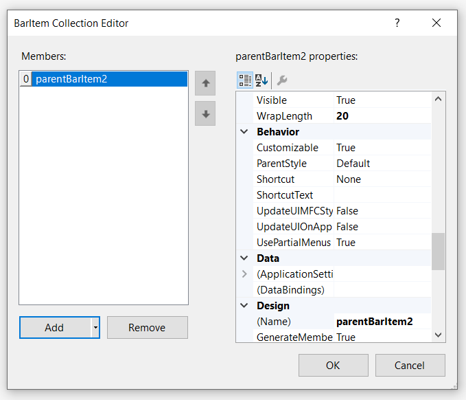

4. Once item is added, we can select particular item in **BarItem Collection Editor** window and set text under **Appearance > Text** section.

   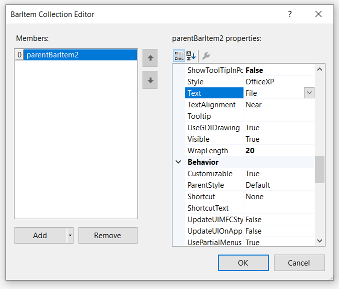

5. Smilarly, we can add the sub menu items in **BarItem Collection Editor** window under **Misc > Items** section.

   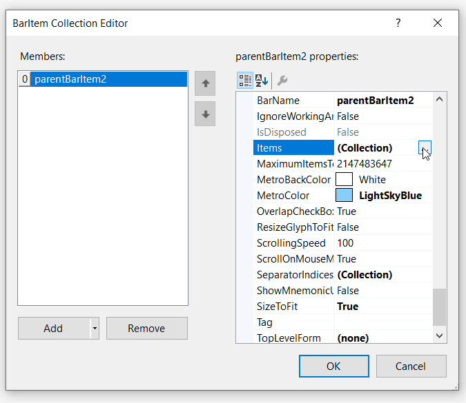

6. Once sub menu item is added, we can select particular item in **BarItem Collection Editor** window and set text under **Appearance > Text** section.

   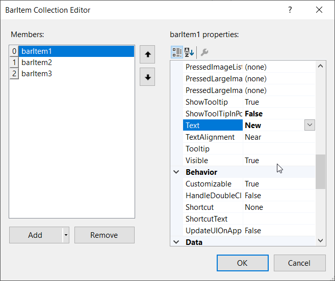

7. Smilarly, we can add the image under **Appearance > Image** section.

   

### Adding ParentBarItem through code

The below code snippets add **ParentBarItem** to the PopupMenu control.




//Declaration
private Syncfusion.Windows.Forms.Tools.XPMenus.PopupMenu popupMenu1;
private Syncfusion.Windows.Forms.Tools.XPMenus.ParentBarItem parentBarItem1;
private Syncfusion.Windows.Forms.Tools.XPMenus.ParentBarItem parentBarItem2;
private Syncfusion.Windows.Forms.Tools.XPMenus.BarItem barItem1;        
private Syncfusion.Windows.Forms.Tools.XPMenus.BarItem barItem2;
private Syncfusion.Windows.Forms.Tools.XPMenus.BarItem barItem3;
private System.Windows.Forms.RichTextBox richTextBox1;
private Syncfusion.Windows.Forms.Tools.XPMenus.PopupMenusManager popupMenusManager1;
        
//Initializing
this.popupMenu1 = new Syncfusion.Windows.Forms.Tools.XPMenus.PopupMenu(this.components);
this.parentBarItem1 = new Syncfusion.Windows.Forms.Tools.XPMenus.ParentBarItem();
this.parentBarItem2 = new Syncfusion.Windows.Forms.Tools.XPMenus.ParentBarItem();
this.barItem1 = new Syncfusion.Windows.Forms.Tools.XPMenus.BarItem();
this.barItem2 = new Syncfusion.Windows.Forms.Tools.XPMenus.BarItem();
this.barItem3 = new Syncfusion.Windows.Forms.Tools.XPMenus.BarItem();
this.richTextBox1 = new System.Windows.Forms.RichTextBox();
this.popupMenusManager1 = new Syncfusion.Windows.Forms.Tools.XPMenus.PopupMenusManager(this.components);

// popupMenu1
this.popupMenu1.ParentBarItem = this.parentBarItem1;

// barItem1
this.barItem1.Image = new ImageExt(System.Drawing.Image.FromFile(@"..\..\..\New.png"));
this.barItem1.SizeToFit = true;
this.barItem1.Text = "New";
        
// barItem2
this.barItem2.Image = new ImageExt(System.Drawing.Image.FromFile(@"..\..\..\Copy.png"));
this.barItem2.SizeToFit = true;
this.barItem2.Text = "Copy";
           
// barItem3
this.barItem3.Image = new ImageExt(System.Drawing.Image.FromFile(@"..\..\..\Save.png"));
this.barItem3.SizeToFit = true;
this.barItem3.Text = "Save";

// parentBarItem1
this.parentBarItem1.MetroColor = System.Drawing.Color.LightSkyBlue;
this.parentBarItem1.SizeToFit = true;          
this.parentBarItem1.Items.Add(this.parentBarItem2);

// parentBarItem2
this.parentBarItem2.MetroColor = System.Drawing.Color.LightSkyBlue;
this.parentBarItem2.SizeToFit = true;
this.parentBarItem2.Text = "File";
this.parentBarItem2.Items.AddRange(new Syncfusion.Windows.Forms.Tools.XPMenus.BarItem[] { this.barItem1, this.barItem2, this.barItem3});

// richTextBox1
this.richTextBox1.Size = new System.Drawing.Size(100, 96);
this.popupMenusManager1.SetXPContextMenu(this.richTextBox1, this.popupMenu1);
            
// Form1
this.ClientSize = new System.Drawing.Size(282, 253);
this.Text = "PopupMenu";
this.Controls.Add(this.richTextBox1);
this.ResumeLayout(false);       

 



'Declaration
Private popupMenu1 As Syncfusion.Windows.Forms.Tools.XPMenus.PopupMenu
Private parentBarItem1 As Syncfusion.Windows.Forms.Tools.XPMenus.ParentBarItem
Private parentBarItem2 As Syncfusion.Windows.Forms.Tools.XPMenus.ParentBarItem
Private barItem1 As Syncfusion.Windows.Forms.Tools.XPMenus.BarItem
Private barItem2 As Syncfusion.Windows.Forms.Tools.XPMenus.BarItem
Private barItem3 As Syncfusion.Windows.Forms.Tools.XPMenus.BarItem
Private richTextBox1 As System.Windows.Forms.RichTextBox
Private popupMenusManager1 As Syncfusion.Windows.Forms.Tools.XPMenus.PopupMenusManager

'Initializing
Me.popupMenu1 = New Syncfusion.Windows.Forms.Tools.XPMenus.PopupMenu(Me.components)
Me.parentBarItem1 = New Syncfusion.Windows.Forms.Tools.XPMenus.ParentBarItem()
Me.parentBarItem2 = New Syncfusion.Windows.Forms.Tools.XPMenus.ParentBarItem()
Me.barItem1 = New Syncfusion.Windows.Forms.Tools.XPMenus.BarItem()
Me.barItem2 = New Syncfusion.Windows.Forms.Tools.XPMenus.BarItem()
Me.barItem3 = New Syncfusion.Windows.Forms.Tools.XPMenus.BarItem()
Me.richTextBox1 = New System.Windows.Forms.RichTextBox()
Me.popupMenusManager1 = New Syncfusion.Windows.Forms.Tools.XPMenus.PopupMenusManager(Me.components)

' popupMenu1
Me.popupMenu1.ParentBarItem = Me.parentBarItem1

' barItem1
Me.barItem1.Image = New ImageExt(System.Drawing.Image.FromFile("..\..\..\New.png"))
Me.barItem1.SizeToFit = True
Me.barItem1.Text = "New"

' barItem2
Me.barItem2.Image = New ImageExt(System.Drawing.Image.FromFile("..\..\..\Copy.png"))
Me.barItem2.SizeToFit = True
Me.barItem2.Text = "Copy"

' barItem3
Me.barItem3.Image = New ImageExt(System.Drawing.Image.FromFile("..\..\..\Save.png"))
Me.barItem3.SizeToFit = True
Me.barItem3.Text = "Save"

' parentBarItem1
Me.parentBarItem1.MetroColor = System.Drawing.Color.LightSkyBlue
Me.parentBarItem1.SizeToFit = True
Me.parentBarItem1.Items.Add(Me.parentBarItem2)

' parentBarItem2
Me.parentBarItem2.MetroColor = System.Drawing.Color.LightSkyBlue
Me.parentBarItem2.SizeToFit = True
Me.parentBarItem2.Text = "File"
Me.parentBarItem2.Items.AddRange(New Syncfusion.Windows.Forms.Tools.XPMenus.BarItem() { Me.barItem1, Me.barItem2, Me.barItem3})

' richTextBox1
Me.richTextBox1.Size = New System.Drawing.Size(100, 96)
Me.popupMenusManager1.SetXPContextMenu(Me.richTextBox1, Me.popupMenu1)

' Form1
Me.ClientSize = New System.Drawing.Size(282, 253)
Me.Text = "PopupMenu"
Me.Controls.Add(Me.richTextBox1)
Me.ResumeLayout(False)




## DropDownBarItem

DropDownBarItem represents submenu that will appear as popup when clicked on it.

### Adding DropDownBarItem through designer

1. Right-clicking on **PopupMenu** control and select **Add Default ParentBarItem...** option. You can also add the default parent bar item by selecting the **Add Default ParentBarItem...** option from the **Smart tag** menu.

   

   

2. Once **Default ParentBarItem** is added, we can add the dropdown bar item by right-clicking on the control in the designer and select **Properties**. Now, in the **Properties** panel, under **Misc > ParentBarItem > Items** select the dropdown bar item from the **BarItem Collection Editor**.

   

   

3. In BarItem Collection Editor window, click on down arrow of **Add** button. It will display different types of bar items. Using this, user can add appropriate bar items as per their need.

   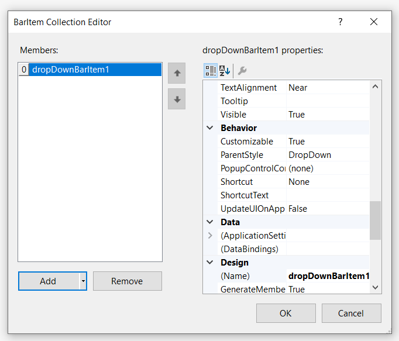

4. Once item is added, we can select particular item in **BarItem Collection Editor** window and set text under **Appearance > Text** section.

   

5. To add sub menu items as popup of **DropDownBarItem** we need to drag and drop **PopupControlContainer** to the application and associate this by using **PopupControlContainer** property of DropDownBarItem.

   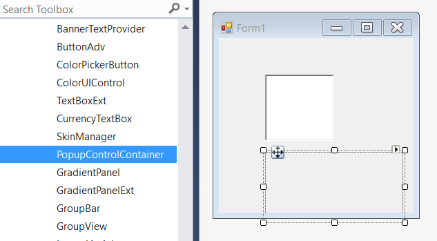

   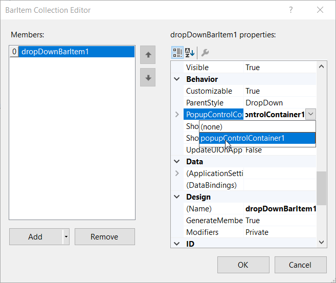

6. Drag and drop any controls like Button, Label, TextBox, Colorpicker etc... in the **PopupControlContainer**. In this illustration, we have used **ColorPickerUIAdv**.

   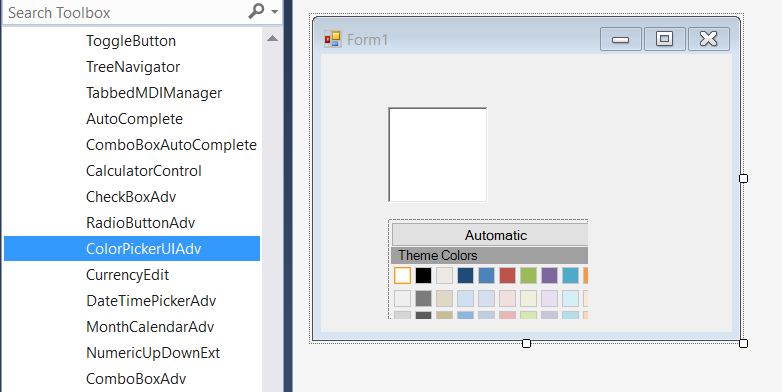

### Adding DropDownBarItem through code

The below code snippets add **DropDownBarItem** to the PopupMenu control.




//Declaration
private Syncfusion.Windows.Forms.Tools.XPMenus.PopupMenu popupMenu1;
private Syncfusion.Windows.Forms.Tools.XPMenus.ParentBarItem parentBarItem1;
private Syncfusion.Windows.Forms.Tools.XPMenus.DropDownBarItem dropDownBarItem1;
private Syncfusion.Windows.Forms.PopupControlContainer popupControlContainer1;
private Syncfusion.Windows.Forms.Tools.ColorPickerUIAdv colorPickerUIAdv1;
private System.Windows.Forms.RichTextBox richTextBox1;
private Syncfusion.Windows.Forms.Tools.XPMenus.PopupMenusManager popupMenusManager1;
        
//Initializing
this.popupMenu1 = new Syncfusion.Windows.Forms.Tools.XPMenus.PopupMenu(this.components);
this.parentBarItem1 = new Syncfusion.Windows.Forms.Tools.XPMenus.ParentBarItem();
this.dropDownBarItem1 = new Syncfusion.Windows.Forms.Tools.XPMenus.DropDownBarItem();
this.popupControlContainer1 = new Syncfusion.Windows.Forms.PopupControlContainer();
this.colorPickerUIAdv1 = new Syncfusion.Windows.Forms.Tools.ColorPickerUIAdv();
this.richTextBox1 = new System.Windows.Forms.RichTextBox();
this.popupMenusManager1 = new Syncfusion.Windows.Forms.Tools.XPMenus.PopupMenusManager(this.components);

// popupMenu1
this.popupMenu1.ParentBarItem = this.parentBarItem1;

// parentBarItem1
this.parentBarItem1.MetroColor = System.Drawing.Color.LightSkyBlue;
this.parentBarItem1.SizeToFit = true;          
this.parentBarItem1.Items.Add(this.dropDownBarItem1);

// dropDownBarItem1
this.dropDownBarItem1.PopupControlContainer = this.popupControlContainer1;
this.dropDownBarItem1.SizeToFit = true;
this.dropDownBarItem1.Text = "Color Picker";

// popupControlContainer1
this.popupControlContainer1.Controls.Add(this.colorPickerUIAdv1);
this.popupControlContainer1.Location = new System.Drawing.Point(67, 165);
this.popupControlContainer1.Name = "popupControlContainer1";
this.popupControlContainer1.Size = new System.Drawing.Size(200, 100);

// colorPickerUIAdv1.RecentGroup
this.colorPickerUIAdv1.RecentGroup.HeaderHeight = 17;
this.colorPickerUIAdv1.RecentGroup.Name = "Recent Colors";
this.colorPickerUIAdv1.RecentGroup.Visible = false;
        
// colorPickerUIAdv1.StandardGroup
this.colorPickerUIAdv1.StandardGroup.HeaderHeight = 17;
this.colorPickerUIAdv1.StandardGroup.Name = "Standard Colors";
            
// colorPickerUIAdv1.ThemeGroup
this.colorPickerUIAdv1.ThemeGroup.HeaderHeight = 17;
this.colorPickerUIAdv1.ThemeGroup.IsSubItemsVisible = true;
this.colorPickerUIAdv1.ThemeGroup.Name = "Theme Colors";
            
// colorPickerUIAdv1
this.colorPickerUIAdv1.BeforeTouchSize = new System.Drawing.Size(13, 13);
this.colorPickerUIAdv1.ButtonsHeight = 25;
this.colorPickerUIAdv1.ColorItemSize = new System.Drawing.Size(17, 17);
this.colorPickerUIAdv1.Location = new System.Drawing.Point(114, 227);
this.colorPickerUIAdv1.MetroColor = System.Drawing.Color.FromArgb(((int)(((byte)(22)))), ((int)(((byte)(165)))), ((int)(((byte)(220)))));
this.colorPickerUIAdv1.MinimumSize = new System.Drawing.Size(136, 193);
this.colorPickerUIAdv1.Name = "colorPickerUIAdv1";
this.colorPickerUIAdv1.SelectedColor = System.Drawing.Color.Empty;
this.colorPickerUIAdv1.Size = new System.Drawing.Size(212, 237);
this.colorPickerUIAdv1.Style = Syncfusion.Windows.Forms.Tools.ColorPickerUIAdv.visualstyle.Default;
this.colorPickerUIAdv1.TabIndex = 0;
this.colorPickerUIAdv1.Text = "colorPickerUIAdv1";
this.colorPickerUIAdv1.UseOffice2007Style = false;

// richTextBox1
this.richTextBox1.Size = new System.Drawing.Size(100, 96);
this.popupMenusManager1.SetXPContextMenu(this.richTextBox1, this.popupMenu1);
            
// Form1
this.ClientSize = new System.Drawing.Size(282, 253);
this.Text = "PopupMenu";
this.Controls.Add(this.richTextBox1);
this.ResumeLayout(false);       

 



'Declaration
Private popupMenu1 As Syncfusion.Windows.Forms.Tools.XPMenus.PopupMenu
Private parentBarItem1 As Syncfusion.Windows.Forms.Tools.XPMenus.ParentBarItem
Private dropDownBarItem1 As Syncfusion.Windows.Forms.Tools.XPMenus.DropDownBarItem
Private popupControlContainer1 As Syncfusion.Windows.Forms.PopupControlContainer
Private colorPickerUIAdv1 As Syncfusion.Windows.Forms.Tools.ColorPickerUIAdv
Private richTextBox1 As System.Windows.Forms.RichTextBox
Private popupMenusManager1 As Syncfusion.Windows.Forms.Tools.XPMenus.PopupMenusManager

'Initializing
Me.popupMenu1 = New Syncfusion.Windows.Forms.Tools.XPMenus.PopupMenu(Me.components)
Me.parentBarItem1 = New Syncfusion.Windows.Forms.Tools.XPMenus.ParentBarItem()
Me.dropDownBarItem1 = New Syncfusion.Windows.Forms.Tools.XPMenus.DropDownBarItem()
Me.popupControlContainer1 = New Syncfusion.Windows.Forms.PopupControlContainer()
Me.colorPickerUIAdv1 = New Syncfusion.Windows.Forms.Tools.ColorPickerUIAdv()
Me.richTextBox1 = New System.Windows.Forms.RichTextBox()
Me.popupMenusManager1 = New Syncfusion.Windows.Forms.Tools.XPMenus.PopupMenusManager(Me.components)

' popupMenu1
Me.popupMenu1.ParentBarItem = Me.parentBarItem1

' parentBarItem1
Me.parentBarItem1.MetroColor = System.Drawing.Color.LightSkyBlue
Me.parentBarItem1.SizeToFit = True
Me.parentBarItem1.Items.Add(Me.dropDownBarItem1)

' dropDownBarItem1
Me.dropDownBarItem1.PopupControlContainer = Me.popupControlContainer1
Me.dropDownBarItem1.SizeToFit = True
Me.dropDownBarItem1.Text = "Color Picker"

' popupControlContainer1
Me.popupControlContainer1.Controls.Add(Me.colorPickerUIAdv1)
Me.popupControlContainer1.Location = New System.Drawing.Point(67, 165)
Me.popupControlContainer1.Name = "popupControlContainer1"
Me.popupControlContainer1.Size = New System.Drawing.Size(200, 100)

' colorPickerUIAdv1.RecentGroup
Me.colorPickerUIAdv1.RecentGroup.HeaderHeight = 17
Me.colorPickerUIAdv1.RecentGroup.Name = "Recent Colors"
Me.colorPickerUIAdv1.RecentGroup.Visible = False

' colorPickerUIAdv1.StandardGroup
Me.colorPickerUIAdv1.StandardGroup.HeaderHeight = 17
Me.colorPickerUIAdv1.StandardGroup.Name = "Standard Colors"

' colorPickerUIAdv1.ThemeGroup
Me.colorPickerUIAdv1.ThemeGroup.HeaderHeight = 17
Me.colorPickerUIAdv1.ThemeGroup.IsSubItemsVisible = True
Me.colorPickerUIAdv1.ThemeGroup.Name = "Theme Colors"

' colorPickerUIAdv1
Me.colorPickerUIAdv1.BeforeTouchSize = New System.Drawing.Size(13, 13)
Me.colorPickerUIAdv1.ButtonsHeight = 25
Me.colorPickerUIAdv1.ColorItemSize = New System.Drawing.Size(17, 17)
Me.colorPickerUIAdv1.Location = New System.Drawing.Point(114, 227)
Me.colorPickerUIAdv1.MetroColor = System.Drawing.Color.FromArgb((CInt(Fix((CByte(22))))), (CInt(Fix((CByte(165))))), (CInt(Fix((CByte(220))))))
Me.colorPickerUIAdv1.MinimumSize = New System.Drawing.Size(136, 193)
Me.colorPickerUIAdv1.Name = "colorPickerUIAdv1"
Me.colorPickerUIAdv1.SelectedColor = System.Drawing.Color.Empty
Me.colorPickerUIAdv1.Size = New System.Drawing.Size(212, 237)
Me.colorPickerUIAdv1.Style = Syncfusion.Windows.Forms.Tools.ColorPickerUIAdv.visualstyle.Default
Me.colorPickerUIAdv1.TabIndex = 0
Me.colorPickerUIAdv1.Text = "colorPickerUIAdv1"
Me.colorPickerUIAdv1.UseOffice2007Style = False

' richTextBox1
Me.richTextBox1.Size = New System.Drawing.Size(100, 96)
Me.popupMenusManager1.SetXPContextMenu(Me.richTextBox1, Me.popupMenu1)

' Form1
Me.ClientSize = New System.Drawing.Size(282, 253)
Me.Text = "PopupMenu"
Me.Controls.Add(Me.richTextBox1)
Me.ResumeLayout(False)




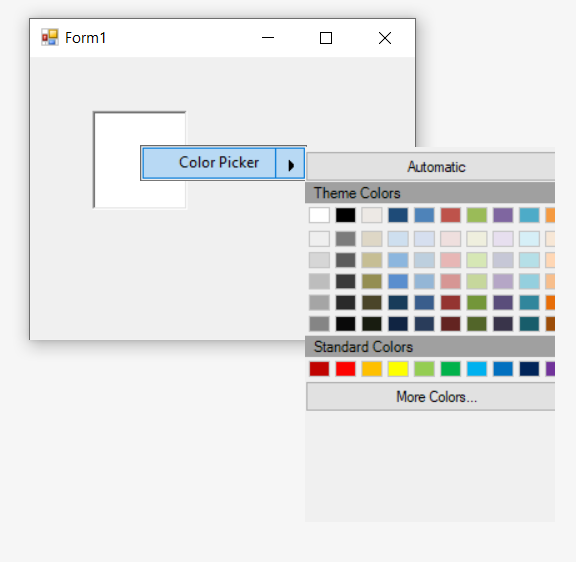

## ComboBoxBarItem

The ComboBoxBarItem is a type of bar item, which behaves like combo box control in PopupMenu.

### Adding ComboBoxBarItem through designer

1. Right-clicking on **PopupMenu** control and select **Add Default ParentBarItem...** option. You can also add the default parent bar item by selecting the **Add Default ParentBarItem...** option from the **Smart tag** menu.

   

   

2. Once **Default ParentBarItem** is added, we can add the combobox bar item by right-clicking on the control in the designer and select **Properties**. Now, in the **Properties** panel, under **Misc > ParentBarItem > Items** select the combobox bar item from the **BarItem Collection Editor**.

   

   

3. In BarItem Collection Editor window, click on down arrow of **Add** button. It will display different types of bar items. Using this, user can add appropriate bar items as per their need.

   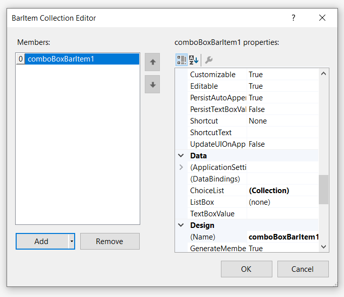

4. Once item is added, we can select particular item in **BarItem Collection Editor** window and set text under **Data > TextBoxValue** section.

   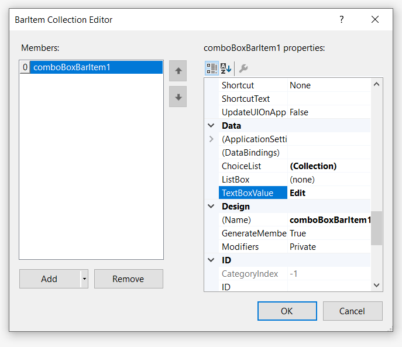

5. Similarly, we can add items collections in **properties** panel, under **Data > ChoiceList** by using **String Collection Editor**.

   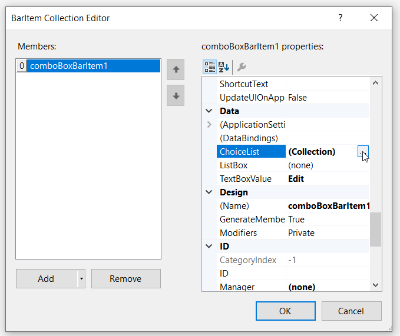

   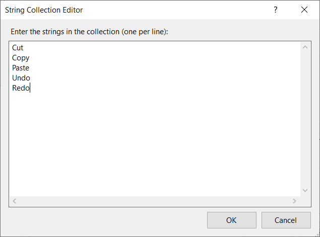

6. Finally, we have add the ComboBoxBarItem in PopupMenu control successfully.

   

### Adding ComboBoxBarItem through code

The below code snippets add **ComboBoxBarItem** to the PopupMenu control.




//Declaration
private Syncfusion.Windows.Forms.Tools.XPMenus.PopupMenu popupMenu1;
private Syncfusion.Windows.Forms.Tools.XPMenus.ParentBarItem parentBarItem1;
private Syncfusion.Windows.Forms.Tools.XPMenus.ComboBoxBarItem comboBoxBarItem1;
private System.Windows.Forms.RichTextBox richTextBox1;
private Syncfusion.Windows.Forms.Tools.XPMenus.PopupMenusManager popupMenusManager1;
        
//Initializing
this.popupMenu1 = new Syncfusion.Windows.Forms.Tools.XPMenus.PopupMenu(this.components);
this.parentBarItem1 = new Syncfusion.Windows.Forms.Tools.XPMenus.ParentBarItem();
this.comboBoxBarItem1 = new Syncfusion.Windows.Forms.Tools.XPMenus.ComboBoxBarItem();
this.richTextBox1 = new System.Windows.Forms.RichTextBox();
this.popupMenusManager1 = new Syncfusion.Windows.Forms.Tools.XPMenus.PopupMenusManager(this.components);

// popupMenu1
this.popupMenu1.ParentBarItem = this.parentBarItem1;

// parentBarItem1
this.parentBarItem1.MetroColor = System.Drawing.Color.LightSkyBlue;
this.parentBarItem1.SizeToFit = true;          
this.parentBarItem1.Items.Add(this.comboBoxBarItem1);

// comboBoxBarItem1
this.comboBoxBarItem1.SizeToFit = true;
this.comboBoxBarItem1.TextBoxValue = "Edit";
this.comboBoxBarItem1.ChoiceList.AddRange(new string[] { "Cut", "Copy", "Paste", "Undo", "Redo"});
            
// richTextBox1
this.richTextBox1.Size = new System.Drawing.Size(100, 96);
this.popupMenusManager1.SetXPContextMenu(this.richTextBox1, this.popupMenu1);
            
// Form1
this.ClientSize = new System.Drawing.Size(282, 253);
this.Text = "PopupMenu";
this.Controls.Add(this.richTextBox1);
this.ResumeLayout(false);       

 



'Declaration
Private popupMenu1 As Syncfusion.Windows.Forms.Tools.XPMenus.PopupMenu
Private parentBarItem1 As Syncfusion.Windows.Forms.Tools.XPMenus.ParentBarItem
Private comboBoxBarItem1 As Syncfusion.Windows.Forms.Tools.XPMenus.ComboBoxBarItem
Private richTextBox1 As System.Windows.Forms.RichTextBox
Private popupMenusManager1 As Syncfusion.Windows.Forms.Tools.XPMenus.PopupMenusManager

'Initializing
Me.popupMenu1 = New Syncfusion.Windows.Forms.Tools.XPMenus.PopupMenu(Me.components)
Me.parentBarItem1 = New Syncfusion.Windows.Forms.Tools.XPMenus.ParentBarItem()
Me.comboBoxBarItem1 = New Syncfusion.Windows.Forms.Tools.XPMenus.ComboBoxBarItem()
Me.richTextBox1 = New System.Windows.Forms.RichTextBox()
Me.popupMenusManager1 = New Syncfusion.Windows.Forms.Tools.XPMenus.PopupMenusManager(Me.components)

' popupMenu1
Me.popupMenu1.ParentBarItem = Me.parentBarItem1

' parentBarItem1
Me.parentBarItem1.MetroColor = System.Drawing.Color.LightSkyBlue
Me.parentBarItem1.SizeToFit = True
Me.parentBarItem1.Items.Add(Me.comboBoxBarItem1)

' comboBoxBarItem1
Me.comboBoxBarItem1.SizeToFit = True
Me.comboBoxBarItem1.TextBoxValue = "Edit"
Me.comboBoxBarItem1.ChoiceList.AddRange(New String() { "Cut", "Copy", "Paste", "Undo", "Redo"})

' richTextBox1
Me.richTextBox1.Size = New System.Drawing.Size(100, 96)
Me.popupMenusManager1.SetXPContextMenu(Me.richTextBox1, Me.popupMenu1)

' Form1
Me.ClientSize = New System.Drawing.Size(282, 253)
Me.Text = "PopupMenu"
Me.Controls.Add(Me.richTextBox1)
Me.ResumeLayout(False)




## ListBarItem

The ListBarItem is a type of bar item, which behaves like list control. 

### Adding ListBarItem through designer

1. Right-clicking on **PopupMenu** control and select **Add Default ParentBarItem...** option. You can also add the default parent bar item by selecting the **Add Default ParentBarItem...** option from the **Smart tag** menu.

   

   

2. Once **Default ParentBarItem** is added, we can add the ListBarItem by right-clicking on the control in the designer and select **Properties**. Now, in the **Properties** panel, under **Misc > ParentBarItem > Items** select the ListBarItem from the **BarItem Collection Editor**.

   

   

3. In BarItem Collection Editor window, click on down arrow of **Add** button. It will display different types of bar items. Using this, user can add appropriate bar items as per their need.

   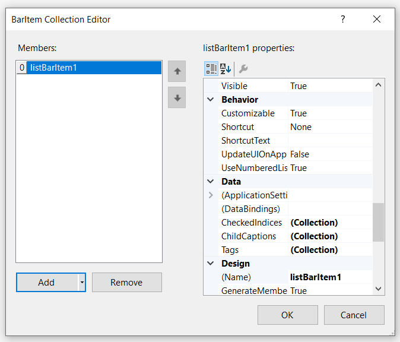

4. Once item is added, we can select particular item in **BarItem Collection Editor** window and set text under **Appearance > Text** section.

   

5. Similarly, we can add child items in **properties** panel, under **Data > ChildCaptions** by using **String Collection Editor**.

   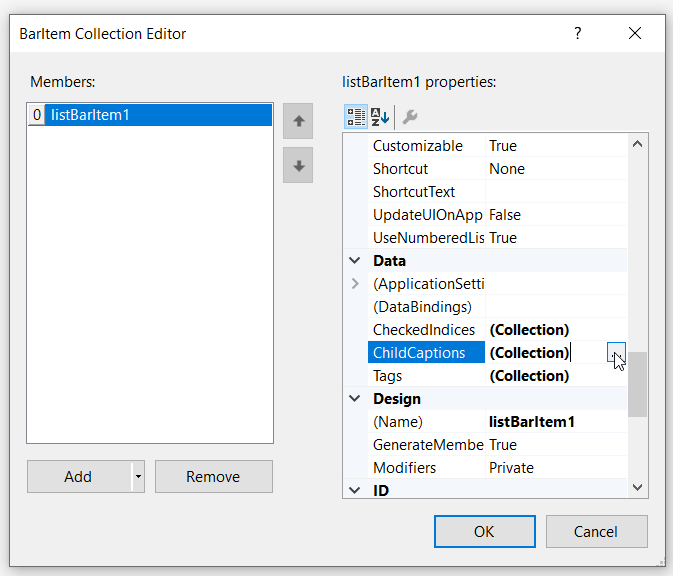

   

6. Finally, we have add the ListBarItem in PopupMenu control successfully.

   

### Adding ListBarItem through code

The below code snippets add **ListBarItem** to the PopupMenu control.




//Declaration
private Syncfusion.Windows.Forms.Tools.XPMenus.PopupMenu popupMenu1;
private Syncfusion.Windows.Forms.Tools.XPMenus.ParentBarItem parentBarItem1;
private Syncfusion.Windows.Forms.Tools.XPMenus.ListBarItem listBarItem1;
private System.Windows.Forms.RichTextBox richTextBox1;
private Syncfusion.Windows.Forms.Tools.XPMenus.PopupMenusManager popupMenusManager1;
        
//Initializing
this.popupMenu1 = new Syncfusion.Windows.Forms.Tools.XPMenus.PopupMenu(this.components);
this.parentBarItem1 = new Syncfusion.Windows.Forms.Tools.XPMenus.ParentBarItem();
this.listBarItem1 = new Syncfusion.Windows.Forms.Tools.XPMenus.ListBarItem();
this.richTextBox1 = new System.Windows.Forms.RichTextBox();
this.popupMenusManager1 = new Syncfusion.Windows.Forms.Tools.XPMenus.PopupMenusManager(this.components);

// popupMenu1
this.popupMenu1.ParentBarItem = this.parentBarItem1;

// parentBarItem1
this.parentBarItem1.MetroColor = System.Drawing.Color.LightSkyBlue;
this.parentBarItem1.SizeToFit = true;          
this.parentBarItem1.Items.Add(this.listBarItem1);

// listBarItem1
this.listBarItem1.SizeToFit = true;
this.listBarItem1.Text = "ListBarItem";
this.listBarItem1.ChildCaptions.AddRange(new string[] { "New", "Save", "SaveAs"});
                       
// richTextBox1
this.richTextBox1.Size = new System.Drawing.Size(100, 96);
this.popupMenusManager1.SetXPContextMenu(this.richTextBox1, this.popupMenu1);
            
// Form1
this.ClientSize = new System.Drawing.Size(282, 253);
this.Text = "PopupMenu";
this.Controls.Add(this.richTextBox1);
this.ResumeLayout(false);       

 



'Declaration
Private popupMenu1 As Syncfusion.Windows.Forms.Tools.XPMenus.PopupMenu
Private parentBarItem1 As Syncfusion.Windows.Forms.Tools.XPMenus.ParentBarItem
Private listBarItem1 As Syncfusion.Windows.Forms.Tools.XPMenus.ListBarItem
Private richTextBox1 As System.Windows.Forms.RichTextBox
Private popupMenusManager1 As Syncfusion.Windows.Forms.Tools.XPMenus.PopupMenusManager

'Initializing
Me.popupMenu1 = New Syncfusion.Windows.Forms.Tools.XPMenus.PopupMenu(Me.components)
Me.parentBarItem1 = New Syncfusion.Windows.Forms.Tools.XPMenus.ParentBarItem()
Me.listBarItem1 = New Syncfusion.Windows.Forms.Tools.XPMenus.ListBarItem()
Me.richTextBox1 = New System.Windows.Forms.RichTextBox()
Me.popupMenusManager1 = New Syncfusion.Windows.Forms.Tools.XPMenus.PopupMenusManager(Me.components)

' popupMenu1
Me.popupMenu1.ParentBarItem = Me.parentBarItem1

' parentBarItem1
Me.parentBarItem1.MetroColor = System.Drawing.Color.LightSkyBlue
Me.parentBarItem1.SizeToFit = True
Me.parentBarItem1.Items.Add(Me.listBarItem1)

' listBarItem1
Me.listBarItem1.SizeToFit = True
Me.listBarItem1.Text = "ListBarItem"
Me.listBarItem1.ChildCaptions.AddRange(New String() { "New", "Save", "SaveAs"})

' richTextBox1
Me.richTextBox1.Size = New System.Drawing.Size(100, 96)
Me.popupMenusManager1.SetXPContextMenu(Me.richTextBox1, Me.popupMenu1)

' Form1
Me.ClientSize = New System.Drawing.Size(282, 253)
Me.Text = "PopupMenu"
Me.Controls.Add(Me.richTextBox1)
Me.ResumeLayout(False)




## StaticBarItem

StaticBarItem represents a BarItem that could be used as a label for an adjacent BarItem.

### Adding StaticBarItem through designer

1. Right-clicking on **PopupMenu** control and select **Add Default ParentBarItem...** option. You can also add the default parent bar item by selecting the **Add Default ParentBarItem...** option from the **Smart tag** menu.

   

   

2. Once **Default ParentBarItem** is added, we can add the StaticBarItem by right-clicking on the control in the designer and select **Properties**. Now, in the **Properties** panel, under **Misc > ParentBarItem > Items** select the StaticBarItem from the **BarItem Collection Editor**.

   

   

3. In BarItem Collection Editor window, click on down arrow of **Add** button. It will display different types of bar items. Using this, user can add appropriate bar items as per their need.

   

4. Once item is added, we can select particular item in **BarItem Collection Editor** window and set text under **Appearance > Text** section.

   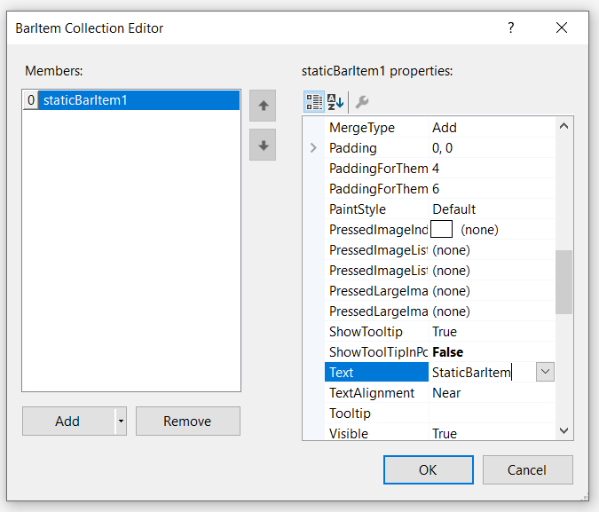

5. Finally, we have add the StaticBarItem in PopupMenu control successfully.

   

### Adding StaticBarItem through code

The below code snippets add **StaticBarItem** to the PopupMenu control.




//Declaration
private Syncfusion.Windows.Forms.Tools.XPMenus.PopupMenu popupMenu1;
private Syncfusion.Windows.Forms.Tools.XPMenus.ParentBarItem parentBarItem1;
private Syncfusion.Windows.Forms.Tools.XPMenus.StaticBarItem staticBarItem1;
private System.Windows.Forms.RichTextBox richTextBox1;
private Syncfusion.Windows.Forms.Tools.XPMenus.PopupMenusManager popupMenusManager1;
        
//Initializing
this.popupMenu1 = new Syncfusion.Windows.Forms.Tools.XPMenus.PopupMenu(this.components);
this.parentBarItem1 = new Syncfusion.Windows.Forms.Tools.XPMenus.ParentBarItem();
this.staticBarItem1 = new Syncfusion.Windows.Forms.Tools.XPMenus.StaticBarItem();
this.richTextBox1 = new System.Windows.Forms.RichTextBox();
this.popupMenusManager1 = new Syncfusion.Windows.Forms.Tools.XPMenus.PopupMenusManager(this.components);

// popupMenu1
this.popupMenu1.ParentBarItem = this.parentBarItem1;

// parentBarItem1
this.parentBarItem1.MetroColor = System.Drawing.Color.LightSkyBlue;
this.parentBarItem1.SizeToFit = true;          
this.parentBarItem1.Items.Add(this.staticBarItem1);

// staticBarItem1
this.staticBarItem1.SizeToFit = true;
this.staticBarItem1.Text = "StaticBarItem";
                       
// richTextBox1
this.richTextBox1.Size = new System.Drawing.Size(100, 96);
this.popupMenusManager1.SetXPContextMenu(this.richTextBox1, this.popupMenu1);
            
// Form1
this.ClientSize = new System.Drawing.Size(282, 253);
this.Text = "PopupMenu";
this.Controls.Add(this.richTextBox1);
this.ResumeLayout(false);       

 



'Declaration
Private popupMenu1 As Syncfusion.Windows.Forms.Tools.XPMenus.PopupMenu
Private parentBarItem1 As Syncfusion.Windows.Forms.Tools.XPMenus.ParentBarItem
Private staticBarItem1 As Syncfusion.Windows.Forms.Tools.XPMenus.StaticBarItem
Private richTextBox1 As System.Windows.Forms.RichTextBox
Private popupMenusManager1 As Syncfusion.Windows.Forms.Tools.XPMenus.PopupMenusManager

'Initializing
Me.popupMenu1 = New Syncfusion.Windows.Forms.Tools.XPMenus.PopupMenu(Me.components)
Me.parentBarItem1 = New Syncfusion.Windows.Forms.Tools.XPMenus.ParentBarItem()
Me.staticBarItem1 = New Syncfusion.Windows.Forms.Tools.XPMenus.StaticBarItem()
Me.richTextBox1 = New System.Windows.Forms.RichTextBox()
Me.popupMenusManager1 = New Syncfusion.Windows.Forms.Tools.XPMenus.PopupMenusManager(Me.components)

' popupMenu1
Me.popupMenu1.ParentBarItem = Me.parentBarItem1

' parentBarItem1
Me.parentBarItem1.MetroColor = System.Drawing.Color.LightSkyBlue
Me.parentBarItem1.SizeToFit = True
Me.parentBarItem1.Items.Add(Me.staticBarItem1)

' staticBarItem1
Me.staticBarItem1.SizeToFit = True
Me.staticBarItem1.Text = "StaticBarItem"

' richTextBox1
Me.richTextBox1.Size = New System.Drawing.Size(100, 96)
Me.popupMenusManager1.SetXPContextMenu(Me.richTextBox1, Me.popupMenu1)

' Form1
Me.ClientSize = New System.Drawing.Size(282, 253)
Me.Text = "PopupMenu"
Me.Controls.Add(Me.richTextBox1)
Me.ResumeLayout(False)




## TextBoxBarItem

TextBoxBarItem is used to provides the TextBox functionality in the **PopupMenu** control.

### Adding TextBoxBarItem through designer

1. Right-clicking on **PopupMenu** control and select **Add Default ParentBarItem...** option. You can also add the default parent bar item by selecting the **Add Default ParentBarItem...** option from the **Smart tag** menu.

   

   

2. Once **Default ParentBarItem** is added, we can add the TextBoxBarItem by right-clicking on the control in the designer and select **Properties**. Now, in the **Properties** panel, under **Misc > ParentBarItem > Items** select the TextBoxBarItem from the **BarItem Collection Editor**.

   

   

3. In BarItem Collection Editor window, click on down arrow of **Add** button. It will display different types of bar items. Using this, user can add appropriate bar items as per their need.

   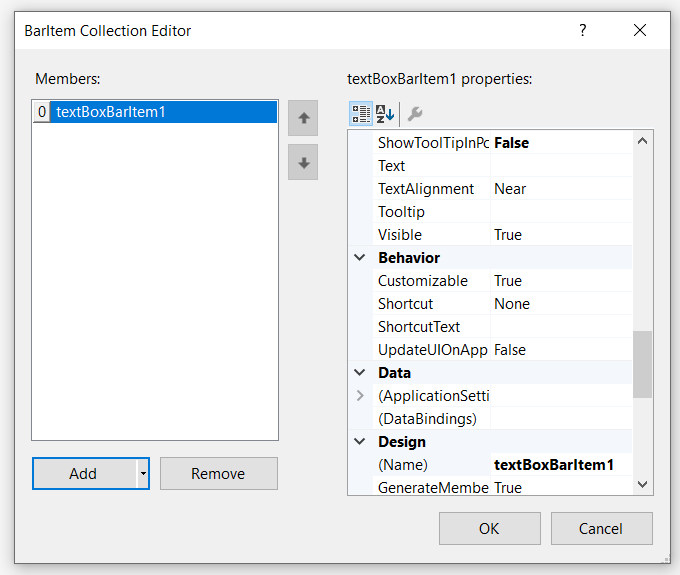

4. Once item is added, we can select particular item in **BarItem Collection Editor** window and set text under **Misc > TextBoxValue** section.

   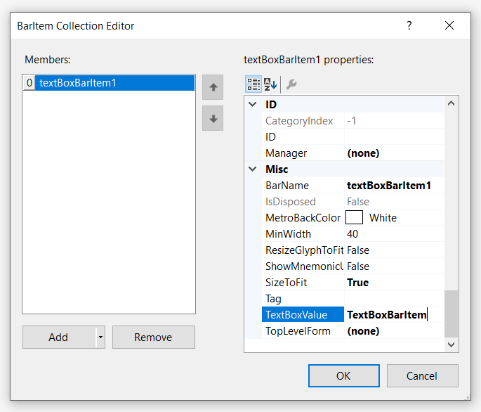

5. Finally, we have add the TextBoxBarItem in PopupMenu control successfully.

   

### Adding TextBoxBarItem through code

The below code snippets add **TextBoxBarItem** to the PopupMenu control.




//Declaration
private Syncfusion.Windows.Forms.Tools.XPMenus.PopupMenu popupMenu1;
private Syncfusion.Windows.Forms.Tools.XPMenus.ParentBarItem parentBarItem1;
private Syncfusion.Windows.Forms.Tools.XPMenus.TextBoxBarItem textBoxBarItem1;
private System.Windows.Forms.RichTextBox richTextBox1;
private Syncfusion.Windows.Forms.Tools.XPMenus.PopupMenusManager popupMenusManager1;
        
//Initializing
this.popupMenu1 = new Syncfusion.Windows.Forms.Tools.XPMenus.PopupMenu(this.components);
this.parentBarItem1 = new Syncfusion.Windows.Forms.Tools.XPMenus.ParentBarItem();
this.textBoxBarItem1 = new Syncfusion.Windows.Forms.Tools.XPMenus.TextBoxBarItem();
this.richTextBox1 = new System.Windows.Forms.RichTextBox();
this.popupMenusManager1 = new Syncfusion.Windows.Forms.Tools.XPMenus.PopupMenusManager(this.components);

// popupMenu1
this.popupMenu1.ParentBarItem = this.parentBarItem1;

// parentBarItem1
this.parentBarItem1.MetroColor = System.Drawing.Color.LightSkyBlue;
this.parentBarItem1.SizeToFit = true;          
this.parentBarItem1.Items.Add(this.textBoxBarItem1);

// textBoxBarItem1
this.textBoxBarItem1.SizeToFit = true;
this.textBoxBarItem1.Text = "Font";
this.textBoxBarItem1.TextBoxValue = "Segoe UI";
this.textBoxBarItem1.Value = "Segoe UI";
this.textBoxBarItem1.MinWidth = 60;
                       
// richTextBox1
this.richTextBox1.Size = new System.Drawing.Size(100, 96);
this.popupMenusManager1.SetXPContextMenu(this.richTextBox1, this.popupMenu1);
            
// Form1
this.ClientSize = new System.Drawing.Size(282, 253);
this.Text = "PopupMenu";
this.Controls.Add(this.richTextBox1);
this.ResumeLayout(false);       

 



'Declaration
Private popupMenu1 As Syncfusion.Windows.Forms.Tools.XPMenus.PopupMenu
Private parentBarItem1 As Syncfusion.Windows.Forms.Tools.XPMenus.ParentBarItem
Private textBoxBarItem1 As Syncfusion.Windows.Forms.Tools.XPMenus.TextBoxBarItem
Private richTextBox1 As System.Windows.Forms.RichTextBox
Private popupMenusManager1 As Syncfusion.Windows.Forms.Tools.XPMenus.PopupMenusManager

'Initializing
Me.popupMenu1 = New Syncfusion.Windows.Forms.Tools.XPMenus.PopupMenu(Me.components)
Me.parentBarItem1 = New Syncfusion.Windows.Forms.Tools.XPMenus.ParentBarItem()
Me.textBoxBarItem1 = New Syncfusion.Windows.Forms.Tools.XPMenus.TextBoxBarItem()
Me.richTextBox1 = New System.Windows.Forms.RichTextBox()
Me.popupMenusManager1 = New Syncfusion.Windows.Forms.Tools.XPMenus.PopupMenusManager(Me.components)

' popupMenu1
Me.popupMenu1.ParentBarItem = Me.parentBarItem1

' parentBarItem1
Me.parentBarItem1.MetroColor = System.Drawing.Color.LightSkyBlue
Me.parentBarItem1.SizeToFit = True
Me.parentBarItem1.Items.Add(Me.textBoxBarItem1)

' textBoxBarItem1
Me.textBoxBarItem1.SizeToFit = True
Me.textBoxBarItem1.Text = "Font"
Me.textBoxBarItem1.TextBoxValue = "Segoe UI"
Me.textBoxBarItem1.Value = "Segoe UI"
Me.textBoxBarItem1.MinWidth = 60

' richTextBox1
Me.richTextBox1.Size = New System.Drawing.Size(100, 96)
Me.popupMenusManager1.SetXPContextMenu(Me.richTextBox1, Me.popupMenu1)

' Form1
Me.ClientSize = New System.Drawing.Size(282, 253)
Me.Text = "PopupMenu"
Me.Controls.Add(Me.richTextBox1)
Me.ResumeLayout(False)




