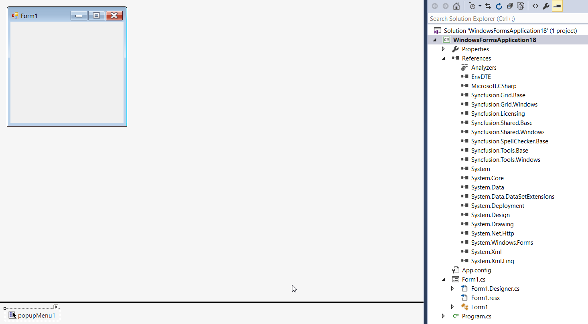
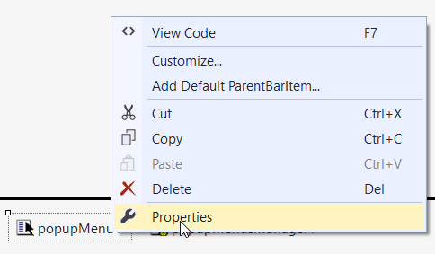
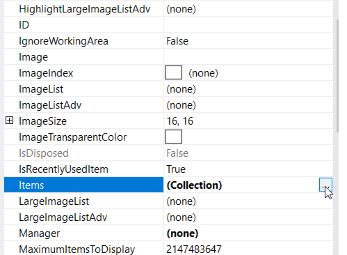
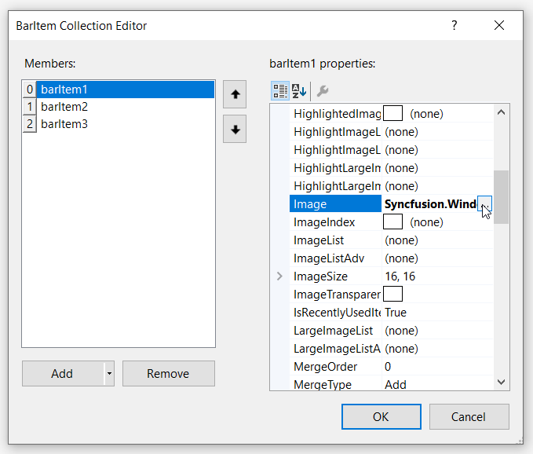
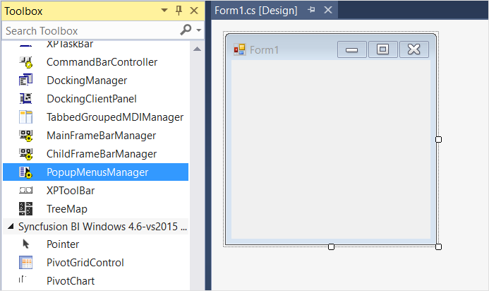
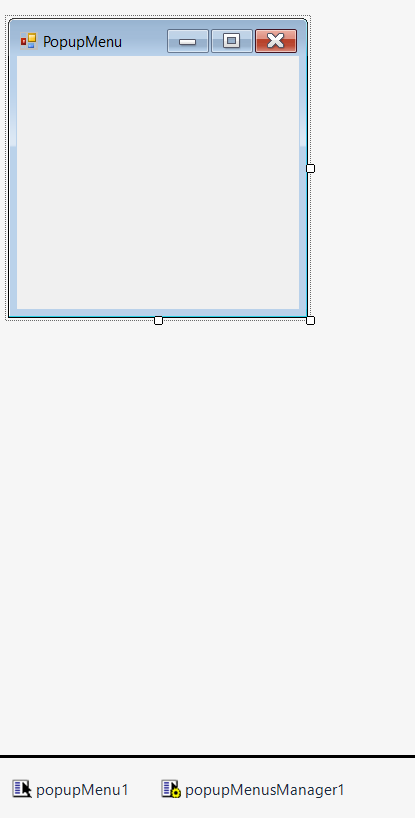
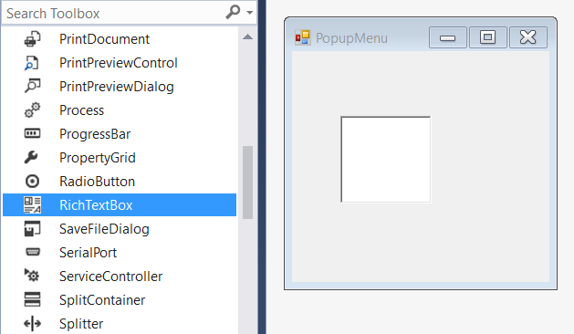
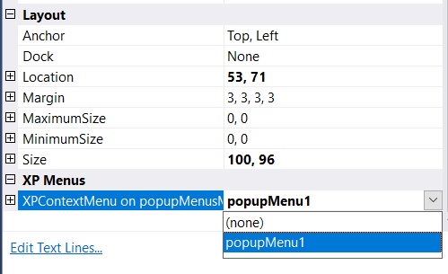

# Getting Started with Windows Forms PopupMenu

>**Important**
Starting with v16.2.0.x, if you refer to Syncfusion assemblies from trial setup or from the NuGet feed, include a license key in your projects. Refer to this [link](https://help.syncfusion.com/common/essential-studio/licensing/license-key) to learn about registering Syncfusion license key in your Windows Forms application to use our components.

This section provides a quick overview for working with the **PopupMenu** control in a WinForms application.

## Dependent Assemblies

The following assemblies needs to be added as reference to use the control in any application.

* Syncfusion.Tools.Windows
* Syncfusion.Grid.Base
* Syncfusion.Grid.Windows
* Syncfusion.Shared.Base
* Syncfusion.Shared.Windows
* Syncfusion.Tools.Base
* Syncfusion.SpellChecker.Base

## Adding popup menu through designer

The PopupMenu control can be added through designer by following the below steps.

1. Drag and drop the PopupMenu control from the toolbox (under the section "Syncfusion Windows **Visual Studio Version** Toolbox **Essential Studio Version**") into the designer page.

   

2. Now the PopupMenu control will be successfully added into the application along with the required dependent assemblies.

   

3. The popup menu needs to be associated with a default parent bar item in order to fill it with bar items. Right-clicking on **PopupMenu** control and select **Add Default ParentBarItem...** option. You can also add the default parent bar item by selecting the **Add Default ParentBarItem...** option from the **Smart tag** menu.

   

   

4. Once **Default ParentBarItem** is added, we can add the items by right-clicking on the control in the designer and select **Properties**. Now, in the **Properties** panel, under **Misc > ParentBarItem > Items** we need to choose the items by using **BarItem Collection Editor**.

   

   

5. In BarItem Collection Editor window, click on down arrow of **Add** button. It will display different types of bar items. Using this, user can add appropriate bar item as per the need.

   

6. In this illustration we have added **BarItem**. Similarly, we can add ParentBarItem, DropDownBarItem, ComboBoxBarItem, ListBarItem, StaticBarItem and TextBoxBarItem.

7. Once items are added, we can select particular item in **BarItem Collection Editor** window and set text under **Appearance > Text** section.

   

   Similarly, we can add image under **Appearance > Image** section.

   

8. On complete populating of popup menu, drag and drop the **PopupMenusManager** container inside which the popup menu will be hosted for display.

   

   

9. Now we are going to associate the popup menu control with an appropriate control. In this example, we illustrate the scenario with "RichTextBox" control.

   >**NOTE**:
   To associate the PopupMenu control, you can choose any type of control like RichTextBox, Button, Label, TextBox, MaskedTextBox etc... of your choice.  

   

10. **Right-click** on the RichTextBox control in the designer and select **Properties**. Now, in the **Properties** panel, under **XP Menus > XPContextMenu on popupMenusManager1** we need to assign the respective popup menu.

   

   

 Now, bar items are successfully associate with the PopupMenu control.

     

## Adding popup menu through code

The PopupMenu control can be added through code by following the below steps.

1. Add the following dependency assembly references to the project.

   * Syncfusion.Tools.Windows.dll
   * Syncfusion.Grid.Base.dll
   * Syncfusion.Grid.Windows.dll
   * Syncfusion.Shared.Base.dll
   * Syncfusion.Shared.Windows.dll
   * Syncfusion.Tools.Base.dll
   * Syncfusion.Licensing.dll
   * Syncfusion.SpellChecker.Base.dll

   > NOTE: You can get these assemblies by browsing to the default assembly location.
{System Drive}: \Program Files (x86) \ Syncfusion\Essential Studio\ {Platform} \ {Build Version Number} \ precompiledassemblies \ {Framework Version Number}

2. The below code snippets adds a PopupMenu control to the application.




//Declaration
private Syncfusion.Windows.Forms.Tools.XPMenus.PopupMenu popupMenu1;
private Syncfusion.Windows.Forms.Tools.XPMenus.ParentBarItem parentBarItem1;
private Syncfusion.Windows.Forms.Tools.XPMenus.BarItem barItem1;        
private Syncfusion.Windows.Forms.Tools.XPMenus.BarItem barItem2;
private Syncfusion.Windows.Forms.Tools.XPMenus.BarItem barItem3;
private System.Windows.Forms.RichTextBox richTextBox1;
private Syncfusion.Windows.Forms.Tools.XPMenus.PopupMenusManager popupMenusManager1;
        
//Initializing
this.popupMenu1 = new Syncfusion.Windows.Forms.Tools.XPMenus.PopupMenu(this.components);
this.parentBarItem1 = new Syncfusion.Windows.Forms.Tools.XPMenus.ParentBarItem();
this.barItem1 = new Syncfusion.Windows.Forms.Tools.XPMenus.BarItem();
this.barItem2 = new Syncfusion.Windows.Forms.Tools.XPMenus.BarItem();
this.barItem3 = new Syncfusion.Windows.Forms.Tools.XPMenus.BarItem();
this.richTextBox1 = new System.Windows.Forms.RichTextBox();
this.popupMenusManager1 = new Syncfusion.Windows.Forms.Tools.XPMenus.PopupMenusManager(this.components);

// popupMenu1
this.popupMenu1.ParentBarItem = this.parentBarItem1;

// barItem1
this.barItem1.Image = new ImageExt(System.Drawing.Image.FromFile(@"..\..\..\File.png"));
this.barItem1.SizeToFit = true;
this.barItem1.Text = "File";
        
// barItem2
this.barItem2.Image = new ImageExt(System.Drawing.Image.FromFile(@"..\..\..\Edit.png"));
this.barItem2.SizeToFit = true;
this.barItem2.Text = "Edit";
           
// barItem3
this.barItem3.Image = new ImageExt(System.Drawing.Image.FromFile(@"..\..\..\Help.png"));
this.barItem3.SizeToFit = true;
this.barItem3.Text = "Help";

// parentBarItem1
this.parentBarItem1.MetroColor = System.Drawing.Color.LightSkyBlue;
this.parentBarItem1.SizeToFit = true;          
this.parentBarItem1.Items.AddRange(new Syncfusion.Windows.Forms.Tools.XPMenus.BarItem[] {this.barItem1, this.barItem2, this.barItem3});

// richTextBox1
this.richTextBox1.Size = new System.Drawing.Size(100, 96);
this.popupMenusManager1.SetXPContextMenu(this.richTextBox1, this.popupMenu1);
            
// Form1
this.ClientSize = new System.Drawing.Size(282, 253);
this.Text = "PopupMenu";
this.Controls.Add(this.richTextBox1);
this.ResumeLayout(false);       

 



'Declaration
Private popupMenu1 As Syncfusion.Windows.Forms.Tools.XPMenus.PopupMenu
Private parentBarItem1 As Syncfusion.Windows.Forms.Tools.XPMenus.ParentBarItem
Private barItem1 As Syncfusion.Windows.Forms.Tools.XPMenus.BarItem
Private barItem2 As Syncfusion.Windows.Forms.Tools.XPMenus.BarItem
Private barItem3 As Syncfusion.Windows.Forms.Tools.XPMenus.BarItem
Private richTextBox1 As System.Windows.Forms.RichTextBox
Private popupMenusManager1 As Syncfusion.Windows.Forms.Tools.XPMenus.PopupMenusManager

'Initializing
Me.popupMenu1 = New Syncfusion.Windows.Forms.Tools.XPMenus.PopupMenu(Me.components)
Me.parentBarItem1 = New Syncfusion.Windows.Forms.Tools.XPMenus.ParentBarItem()
Me.barItem1 = New Syncfusion.Windows.Forms.Tools.XPMenus.BarItem()
Me.barItem2 = New Syncfusion.Windows.Forms.Tools.XPMenus.BarItem()
Me.barItem3 = New Syncfusion.Windows.Forms.Tools.XPMenus.BarItem()
Me.richTextBox1 = New System.Windows.Forms.RichTextBox()
Me.popupMenusManager1 = New Syncfusion.Windows.Forms.Tools.XPMenus.PopupMenusManager(Me.components)

' popupMenu1
Me.popupMenu1.ParentBarItem = Me.parentBarItem1

' barItem1
Me.barItem1.Image = New ImageExt(System.Drawing.Image.FromFile("..\..\..\File.png"))
Me.barItem1.SizeToFit = True
Me.barItem1.Text = "File"

' barItem2
Me.barItem2.Image = New ImageExt(System.Drawing.Image.FromFile("..\..\..\Edit.png"))
Me.barItem2.SizeToFit = True
Me.barItem2.Text = "Edit"

' barItem3
Me.barItem3.Image = New ImageExt(System.Drawing.Image.FromFile("..\..\..\Help.png"))
Me.barItem3.SizeToFit = True
Me.barItem3.Text = "Help"

' parentBarItem1
Me.parentBarItem1.MetroColor = System.Drawing.Color.LightSkyBlue
Me.parentBarItem1.SizeToFit = True
Me.parentBarItem1.Items.AddRange(New Syncfusion.Windows.Forms.Tools.XPMenus.BarItem() {Me.barItem1, Me.barItem2, Me.barItem3})

' richTextBox1
Me.richTextBox1.Size = New System.Drawing.Size(100, 96)
Me.popupMenusManager1.SetXPContextMenu(Me.richTextBox1, Me.popupMenu1)

' Form1
Me.ClientSize = New System.Drawing.Size(282, 253)
Me.Text = "PopupMenu"
Me.Controls.Add(Me.richTextBox1)
Me.ResumeLayout(False)




## Adding popup menu through NuGet package

Refer [control dependencies](https://help.syncfusion.com/windowsforms/control-dependencies#popupmenu) section to get the list of assemblies or NuGet package needs to be added as reference to use the control in any application.

Find more details regarding how to install the NuGet packages in WinForms application in the following link: [Steps to install NuGet packages](https://help.syncfusion.com/windowsforms/installation/install-nuget-packages).

