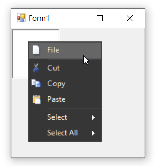
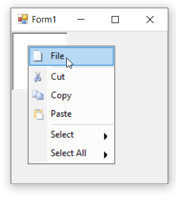
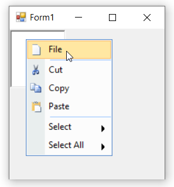
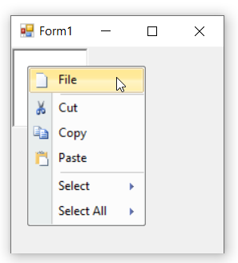
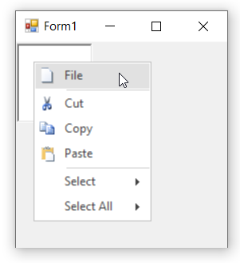
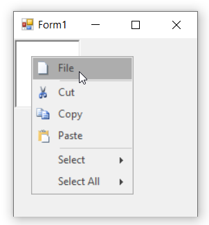
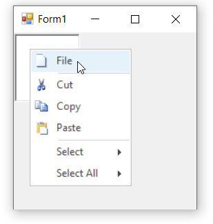
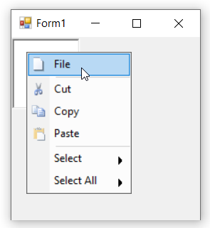
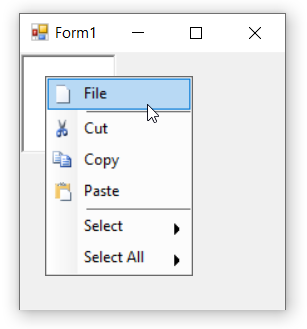

# Themes 

Theming is the process of applying rich look and feel to visual elements of a control. The [`Style`](https://help.syncfusion.com/cr/windowsforms/Syncfusion.Tools.Windows~Syncfusion.Windows.Forms.Tools.XPMenus.ParentBarItem~Style.html) property is used to set the visual style of PopupMenu control. This control provides the following theming options:

* Default
* Metro
* Office2003
* Office2007
* Office2007Outlook
* Office2010
* Office2016Black
* Office2016Colorful
* Office2016DarkGray
* Office2016White
* OfficeXP
* VS2005
* VS2010

The below code snippet will sets the visual style as "Office2016Black".




this.popupMenu1.ParentBarItem.Style = Syncfusion.Windows.Forms.VisualStyle.Office2016Black;





Me.popupMenu1.ParentBarItem.Style = Syncfusion.Windows.Forms.VisualStyle.Office2016Black




## Office2016Black

## Default

## Metro

## Office2003

## Office2007

## Office2007Outlook

## Office2010

## Office2016Colorful

## Office2016DarkGray

## Office2016White

## OfficeXP

## VS2005

## VS2010

