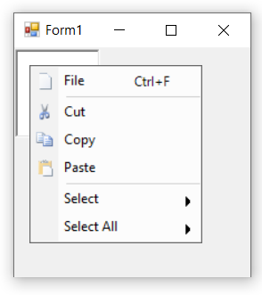
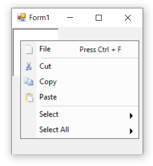

# Touch and Keyboard in Windows Forms PopupMenu

## Touch

Touch mode is used to access the control easily in touch devices. By default, touch support is enabled in PopupMenu control.

## Keyboard Shortcuts

The bar items can be selected through keyboard operation by specifying the shortcuts via the [`Shortcut`](https://help.syncfusion.com/cr/windowsforms/Syncfusion.Windows.Forms.Tools.XPMenus.BarItem.html#Syncfusion_Windows_Forms_Tools_XPMenus_BarItem__ctor_System_String_System_EventHandler_System_Windows_Forms_Shortcut_) property of the bar item.

>**NOTE**      
1. By using this keyboard shortcuts we can access the bar items through [`Click`](https://help.syncfusion.com/cr/windowsforms/Syncfusion.Windows.Forms.Tools.XPMenus.BarItem.html) event.               
2. In this illustration, we have used **BarItem**. Similarly, we have set the shortcuts for ParentBarItem, DropDownBarItem, ComboBoxBarItem, ListBarItem, StaticBarItem and TextBoxBarItem.

The below code snippet shows how shortcut is assigned to the bar item.




this.barItem1.Shortcut = System.Windows.Forms.Shortcut.CtrlF;





Me.barItem1.Shortcut = System.Windows.Forms.Shortcut.CtrlF




User can also specify custom text in place of keyboard shortcuts region using the [`ShortcutText`](https://help.syncfusion.com/cr/windowsforms/Syncfusion.Windows.Forms.Tools.XPMenus.BarItem.html#Syncfusion_Windows_Forms_Tools_XPMenus_BarItem_ShortcutText) property.




this.barItem1.Shortcut = System.Windows.Forms.Shortcut.CtrlF;
this.barItem1.ShortcutText = "Press Ctrl + F";





Me.barItem1.Shortcut = System.Windows.Forms.Shortcut.CtrlF
Me.barItem1.ShortcutText = "Press Ctrl + F"




## Keyboard Mnemonics

The bar items of popup menu support to add mnemonic text. The required character is appended with **&** symbol in the [`Text`](https://help.syncfusion.com/cr/windowsforms/Syncfusion.Windows.Forms.Tools.XPMenus.BarItem.html#Syncfusion_Windows_Forms_Tools_XPMenus_BarItem_Text) property of the bar item. Mnemonics can be visible by setting the [`ShowMnemonicUnderlinesAlways`](https://help.syncfusion.com/cr/windowsforms/Syncfusion.Windows.Forms.Tools.XPMenus.BarItem.html#Syncfusion_Windows_Forms_Tools_XPMenus_BarItem_ShowMnemonicUnderlinesAlways) property of the bar item as `true`.

The below code snippet shows the bar items with the mnemonics.




this.barItem1.Text = "&File";
this.barItem1.ShowMnemonicUnderlinesAlways = true;





Me.barItem1.Text = "&File"
Me.barItem1.ShowMnemonicUnderlinesAlways = True




