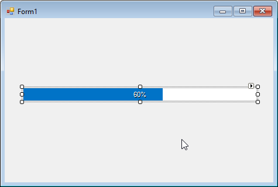
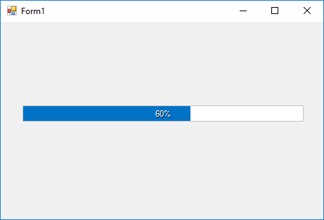
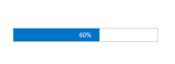

# Getting Started in Windows Forms Progress Bar (ProgressBarAdv)

This section describes how to add [Windows Forms Progress Bar](https://www.syncfusion.com/winforms-ui-controls/progress-bar) (ProgressBarAdv) control in a Windows Forms application and overview of its basic functionalities.

## Assembly deployment

Refer [control dependencies](https://help.syncfusion.com/windowsforms/control-dependencies#progressbaradv) section to get the list of assemblies or NuGet package needs to be added as reference to use the control in any application.
 
Please find more details regarding how to install the nuget packages in windows form application in the below link:
 
[How to install nuget packages](https://help.syncfusion.com/windowsforms/visual-studio-integration/nuget-packages)

## Creating simple application with ProgressBarAdv

You can create the Windows Forms application with ProgressBarAdv control as follows:

1. [Creating project](#creating-the-project)
2. [Adding control via designer](#adding-control-via-designer)
3. [Adding control manually using code](#adding-control-manually-using-code)
4. [Configure text format](#configure-text-format)
5. [Configure TextAlignment](#configure-textAlignment)

### Creating the project

Create a new Windows Forms project in the Visual Studio to display the [ProgressBarAdv](https://help.syncfusion.com/cr/windowsforms/Syncfusion.Windows.Forms.Tools.ProgressBarAdv.html) with basic functionalities.

## Adding control via designer

The [Windows Forms Progress Bar](https://help.syncfusion.com/cr/windowsforms/Syncfusion.Windows.Forms.Tools.ProgressBarAdv.html) (ProgressBarAdv) control can be added to the application by dragging it from the toolbox and dropping it in a designer view. The following required assembly references will be added automatically:

* Syncfusion.Shared.Base.dll

## Adding control manually using code

To add control manually in C#, follow the given steps:

**Step 1** - Add the following required assembly references to the project:

	* Syncfusion.Shared.Base.dll

**Step 2** - Include the namespaces **Syncfusion.Windows.Forms.Tools**.





using Syncfusion.Windows.Forms.Tools;





Imports Syncfusion.Windows.Forms.Tools



 

**Step 3** - Create `ProgressBarAdv` control instance and add it to the form.





ProgressBarAdv progressBarAdv1 = new ProgressBarAdv();

this.progressBarAdv1.ProgressStyle = ProgressBarStyles.Office2016Colorful;

this.progressBarAdv1.Value = 60;

this.Controls.Add(progressBarAdv1);





Dim progressBarAdv1 As ProgressBarAdv = New ProgressBarAdv()

Me.progressBarAdv1.ProgressStyle = ProgressBarStyles.Office2016Colorful

Me.progressBarAdv1.Value = 60

Me.Controls.Add(progressBarAdv1)





## Configure text format

Text format of the ProgressBarAdv can be customized using [TextStyle](https://help.syncfusion.com/cr/windowsforms/Syncfusion.Windows.Forms.Tools.ProgressBarAdv.html#Syncfusion_Windows_Forms_Tools_ProgressBarAdv_TextStyle) property.

**Value** - It represents the current value out of maximum value format.





this.progressBarAdv1.TextStyle = ProgressBarTextStyles.Value;





Me.progressBarAdv1.TextStyle = ProgressBarTextStyles.Value





**Percentage** - It represents the percentage format.





this.progressBarAdv1.TextStyle = ProgressBarTextStyles.Percentage;





Me.progressBarAdv1.TextStyle = ProgressBarTextStyles.Percentage





**Custom** - It represents the other custom format.





this.progressBarAdv1.CustomText = "Loading";
this.progressBarAdv1.TextStyle = ProgressBarTextStyles.Custom;





Me.progressBarAdv1.CustomText = "Loading"
Me.progressBarAdv1.TextStyle = ProgressBarTextStyles.Custom





## Configure text alignment

Alignment of the foreground text can be modified using [TextAlignment](https://help.syncfusion.com/cr/windowsforms/Syncfusion.Windows.Forms.Tools.ProgressBarAdv.html#Syncfusion_Windows_Forms_Tools_ProgressBarAdv_TextAlignment) property.

**Center** - It represents text aligned to the center.





this.progressBarAdv1.TextAlignment = TextAlignment.Center;





Me.progressBarAdv1.TextAlignment = TextAlignment.Center





**Left** - It represents text aligned to the left.





this.progressBarAdv1.TextAlignment = TextAlignment.Left;





Me.progressBarAdv1.TextAlignment = TextAlignment.Left





**Right** - It represents text aligned to the right.





this.progressBarAdv1.TextAlignment = TextAlignment.Right;





Me.progressBarAdv1.TextAlignment = TextAlignment.Right





