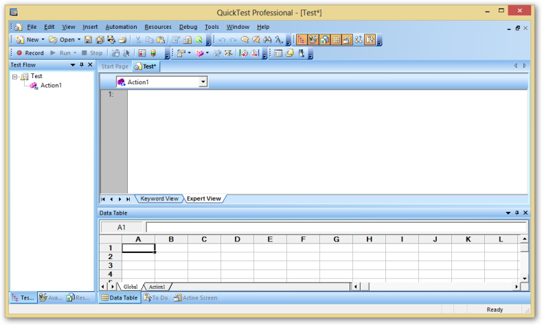
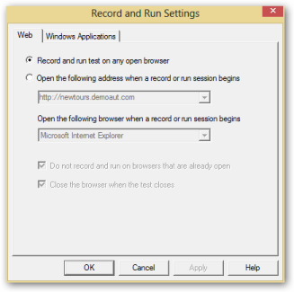
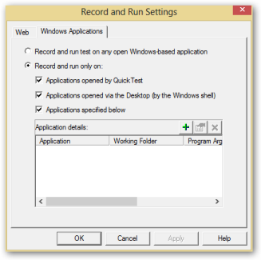
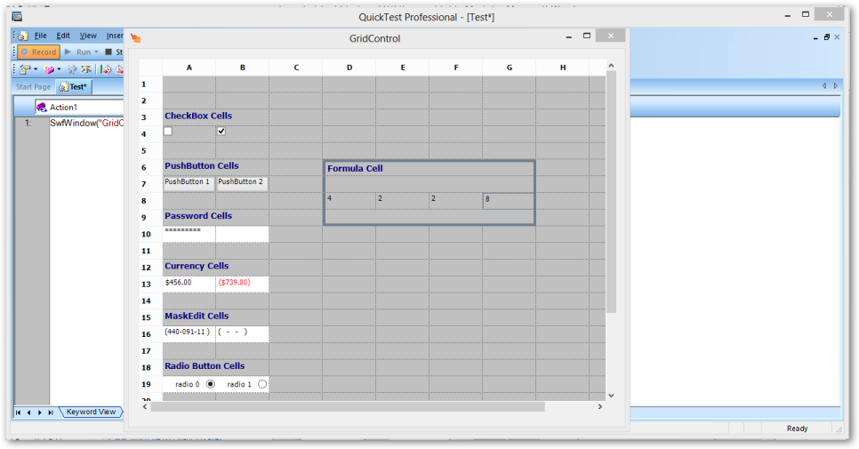
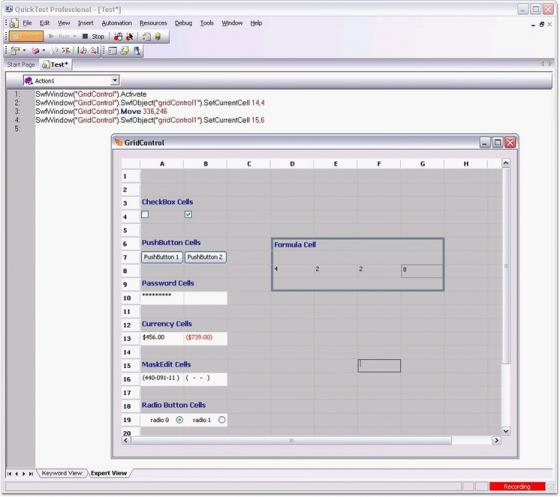
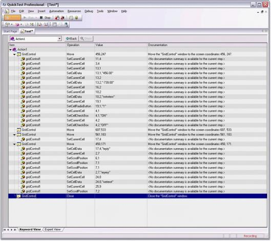
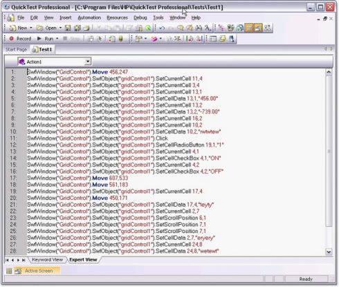

# Getting Started

Essential QuickTest Professional lets you test applications with different Syncfusion controls, and allows playback of scripts. The following is a list of chapters containing information on the functionality of this software.

## Creating and Recording a Test

To create a new test:

1. Open QTP by double-clicking the QuickTest Professional icon.
   
   N> The QuickTest Professional – Add-in Manager window is displayed.

2. Select the .NET check box under the Add-in header. This ensures that .NET add-in is installed. 

   

   _Figure_ _9_: QuickTest Professional - Add-In Manager

3. Click OK.

   N> The QuickTest Professional – [Start Page] window is displayed. There are two tabs, Start Page and Test, in the main pane of the window. The content under the Start Page tab is displayed by default.

   
   

   
   _Figure_ _10_: QuickTest Professional – [Start Page]

4. Click the New Test icon on the Start Page.

   

    _Figure_ _11_: QuickTest Professional – [Start Page] showing New Test icon

This creates a new test. Alternatively, you can click the Test tab in the main pane of the window or Test sub-menu under the New menu in the Menu bar.

5. Click Record in the toolbar to start the recording. 

   

    _Figure_ _12_: QuickTest Professional – [Test*] Window showing Record tool

    N> A Record and Run Settings dialog box is displayed.

   

   _Figure_ _13_: Record and Run Settings-Web tab

6. Click the Windows Applications tab. 

   N> The content under the tab is displayed.

   

   _Figure_ _14_: Record and Run Settings-Windows Applications

   N> The Record and run only on option button is selected by default, and the check boxes selected under it ensure that only the applications opened by QuickTest and added applications are tested.

7. To add an application for testing, click the + button in the Application details: frame as shown in the figure above.
 
   N> The Application Details dialog box is displayed.
  
   
 
   _Figure_ _15_: Application Details

8. Browse and select the path of the application that is to be tested by clicking () for the Application: label.

9. Browse and select the path of the working folder by clicking () for the Working folder: label.

   N> Selecting the Launch application check box launches the application immediately after clicking OK in the current dialog. The Include descendant processes check box includes all the processes that are descendant to the current process. Both these check boxes will be selected by default.

10. Click OK.

    N> The path of the application and working folder are displayed in the Application details frame as shown below.

    

    _Figure_ _16_: Record and Run Settings with the Application Location

11. Click OK. 

    N> The recording starts. The application in the given path is opened as shown below.

    

    _Figure_ _17_: Application using Grid Control

12. Perform required valid user-action in the application. 

    N> Whenever the user performs any action involving the Syncfusion control used in the application, the SwfConfig file maps the control to the corresponding DLL.

    The DLL renders the correct method names of the Syncfusion namespace that will be called respective to the user-actions performed.
    These method names are then recorded and displayed in the screen behind the running application, as shown below.

    

    N> This is called high-level recording, as the events are recorded with the method names of the Syncfusion namespace after recognizing the Syncfusion control, unlike the low-level recording in which the Syncfusion controls are not recognized by QTP and the events are recorded with default method names as shown below.

    

    _Figure_ _18_: Default recording without recognizing Syncfusion control

    N> The low-level recording is the default recording, which is done by QTP when the steps mentioned in the Configuring Essential QuickTest Professional section are not followed. The recording can be stopped by clicking the Stop button in the toolbar.

The process of creating and recording the test is completed.

## Running a Test

On recording, all the user actions performed in the control are just noted with the corresponding method names of the Syncfusion namespace. The errors can be checked while running a test. To run a test, follow the steps below: 

1. Click Run in the toolbar.

   N> The Run dialog box is displayed. The Results Location tab is highlighted by default.

   

   _Figure_ _19_: Run Dialog

   In the Results Location tab, two options are provided:

   * New run results folder: Allows the results of the test to be written to the location mentioned in the text box below it.
   * Temporary run results folder (overwrites any existing temporary results) - Allows the results to be stored in the temporary location.

2. Click the required option.

   N> Selecting one option renders the other unavailable.

3. Browse and select the required location by clicking the <icon>

   N> QTP starts the running process; the application containing the recorded Syncfusion control is opened and it shows all the recorded events in a continuous flow one by one. After it finishes running the test, it displays the Test [Result_Written_Location] - Test Results dialog box, in which the results are summarized as shown below:

_Figure_ _20_: Test Results

The process of running the test is completed.

 To know more about running scripts, refer to the QTP help document. 

## Editing a Test

A test can be edited in either the Keyword view or in the Expert view. You can switch between these views by selecting the required tab at the bottom left of the QuickTest Professional test screen. 

### Editing in Expert View

This view is specially provided for the experts in VB script. In the Expert view, the VB scripts are generated while recording. You can also manually write scripts to the existing scripts in this view. So, this view can be used as a tool for managing the testing process in a more controlled manner. You can add scripts to trigger events manually. 

The following image shows adding a script line to the Expert View pane.

_Figure_ _21_: Editing in Expert view

You can run the edited test to check whether the newly added or changed scripts affect the running process by showing the changes in the running application.

N> Sometimes, the newly added or changed script may have an error causing the whole application to fail. In such a case, the Test Results dialog will show the failure as shown below:

_Figure_ _22_: Test Results when Testing Fails

For more details on running the test, refer to the previous section.

### Editing in Keyword View

The keyword view is meant for persons who are not experts in VB scripts. Keyword view contains the controls used, the user-actions or operations performed, values involved in the operation, and the documentation summary in a table format. The controls used are listed under the Item header in a tree-view format as shown below.

_Figure_ _23_: Keyword View

To edit the test in Keyword view, you can perform any of the following actions:

1. You can right-click any of the items listed under the Item header and choose one of the options available in the displayed menu as shown below.

_Figure_ _24_: Editing in Keyword View – Right-click

For example, clicking Cut in the menu will cause the row representing a user-action to be cut. You can then right-click on any other item and click Paste on the menu displayed. This causes the row to be pasted before the right-clicked item.

N> All the items under the Item header are represented as a drop-down list.

_Figure_ _25_: Editing on Keyword View – Drop-down

You can then run the edited test.

 For more details on running the edited test, refer to Editing on Expert View topic.

## Saving a Test

Saving a test is like saving any other document or picture. To save a test, follow the steps below:

1. Click the Save button in the toolbar. The Save Test dialog box is displayed.

   

   _Figure_ _26_: Save Test Dialog

2. Select the location to save the file from the Save in: drop-down list.
3. Type the file name of the file to be saved in the text box adjacent to the File name label. 
4. Click Save.

The test is saved.

## Running the Saved Test

The tests that have been saved can be replayed later. To run a saved test, follow the steps below:

1. Click Open on the toolbar.

   N> The Open Test dialog box is displayed with a list of saved tests.

   

   _Figure_ _27_: Open Test Dialog

2. Select the required test and click Open.

   N> The saved test is opened with its name and the complete path as the name of the window. By default, Expert View of the Test is opened.

   The following image shows the mouse pointer pointing towards the path and file displayed as the window name.

   

   _Figure_ _28__: Test Opened_

3. Click Run on the toolbar to run the test.

 For more details on running the test, refer to the Running a Test topic in this document.

The process of running a saved test is complete.

