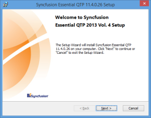
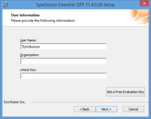
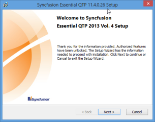
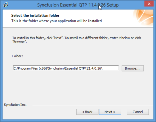
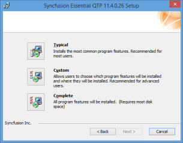

## Installation and Deployment

This section covers information on the install location, samples, licensing, and uninstallation of the recent version of Essential QuickTest Professional.

### Installation and Configuration

This topic explains the installation process for Syncfusion Essential QuickTest professional and the configuration details about the swfconfig file.

#### Installation

This section provides specifics on installation of Syncfusion Essential QuickTest professional.

To install Essential Test Studio:

> {  | markdownify }
{:.image }
_Note: The Installation procedures are the same for every Essential Test Studio setup, regardless of the volume of the Test setup._

1. Double-click the Syncfusion Essential Test Studio Setup file.
> 
{  | markdownify }
{:.image }
_Note: Setup - Syncfusion Essential QuickTest Professional dialog box opens._

{  | markdownify }
{:.image }

_Figure_ _1_: Setup - Essential QuickTest Professional Welcome screen_

2. Click Next. The User Information screen opens. 

{  | markdownify }
{:.image }

_Figure_ _2_: User Information screen_

3. Enter your name, organization and enter the license key in the corresponding text boxes provided.

> {  | markdownify }
{:.image }
_Note: Use Essential Studio Unlock Key as the Unlock Key for Essential Testing Studio. For version previous to 6.3.0.6, use “Syncfusion199“ as the Unlock Key._ 

4. Click Next. The unlock key will be validated.

{  | markdownify }
{:.image }

_Figure_ _3_: Select Destination Location_

5. Click Next. The Select the installation folder window opens.

{  | markdownify }
{:.image }

_Figure_ _4_: Select Installation Folder_

6. To install in the default location, click Next. You can also browse to choose a required location. When you click Browse to select the desired location, the Destination Location screen displays the selected location. 

7. Click Next. The Installation options window opens. Choose one of the following installation options as required:

* Typical - Installs most common program features.
* Custom - Allows you to choose the program to be installed and where it should be installed.
* Complete - Installs all of the feature programs.

{  | markdownify }
{:.image }

_Figure_ _5_: Installing options Screen_

8. Click Next. The Ready to Install dialog opens.

{  | markdownify }
{:.image }

_Figure_ _6_: Ready to Install Screen_

9. Click Install. The installation process starts displaying the Installing screen as shown in the following screen shot.

{  | markdownify }
{:.image }

_Figure_ _7_: Installing Screen_

The following screen is displayed once the installation is completed.

{  | markdownify }
{:.image }

_Figure_ _8_: Installation Completed_

#### Configuration

An XML file in QTP called swfconfig is the configuration file located at _(Installed location of Essential QuickTest Professional)Config\&lt;version-2.0, 3.5, or 4.0&gt;\swfconfig_, which contains all the mapping information for QTP to recognize Syncfusion controls. In swfconfig, the controls are mapped to their corresponding custom server libraries (Essential QuickTest Professional DLLs) by giving the fully qualified name of the DLL.

> {  | markdownify }
{:.image }
_Note: The fully qualified name is the name of the file mentioned with its complete path._

Any event that is triggered while working with a Syncfusion control, either by the user or the program activity, will be handled by the corresponding method in the custom library (DLL) given as the &lt;DllName&gt; tag under the &lt;Control&gt; tag.

An XML file can be configured in one of two ways, automatically or manually.

##### Automatic Configuration

This section provides the details about the configuration of the swfconfig file using the SwfConfigUtility. Refer to the Utility section of this document.

##### Manual Configuration

This section provides details about the manual configuration of the swfconfig file.

Steps to Configure QTP to use the Custom Libraries shipped in Essential QuickTest Professional

1. Navigate to the following path:

_(Installed location of Essential QuickTest Professional)\Config_

> {  | markdownify }
{:.image }
_Note: You will find three folders, named 2.0, 3.5 and 4.0 here. The folders 2.0, 3.5 and 4.0 consist of swfconfig files for .NET 2.0, .NET 3.5 and NET 4.0 frameworks respectively._

2. Open the swfconfig file by double-clicking it. You can view the mapping for all the supported controls here. The sample code below maps the grid control to its corresponding DLL.

[XML]

&lt;CC &lt;Control Type="Syncfusion.Windows.Forms.Grid.GridControl"&gt;

&lt;CustomRecord&gt;

&lt;Component&gt;

<Context>AUT</Context>

<DllName>C:\Program files\Syncfusion\Essential TestStudio\&lt;Version Number&gt;\Bin\2.0\GridControl.dll</DllName> 

<TypeName>Syncfusion.TestStudio.Grid.GridControl</TypeName>

&lt;/Component&gt;

&lt;/CustomRecord&gt;

&lt;CustomReplay&gt;

&lt;Component&gt;

<Context>AUT</Context>

<DllName>C:\Program files\Syncfusion\Essential TestStudio\&lt;Version number&gt;\Bin\2.0\GridControl.dll</DllName>

<TypeName>Syncfusion.TestStudio.Grid.GridControl</TypeName>

&lt;/Component&gt;

&lt;/CustomReplay&gt;

&lt;/Control&gt;

> {  | markdownify }
{:.image }
_Note: In the preceding code, the fully qualified name of the DLL given in the &lt;DllName&gt; tag assumes that you have installed the Essential QuickTest Professional in the following default path:_

> _C:\Program Files\Syncfusion\Essential QuickTest Professional\&lt;Version number&gt;\_

If you have installed Essential QuickTest Professional in any other path, you need to give the correct path of the DLL in all the &lt;DllName&gt; tag. For example, if Essential QuickTest Professional is located in D:\Essential QuickTest Professional\&lt;version number&gt;, then the code should be as follows:

[XML]

&lt;CC &lt;Control Type="Syncfusion.Windows.Forms.Grid.GridControl"&gt;

&lt;CustomRecord&gt;

&lt;Component&gt;

<Context>AUT</Context>

<DllName>D:\Essential TestStudio\&lt;Version Number&gt;\Bin\2.0\GridControl.dll</DllName>

<TypeName>Syncfusion.TestStudio.Grid.GridControl</TypeName>

&lt;/Component&gt;

&lt;/CustomRecord&gt;

&lt;CustomReplay&gt;

&lt;Component&gt;

<Context>AUT</Context>

<DllName>D:\Essential TestStudio\&lt;Version number&gt;\Bin\2.0\GridControl.dll</DllName>

<TypeName>Syncfusion.TestStudio.Grid.GridControl</TypeName>

&lt;/Component&gt;

&lt;/CustomReplay&gt;

&lt;/Control&gt;

3. Select the segment of the code containing the controls to be tested.
4. On the Edit menu, click Copy.
> 
{  | markdownify }
{:.image }
_Note: While selecting the code for copying, exclude the following lines of code._

[XML]

&lt;CC &lt;?xml version="1.0" encoding="UTF-8" ?&gt;

5. Open the SwfConfig.xml file located under the following location:

&lt;QuickTest Professional Installation Path&gt;\dat\SwfConfig.xml

6. Paste the copied segment under the &lt;?xml&gt; tag in SwfConfig.xml. 

> {  | markdownify }
{:.image }
_Note: The SwfConfig.xml file will look like the following:_

[XML]

&lt;?xml version="1.0" encoding="UTF-8" ?&gt;

&lt;Controls&gt;

&lt;CC   &lt;Control Type="Syncfusion.Windows.Forms.Grid.GridControl"&gt;

&lt;CustomRecord&gt;

&lt;Component&gt;

<Context>AUT</Context>

<DllName>C:\Program files\Syncfusion\Essential TestStudio\&lt;Version Number&gt;\Bin\2.0\GridControl.dll</DllName>

<TypeName>Syncfusion.TestStudio.Grid.GridControl</TypeName>

&lt;/Component&gt;

&lt;/CustomRecord&gt;

&lt;CustomReplay&gt;

&lt;Component&gt;

<Context>AUT</Context>

<DllName>C:\Program files\Syncfusion\Essential TestStudio\&lt;Version number&gt;\Bin\2.0\GridControl.dll</DllName>

<TypeName>Syncfusion.TestStudio.Grid.GridControl</TypeName>

&lt;/Component&gt;

&lt;/CustomReplay&gt;

&lt;/Control&gt;

      ..........

&lt;/Controls&gt;

> {  | markdownify }
{:.image }
_Note: Ensure that the element &lt;DllName&gt; contains the correct path to the corresponding DLL._ 

7. Save the SwfConfig.xml file. 

8. Restart QTP once the SwfConfig.xml file is saved to refresh the mappings to the required controls, before starting the test.

> {  | markdownify }
{:.image }
_Note: Mapping for the required controls can be done in a similar manner._

### Sample and Location

This section contains the location of the samples, source code and assemblies.

Samples Location 

The samples for Essential QuickTest Professional are available at the following locations:

* Grid samples- (installed location of the product)\Examples\Samples\Grid\
* Tools samples- (installed location of the product)\Examples\Samples\Tools\
* Chart samples- (installed location of the product)\Examples\Samples\Chart\
* Schedule samples- (installed location of the product)\Examples\Samples\Schedule\
* Diagram samples- (installed location of the product)\Examples\Samples\Diagram\
> 
{  | markdownify }
{:.image }
_Note: By default, the installed location of the product corresponds to- &lt;Drive&gt;:\Program Files\Syncfusion\Essential QuickTest Professional\&lt;version number&gt;\_

The executable files for the samples are available under the following location:

* (Installed location of the product)\Examples\Samples\Bin\

> {  | markdownify }
{:.image }
_Note: There is no sample browser available to run the samples for Essential QuickTest Professional. You have to manually run the exe from the above-mentioned location._

Source CodeLocation

The source code for Essential QuickTest Professional is available at the following location:

* (Installed location of the product)\Src\

Assemblies Location

The assemblies are available under the following location:

* (Installed location of the product)\Bin\
### Licensing, Patches and Uninstallation

This section deals with license keys, patches and the uninstallation process.

Licensing

Essentialqtpaddonsetup is the setup file for Essential QuickTest Professional, which can be installed with the same license key that has been used to install Essential Studio. Essential QuickTest Professional does not require a separate license. 

Patches

Patches are not provided for Essential QuickTest Professional. In case of any fix requested by the user, the assemblies are sent. These assemblies are then to be placed under the following location:

_(Installed location of the product)\Bin\_

Uninstallation

Uninstallation can be done with the help of the unins000 file that is available in the installed location. Double-clicking the file uninstalls Essential QuickTest Professional.

### Assembly information

The following table shows the assembly information for each of the controls supported by Essential QuickTest Professional.

For Essential Grid

<table>
<tr>
<td>
Assembly Name</td><td>
Type Name</td><td>
Control Name</td></tr>
<tr>
<td>
GridControl.dll</td><td>
Syncfusion.TestStudio.Grid.GridControl</td><td>
Syncfusion.Windows.Forms.Grid.GridControl</td></tr>
<tr>
<td>
GridDataBoundGrid.dll</td><td>
Syncfusion.TestStudio.Grid.GridDataBoundGrid</td><td>
Syncfusion.Windows.Forms.Grid. GridDataBoundGrid</td></tr>
<tr>
<td>
GridGroupingControl.dll</td><td>
Syncfusion.TestStudio.Grid.GridGroupingControl</td><td>
Syncfusion.Windows.Forms.Grid. GridGroupingControl</td></tr>
<tr>
<td>
GridListControl.dll</td><td>
Syncfusion.TestStudio.Grid.GridListControl</td><td>
Syncfusion.Windows.Forms.Grid. GridListControl</td></tr>
<tr>
<td>
TabBarSplitterControl.dll</td><td>
Syncfusion.TestStudio.Grid.TabBarControl</td><td>
Syncfusion.Windows.Forms.TabBar</td></tr>
</table>

For Essential Tools

<table>
<tr>
<td>
Assembly Name</td><td>
Type Name</td><td>
Control Name</td></tr>
<tr>
<td>
RibbonControlAdv.dll</td><td>
Syncfusion.TestStudio.Tools.RibbonControlAdv</td><td>
Syncfusion.Windows.Forms.Tools.RibbonControlAdv</td></tr>
<tr>
<td>
DockingManager.dll</td><td>
Syncfusion.TestStudio.Tools.DockingManager</td><td>
Syncfusion.Windows.Forms.Tools.DockingManager</td></tr>
<tr>
<td>
XPMenus.dll</td><td>
Syncfusion.TestStudio.Tools.XPMenus</td><td>
Syncfusion.Windows.Forms.Tools.XPMenus.BarControlInternal</td></tr>
<tr>
<td>
PopupMenu.dll</td><td>
Syncfusion.TestStudio.Tools.XPMenuGrid</td><td>
Syncfusion.Windows.Forms.Tools.XPMenus.MenuGrid</td></tr>
<tr>
<td>
CommandBar.dll</td><td>
Syncfusion.TestStudio.Tools.CommandBar</td><td>
Syncfusion.Windows.Forms.Tools.XPMenus.CommandBarExt</td></tr>
<tr>
<td>
XPToolBar.dll</td><td>
Syncfusion.TestStudio.Tools.XPToolBar</td><td>
Syncfusion.Windows.Forms.Tools.XPMenus.XPToolBar</td></tr>
<tr>
<td>
TreeViewAdv.dll</td><td>
Syncfusion.TestStudio.Tools.TreeViewAdv</td><td>
Syncfusion.Windows.Forms.Tools.TreeViewAdv</td></tr>
<tr>
<td>
CalculatorControl.dll</td><td>
Syncfusion.TestStudio.Tools.CalculatorControl</td><td>
Syncfusion.Windows.Forms.Tools.CalculatorControl</td></tr>
<tr>
<td>
ProgressBarAdv.dll</td><td>
Syncfusion.TestStudio.Tools.ProgressBarAdv</td><td>
Syncfusion.Windows.Forms.Tools.ProgressBarAdv</td></tr>
<tr>
<td>
CheckBoxAdv.dll</td><td>
Syncfusion.TestStudio.Tools.CheckBoxAdv</td><td>
Syncfusion.Windows.Forms.Tools.CheckBoxAdv</td></tr>
<tr>
<td>
RadioButtonAdv</td><td>
Syncfusion.TestStudio.Tools.RadioButtonAdv</td><td>
Syncfusion.Windows.Forms.Tools.RadioButtonAdv</td></tr>
<tr>
<td>
ColorPickerUIAdv.dll</td><td>
Syncfusion.TestStudio.Tools.ColorPickerUI</td><td>
Syncfusion.Windows.Forms.Tools.ColorPickerUIAdv</td></tr>
<tr>
<td>
DateTimePickerAdv.dll</td><td>
Syncfusion.TestStudio.Tools.DateTimePickerAdv</td><td>
Syncfusion.Windows.Forms.Tools.DateTimePickerAdv</td></tr>
<tr>
<td>
ThemedCheckButton.dll</td><td>
Syncfusion.TestStudio.Tools.ThemedCheckButton</td><td>
Syncfusion.Windows.Forms.ThemedCheckButton</td></tr>
<tr>
<td>
ButtonAdv.dll</td><td>
Syncfusion.TestStudio.Tools.ButtonAdv</td><td>
Syncfusion.Windows.Forms.ButtonAdv</td></tr>
<tr>
<td>
TextBoxExt.dll</td><td>
Syncfusion.TestStudio.Tools.TextBoxExt</td><td>
Syncfusion.Windows.Forms.Tools.TextBoxExt</td></tr>
<tr>
<td>
MultiColumnComboBox.dll</td><td>
Syncfusion.TestStudio.Tools.MultiColumnComboBox</td><td>
Syncfusion.Windows.Forms.Tools.MultiColumnComboBox</td></tr>
<tr>
<td>
TabControlAdv.dll</td><td>
Syncfusion.TestStudio.Tools.TabControlAdv</td><td>
Syncfusion.Windows.Forms.Tools.TabControlAdv</td></tr>
<tr>
<td>
ScrollerFrame.dll</td><td>
Syncfusion.TestStudio.Tools.ScrollerFrame</td><td>
Syncfusion.Windows.Forms.ScrollBarCustomDraw</td></tr>
<tr>
<td>
GroupBar.dll</td><td>
Syncfusion.TestStudio.Tools. GroupBar</td><td>
Syncfusion.Windows.Forms.Tools. GroupBar</td></tr>
<tr>
<td>
GroupView.dll</td><td>
Syncfusion.TestStudio.Tools. GroupView</td><td>
Syncfusion.Windows.Forms.Tools. GroupView</td></tr>
<tr>
<td>
TaskBarBox.dll</td><td>
Syncfusion.TestStudio.Tools. TaskBarBox</td><td>
Syncfusion.Windows.Forms.Tools. XPTaskBarBox</td></tr>
<tr>
<td>
ComboDropDown.dll</td><td>
Syncfusion.TestStudio.Tools. ComboDropDown</td><td>
Syncfusion.Windows.Forms.Tools. ComboDropDown</td></tr>
<tr>
<td>
DataListView.dll</td><td>
Syncfusion.TestStudio.Tools. DataListView</td><td>
Syncfusion.Windows.Forms.Tools. DataListView</td></tr>
<tr>
<td>
ComboBoxAutoComplete.dll</td><td>
Syncfusion.TestStudio.Tools. ComboBoxAutoComplete</td><td>
Syncfusion.Windows.Forms.Tools. ComboBoxAutoComplete</td></tr>
<tr>
<td>
TabbedMDI.dll</td><td>
Syncfusion.TestStudio.Tools. TabbedMDI</td><td>
Syncfusion.Windows.Forms.Tools. MDITabPanel</td></tr>
</table>

For Essential Chart

<table>
<tr>
<td>
Assembly Name</td><td>
Type Name</td><td>
Control Name</td></tr>
<tr>
<td>
ChartControl.dll</td><td>
Syncfusion.TestStudio. Chart.ChartControl</td><td>
Syncfusion.Windows.Forms.Chart.ChartControl</td></tr>
</table>

For Essential Schedule

<table>
<tr>
<td>
Assembly Name</td><td>
Type Name</td><td>
Control Name</td></tr>
<tr>
<td>
ScheduleControl.dll</td><td>
Syncfusion.TestStudio Schedule.ScheduleControl</td><td>
Syncfusion.Windows.Forms. Schedule.ScheduleControl</td></tr>
</table>

For Essential Diagram

<table>
<tr>
<td>
Assembly Name</td><td>
Type Name</td><td>
Control Name</td></tr>
<tr>
<td>
Diagram{{ '_._' | markdownify }}dll</td><td>
Syncfusion.TestStudio.Diagram.Diagram</td><td>
Syncfusion.Windows.Forms.Diagram.Controls.Diagram</td></tr>
</table>

