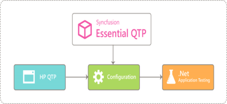
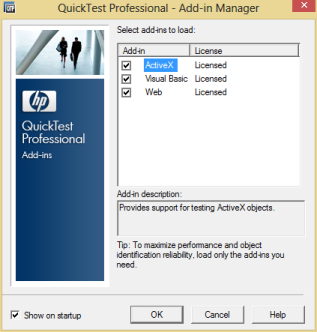
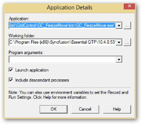
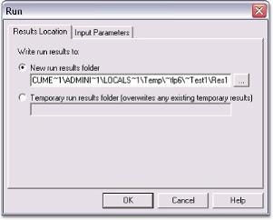
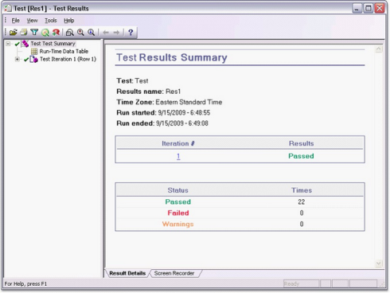
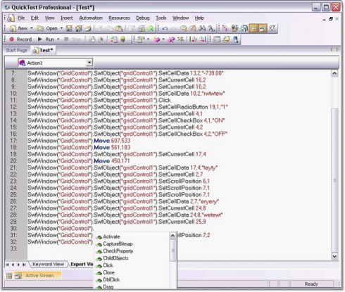
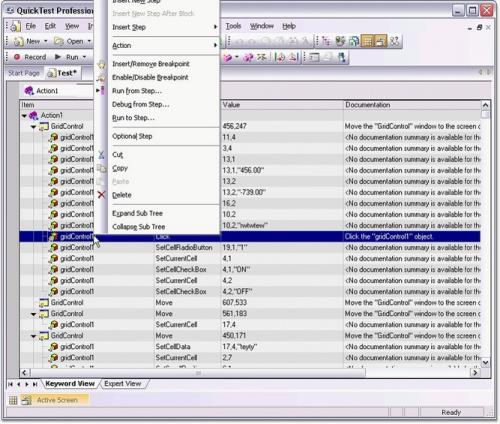
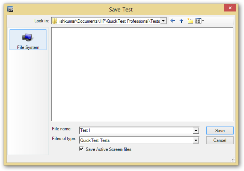
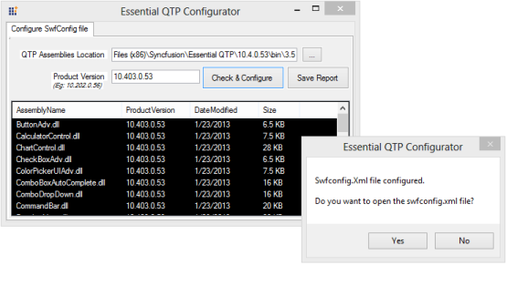

# Overview

This topic gives an introduction to the new Essential QuickTest Professional. It answers the following questions:

* What is Essential QuickTest Professional and how is it linked with QuickTest Professional (QTP)?
* Who can use the product or for whom is this product intended?
* What is the product used for?

You also get an overview of what this manual has to offer.

## Introduction to Essential QuickTest Professional

Essential QuickTest Professional is an add-on shipped with Essential Studio products offered by Syncfusion. It has been specially designed to meet the requirements of professionals who test the applications designed, using Syncfusion controls with HP QuickTest Professional software. 

Essential QuickTest Professional contains custom libraries, that help HP QuickTest Professional software recognize Syncfusion controls. These custom libraries are built with the help of QuickTest Professional .NET add-in extensibility. For more details, refer to HP QuickTest Professional help. 

The custom libraries allow Syncfusion controls to be used as a native object inside the QTP testing environment and enable testing of applications in QTP. Essential QuickTest Professional helps you perform regression test on your application containing Syncfusion controls and thereby increase the reliability of the end product. The following chapters demonstrate the usage of the custom library in QTP.

Essential QuickTest Professional comes with numerous samples as well as extensive documentation to guide you step-by-step. This user guide provides detailed information on the features and functionalities of ssential QuickTest Professional and is organized in the following order:

Install and Configuration of Essential QuickTest Professional.

This section provides details about installing and configuring Essential QuickTest Professional, mandatory before you start using the add-on.

### Samples and Locations

This section provides the location of the installed samples, source code location, and the location of the assemblies for the source.

### Licensing, Patches and Uninstallation

This section covers information on licensing and patches. It also covers the uninstallation process.

### Assembly information

This section provides details about the assembly name, type name, and control type in table format. This table is used to write the swfconfig file.

### Frequently Asked Questions

This section comprises an assembled list of questions and answers to provide expert solutions on the product and its usage for every control that is supported.

### Known Issues

This section lists existing issues with the product that have not yet been solved.

### Supported Controls

Essential QuickTest Professional supports only certain methods exclusive to each control. This section lists these controls and their methods.

## Prerequisites and Compatibility

This section covers the requirements that are mandatory for installing Essential Test Studio. It also lists the operating systems and browsers that are compatible with the product.

### Prerequisites

The following are the prerequisites:

<table>
<tr>
<th>
Testing Environments</th><td>
1) QuickTest Professional version 9.5 and above
2) QuickTest Professional .NET add-in</td></tr>
<tr>
<th>
.NET Framework </th><td>
.Net Framework version 2.0, 3.5, 4.0, 4.5 or 4.5.1</td></tr>
<tr>
<th>
Other Requirements</th><td>
Essential Studio (User Interface edition – Windows Forms) of the same version as the Essential QTP Add-on. </td></tr>
</table>

### Compatibility

Essential QuickTest Professional is compatible with the following operating systems:

<table>
<tr>
<th>
Operating Systems</th><td>
<ul>
<li> Microsoft Windows 8.1 ((32 bit and 64 bit)</li>
<li> Microsoft Windows 8  ((32 bit and 64 bit)</li>
<li> Microsoft Windows Server 2013 (32 bit and 64 bit)</li>
<li> Microsoft Windows Server 2013 (32 bit and 64 bit)</li>
<li> Microsoft Windows Server 2013 (32 bit and 64 bit)</li>
<li> Microsoft Windows Server 2013 (32 bit and 64 bit)</li>
<li> Microsoft Windows Server 2012 (32 bit and 64 bit)</li>
<li> Microsoft Windows Server 2008 (32 bit and 64 bit)</li>
<li> Microsoft Windows Server 2003 (32 bit and 64 bit)</li>
<li> Microsoft Windows Vista (32 bit and 64 bit)</li>
<li> Microsoft Windows XP</li>
</ul>
</td>
</tr>
</table>

### Documentation

Syncfusion provides the following documentation segments that covers all the necessary information pertaining to Essential QuickTest Professional.

<table>
<tr>
<th>
Type of documentation</th><th>
Location</th></tr>
<tr>
<td>
Readme</td><td>
(Installed location of Essential QTP)\ReadMe\ReadMe.htm</td></tr>
<tr>
<td>
Class Reference</td><td>
(Installed location of Essential QTP)\Help\ClassReference.chm</td></tr>
</table>

## Getting Started

Essential QuickTest Professional lets you test applications with different Syncfusion controls, and allows playback of scripts. The following is a list of chapters containing information on the functionality of this software.

### Create and Record a Test

To create a new test:

1) Open QTP by double-clicking the QuickTest Professional icon.
   
   N> The QuickTest Professional – Add-in Manager window is displayed.

2) Select the .NET check box under the Add-in header. This ensures that .NET add-in is installed. 

   

3) Click OK.

   N> The QuickTest Professional – [Start Page] window is displayed. There are two tabs, Start Page and Test, in the main pane of the window. The content under the Start Page tab is displayed by default.

   
   

   

4) Click the New Test icon on the Start Page.

   

This creates a new test. Alternatively, you can click the Test tab in the main pane of the window or Test sub-menu under the New menu in the Menu bar.

5) Click Record in the toolbar to start the recording. 

   

    N> A Record and Run Settings dialog box is displayed.

   

6) Click the Windows Applications tab. 

   N> The content under the tab is displayed.

   

   N> The "Record and run only on" option button is selected by default, and the check boxes selected under it ensure that, only the applications opened by QuickTest and added applications are tested.

7) To add an application for testing, click the + button in the Application details: frame as shown in the figure above.
 
   N> The Application Details dialog box is displayed.
  
   
 
 

8) Browse and select the path of the application that is to be tested by clicking () for the Application: label.

9) Browse and select the path of the working folder by clicking () for the Working folder: label.

   N> Selecting the Launch application check box launches the application immediately after clicking OK in the current dialog. The Include descendant processes check box that includes all the processes that are descendant to the current process. Both these check boxes are selected by default.

10) Click OK.

    N> The path of the application and working folder are displayed in the Application details frame as shown here.

   

11) Click OK. 

    N> The recording starts. The application in the given path is opened as shown here.

   

12) Perform required valid user-action in the application. 

    N> Whenever you perform any action involving the Syncfusion control used in the application, the SwfConfig file maps the control to the corresponding DLL.

    The DLL renders the correct method names of the Syncfusion namespace that is called respective to the user-actions performed.
    These method names are then recorded and displayed in the screen behind the running application as shown here.

    N> This is called high-level recording, as the events are recorded with the method names of the Syncfusion namespace after recognizing the Syncfusion control, unlike the low-level recording where the Syncfusion controls are not recognized by QTP and the events are recorded with default method names as shown here.

   

    N> The low-level recording is the default recording done by QTP, when the steps mentioned in the Configuring Essential QuickTest Professional section are not followed. The recording can be stopped by clicking the Stop button in the toolbar.

The process of creating and recording the test is completed.

### Running a Test

On recording, all the user-actions performed in the control are just noted with the corresponding method names of the Syncfusion namespace. The errors can be checked while running a test. To run a test, follow the given steps: 

1) Click Run in the toolbar.

   N> The Run dialog box is displayed. The Results Location tab is highlighted by default.

   

   In the Results Location tab, two options are provided:

   * New run results folder: Allows the results of the test to be written to the location mentioned in the text box after it.
   * Temporary run results folder, overwrites any existing temporary results, allows the results to be stored in the temporary location.

2) Click the required option.

   N> Selecting one option renders the other unavailable.

3) Browse and select the required location by clicking the <icon>

   N> QTP starts the running process; the application containing the recorded Syncfusion control is opened and it shows all the recorded events in a continuous flow one by one. After running the test, it displays the Test [Result_Written_Location] - Test Results dialog box, where the results are summarized as shown here:

The process of running the test is completed.

 To know more about running scripts, refer to the QTP help document. 

### Editing a Test

A test can be edited in either the Keyword view or in the Expert view. You can switch between these views by selecting the required tab at the bottom left of the QuickTest Professional test screen. 

#### Editing in Expert View

This view is specially provided for the experts in VB script. In the Expert view, the VB scripts are generated while recording. You can also manually write scripts to the existing scripts in this view. So, this view can be used as a tool for managing the testing process in a more controlled manner. You can add scripts to trigger events manually. 

The following image shows adding a script line to the Expert View pane.

You can run the edited test to check whether the newly added or changed scripts affect the running process by showing the changes in the running application.

N> Sometimes, the newly added or changed script may have an error causing the whole application to fail. In such a case, the Test Results dialog shows the failure as shown here:

For more details on running the test, refer to the previous section.

#### Editing in Keyword View

The keyword view is meant for those who are not experts in VB scripts. Keyword view contains the controls used, the user-actions, or operations performed, values involved in the operation, and the documentation summary in a table format. The controls used are listed under the Item header in a tree-view format as shown here.

To edit the test in Keyword view, you can perform any of the following actions:

1) You can right-click any of the items listed under the Item header and choose one of the options available in the displayed menu as shown here.

For example, clicking Cut in the menu causes the row representing a user-action to be cut. You can then right-click any other item and click Paste on the menu displayed. This causes the row to be pasted before the right-clicked item.

N> All the items under the Item header are represented as a drop-down list.

You can then run the edited test.

 For more details on running the edited test, refer to Editing on Expert View topic.

### Saving a Test

Saving a test is like saving any other document or picture. To save a test, follow the steps:

1) Click the Save button in the toolbar. The Save Test dialog box is displayed.

   

2) Select the location to save the file from the Save in: drop-down list.
3) Type the file name of the file to be saved in the text box adjacent to the File name label. 
4) Click Save.

The test is saved.

### Running the Saved Test

The tests that have been saved can be replayed later. To run a saved test, follow the steps provided:

1) Click Open on the toolbar.

   N> The Open Test dialog box is displayed with a list of saved tests.

   

2) Select the required test and click Open.

   N> The saved test is opened with its name and the complete path as the name of the window. By default, Expert View of the Test is opened.

   The following image shows the mouse pointer pointing towards the path and file displayed as the window name.

   

3) Click Run on the toolbar to run the test.

 For more details on running the test, refer to the Running a Test topic in this document.

The process of running a saved test is complete.

## Supported Controls and Methods

The following controls are supported by Essential QuickTest Professional:

* Essential Grid
* Essential Tools
* Essential Chart
* Essential Schedule
* Essential Diagram

Supported methods denote those methods that are recorded in QTP. 

### Essential Grid

Essential Grid supports the following controls:

* GridControl
* GridDataBoundGrid
* GridGroupingControl
* GridListControl
* TabBarSplitterControl

The following are the recorded methods and their corresponding descriptions for Essential Grid:

### Grid Control

<table>
<tr>
<th>
Method</th><th>
Description</th></tr>
<tr>
<td>
CellButtonClick(int row, int col)</td><td>
Raises the click on the cell button.</td></tr>
<tr>
<td>
CellDoubleClick(int row, int col)</td><td>
Raises the cell double-click.</td></tr>
<tr>
<td>
GetDescription(int row, int col)</td><td>
Gets the description of grid cells.</td></tr>
<tr>
<td>
MouseDown(int row, int col, string button)</td><td>
Raises a click in the grid.</td></tr>
<tr>
<td>
MoveColumn(int fromColumn, int count, int target)</td><td>
Moves a range of columns.</td></tr>
<tr>
<td>
MoveRow(int from, int count, int target)</td><td>
Moves a range of rows from the specified location to a target location.</td></tr>
<tr>
<td>
ResizeColumn(int fromColumn, int to, int width)</td><td>
Resizes the specified columns.</td></tr>
<tr>
<td>
ResizeRow(int fromRow, int to, int height)</td><td>
Resizes the specified rows.</td></tr>
<tr>
<td>
SelectRange(string range, int top, int left, int bottom, int right)</td><td>
Selects the range.</td></tr>
<tr>
<td>
SetCellData(int row, int col, string str)</td><td>
Sets the cell value of the cell.</td></tr>
<tr>
<td>
SetCellCheckBox(int row, int col, string str)</td><td>
Sets the cell value of the check box cell.</td></tr>
<tr>
<td>
SetCellRadioButton(int row, int col, string str)</td><td>
Sets the cell value of the radio button cell.</td></tr>
<tr>
<td>
SetCurrentCell(int row, int col)</td><td>
Sets the location of the current cell.</td></tr>
<tr>
<td>
SetScrollPosition(int vScrollPosition, int hScrollPosition)</td><td>
Sets the scroll position.</td></tr>
<tr>
<td colspan = "2">
Helper Functions</td></tr>
<tr>
<td>
BeginEdit(int row, int col)</td><td>
Brings the editing cursor in the specified grid cell.</td></tr>
<tr>
<td>
EndEdit(int row, int col)</td><td>
Finishes the editing mode of the cell specified.</td></tr>
<tr>
<td>
string GetCellType(int row, int col)</td><td>
Retrieves the CellType for the given cell coordinates.</td></tr>
<tr>
<td>
int GetColumnCount()</td><td>
Retrieves the number of columns used.</td></tr>
<tr>
<td>
int GetColumnIndex(string name)</td><td>
Finds the column index for the given column name, returns 0 when the search fails.</td></tr>
<tr>
<td>
string GetFormattedText(int row, int col)</td><td>
Retrives the formatted cell format.</td></tr>
<tr>
<td>
bool IsFormulaCell(int row, int col, out string formula, out string computedValue)</td><td>
For a given row and column index, IsFormulaCell points to the formula used in that cell and the result of the formula. This also returns “false” when this cell is not a formula cell.</td></tr>
<tr>
<td>
object GetCellData(int row, int col)</td><td>
For the given Row and Column objects, the cell value of that cell can be obtained.</td></tr>
<tr>
<td>
int GetRowCount()</td><td>
Retrieves the number of rows used.</td></tr>
<tr>
<td>
InsertColumn(int insertAt, int count)</td><td>
Inserts a range of columns from the specified location.</td></tr>
<tr>
<td>
InsertRow(int insertAt, int count)</td><td>
Inserts a range of rows from the specified location.</td></tr>
<tr>
<td>
RemoveColumn(int from, int to)</td><td>
Removes a range of columns specified for the Grid control.</td></tr>
<tr>
<td>
RemoveRow(int from, int to)</td><td>
Removes a range of rows specified for the Grid control.</td></tr>
<tr>
<td>
ScrollToCell(int rowIndex, int colIndex)</td><td>
Scrolls the grid so that the cell will be visible for replay.</td></tr>
<tr>
<td>
HideRow(int from, int to)</td><td>
Hides a range of rows specified for the Grid control.</td></tr>
<tr>
<td>
ShowHiddenRow(int from, int to)</td><td>
Shows a range of rows specified for the Grid control, that are hiding.</td></tr>
<tr>
<td>
HideCol(int from, int to)</td><td>
Hides a range of columns specified for the Grid control.</td></tr>
<tr>
<td>
ShowHiddenCol(int from, int to)</td><td>
Shows a range of columns specified for the Grid control.</td></tr>
<tr>
<td>
int GetSelectedRowIndex()</td><td>
Returns the top row index of the selected row.</td></tr>
<tr>
<td>
GetSelectedColIndex()</td><td>
Returns the column index of the selected column.</td></tr>
<tr>
<td>
Color GetCellBackColor(int row, int col)</td><td>
Gets the back color of the cell.</td></tr>
<tr>
<td>
string GetName()</td><td>
Gets the name of the Grid control object.</td></tr>
</table>

### GridDataBoundGrid

<table>
<tr>
<th>
Method</th><th>
Description</th></tr>
<tr>
<td>
 CellButtonClick(int row, int col)</td><td>
Raises the click on the cell button.</td></tr>
<tr>
<td>
 CellDoubleClick(int row, int col)</td><td>
Raises the cell double-click.</td></tr>
<tr>
<td>
 CollapseRow(int rowIndex)</td><td>
Collapses the row for the specified row index.</td></tr>
<tr>
<td>
 DeleteRow(int from, int to)</td><td>
Deletes the specified rows.</td></tr>
<tr>
<td>
 ExpandRow(int rowIndex)</td><td>
Expands the Row for the specified row index.</td></tr>
<tr>
<td>
 MouseDown(int row, int col, string button)</td><td>
Raises a click in the grid.</td></tr>
<tr>
<td>
 MoveColumn(int fromColumn, int count, int target)</td><td>
Moves a range of columns.</td></tr>
<tr>
<td>
 ResizeColumn(int fromColumn, int to, int width)</td><td>
Resizes the specified columns.</td></tr>
<tr>
<td>
 ResizeRow(int fromRow, int to, int height)</td><td>
Resizes the specified rows.</td></tr>
<tr>
<td>
 SelectRange(string range, int top, int left, int bottom, int right)</td><td>
Selects the range.</td></tr>
<tr>
<td>
 SetCellData(int row, int col, string str)</td><td>
Sets the cell value of the cell.</td></tr>
<tr>
<td>
 SetCellCheckBox(int row, int col, string str)</td><td>
Sets the cell value of the check box cell.</td></tr>
<tr>
<td>
 SetCellRadioButton(int row, int col, string str)</td><td>
Sets the cell value of the radio button cell.</td></tr>
<tr>
<td>
 SetCurrentCell(int row, int col)</td><td>
Sets the location of current cell.</td></tr>
<tr>
<td>
 SetScrollPosition(int vScrollPosition, int hScrollPosition)</td><td>
Sets the scroll position.</td></tr>
<tr>
<td>
 SortColumn(int col, string sortBehavior)</td><td>
Sorts the column.</td></tr>
<tr>
<td colspan = "2">
Helper Functions</td></tr>
<tr>
<td>
BeginEdit(int row, int col)</td><td>
Brings the editing cursor in the specified grid cell.</td></tr>
<tr>
<td>
string GetCellType(int row, int col)</td><td>
Retrieves the CellType for the given cell co-ordinates.</td></tr>
<tr>
<td>
string GetCellBackColor(int row, int col)</td><td>
Retrieves the Back color for the given cell co-ordinates.</td></tr>
<tr>
<td>
int GetColumnCount()</td><td>
Retrieves the number of columns used.</td></tr>
<tr>
<td>
int GetVisibleColumnCount()</td><td>
Retrieves the number of visible columns. </td></tr>
<tr>
<td>
int GetColumnIndex(string name)</td><td>
Finds the column index for the given column name, returns 0 if search fails.</td></tr>
<tr>
<td>
Int GetCurrentCellImageIndex(int row, int col)</td><td>
Gets the image index of the current cell.</td></tr>
<tr>
<td>
string GetFormattedText(int row, int col)</td><td>
Retrieves the formatted cell value.</td></tr>
<tr>
<td>
bool IsColumnVisible(int col)</td><td>
Checks if the column is visible.</td></tr>
<tr>
<td>
bool IsFormulaCell(int row, int col, out string formula, out string computedValue) </td><td>
For a given row and column index, IsFormulaCell points to the formula used in that cell and the result of the formula. This also returns “false” when this cell is not a formula cell.</td></tr>
<tr>
<td>
object GetCellData(int row, object col)</td><td>
For the given Row and Column objects, the cell value of that cell can be obtained.</td></tr>
<tr>
<td>
int GetRowCount()</td><td>
Retrieves the number of rows used.</td></tr>
<tr>
<td>
 ScrollToCell(int rowIndex, int colIndex)</td><td>
Scrolls the grid so as the cell to be visible for replay.</td></tr>
<tr>
<td>
 HideRow(int from, int to)</td><td>
Hides a range of rows specified for the GridControl.</td></tr>
<tr>
<td>
 HideCol(int from, int to)</td><td>
Hides a range of columns specified for the GridControl.</td></tr>
<tr>
<td>
int GetSelectedRowIndex()</td><td>
Returns the top row index of the selected row.</td></tr>
<tr>
<td>
int GetSelectedColIndex()</td><td>
Returns the column index of the selected column.</td></tr>
<tr>
<td>
int GetSelectedRowCount()</td><td>
Returns the number of selected rows.</td></tr>
<tr>
<td>
int GetSelectedColCount()</td><td>
Returns the number of selected columns.</td></tr>
<tr>
<td>
string GetSelectedRowRange()</td><td>
Returns the Top and Bottom row of the selected row range.</td></tr>
<tr>
<td>
string GetSelectedColRange()</td><td>
Returns the left and right column of the selected column range.</td></tr>
<tr>
<td>
bool IsColSorted(int col)</td><td>
Determines whether the column is sorted.</td></tr>
<tr>
<td>
string GetColSortOrder(int col)</td><td>
Returns the sort order of the sorted column (Ascending or Descending).</td></tr>
<tr>
<td>
string GetName()</td><td>
Gets the name of the Grid DataBoundGrid object</td></tr>
</table>

### GridGroupingControl

<table>
<tr>
<th>
Method</th><th>
Description</th></tr>
<tr>
<td>
 CellButtonClick(object row, object col)</td><td>
Raises the cell button click.</td></tr>
<tr>
<td>
 CellDoubleClick(object row,object col)</td><td>
Raises the cell double-click.</td></tr>
<tr>
<td>
 CollapseRecord(object record)</td><td>
Collapses the record.</td></tr>
<tr>
<td>
 CollapseGroup(object row) </td><td>
Collapses the group.</td></tr>
<tr>
<td>
 ExpandGroup(object row) </td><td>
Expands the group.</td></tr>
<tr>
<td>
 ExpandRecord(object record)</td><td>
Expands the record.</td></tr>
<tr>
<td>
FindRecordInGrid(string tableObject, string columnName, string data)</td><td>
Returns the first index of the searched data for the given column of the table, as located in the NestedDisplayElements.</td></tr>
<tr>
<td>
FindRecordInTable(string tableObject, string columnName, string data)</td><td>
Returns the first index of the searched data for the given column.</td></tr>
<tr>
<td>
GetAbsoluteRowIndex(int RowIndex)</td><td>
Retrieves the absolute RowIndex.</td></tr>
<tr>
<td>
GetBackColor(int row)</td><td>
Gets the backcolor of the record.</td></tr>
<tr>
<td>
GetCellBackColor(object row, object col)</td><td>
Gets the backcolor of the Cell.</td></tr>
<tr>
<td>
GetCellData(object row, object col)</td><td>
For the given Row and Column objects, the cell value of that cell can be obtained.</td></tr>
<tr>
<td>
GetChildCount(object row)</td><td>
Gets the child count for the given caption row and a record row.</td></tr>
<tr>
<td>
GetDescription(object row, object col)</td><td>
Gets the description of grid cells.</td></tr>
<tr>
<td>
GetColumnCount()</td><td>
Returns the sort order of the sorted column (Ascending or Descending).</td></tr>
<tr>
<td>
GetColSortOrder(int col)</td><td>
Returns the sort order of the sorted column (Ascending or Descending).</td></tr>
<tr>
<td>
GetColumnName(string tablename, int colindex)</td><td>
For a given table name and column index, the column name in which an element resides can be obtained.</td></tr>
<tr>
<td>
GetDetails()</td><td>
Gets details like table, record, and table descriptor.</td></tr>
<tr>
<td>
GetLevelByTableName(string name)</td><td>
Gets the level of table for the given table name.</td></tr>
<tr>
<td>
GetRowCount()</td><td>
Retrieves the number of rows used.</td></tr>
<tr>
<td>
GetRowElement(object row)</td><td>
Gets the row element.</td></tr>
<tr>
<td>
GetSelectedColIndex()</td><td>
Returns the Left column index of the selected columns.</td></tr>
<tr>
<td>
GetSelectedRowIndex()</td><td>
Returns the top row index of the selected row.</td></tr>
<tr>
<td>
GetSelectedRowRange()</td><td>
Returns the Top and Bottom row of the selected row range.</td></tr>
<tr>
<td>
GetTableName(object row)</td><td>
Obtains the table name for a given Row.</td></tr>
<tr>
<td>
GetTableNameByLevel(int level)</td><td>
Gets the level of the table for the given table name.</td></tr>
<tr>
<td>
 GroupBy(string tablename,string column, string status)</td><td>
Defines grouping and ungrouping of specified columns.</td></tr>
<tr>
<td>
 MouseDown(object row, object col, string button)</td><td>
Raises the MouseDown.</td></tr>
<tr>
<td>
 MouseDownOnRowHeader(int row, int col, string button)</td><td>
Raises the MouseDown on the RowHeader.</td></tr>
<tr>
<td>
 MoveColumn(string tablename, object fromColumn, object count, object target)</td><td>
Moves a range of columns.</td></tr>
<tr>
<td>
IsColSorted(int col)</td><td>
Determines whether the column is sorted.</td></tr>
<tr>
<td>
IsGroupExpanded(object row)</td><td>
Determines whether the specified group is expanded.</td></tr>
<tr>
<td>
IsGroupRow(object row)</td><td>
Determines whether the specified row is a caption row or caption section.</td></tr>
<tr>
<td>
IsRecord(object record)</td><td>
Determines whether the specified row is a record.</td></tr>
<tr>
<td>
IsRecordExpanded(object record)</td><td>
Determines whether the specified record is expanded.</td></tr>
<tr>
<td>
 ResizeColumn(string tablename, int fromColumn, int to, int width)</td><td>
Resizes the specified column.</td></tr>
<tr>
<td>
 ResizeRow(string tablename, int fromRow, int to, int height)</td><td>
Resizes the specified rows.</td></tr>
<tr>
<td>
 SelectRange(string range, int top, int left, int bottom, int right)</td><td>
Selects the range.</td></tr>
<tr>
<td>
 SelectRecord(object row, string status)</td><td>
Selects a record for the GridGroupingControl.</td></tr>
<tr>
<td>
 SetCellData(object row, object col, string str)</td><td>
Sets the cell value of the cell.</td></tr>
<tr>
<td>
 SetCellCheckBox(object row, object col, string str)</td><td>
Sets the cell value of the check box cell.</td></tr>
<tr>
<td>
 SetCellRadioButton(object row, object col, string str)</td><td>
Sets the cell value of the radio button cell.</td></tr>
<tr>
<td>
 SetCurrentCell(object row, object col)</td><td>
Sets the location of current cell.</td></tr>
<tr>
<td>
 SetScrollPosition(int vScrollPosition, int hScrollPosition)</td><td>
Sets the scroll position.</td></tr>
<tr>
<td>
 SortColumn(string tablename,object col, string sortBehavior, bool cntrl)</td><td>
Sorts the column.</td></tr>
<tr>
<td>
SelectRecords(object row, object count)</td><td>
Selects mutiple records for the GridGroupingControl.</td></tr>
<tr>
<td>
ScrollToColumn(string tablename, object col)</td><td>
The grid will scroll to the given column.</td></tr>
<tr>
<td>
ScrollToRow(int row)</td><td>
The grid will scroll to the given row.</td></tr>
<tr>
<td>
 AddNewRow(string objn)</td><td>
A new row will be added.</td></tr>
<tr>
<td>
string GetFormattedText(int row, int col)</td><td>
Retrieves the formatted cell value.</td></tr>
<tr>
<td>
string GetName()</td><td>
Gets the name of the Grid control object.</td></tr>
</table>

### GridListControl

<table>
<tr>
<th>
Method</th><th>
Description</th></tr>
<tr>
<td>
ResizeColumn(object fromColumn, int to, int width)</td><td>
Resizes the specified columns.</td></tr>
<tr>
<td>
ResizeRow(int fromRow, int to, int height)</td><td>
Resizes the specified rows.</td></tr>
<tr>
<td>
SelectRow(int top,int bottom)</td><td>
Selects the range.</td></tr>
<tr>
<td>
string GetName()</td><td>
Gets the name of the GridListControl object</td></tr>
</table>

### TabBarSplitterControl

<table>
<tr>
<th>
Method</th><th>
Description</th></tr>
<tr>
<td>
GetName()</td><td>
Gets the name of the TabBarControl.</td></tr>
<tr>
<td>
GetTabName(int index)</td><td>
The label in the tab page can be known by passing the index.</td></tr>
<tr>
<td>
Select(string tab)</td><td>
The name of the selected tab.</td></tr>
<tr>
<td>
SetSplitterPosition(string tab, int vSplit, int hSplit)</td><td>
The splitter position in the tab bar page.</td></tr>
</table>

### Essential Tools

The following controls are supported by Essential Tools.

* ButtonAdv
* CalculatorControl
* CheckBoxAdv
* ColorPickerUIAdv
* ComboBoxAutoComplete
* ComboDropDown
* CommandBar
* DataListView
* DateTimePickerAdv
* DockingManager
* GroupBar
* GroupView
* MultiColumnComboBox
* Popupmenu
* ProgressBarAdv
* RadioButtonAdv
* RibbonControlAdv
* ScrollerFrame
* TabbedMDI
* TabControlAdv
* XPTaskBar
* TextBoxExt
* ThemedCheckedButton
* TreeViewAdv
* XPMenus
* XPToolBar
* SplitContainerAdv
* TabSplitterContainer
* TrackBarEx
* RangeSlider
* NavigationView

The following are the recorded methods and their corresponding descriptions for Essential Tools:

#### ButtonAdv

<table>
<tr>
<th>
Method</th><th>
Description</th></tr>
<tr>
<td>
Click(string text)</td><td>
Performs click action on the ButtonAdv control.</td></tr>
</table>

#### CalculatorControl

<table>
<tr>
<th>
Method</th><th>
Description</th></tr>
<tr>
<td>
SetValue(int value)</td><td>
The value is appended to the calculated value.</td></tr>
<tr>
<td>
SetAction(string action)</td><td>
The action is paused at the calculated value.</td></tr>
<tr>
<td>
double GetCalculatedValue()</td><td>
Helps to get the current value from the text area.</td></tr>
<tr>
<td>
SetCalculatedValue(double value)</td><td>
Sets the value in the text area as specified in the argument.</td></tr>
</table>

#### CheckBoxAdv

<table>
<tr>
<th>
Method</th><th>
Description</th></tr>
<tr>
<td>
Set(string chkState)</td><td>
The CheckState of the CheckBoxAdv.</td></tr>
<tr>
<td colspan = "2">
Helper Function</td></tr>
<tr>
<td>
string GetCheckState()</td><td>
Gets the CheckState of the CheckBoxAdv.</td></tr>
</table>

#### ColorPickerUIAdv

<table>
<tr>
<th>
Method</th><th>
Description</th></tr>
<tr>
<td>
SelectColor(object color)</td><td>
The color that has to be selected.</td></tr>
</table>

#### ComboBoxAutoComplete

<table>
<tr>
<th>
Method</th><th>
Description</th></tr>
<tr>
<td>
DropDown()</td><td>
Shows the drop-down list.</td></tr>
</table>

#### ComboDropDown

<table>
<tr>
<th>
Method</th><th>
Description</th></tr>
<tr>
<td>
DropDown()</td><td>
Shows the drop-down list.</td></tr>
<tr>
<td>
Select(object item)</td><td>
Selects the item in the list.</td></tr>
</table>

#### CommandBar

<table>
<tr>
<th>
Method</th><th>
Description</th></tr>
<tr>
<td>
DropDown()</td><td>
Shows the drop-down list.</td></tr>
<tr>
<td>
SetDockState(string dockState)</td><td>
Changes the dock state.</td></tr>
<tr>
<td>
SetFloatState(int x, int y)</td><td>
Sets the CommandBar to float.</td></tr>
</table>

#### DataListView

<table>
<tr>
<th>
Method</th><th>
Description</th></tr>
<tr>
<td>
Select(string item)</td><td>
Selects the specified item.</td></tr>
<tr>
<td>
Return()</td><td>
Performs click on the focused item.</td></tr>
</table>

#### DateTimePickerAdv

<table>
<tr>
<th>
Method</th><th>
Description</th></tr>
<tr>
<td>
void CheckEnabled(object on, string checkState);</td><td>
Interface to check the enabled state of the DateTimePickerAdv.</td></tr>
<tr>
<td>
void ChangeValue(object on, string dateTime);</td><td>
Interface to change the value of the DateTimePickerAdv.</td></tr>
<tr>
<td>
void ShowPopupWindow(object visible, object x, object y);</td><td>
Interface to show the calendar popup.</td></tr>
<tr>
<td>
void ShowCalendar(object visible);</td><td>
Interface to show the calendar in the popup window.</td></tr>
<tr>
<td>
void SetCalendarValue(object visible, string calValue);</td><td>
Interface to set the Calendar value of the DateTimePickerAdv control.</td></tr>
<tr>
<td>
void PopupClose(object visible);</td><td>
Interface to close the popup window.</td></tr>
<tr>
<td>
void SetTodayValue(string str);</td><td>
Interface to set the today value when the today button is clicked.</td></tr>
<tr>
<td>
void SetNoValue(string str);</td><td>
Interface to set the null value when the None button is clicked.</td></tr>
<tr>
<td>
System.DateTime GetCalendarValue();</td><td>
Returns the current value in the DateTimePickerAdv control.</td></tr>
</table>

#### DockingManager

<table>
<tr>
<th>
Method</th><th>
Description</th></tr>
<tr>
<td>
DockStateChange(string dock,string prevState, string ctrl,string hostForm,string dockingStyle)</td><td>
Changes the docking window according to the specified current and previous state, like Pinned, Unpinned, Tabbed, and MDIChild.</td></tr>
<tr>
<td>
VisibilityChange(string ctrlName,string visibility)</td><td>
Changes the visibility of the docked control according to the specified state.</td></tr>
<tr>
<td>
ActivateControl(string ctrlName)</td><td>
Activates the specified control.</td></tr>
<tr>
<td>
FloatStateChange(string ctrlName, string x, string y, string width, string height)</td><td>
Changes the state of the docking window into a floating state with the specified location and size.</td></tr>
</table>

#### GroupBar

<table>
<tr>
<th>
Method</th><th>
Description</th></tr>
<tr>
<td>
SelectGroup(object index, string itemText)</td><td>
Selects the GroupBar item.</td></tr>
<tr>
<td>
DropDownButtonClick()</td><td>
Simulates click in the Navigation pane drop-down button.</td></tr>
</table>

#### GroupView

<table>
<tr>
<th>
Method</th><th>
Description</th></tr>
<tr>
<td>
SelectItem(object item)</td><td>
Selects the GroupView item.</td></tr>
<tr>
<td>
DropItem(int index, object source)</td><td>
Drag and drop the GroupView item.</td></tr>
</table>

#### MultiColumnComboBox

<table>
<tr>
<th>
Method</th><th>
Description</th></tr>
<tr>
<td>
DropDown()</td><td>
Shows the hidden grid in the MultiColumnComboBox.</td></tr>
<tr>
<td>
SelectIndex(int index)</td><td>
Selects the given index.</td></tr>
</table>

#### PopupMenu

<table>
<tr>
<th>
Method</th><th>
Description</th></tr>
<tr>
<td>
Select(string barText)</td><td>
Selects the item from the pop-up menu.</td></tr>
</table>

#### ProgressBarAdv

<table>
<tr>
<th>
Method</th><th>
Description</th></tr>
<tr>
<td>
SetValue(int value)</td><td>
Assigns the Progress bar value.</td></tr>
<tr>
<td>
int GetValue()</td><td>
Gets the current value of the ProgressBar.</td></tr>
</table>

#### RadioButtonAdv

<table>
<tr>
<th>
Method</th><th>
Description</th></tr>
<tr>
<td>
Set()</td><td>
Changes Checked property to true.</td></tr>
<tr>
<td>
bool IsSet()</td><td>
Shows whether the RadioButtonAdv is set.</td></tr>
</table>

#### RibbonControlAdv

<table>
<tr>
<th>
Method</th><th>
Description</th></tr>
<tr>
<td>
RibbonMenuButtonClick()</td><td>
Clicks the Ribbon menu button.</td></tr>
<tr>
<td>
SelectRibbonMenuItem(object item)</td><td>
Selects the ribbon menu item.</td></tr>
<tr>
<td>
Close()</td><td>
Closes the parent form of RibbonControlAdv.</td></tr>
<tr>
<td>
Activate()</td><td>
Activates the parent form of RibbonControlAdv.</td></tr>
<tr>
<td>
Maximize()</td><td>
Maximizes the parent form of RibbonControlAdv.</td></tr>
<tr>
<td>
Minimize()</td><td>
Minimizes the parent form of RibbonControlAdv.</td></tr>
<tr>
<td>
Restore()</td><td>
Restores the parent form of RibbonControlAdv.</td></tr>
<tr>
<td>
SelecTab(object tabItem)</td><td>
Selects the Ribbon Tab item.</td></tr>
<tr>
<td>
MinimizingPanel()</td><td>
Minimizes the Ribbon Tab panel.</td></tr>
<tr>
<td>
MaximizingPanel()</td><td>
Maximizes the Ribbon Tab panel.</td></tr>
</table>

#### ScrollerFrame

<table>
<tr>
<th>
Method</th><th>
Description</th></tr>
<tr>
<td>
ScrollValue(int value)</td><td>
The position of the scroll to be specified.</td></tr>
</table>

#### TabbedMDIManager

<table>
<tr>
<th>
Method</th><th>
Description</th></tr>
<tr>
<td>
ClosePage(object tabPage)</td><td>
Closes the specified tab page.</td></tr>
<tr>
<td>
SelectPage(object tab)</td><td>
Selects the specified tab page.</td></tr>
</table>

#### TabControlAdv

<table>
<tr>
<th>
Method</th><th>
Description</th></tr>
<tr>
<td>
SelectPage(object tab)</td><td>
Selects the tab page in the TabPageAdv control.</td></tr>
<tr>
<td>
RightClick(object tab)</td><td>
Performs a rightclick on the tab page in the TabPageAdv control.</td></tr>
<tr>
<td>
ClosePage(object tab)</td><td>
Closes the tab page in the TabPageAdv control.</td></tr>
</table>

#### XPTaskBar

<table>
<tr>
<th>
Method</th><th>
Description</th></tr>
<tr>
<td>
Expand(string headerText)</td><td>
Expands the content area of the task bar box.</td></tr>
<tr>
<td>
Collapse(string headerText)</td><td>
Collapses the content area of the task bar box.</td></tr>
<tr>
<td>
ItemClick(string headerText, string itemText)</td><td>
Performs click on the item described in the tag.</td></tr>
<tr>
<td colspan = "2">
Helper Functions</td></tr>
<tr>
<td>
string GetTag(int itemIndex)</td><td>
Retrieves the tag information for the given item index.</td></tr>
<tr>
<td>
string GetHeaderText()</td><td>
Retrieves the group or header text of the task bar box being called.</td></tr>
<tr>
<td>
string GetItemText(int itemIndex)</td><td>
Retrieves the item text for the given item index from the task bar box called</td></tr>
<tr>
<td>
int GetTaskBarBoxCount()</td><td>
Gets the number of task bar boxes in the XPTaskBar.</td></tr>
<tr>
<td>
int GetExpandedTaskBarBoxCount()</td><td>
Gets the number of expanded task bar boxes.</td></tr>
<tr>
<td>
int GetCollapsedTaskBarBoxCount()</td><td>
Gets the number of collapsed task bar boxes.</td></tr>
<tr>
<td>
bool FindItem(string itemText, out string headerText, out int itemIndex);</td><td>
Helps to find an item’s existence.</td></tr>
</table>

#### TextBoxExt

<table>
<tr>
<th>
Method</th><th>
Description</th></tr>
<tr>
<td>
Set(string text)</td><td>
Sets the text in the TextBoxExt.</td></tr>
<tr>
<td>
SelectText(string selText, object start, object length);</td><td>
Select the text in the TextBoxExt.</td></tr>
</table>

#### ThemedCheckButton

<table>
<tr>
<th>
Method</th><th>
Description</th></tr>
<tr>
<td>
Set(string chkState)</td><td>
Sets the CheckState of the CheckBox in the DateTimeAdv.</td></tr>
<tr>
<td>
string GetCheckState()</td><td>
Gets the CheckState of the CheckBox in the DateTimeAdv</td></tr>
</table>

#### TreeViewAdv

<table>
<tr>
<th>
Method</th><th>
Description</th></tr>
<tr>
<td>
CollapseNode(string fullPath)</td><td>
Collapses the specified node.</td></tr>
<tr>
<td>
ExpandNode(string fullPath)</td><td>
Expands the specified node.</td></tr>
<tr>
<td>
SetCheckState(string fullPath, string checkState)</td><td>
Sets the specified state of the CheckBox or OptionButton for the specified node.</td></tr>
<tr>
<td>
SelectNodeWithModifierKeys(string fullPath,string ctrl, string shift)</td><td>
Selects the specified node according to the selection mode.</td></tr>
<tr>
<td>
BackupNodeDetails(string fullPath)</td><td>
Backs up the node details before editing.</td></tr>
<tr>
<td>
EditNode(string nodeText)</td><td>
Edits the specified node.</td></tr>
<tr>
<td>
DragDrop(string fullPath)</td><td>
Perform the drag and drop operation for the nodes in the SelectedNodes list, that is added during drag over event.</td></tr>
<tr>
<td>
AddToSelectedNodeList(string fullPath)</td><td>
Adds the specifed node into selected node list during Drag over event.</td></tr>
<tr>
<td>
DoubleClick(string fullPath)</td><td>
Handles the double-click event of TreeViewAdv.</td></tr>
<tr>
<td>
SelectNode(string fullPath)</td><td>
Selects the node in SingleSelect mode.</td></tr>
<tr>
<td>
RMouseDown(int x, int y)</td><td>
Performs a right mouse click.</td></tr>
<tr>
<td>
TreeNodeAdv GetNodeFromPath(string fullPath)</td><td>
Gets the tree node from the path.</td></tr>
<tr>
<td>
Point GetPointFromNode(TreeNodeAdv node)</td><td>
Returns the TextBounds point of the specified node.</td></tr>
<tr>
<td>
RightClickNode(string fullPath)</td><td>
Right-clicks the specified node.</td></tr>
</table>

#### XPMenus

<table>
<tr>
<th>
Method</th><th>
Description</th></tr>
<tr>
<td>
Select(string text)</td><td>
Performs click on a bar item.</td></tr>
<tr>
<td>
string TraceParentRoot(string barItemText)</td><td>
For the given text of the required menu, TraceParentRoot retrieves the full path as recoded.</td></tr>
<tr>
<td>
int MenuItemPos(string ParentText, string barItemText)</td><td>
For the given text of the required menu, MenuItemPos returns the position of the menu item.</td></tr>
</table>

#### XPToolBar

<table>
<tr>
<th>
Method</th><th>
Description</th></tr>
<tr>
<td>
Select(string ID)</td><td>
Performs click in the barItem.</td></tr>
<tr>
<td>
Popup(string ID)</td><td>
Shows the popup of the parent bar item.</td></tr>
</table>

#### XPTaskBar

<table>
<tr>
<th>
Method</th><th>
Description</th></tr>
<tr>
<td>
Expand(string headerText)</td><td>
Expands the content area of the task bar box.</td></tr>
<tr>
<td>
Collapse(string headerText)</td><td>
Collapses the content area of the task bar box.</td></tr>
<tr>
<td>
ItemClick(string headerText, string itemTag)</td><td>
Performs a click in the item described in the tag.</td></tr>
<tr>
<td colspan = "2">
Helper Functions</td></tr>
<tr>
<td>
string GetTag(int itemIndex)</td><td>
Retrieves the tag information for the given itemIndex.</td></tr>
<tr>
<td>
string GetHeaderText()</td><td>
Retrieves the group/header text of the task bar box called from.</td></tr>
<tr>
<td>
string GetItemText(int itemIndex)</td><td>
Retrieves the item text for the given item index from the task bar box called.</td></tr>
<tr>
<td>
int GetTaskBarBoxCount()</td><td>
Number of task bar boxes.</td></tr>
<tr>
<td>
int GetExpandedTaskBarBoxCount()</td><td>
Number of expanded task bar boxes.</td></tr>
<tr>
<td>
GetCollapsedTaskBarBoxCount()</td><td>
Number of collapsed task bar boxes.</td></tr>
<tr>
<td>
bool FindItem(string itemText, out string headerText, out int itemIndex)</td><td>
Helps to find if an item exists.</td></tr>
</table>

#### SplitContainerAdv

<table>
<tr>
<th>
Method</th><th>
Description</th></tr>
<tr>
<td>
MoveSplitter(int distance)</td><td>
Adjusts the distance of the splitter.</td></tr>
<tr>
<td>
CollapsePanel(string collapse)</td><td>
Collapses the panel.</td></tr>
</table>

#### TabSplitterContainer

<table>
<tr>
<th>
Method</th><th>
Description</th></tr>
<tr>
<td>
Collapse(string collapse)</td><td>
Collapses the pane to the bottom.</td></tr>
<tr>
<td>
ChangeOrientation(string orientation)</td><td>
Changes the orientation.</td></tr>
<tr>
<td>
MoveSplitter(int position)</td><td>
Adjusts the position of the splitter.</td></tr>
<tr>
<td>
SwapPanes(string swap)</td><td>
Swaps primary and secondary panes.</td></tr>
<tr>
<td>
SelectPrimaryTab(int index)</td><td>
Selects the primary tab page based on the given index.</td></tr>
<tr>
<td>
SelectSecondaryTab(int index)</td><td>
Selects the secondary tab page based on the given index.</td></tr>
</table>

#### TrackBarEx

<table>
<tr>
<th>
Method</th><th>
Description</th></tr>
<tr>
<td>
SetValue(int value)</td><td>
Sets the value.</td></tr>
</table>

#### RangeSlider

<table>
<tr>
<th>
Method</th><th>
Description</th></tr>
<tr>
<td>
SetValue(int min, int max)</td><td>
Sets the values.</td></tr>
</table>

#### NavigationView

<table>
<tr>
<th>
Method</th><th>
Description</th></tr>
<tr>
<td>
Select(int x, int y)</td><td>
Clicks the specified x and y value.</td></tr>
<tr>
<td>
ActivateBar(string barName)</td><td>
Selects the bar based on the given name.</td></tr>
</table>

#### TabBarSplitterControl

<table>
<tr>
<th>
Method</th><th>
Description</th></tr>
<tr>
<td>
Select(string tab)</td><td>
The name of the selected tab.</td></tr>
<tr>
<td>
SetSplitterPosition(string tab, int vSplit, int hSplit)</td><td>
The splitter position in the tab bar page.</td></tr>
<tr>
<td>
string GetTabName(int index)</td><td>
The label in the tab page can be found by passing the index.</td></tr>
</table>

#### Essential Chart

The following are the recorded methods and their corresponding descriptions for Essential Chart:

ChartControl

<table>
<tr>
<th>
Method</th><th>
Description</th></tr>
<tr>
<td>
RegionClick(double x, double y)</td><td>
The point on the chart region to be clicked.</td></tr>
<tr>
<td>
RegionRightClick(double x, double y)</td><td>
The point on the chart region to be right-clicked.</td></tr>
<tr>
<td>
RegionDoubleClick(double x, double y)</td><td>
The point on the chart region to be double-clicked.</td></tr>
<tr>
<td>
TitleClick(int x, int y)</td><td>
The region on the title to be clicked.</td></tr>
<tr>
<td>
LegendClick(int x, int y)</td><td>
The region on the legend to be clicked.</td></tr>
<tr>
<td>
SetItemCheckState(string itemtext, string checkstate)</td><td>
Setting the legend item check box.</td></tr>
<tr>
<td>
SetLegendFloatingLocation(int x, int y)</td><td>
The location of the legend if it is floating.</td></tr>
<tr>
<td>
SetLegendNonFloatingLocation(object pos, object align);</td><td>
The location of the fixed position in or on the QTP.</td></tr>
<tr>
<td>
SetTitleFloatingLocation(int x, int y)</td><td>
The location of the legend if it is floating.</td></tr>
<tr>
<td>
SetTitleNonFloatingLocation(object pos, object align)</td><td>
The location of the fixed position in or on the QTP.</td></tr>
<tr>
<td>
ZoomXAxis(object min, object max)</td><td>
The values of X-coordinates to zoom the chart.</td></tr>
<tr>
<td>
ZoomYAxis(object min, object max)</td><td>
The values of Y-coordinates to zoom the chart.</td></tr>
<tr>
<td>
int GetSeriesCount();</td><td>
Gets the count of series within the chart.</td></tr>
<tr>
<td>
int GetPointsCount(int series);</td><td>
The point count on the specified series.</td></tr>
<tr>
<td>
double GetMaxYValue(int series, int point);</td><td>
The maximum Y-value of the specified point.</td></tr>
<tr>
<td>
double GetXvalue(int series, int point);</td><td>
The X-value of the specified point.</td></tr>
<tr>
<td>
string GetChartType(int series);</td><td>
Gets the type of the chart.</td></tr>
<tr>
<td>
string GetXAxisText();</td><td>
Gets the text that appeared on the X-axis.</td></tr>
<tr>
<td>
string GetYAxisText();</td><td>
Gets the text that appeared on the Y-axis.</td></tr>
</table>

### Essential Schedule

The following are the recorded methods and their corresponding descriptions for Essential Schedule:

#### Schedule Control

<table>
<tr>
<th>
Method</th><th>
Description</th></tr>
<tr>
<td>
DblClick(int row, int col)</td><td>
Double-click a schedule row.</td></tr>
<tr>
<td>
RightClick(int row, int col)</td><td>
Right-click a schedule row.</td></tr>
<tr>
<td>
TimeDrag (int row, int col, object newStartTime, object newEndTime)</td><td>
Adjust the timeline for an appointment.</td></tr>
<tr>
<td>
ItemDrag (int row, int col, object newStartTime, object newEndTime)</td><td>
Move appointment to some other timeline.</td></tr>
<tr>
<td>
Scroll(int value)</td><td>
Scroll the schedule control.</td></tr>
</table>

### Essential Diagram

The following are the recorded methods and their corresponding descriptions for Essential Diagram:

#### Diagram Control

<table>
<tr>
<th>
Method</th><th>
Description</th></tr>
<tr>
<td>
ConnectNodes(string startNode, string endNode, string connector)</td><td>
Connects the specified nodes using the connector.</td></tr>
<tr>
<td>
SelectNode(string name)</td><td>
Selects a diagram node.</td></tr>
<tr>
<td>
DblClick(string name)</td><td>
Double-clicks  a diagram node.</td></tr>
<tr>
<td>
RotateNode(string node, float offset)</td><td>
Rotates a diagram node to the given offset.</td></tr>
<tr>
<td>
ResizeNode(string node, float offsetX, float OffsetY)</td><td>
Resizes a diagram node to the given offset.</td></tr>
<tr>
<td>
MoveNode(string node, float offsetX, float OffsetY)</td><td>
Moves a diagram node to a new location.</td></tr>
<tr>
<td>
Zoom(float magnification)</td><td>
Zoom the diagram view.</td></tr>
<tr>
<td>
Scroll(double x, double y)</td><td>
Scroll the diagram view.</td></tr>
</table>

## Known Issues

The following are the known issues in various platforms that are yet to be solved.

### General

Documentation column is not supported in the Keyword View.

### Essential Grid 

Grid does not support drop-down controls such as Combo box, Grid List control, and so on.

### Essential Tools

The following are the list of tools with their respective known issues:

#### Group Bar

When the Stacked Mode is set to true, the NavigationPanelButtonClick is not recorded.

#### GroupView

When the button view is set to false, the drag-and-drop, or re-ordering, of the GroupView item is not recorded. On clicking the re-ordered item, the index is recorded correctly.

#### DateTimePickerAdv

1. The events on the header panel that are inside the pop-up window cannot be replayed. The SetCurrentCell and ResizeRow events of the Syncfusion.QuickTestProfessional.Grid that are associated with the Calendar are triggered by the pop-up window. These events are recorded, but cannot be played back in the replay. While replaying, they should be manually removed.
2. Once the calendar events are handled, the replay works slower. This is because of the ‘for each’ loop in the replay, enables you to trace all the controls that are inside the pop-up window and then show or hide them as you need.

#### Docking Manager

1. When two controls are in tabbed style and you click on the inactive tab and drag it outside the tabbed mode, it does not replay properly. In order to avoid this problem, select the tab that is going to be dragged, click on the tab, and drag it outside.
2. When a floating form state is changed to an MDIChild state and MDIChild state is changed to a floating form state, it does not replay properly.

#### Ribbon Control

The Quick access panel customize menu is not recorded.

## Utilities

### Configuring the SwfConfig file

An XML file in QTP called SwfConfig is the configuration file located at (Installed location of Essential QuickTest Professional)\Config\<version-2.0, 3.5, or 4.0>\swfconfig, that contains all the mapping information for QTP to recognize Syncfusion controls. Using the SwfConfig utility, you can easily configure the SwfConfig.xml file in HP QTP.

#### Steps to Configure the SwfConfig.xml File

1) Open the Syncfusion Essential QTP Configurator located at (Installed location of Essential QuickTest Professional)\Utilities\SwfConfigUtility\SwfConfigUtility.exe. Enter the QTP assemblies’ location in the QTP Assemblies Location textbox and the Essential Studio version with framework in the Product Version textbox. After entering the details, click Check & Configure. It creates the swfconfig.xml file for that particular version. Refer to the following image.
   
   
   
   

2) Then Essential QTP Configurator shows the dialog box for appending the swfconfig.xml file. Click Yes to append the swfconfig.xml file in the QTP machine.
   
    
   
   

3) When your system already has a swfconfig.xml file, then another dialog box appears asking to replace the existing swfconfig.xml. Click Yes to replace the old swfconfig.xml file with the current framework swfconfig.xml file on your machine. When you want to keep both files in the same folder, click No.
   
   
   
   

4) After generating the swfconfig.xml file, the system asks you whether you want to open it. Click Yes to save and open the new swfconfig.xml file.
   
   
   
   
   

5) Restart QTP once the SwfConfig.xml file is saved to refresh the mappings to the required controls before starting the test.