# Linear Gauge in Windows Forms Radial Gauge (Gauge)

[LinearGauge](#https://help.syncfusion.com/cr/windowsforms/Syncfusion.Windows.Forms.Gauge.LinearGauge.html) displays a range of values graphically along the linear scale. It measures the values of the scales and can be presented in the horizontal or vertical sliding or meter.

## Key features

* **Scales** - Provides support to customize appearance of the associated scales.

* **Frame types** - Provides options to specify the built-in frame style, such as horizontal or vertical.

* **Range** - Provides options to display different ranges in different colors.

* **Customization options** - Supports color and visibility customization of all elements and its appearance can also be customized in any form.

* **Visual style** - Supports rich set of visual styles to modify look and feel of the LinearGauge

* **Data binding** - Support provided to update value using Data Binding concept. 

**Getting started**

This section describes how to add [LinearGauge](https://help.syncfusion.com/cr/windowsforms/Syncfusion.Windows.Forms.Gauge.LinearGauge.html) control in a Windows Forms application and overview of its basic functionalities.

## Assembly deployment

Refer [control dependencies](https://help.syncfusion.com/windowsforms/control-dependencies#linear-gauge) section to get the list of assemblies or NuGet package needs to be added as reference to use the control in any application. 
 
Please find more details regarding how to install the nuget packages in windows form application in the below link:
 
[How to install nuget packages](https://help.syncfusion.com/windowsforms/installation/install-nuget-packages)

**Creating simple application with LinearGauge**

You can create the Windows Forms application with LinearGauge control as follows:

1. [Creating project](#creating-the-project)
2. [Adding control via designer](#adding-control-via-designer)
3. [Adding control manually using code](#adding-control-manually-using-code)

**Creating the project**

Create a new Windows Forms project in the Visual Studio to display the LinearGauge with basic functionalities.

## Adding control via designer

The LinearGauge control can be added to the application by dragging it from the toolbox and dropping it in a designer view. The following required assembly references will be added automatically:

* Syncfusion.Gauge.Windows.dll
* Syncfusion.Shared.Base.dll

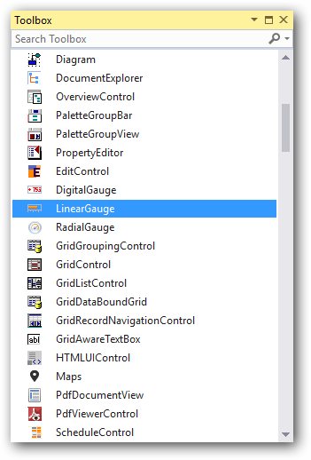

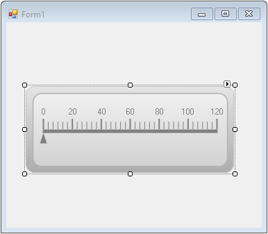

## Adding control manually using code

To add control manually in C#, follow the given steps:

Step 1. Add the following required assembly references to the project:

	    * Syncfusion.Gauge.Windows.dll
	    * Syncfusion.Shared.Base.dll

Step 2. Include the namespaces **Syncfusion.Windows.Forms.Gauge**.






using Syncfusion.Windows.Forms.Gauge;





Imports Syncfusion.Windows.Forms.Gauge



 

{{ codesnippet1 | OrderList_Indent_Level_1 }}

Step 3. Create [LinearGauge](https://help.syncfusion.com/cr/windowsforms/Syncfusion.Windows.Forms.Gauge.LinearGauge.html) control instance and add it to the form.






LinearGauge linearGauge1 = new LinearGauge();

this.Controls.Add(linearGauge1);





Dim linearGauge1 As LinearGauge = New LinearGauge

Me.Controls.Add(linearGauge1)





{{ codesnippet2 | OrderList_Indent_Level_1 }}

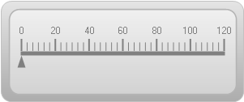

## Concepts and features

This section illustrates the features of the LinearGauge with images and sample code. It contains the following topics:

* LinearGauge Frames
* Scales
* Ticks
* Needles
* Ranges
* Scaling Divisions

### LinearGauge frame

The frame defines the frame types of linear gauges. Frames can be applied using the [LinearFrameType](https://help.syncfusion.com/cr/windowsforms/Syncfusion.Windows.Forms.Gauge.LinearGauge.html#Syncfusion_Windows_Forms_Gauge_LinearGauge_LinearFrameType) property. The LinearGauge control contains two frame types:

* Horizontal
* Vertical

The following properties used to customize the appearance of LinearGauge control.

* [LinearFrameType](https://help.syncfusion.com/cr/windowsforms/Syncfusion.Windows.Forms.Gauge.LinearGauge.html#Syncfusion_Windows_Forms_Gauge_LinearGauge_LinearFrameType)
* [BackgroundGradientStartColor](https://help.syncfusion.com/cr/windowsforms/Syncfusion.Windows.Forms.Gauge.LinearGauge.html#Syncfusion_Windows_Forms_Gauge_LinearGauge_BackgroundGradientStartColor)
* [BackgroundGradientEndColor](https://help.syncfusion.com/cr/windowsforms/Syncfusion.Windows.Forms.Gauge.LinearGauge.html#Syncfusion_Windows_Forms_Gauge_LinearGauge_BackgroundGradientEndColor)
* [InnerFrameGradientStartColor](https://help.syncfusion.com/cr/windowsforms/Syncfusion.Windows.Forms.Gauge.LinearGauge.html#Syncfusion_Windows_Forms_Gauge_LinearGauge_InnerFrameGradientStartColor)
* [InnerFrameGradientEndColor](https://help.syncfusion.com/cr/windowsforms/Syncfusion.Windows.Forms.Gauge.LinearGauge.html#Syncfusion_Windows_Forms_Gauge_LinearGauge_InnerFrameGradientEndColor)
* [OuterFrameGradientStartColor](https://help.syncfusion.com/cr/windowsforms/Syncfusion.Windows.Forms.Gauge.LinearGauge.html#Syncfusion_Windows_Forms_Gauge_LinearGauge_OuterFrameGradientStartColor)
* [OuterFrameGradientEndColor](https://help.syncfusion.com/cr/windowsforms/Syncfusion.Windows.Forms.Gauge.LinearGauge.html#Syncfusion_Windows_Forms_Gauge_LinearGauge_OuterFrameGradientEndColor)
* [GaugeBaseColor](https://help.syncfusion.com/cr/windowsforms/Syncfusion.Windows.Forms.Gauge.LinearGauge.html#Syncfusion_Windows_Forms_Gauge_LinearGauge_GaugeBaseColor)
* [ValueIndicatorColor](https://help.syncfusion.com/cr/windowsforms/Syncfusion.Windows.Forms.Gauge.LinearGauge.html#Syncfusion_Windows_Forms_Gauge_LinearGauge_ValueIndicatorColor)





this.linearGauge1.LinearFrameType = LinearFrameType.Horizontal;





Me.linearGauge1.LinearFrameType = LinearFrameType.Horizontal





#### Scales

Scales are used to control element placement and value ranges.

#### Customizing scales

You can customize scales added to the Linear Gauge by using the properties listed in the following table:

[ShowScaleLabel](https://help.syncfusion.com/cr/windowsforms/Syncfusion.Windows.Forms.Gauge.LinearGauge.html#Syncfusion_Windows_Forms_Gauge_LinearGauge_ShowScaleLabel)
[ScaleLabelColor](https://help.syncfusion.com/cr/windowsforms/Syncfusion.Windows.Forms.Gauge.LinearGauge.html#Syncfusion_Windows_Forms_Gauge_LinearGauge_ScaleLabelColor)

#### Ticks

Two types of ticks can be added to the LinearGauge control scale. Major tick marks are the primary scale indicators. Minor tick marks and inter-tick marks are the secondary scale indicators that fall between the major ticks.

The following table lists the properties that can be used to customize the linear tick marks. This is done to represent the scale with meaningful markers and labels.

[MajorTickMarkColor](https://help.syncfusion.com/cr/windowsforms/Syncfusion.Windows.Forms.Gauge.LinearGauge.html#Syncfusion_Windows_Forms_Gauge_LinearGauge_MajorTickMarkColor)
[MajorTicksHeight](https://help.syncfusion.com/cr/windowsforms/Syncfusion.Windows.Forms.Gauge.LinearGauge.html#Syncfusion_Windows_Forms_Gauge_LinearGauge_MajorTicksHeight)
[MinorTickMarkColor](https://help.syncfusion.com/cr/windowsforms/Syncfusion.Windows.Forms.Gauge.LinearGauge.html#Syncfusion_Windows_Forms_Gauge_LinearGauge_MinorTickMarkColor)
[MinorTickHeight](https://help.syncfusion.com/cr/windowsforms/Syncfusion.Windows.Forms.Gauge.LinearGauge.html#Syncfusion_Windows_Forms_Gauge_LinearGauge_MinorTickHeight)
[PointerPlacement](https://help.syncfusion.com/cr/windowsforms/Syncfusion.Windows.Forms.Gauge.LinearGauge.html#Syncfusion_Windows_Forms_Gauge_LinearGauge_PointerPlacement)

The following code sample demonstrates how to add major and minor ticks to the linear scale.





this.linearGauge1.MajorTickMarkColor = System.Drawing.Color.White;

this.linearGauge1.MinorTickMarkColor = System.Drawing.Color.White;

this.linearGauge1.MinorTickHeight = 6;

this.linearGauge1.MajorTicksHeight = 12;





Me.linearGauge1.MajorTickMarkColor = System.Drawing.Color.White

Me.linearGauge1.MinorTickMarkColor = System.Drawing.Color.White

Me.linearGauge1.MinorTickHeight = 6

Me.linearGauge1.MajorTicksHeight = 12









this.linearGauge1.ShowNeedle = true;

this.linearGauge1.NeedleColor = System.Drawing.Color.Black;





Me.linearGauge1.ShowNeedle = True

Me.linearGauge1.NeedleColor = System.Drawing.Color.Black





#### Pointer placement





this.linearGauge1.PointerPlacement = Placement.Center;





      Me.linearGauge1.PointerPlacement = Placement.Center





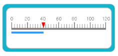

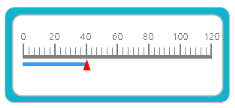

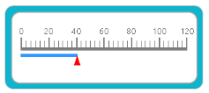

#### Ranges

[Ranges](https://help.syncfusion.com/cr/windowsforms/Syncfusion.Windows.Forms.Gauge.LinearGauge.html#Syncfusion_Windows_Forms_Gauge_LinearGauge_Ranges) are objects that highlight a range of values and can display different ranges in different colors. [Ranges](https://help.syncfusion.com/cr/windowsforms/Syncfusion.Windows.Forms.Gauge.LinearGauge.html#Syncfusion_Windows_Forms_Gauge_LinearGauge_Ranges) can be customized using various attributes such as range placement, height, color of the range, and more. All the available attributes are listed in the following table:

<table>
<tr>
<th>
Property</th><th>
Type</th><th>
Description</th></tr>
<tr>
<td>
StartValue</td><td>
Integer</td><td>
Specify the start value of the range. Default value is set to 0.</td></tr>
<tr>
<td>
EndValue</td><td>
Integer</td><td>
Specify the end value of the range. Default value is set to 0.</td></tr>
<tr>
<td>
RangePlacement</td><td>
Enum</td><td>
Using this attribute, the range can be positioned in two areas along the linear scale. It includes the following options:
<ul><li> Inside</li>
<li> Outside</li></ul>  The default value is Inside.</td></tr>
<tr>
<td>
Height</td><td>
Integer</td><td>
Specify the height of the range. Default value is set to 5.</td></tr>
<tr>
<td>
Color</td><td>
Color</td><td>
Gets or sets the color of the range.</td></tr>
</table>

The following code sample demonstrates how to add ranges to the linear gauge:





Syncfusion.Windows.Forms.Gauge.LinearRange range1 = new Syncfusion.Windows.Forms.Gauge.LinearRange();

range1.Color = System.Drawing.Color.FromArgb(((int)(((byte)(225)))), ((int)(((byte)(128)))), ((int)(((byte)(128)))));

            range1.EndValue = 0F;

            range1.Height = 5;

            range1.InRange = false;

            range1.Name = "GaugeRange1";

            range1.StartValue = 0F;

            this.linearGauge1.Ranges.Add(range1);





Dim range1 As New Syncfusion.Windows.Forms.Gauge.LinearRange range()

range1.Color = System.Drawing.Color.FromArgb(CInt(CByte(225)), CInt(CByte(128)), CInt(CByte(128)))

range1.EndValue = 0F

range1.Height = 5

range1.InRange = False

range1.Name = "GaugeRange1"

range1.StartValue = 0F

Me.linearGauge1.Ranges.Add(range1)





#### Scaling divisions

The Gauge control for Windows Forms includes support for customizing the number of major tick lines and minor tick lines using the [MajorDifference](https://help.syncfusion.com/cr/windowsforms/Syncfusion.Windows.Forms.Gauge.LinearGauge.html#Syncfusion_Windows_Forms_Gauge_LinearGauge_MajorDifference) and [MinorTickCount](https://help.syncfusion.com/cr/windowsforms/Syncfusion.Windows.Forms.Gauge.LinearGauge.html#Syncfusion_Windows_Forms_Gauge_LinearGauge_MinorTickCount) properties. It also provides support to customize the number of tick lines using the [MaximumValue](https://help.syncfusion.com/cr/windowsforms/Syncfusion.Windows.Forms.Gauge.LinearGauge.html#Syncfusion_Windows_Forms_Gauge_LinearGauge_MaximumValue) and [MinimumValue](https://help.syncfusion.com/cr/windowsforms/Syncfusion.Windows.Forms.Gauge.LinearGauge.html#Syncfusion_Windows_Forms_Gauge_LinearGauge_MinimumValue) properties.





           this.linearGauge1.MajorDifference = 20F;

           this.linearGauge1.MaximumValue = 120F;

           this.linearGauge1.MinimumValue = 0F;

           this.linearGauge1.MinorTickCount = 1;





Me.linearGauge1.MajorDifference = 20F

Me.linearGauge1.MaximumValue = 120F

Me.linearGauge1.MinimumValue = 0F

Me.linearGauge1.MinorTickCount = 1





## Visual styles

The Gauge control for Windows Forms includes four stunning skins for professional representation of gauges. You can easily modify the look and feel of the gauge component using the [VisualStyle](https://help.syncfusion.com/cr/windowsforms/Syncfusion.Windows.Forms.Gauge.LinearGauge.html#Syncfusion_Windows_Forms_Gauge_LinearGauge_VisualStyle) property.

The styles are built-in for all gauges.

* Blue
* Black
* Silver
* Metro
* Office2016White
* Office2016Colorful
* Office2016DarkGray
* Office2016Black
* Custom

**Black**

This option helps to set the Black theme.





this.linearGauge1.VisualStyle = Syncfusion.Windows.Forms.Gauge.ThemeStyle.Black;





Me.linearGauge1.VisualStyle = 

Syncfusion.Windows.Forms.Gauge.ThemeStyle.Black





**Blue**

This option helps to set the Blue theme.





this.linearGauge1.VisualStyle = Syncfusion.Windows.Forms.Gauge.ThemeStyle.Blue;





Me.linearGauge1.VisualStyle = 

Syncfusion.Windows.Forms.Gauge.ThemeStyle.Blue





**Silver**

This option helps to set the Silver theme.





this.linearGauge1.VisualStyle = Syncfusion.Windows.Forms.Gauge.ThemeStyle.Silver;





Me.linearGauge1.VisualStyle = 

Syncfusion.Windows.Forms.Gauge.ThemeStyle.Silver





**Metro**

This option helps to set the Metro theme.





this.linearGauge1.VisualStyle = Syncfusion.Windows.Forms.Gauge.ThemeStyle.Metro;





Me.linearGauge1.VisualStyle = 

Syncfusion.Windows.Forms.Gauge.ThemeStyle.Metro





**Office2016 White**

This option helps to set the Office2016White theme.





//Office2016White

this.linearGauge1.VisualStyle = Syncfusion.Windows.Forms.Gauge.ThemeStyle.Office2016White;





'Office2016White

Me.linearGauge1.VisualStyle = Syncfusion.Windows.Forms.Gauge.ThemeStyle.Office2016White





 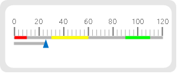

 **Office2016Colorful**

This option helps to set the Office2016Colorful theme.





// Office2016Colorful

this.linearGauge1.VisualStyle = Syncfusion.Windows.Forms.Gauge.ThemeStyle.Office2016Colorful;





'Office2016Colorful

Me.linearGauge1.VisualStyle = Syncfusion.Windows.Forms.Gauge.ThemeStyle.Office2016Colorful





 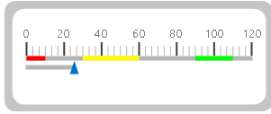

**Office2016DarkGray**

This option helps to set the Office2016DarkGray theme.





//Office2016DarkGray

this.linearGauge1.VisualStyle = Syncfusion.Windows.Forms.Gauge.ThemeStyle.Office2016DarkGray;





'Office2016DarkGray

Me.linearGauge1.VisualStyle = Syncfusion.Windows.Forms.Gauge.ThemeStyle.Office2016DarkGray





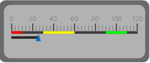

**Office2016Black**

This option helps to set the Office2016Black theme.





//Office2016Black

this.linearGauge1.VisualStyle = Syncfusion.Windows.Forms.Gauge.ThemeStyle.Office2016Black;





'Office2016Black

Me.linearGauge1.VisualStyle = Syncfusion.Windows.Forms.Gauge.ThemeStyle.Office2016Black





 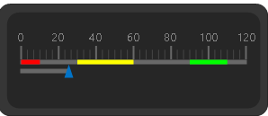

**Custom**

 Linear Gauge also provides an option to end user to create their own custom theme based on the requirement by setting the [VisualStyle](https://help.syncfusion.com/cr/windowsforms/Syncfusion.Windows.Forms.Gauge.LinearGauge.html#Syncfusion_Windows_Forms_Gauge_LinearGauge_VisualStyle) property as Custom.

 **Steps to customize the theme in design time**

 Step 1. Need to add Linear Gauge control to Form Designer.

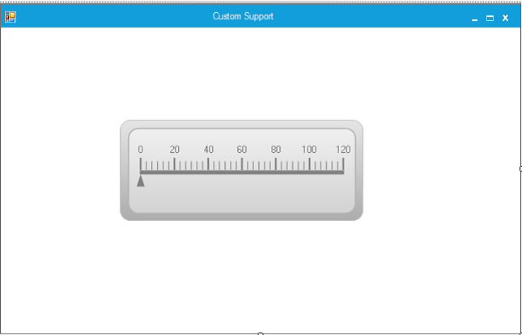

 Step 2. Set the VisualStyle as Custom.

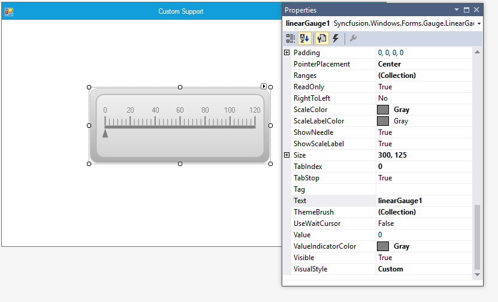

 Step 3. Need to add necessary Theme combination in ThemeBrush collection and it will update the Color customization details in LinearGauge control.

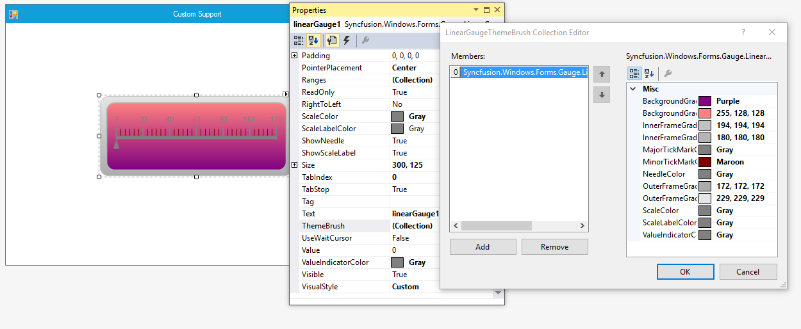





this.linearGauge1 = new Syncfusion.Windows.Forms.Gauge.LinearGauge();
this.linearGauge1.BackgroundGradientEndColor = System.Drawing.Color.Purple;this.linearGauge1.BackgroundGradientStartColor = System.Drawing.Color.FromArgb(((int)(((byte)(255)))), ((int)(((byte)(128)))), ((int)(((byte)(128)))));
this.linearGauge1.ForeColor = System.Drawing.Color.Gray;
this.linearGauge1.GaugelabelFont = new System.Drawing.Font("Segoe UI", 8.25F, System.Drawing.FontStyle.Regular, System.Drawing.GraphicsUnit.Point, ((byte)(0)));
this.linearGauge1.LinearFrameType = Syncfusion.Windows.Forms.Gauge.LinearFrameType.Horizontal;
this.linearGauge1.Location = new System.Drawing.Point(138, 109);
this.linearGauge1.MajorTicksHeight = 15;
this.linearGauge1.MinimumSize = new System.Drawing.Size(75, 125);
this.linearGauge1.MinorTickCount = 5;
this.linearGauge1.MinorTickHeight = 10;
this.linearGauge1.MinorTickMarkColor = System.Drawing.Color.Maroon;
this.linearGauge1.Name = "linearGauge1";
this.linearGauge1.PointerPlacement = Syncfusion.Windows.Forms.Gauge.Placement.Center;
this.linearGauge1.ScaleColor = System.Drawing.Color.Gray;
this.linearGauge1.Size = new System.Drawing.Size(300, 125);
this.linearGauge1.TabIndex = 0;
this.linearGauge1.Text = "linearGauge1";
this.linearGauge1.ValueIndicatorColor = System.Drawing.Color.Gray;
this.linearGauge1.VisualStyle = Syncfusion.Windows.Forms.Gauge.ThemeStyle.Custom;





Me.linearGauge1 = New Syncfusion.Windows.Forms.Gauge.LinearGauge()
Me.linearGauge1.BackgroundGradientEndColor = System.Drawing.Color.Purple
Me.linearGauge1.BackgroundGradientStartColor = System.Drawing.Color.FromArgb((CType(((CType((255), Byte))), Integer)), (CType(((CType((128), Byte))), Integer)), (CType(((CType((128), Byte))), Integer)))Me.linearGauge1.ForeColor = System.Drawing.Color.Gray
Me.linearGauge1.GaugelabelFont = New System.Drawing.Font("Segoe UI", 8.25F, System.Drawing.FontStyle.Regular, System.Drawing.GraphicsUnit.Point, (CType((0), Byte)))
Me.linearGauge1.LinearFrameType = Syncfusion.Windows.Forms.Gauge.LinearFrameType.Horizontal
Me.linearGauge1.Location = New System.Drawing.Point(138, 109)
Me.linearGauge1.MajorTicksHeight = 15
Me.linearGauge1.MinimumSize = New System.Drawing.Size(75, 125)
Me.linearGauge1.MinorTickCount = 5
Me.linearGauge1.MinorTickHeight = 10
Me.linearGauge1.MinorTickMarkColor = System.Drawing.Color.Maroon
Me.linearGauge1.Name = "linearGauge1"
Me.linearGauge1.PointerPlacement = Syncfusion.Windows.Forms.Gauge.Placement.Center
Me.linearGauge1.ScaleColor = System.Drawing.Color.Gray
Me.linearGauge1.Size = New System.Drawing.Size(300, 125)
Me.linearGauge1.TabIndex = 0
Me.linearGauge1.Text = "linearGauge1"
Me.linearGauge1.ValueIndicatorColor = System.Drawing.Color.Gray
Me.linearGauge1.VisualStyle = Syncfusion.Windows.Forms.Gauge.ThemeStyle.Custom





**Output:**

## Data binding

You can bind any data source to the LinearGauge control and map an index of a record to represent the actual value in the linear gauge. The [DisplayMember](https://help.syncfusion.com/cr/windowsforms/Syncfusion.Windows.Forms.Gauge.LinearGauge.html#Syncfusion_Windows_Forms_Gauge_LinearGauge_DisplayMember) and [DisplayRecordIndex](https://help.syncfusion.com/cr/windowsforms/Syncfusion.Windows.Forms.Gauge.LinearGauge.html#Syncfusion_Windows_Forms_Gauge_LinearGauge_DisplayRecordIndex) properties will map the DataColumn and DataRow of the binding source respectively to the LinearGauge control, which will then support high frequency data updates.


this.linearGauge1.DataSource = dataTable;
this.linearGauge1.DisplayRecordIndex = [Row Index];
this.linearGauge1.DisplayMember = [column name];


## Custom renderer

The appearance of the Linear Gauge can be customized by using the Interface [ILinearGaugeRenderer](https://help.syncfusion.com/cr/windowsforms/Syncfusion.Windows.Forms.Gauge.ILinearGaugeRenderer.html). This interface provides few methods to control painting over the [Frame](https://help.syncfusion.com/cr/windowsforms/Syncfusion.Windows.Forms.Gauge.ILinearGaugeRenderer.html#Syncfusion_Windows_Forms_Gauge_ILinearGaugeRenderer_DrawFrame_System_Drawing_Graphics_), [Needle](https://help.syncfusion.com/cr/windowsforms/Syncfusion.Windows.Forms.Gauge.ILinearGaugeRenderer.html#Syncfusion_Windows_Forms_Gauge_ILinearGaugeRenderer_DrawLines_System_Drawing_Graphics_), [Major ticks](https://help.syncfusion.com/cr/windowsforms/Syncfusion.Windows.Forms.Gauge.ILinearGaugeRenderer.html#Syncfusion_Windows_Forms_Gauge_ILinearGaugeRenderer_DrawLines_System_Drawing_Graphics_), [Minor ticks](https://help.syncfusion.com/cr/windowsforms/Syncfusion.Windows.Forms.Gauge.ILinearGaugeRenderer.html#Syncfusion_Windows_Forms_Gauge_ILinearGaugeRenderer_DrawLines_System_Drawing_Graphics_), [Pointers](https://help.syncfusion.com/cr/windowsforms/Syncfusion.Windows.Forms.Gauge.ILinearGaugeRenderer.html#Syncfusion_Windows_Forms_Gauge_ILinearGaugeRenderer_DrawPointer_System_Drawing_Graphics_), [Ranges](https://help.syncfusion.com/cr/windowsforms/Syncfusion.Windows.Forms.Gauge.ILinearGaugeRenderer.html#Syncfusion_Windows_Forms_Gauge_ILinearGaugeRenderer_DrawRanges_System_Drawing_Graphics_) etc.

To customize the appearance,

1. Create a new custom renderer class and implement each of the members defined in [ILinearGaugeRenderer](https://help.syncfusion.com/cr/windowsforms/Syncfusion.Windows.Forms.Gauge.ILinearGaugeRenderer.html).
2. Assign instance of your custom renderer to the [Renderer](https://help.syncfusion.com/cr/windowsforms/Syncfusion.Windows.Forms.Gauge.LinearGauge.html#Syncfusion_Windows_Forms_Gauge_LinearGauge_Renderer) property of Linear Gauge.

Note: By default, Linear Gauge is painted by using its default renderer.





CustomRenderer custom1= new CustomRenderer(this.linearGauge1);

linearGauge1.Renderer = custom;





Private custom1 As CustomRenderer  = New CustomRenderer(Me.linearGauge1)

linearGauge1.Renderer = custom





## Frequently asked questions

### How to customize Linear Gauge appearance

You can customize the appearance of the Linear Gauge by using its interface named [ILinearGaugeRenderer](https://help.syncfusion.com/cr/windowsforms/Syncfusion.Windows.Forms.Gauge.ILinearGaugeRenderer.html) and property named Renderer. The following code example illustrates how to customize the appearance of Linear Gauge, based on user requirement. 





CustomRenderer custom1= new CustomRenderer(this.linearGauge1);

linearGauge1.Renderer = custom;

class CustomRenderer :ILinearGaugeRenderer
    {
        
        /// 

        /// Gets the Linear gauge
        /// 

        private LinearGauge m_LinearGauge;
        /// 

        /// Gets/Sets the Tick Distance of the Linear gauge.
        /// 

        private float majorTicksDistance;
        /// 

        /// Calculates the Minor Ticks Pixels.
        /// 

        private float m_minorTicksPixels;
        /// 

        /// Start point of the frame
        /// 

        private int start;
        /// 

        /// Counts the Major ticks count for the given range.
        /// 

        private int majorTicksCount;

        /// 

        ///  Gets the Radial gauge
        /// 

        internal LinearGauge LinearGauge
        {
            get
            {
                return m_LinearGauge;
            }
        }

        public CustomRenderer(LinearGauge linearGauge)
        {
            m_LinearGauge = linearGauge;
            majorTicksDistance = 0;
            m_minorTicksPixels = 0;
            start = 25;
           
        }

        public void DrawFrame(System.Drawing.Graphics Graphics)
        {
        }

        public void DrawLines(System.Drawing.Graphics Graphics)
        {
            Pen majorTickPen = new Pen(LinearGauge.MajorTickMarkColor);
            Pen minorTickPen = new Pen(LinearGauge.MinorTickMarkColor);
            Brush brush = new SolidBrush(LinearGauge.ForeColor);
            StringFormat sf = new StringFormat();
            Graphics.SmoothingMode = System.Drawing.Drawing2D.SmoothingMode.AntiAlias;

            majorTicksDistance = ((LinearGauge.MaximumValue - LinearGauge.MinimumValue) / LinearGauge.MajorDifference);
            majorTicksCount = ((int)(LinearGauge.MaximumValue - LinearGauge.MinimumValue) / (LinearGauge.MajorDifference)) + 1;
            double majorTickValue = LinearGauge.MinimumValue;
            float tickPosition = 25f;
            float temp1 = 0;
            float s = (LinearGauge.MaximumValue - LinearGauge.MinimumValue) % LinearGauge.MajorDifference;
            sf.Alignment = StringAlignment.Center;
            sf.LineAlignment = StringAlignment.Center;
            float minortickValue = 0;
            float tickPositionMinor = 0;
            GraphicsPath path = new GraphicsPath();
            int minor = LinearGauge.MinorTickCount;
            m_minorTicksPixels = ((this.LinearGauge.Height - 50) / majorTicksDistance);
            int x = this.LinearGauge.Width / 2;
            temp1 = 0;
            for (int L = 1; L <= majorTicksCount; L++)
            {
                Graphics.DrawLine(majorTickPen, x, this.LinearGauge.Height - tickPosition, x - LinearGauge.MajorTicksHeight, this.LinearGauge.Height - tickPosition);
                Graphics.TextRenderingHint = System.Drawing.Text.TextRenderingHint.AntiAlias;
                if (LinearGauge.ShowScaleLabel)
                    Graphics.DrawString(Math.Round(majorTickValue, 2).ToString(),
                             LinearGauge.Font, brush, new PointF(x - LinearGauge.MajorTicksHeight - 25, this.LinearGauge.Height - tickPosition), sf);
                if (L == majorTicksCount)
                    minor = (LinearGauge.MinorTickCount * (int)Math.Ceiling(s)) / LinearGauge.MajorDifference;
                if (majorTickValue < LinearGauge.MaximumValue)
                {
                    for (int S = 1; S <= minor; S++)
                    {
                        minortickValue = (m_minorTicksPixels / (LinearGauge.MinorTickCount + 1)) * S;
                        tickPositionMinor = this.LinearGauge.Height - (minortickValue + temp1 + 25);
                        Graphics.DrawLine(minorTickPen, x, (float)tickPositionMinor, x - LinearGauge.MinorTickHeight, (float)tickPositionMinor);
                    }
                    temp1 = m_minorTicksPixels * L;
                }

                majorTickValue += LinearGauge.MajorDifference;
                tickPosition += m_minorTicksPixels;
            }
            Graphics.FillRectangle(new SolidBrush(LinearGauge.GaugeBaseColor), this.LinearGauge.Width / 2, start - 1, 1, (((this.majorTicksDistance)) * m_minorTicksPixels) + 2);
            if (this.LinearGauge.MinimumValue > 0)
                Graphics.FillRectangle(new SolidBrush(LinearGauge.ValueIndicatorColor), this.LinearGauge.Width / 2 + 10, start + (majorTicksDistance * m_minorTicksPixels) - (((LinearGauge.Value / LinearGauge.MajorDifference)) * m_minorTicksPixels), 5, (((LinearGauge.Value / LinearGauge.MajorDifference)) * m_minorTicksPixels) + 2);
            else
                Graphics.FillRectangle(new SolidBrush(LinearGauge.ValueIndicatorColor), this.LinearGauge.Width / 2 + 10, start + (majorTicksDistance * m_minorTicksPixels) - ((((Math.Abs(this.LinearGauge.MinimumValue) + LinearGauge.Value) / LinearGauge.MajorDifference)) * m_minorTicksPixels), 5, ((((Math.Abs(this.LinearGauge.MinimumValue) + LinearGauge.Value) / LinearGauge.MajorDifference)) * m_minorTicksPixels) + 2);
            brush.Dispose();
            minorTickPen.Dispose();
        }

        public void DrawRanges(System.Drawing.Graphics Graphics)
        {
            Graphics.SmoothingMode = System.Drawing.Drawing2D.SmoothingMode.AntiAlias ;
            foreach (LinearRange ptrRange in this.LinearGauge.Ranges)
            {
                int value = (int)Math.Ceiling(LinearGauge.MaximumValue - ptrRange.EndValue) / LinearGauge.MajorDifference;
                if (ptrRange.EndValue > ptrRange.StartValue && ptrRange.EndValue <= this.LinearGauge.MaximumValue)
                {
                    if (this.LinearGauge.MinimumValue >= 0 && ptrRange.StartValue < 0)
                    {
                        return;
                    }
                    float startValue = (float)ptrRange.StartValue;
                    float end = (float)ptrRange.EndValue;
                    if (this.LinearGauge.MinimumValue < 0)
                    {
                        startValue = this.LinearGauge.MinimumValue + Math.Abs(ptrRange.StartValue);
                    }
                    if (this.LinearGauge.MinimumValue < 0 && ptrRange.StartValue > 0)
                    {
                        startValue = Math.Abs(this.LinearGauge.MinimumValue) + Math.Abs(ptrRange.StartValue);
                    }
                    if (this.LinearGauge.MinimumValue < 0 && ptrRange.StartValue == 0)
                    {
                        startValue = Math.Abs(this.LinearGauge.MinimumValue) + Math.Abs(ptrRange.StartValue);
                        startValue = (((startValue / LinearGauge.MajorDifference)) * m_minorTicksPixels);
                    }

                    float height = (ptrRange.EndValue / LinearGauge.MajorDifference) * m_minorTicksPixels;
                    float endValueRangeHeight = 0f;
                    if (this.LinearGauge.MinimumValue < 0)
                    {
                        height = ((Math.Abs(this.LinearGauge.MinimumValue) + ptrRange.EndValue) / LinearGauge.MajorDifference) * m_minorTicksPixels;
                    }
                    endValueRangeHeight = height;
                    if (this.LinearGauge.MinimumValue < 0 && ptrRange.StartValue == 0)
                    {
                        endValueRangeHeight = (((ptrRange.EndValue - ptrRange.StartValue) / LinearGauge.MajorDifference) * m_minorTicksPixels);
                    }
                    if (ptrRange.StartValue == 0)
                        Graphics.FillRectangle(new SolidBrush(ptrRange.Color), this.LinearGauge.Width / 2 + 10, start + (majorTicksDistance * m_minorTicksPixels) - height, 8, endValueRangeHeight);
                    else if (ptrRange.StartValue > 0)
                        Graphics.FillRectangle(new SolidBrush(ptrRange.Color), this.LinearGauge.Width / 2 + 10, start + (majorTicksDistance * m_minorTicksPixels) - height, 8, (((ptrRange.EndValue - ptrRange.StartValue) / LinearGauge.MajorDifference) * m_minorTicksPixels));
                    else if (ptrRange.StartValue < 0)
                    {
                        Graphics.FillRectangle(new SolidBrush(ptrRange.Color), this.LinearGauge.Width / 2 + 10, start + (majorTicksDistance * m_minorTicksPixels) - height, 8, (((ptrRange.EndValue - ptrRange.StartValue) / LinearGauge.MajorDifference) * m_minorTicksPixels));
                    }
                }
            }
        }

        public void DrawPointer(System.Drawing.Graphics Graphics)
        {
            Graphics.SmoothingMode = System.Drawing.Drawing2D.SmoothingMode.AntiAlias;
            GraphicsPath path = new GraphicsPath();
            int a = 0;
            if (this.LinearGauge.MinimumValue < 0)
                a = (int)Math.Ceiling((((Math.Abs(this.LinearGauge.MinimumValue) + LinearGauge.Value) / (float)LinearGauge.MajorDifference) * m_minorTicksPixels));
            else
                a = (int)Math.Ceiling(((LinearGauge.Value / (float)LinearGauge.MajorDifference) * m_minorTicksPixels));
            int y = (this.LinearGauge.Height / 2 + 5 + LinearGauge.MajorTicksHeight) - LinearGauge.MajorTicksHeight;
            a = 10 + (int)Math.Ceiling((majorTicksDistance * m_minorTicksPixels))-a;
            Rectangle rect = new Rectangle(new Point(this.LinearGauge.Width / 2 + 28, a), new Size(32, 32));
            SizeF sf= Graphics.MeasureString(this.LinearGauge.Value.ToString(),this.LinearGauge.GaugelabelFont);
            PointF point=new PointF(rect.X+rect.Width/2-sf.Width/2,rect.Y+rect.Height/2-sf.Height/2);
            Graphics.FillEllipse(new SolidBrush(LinearGauge.NeedleColor), rect);
            Graphics.DrawEllipse(new Pen(ColorTranslator.FromHtml("#00a0d1")), rect);
            Graphics.DrawLine(new Pen(ColorTranslator.FromHtml("#00a0d1")), rect.X, rect.Y + rect.Height / 2, rect.X - 18, rect.Y + rect.Height / 2);
            Graphics.DrawString(Math.Round(LinearGauge.Value,2).ToString(), this.LinearGauge.GaugelabelFont, new SolidBrush( ColorTranslator.FromHtml("#024e60")), point);
        }

        public void UpdateRenderer(System.Windows.Forms.PaintEventArgs PaintEventArgs)
        {
            DrawLines(PaintEventArgs.Graphics);
            DrawRanges(PaintEventArgs.Graphics);
            DrawPointer(PaintEventArgs.Graphics);
        }
    }





Private custom1 As CustomRenderer  = New CustomRenderer(Me. linearGauge1)

linearGauge1.Renderer = custom

Public Class CustomRenderer
        Implements ILinearGaugeRenderer
        ''' 

        ''' Gets the Linear gauge
        ''' 

        Private m_LinearGauge As LinearGauge
        ''' 

        ''' Gets/Sets the Tick Distance of the Linear gauge.
        ''' 

        Private majorTicksDistance As Single
        ''' 

        ''' Calculates the Minor Ticks Pixels.
        ''' 

        Private m_minorTicksPixels As Single
        ''' 

        ''' Start point of the frame
        ''' 

        Private start As Integer
        ''' 

        ''' Counts the Major ticks count for the given range.
        ''' 

        Private majorTicksCount As Integer

        ''' 

        '''  Gets the Radial gauge
        ''' 

        Friend ReadOnly Property LinearGauge() As LinearGauge
            Get
                Return m_LinearGauge
            End Get
        End Property

        Public Sub New(ByVal linearGauge As LinearGauge)
            m_LinearGauge = linearGauge
            majorTicksDistance = 0
            m_minorTicksPixels = 0
            start = 25

        End Sub

        Public Sub DrawFrame(ByVal Graphics As System.Drawing.Graphics)
        End Sub

        Public Sub DrawLines(ByVal Graphics As System.Drawing.Graphics)
            Dim majorTickPen As New Pen(LinearGauge.MajorTickMarkColor)
            Dim minorTickPen As New Pen(LinearGauge.MinorTickMarkColor)
            Dim brush As Brush = New SolidBrush(LinearGauge.ForeColor)
            Dim sf As New StringFormat()
            Graphics.SmoothingMode = System.Drawing.Drawing2D.SmoothingMode.AntiAlias

            majorTicksDistance = ((LinearGauge.MaximumValue - LinearGauge.MinimumValue) / LinearGauge.MajorDifference)
            majorTicksCount = (CInt(Fix(LinearGauge.MaximumValue - LinearGauge.MinimumValue)) / (LinearGauge.MajorDifference)) + 1
            Dim majorTickValue As Double = LinearGauge.MinimumValue
            Dim tickPosition As Single = 25.0F
            Dim temp1 As Single = 0
            Dim s As Single = (LinearGauge.MaximumValue - LinearGauge.MinimumValue) Mod LinearGauge.MajorDifference
            sf.Alignment = StringAlignment.Center
            sf.LineAlignment = StringAlignment.Center
            Dim tick As Single = 0
            Dim tickPositionMinor As Single = 0
            Dim path As New GraphicsPath()
            Dim minor As Integer = LinearGauge.MinorTickCount
            m_minorTicksPixels = ((Me.LinearGauge.Height - 50) / majorTicksDistance)
            Dim x As Integer = Me.LinearGauge.Width \ 2
            temp1 = 0
            For L As Integer = 1 To majorTicksCount
                Graphics.DrawLine(majorTickPen, x, Me.LinearGauge.Height - tickPosition, x - LinearGauge.MajorTicksHeight, Me.LinearGauge.Height - tickPosition)
                Graphics.TextRenderingHint = System.Drawing.Text.TextRenderingHint.AntiAlias
                If LinearGauge.ShowScaleLabel Then
                    Graphics.DrawString(Math.Round(majorTickValue, 2).ToString(), LinearGauge.Font, brush, New PointF(x - LinearGauge.MajorTicksHeight - 25, Me.LinearGauge.Height - tickPosition), sf)
                End If
                If L = majorTicksCount Then
                    minor = (LinearGauge.MinorTickCount * CInt(Fix(Math.Ceiling(s)))) / LinearGauge.MajorDifference
                End If
                If majorTickValue < LinearGauge.MaximumValue Then
                    'INSTANT VB NOTE: The variable S was renamed since Visual Basic will not allow local variables with the same name as parameters or other local variables:
                    For S_Renamed As Integer = 1 To minor
                        tick = (m_minorTicksPixels / (LinearGauge.MinorTickCount + 1)) * S_Renamed
                        tickPositionMinor = Me.LinearGauge.Height - (minortick + temp1 + 25)
                        Graphics.DrawLine(minorTickPen, x, tickPositionMinor, x - LinearGauge.MinorTickHeight, tickPositionMinor)
                    Next s
                    temp1 = m_minorTicksPixels * L
                End If

                majorTickValue += LinearGauge.MajorDifference
                tickPosition += m_minorTicksPixels
            Next L
            Graphics.FillRectangle(New SolidBrush(LinearGauge.GaugeBaseColor), Me.LinearGauge.Width \ 2, start - 1, 1, (((Me.majorTicksDistance)) * m_minorTicksPixels) + 2)
            If Me.LinearGauge.MinimumValue > 0 Then
                Graphics.FillRectangle(New SolidBrush(LinearGauge.ValueIndicatorColor), Me.LinearGauge.Width \ 2 + 10, start + (majorTicksDistance * m_minorTicksPixels) - (((LinearGauge.Value / LinearGauge.MajorDifference)) * m_minorTicksPixels), 5, (((LinearGauge.Value / LinearGauge.MajorDifference)) * m_minorTicksPixels) + 2)
            Else
                Graphics.FillRectangle(New SolidBrush(LinearGauge.ValueIndicatorColor), Me.LinearGauge.Width \ 2 + 10, start + (majorTicksDistance * m_minorTicksPixels) - ((((Math.Abs(Me.LinearGauge.MinimumValue) + LinearGauge.Value) / LinearGauge.MajorDifference)) * m_minorTicksPixels), 5, ((((Math.Abs(Me.LinearGauge.MinimumValue) + LinearGauge.Value) / LinearGauge.MajorDifference)) * m_minorTicksPixels) + 2)
            End If
            brush.Dispose()
            minorTickPen.Dispose()
        End Sub

        Public Sub DrawRanges(ByVal Graphics As System.Drawing.Graphics)
            Graphics.SmoothingMode = System.Drawing.Drawing2D.SmoothingMode.AntiAlias
            For Each ptrRange As LinearRange In Me.LinearGauge.Ranges
                Dim value As Integer = CInt(Fix(Math.Ceiling(LinearGauge.MaximumValue - ptrRange.EndValue))) / LinearGauge.MajorDifference
                If ptrRange.EndValue > ptrRange.StartValue AndAlso ptrRange.EndValue <= Me.LinearGauge.MaximumValue Then
                    If Me.LinearGauge.MinimumValue >= 0 AndAlso ptrRange.StartValue < 0 Then
                        Return
                    End If
                    Dim startValue As Single = ptrRange.StartValue
                    Dim end As Single = ptrRange.EndValue
                    If Me.LinearGauge.MinimumValue < 0 Then
                        startValue = Me.LinearGauge.MinimumValue + Math.Abs(ptrRange.StartValue)
                    End If
                    If Me.LinearGauge.MinimumValue < 0 AndAlso ptrRange.StartValue > 0 Then
                        startValue = Math.Abs(Me.LinearGauge.MinimumValue) + Math.Abs(ptrRange.StartValue)
                    End If
                    If Me.LinearGauge.MinimumValue < 0 AndAlso ptrRange.StartValue = 0 Then
                        startValue = Math.Abs(Me.LinearGauge.MinimumValue) + Math.Abs(ptrRange.StartValue)
                        startValue = (((startValue / LinearGauge.MajorDifference)) * m_minorTicksPixels)
                    End If

                    Dim height As Single = (ptrRange.EndValue / LinearGauge.MajorDifference) * m_minorTicksPixels
                    Dim endValueRangeHeight As Single = 0.0F
                    If Me.LinearGauge.MinimumValue < 0 Then
                        height = ((Math.Abs(Me.LinearGauge.MinimumValue) + ptrRange.EndValue) / LinearGauge.MajorDifference) * m_minorTicksPixels
                    End If
                    endValueRangeHeight = height
                    If Me.LinearGauge.MinimumValue < 0 AndAlso ptrRange.StartValue = 0 Then
                        endValueRangeHeight = (((ptrRange.EndValue - ptrRange.StartValue) / LinearGauge.MajorDifference) * m_minorTicksPixels)
                    End If
                    If ptrRange.StartValue = 0 Then
                        Graphics.FillRectangle(New SolidBrush(ptrRange.Color), Me.LinearGauge.Width \ 2 + 10, start + (majorTicksDistance * m_minorTicksPixels) - height, 8, endValueRangeHeight)
                    ElseIf ptrRange.StartValue > 0 Then
                        Graphics.FillRectangle(New SolidBrush(ptrRange.Color), Me.LinearGauge.Width \ 2 + 10, start + (majorTicksDistance * m_minorTicksPixels) - height, 8, (((ptrRange.EndValue - ptrRange.StartValue) / LinearGauge.MajorDifference) * m_minorTicksPixels))
                    ElseIf ptrRange.StartValue < 0 Then
                        Graphics.FillRectangle(New SolidBrush(ptrRange.Color), Me.LinearGauge.Width \ 2 + 10, start + (majorTicksDistance * m_minorTicksPixels) - height, 8, (((ptrRange.EndValue - ptrRange.StartValue) / LinearGauge.MajorDifference) * m_minorTicksPixels))
                    End If
                End If
            Next ptrRange
        End Sub

        Public Sub DrawPointer(ByVal Graphics As System.Drawing.Graphics)
            Graphics.SmoothingMode = System.Drawing.Drawing2D.SmoothingMode.AntiAlias
            Dim path As New GraphicsPath()
            Dim a As Integer = 0
            If Me.LinearGauge.MinimumValue < 0 Then
                a = CInt(Fix(Math.Ceiling((((Math.Abs(Me.LinearGauge.MinimumValue) + LinearGauge.Value) / LinearGauge.MajorDifference) * m_minorTicksPixels))))
            Else
                a = CInt(Fix(Math.Ceiling(((LinearGauge.Value / LinearGauge.MajorDifference) * m_minorTicksPixels))))
            End If
            Dim y As Integer = (Me.LinearGauge.Height \ 2 + 5 + LinearGauge.MajorTicksHeight) - LinearGauge.MajorTicksHeight
            a = 10 + CInt(Fix(Math.Ceiling((majorTicksDistance * m_minorTicksPixels)))) - a
            Dim rect As New Rectangle(New Point(Me.LinearGauge.Width \ 2 + 28, a), New Size(32, 32))
            Dim sf As SizeF = Graphics.MeasureString(Me.LinearGauge.Value.ToString(), Me.LinearGauge.GaugelabelFont)
            Dim point As New PointF(rect.X + rect.Width \ 2 - sf.Width \ 2, rect.Y + rect.Height \ 2 - sf.Height \ 2)
            Graphics.FillEllipse(New SolidBrush(LinearGauge.NeedleColor), rect)
            Graphics.DrawEllipse(New Pen(ColorTranslator.FromHtml("#00a0d1")), rect)
            Graphics.DrawLine(New Pen(ColorTranslator.FromHtml("#00a0d1")), rect.X, rect.Y + rect.Height \ 2, rect.X - 18, rect.Y + rect.Height \ 2)
            Graphics.DrawString(Math.Round(LinearGauge.Value, 2).ToString(), Me.LinearGauge.GaugelabelFont, New SolidBrush(ColorTranslator.FromHtml("#024e60")), point)
        End Sub

        Public Sub UpdateRenderer(ByVal PaintEventArgs As System.Windows.Forms.PaintEventArgs)
            DrawLines(PaintEventArgs.Graphics)
            DrawRanges(PaintEventArgs.Graphics)
            DrawPointer(PaintEventArgs.Graphics)
        End Sub
    End Class





