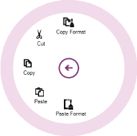
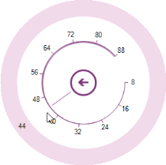

# Element Binding in Windows Forms Radial Menu

## Menu items

Radial Menu Items is populated with the business object collection. This section explains how to create a Radial Menu that shows the list of Application commands.

### Slice count

Slice Count functionality is used to define the maximum number of menu items (slices) that is made visible by default in the Radial Menu.





// Allocate space for number of items

this.radialMenu1.WedgeCount = 8; 





‘ Allocate space for number of items

Me.radialMenu1.WedgeCount = 8





### Menu view visibility

Menu View is enabled by default on load using the following code example.





// Display Menus initially.
this.radialMenu1.MenuVisibility = true;





‘Display Menus initially.
Me.RadialMenu1.MenuVisibility = True





The current state of the menu displayed is maintained and restored back when the menu is initialized back dynamically.

Following code example illustrates the State Persistence.





// Retain the old state of the Radial Menu while loading.

this.radialMenu1.PersistPreviousState = true;





‘Retain the old state of the Radial Menu while loading.

Me.radialMenu1.PersistPreviousState = True





### Custom images

A custom set of images are configured to the Menu using ImageListAdv in the Radial Menu Control.

Following code example illustrates the Custom Images.





// Custom images configured to Radial Menu.

  this.radialMenu1.ImageList = this.imageListAdv1;





‘Custom images configured to Radial Menu.

Me.radialMenu1.ImageList = Me.imageListAdv1





### Index based ordering

Menu items in Radial Menu are arranged based on their respective indices. You can arrange the items in index-based order or in a sequential order by enabling this functionality.





// Menu Items will be arranged in Index based.

this.radialMenu1.UseIndexBasedOrder= true; 





‘Menu Items will be arranged in Index based.

Me.radialMenu1.UseIndexBasedOrder= true





## Populating color palette

Radial Color Palette is configured with the set of colors in Radial Menu using the following code example.





//Creates RadialColorPalette

Syncfusion.Windows.Forms.Tools.RadialColorPalette radialColorPalette1;

this.radialColorPalette1 = new Syncfusion.Windows.Forms.Tools.RadialColorPalette();

//Image index

this.radialColorPalette1.ImageIndex = 0;

this.radialColorPalette1.Text = "Color";

// Image collection configured to Radial Menu.

  this.radialMenu1.ImageList = this.imageListAdv1;





‘ Creates Radial Color Palette

Dim radialColorPalette1 As Syncfusion.Windows.Forms.Tools.RadialColorPalette

Me.radialColorPalette1 = New Syncfusion.Windows.Forms.Tools.RadialColorPalette

‘Image index

Me.radialColorPalette1.ImageIndex = 0

Me.radialColorPalette1.Text = "Color"

‘Image collection configured to Radial Menu.

Me.radialMenu1.ImageList = Me.imageListAdv1





## Populating font list box

Radial Font List Box is configured in Radial Menu with installed font family using the following code example.





// Creates RadialFontListBox

Syncfusion.Windows.Forms.Tools.RadialFontListBox radialFontListBox1;

this.radialFontListBox1 = new Syncfusion.Windows.Forms.Tools.RadialFontListBox();

//Image index

this.radialFontListBox1.ImageIndex = 3;            

this.radialFontListBox1.Text = "Font";

// Image collection configured to Radial Menu.

  this.radialMenu1.ImageList = this.imageListAdv1;





‘ Creates Radial Font List Box

Dim radialFontListBox1 As Syncfusion.Windows.Forms.Tools.RadialFontListBox

Me.radialFontListBox1 = New Syncfusion.Windows.Forms.Tools.RadialFontListBox

‘Image index

Me.radialFontListBox1.ImageIndex = 3

Me.radialFontListBox1.Text = "Font"

‘Image collection configured to Radial Menu.

Me.radialMenu1.ImageList = Me.imageListAdv1





## Populating Radial Menu Slider

Radial Menu Slider is configured in Radial Menu with minimum and maximum value.





//Creates Radial Menu Slider

Syncfusion.Windows.Forms.Tools.RadialMenuSlider radialMenuSlider1;

this.radialMenuSlider1 = new Syncfusion.Windows.Forms.Tools.RadialMenuSlider();

//Image index

this.radialMenuSlider1.ImageIndex = 5;

this.radialMenuSlider1.MaximumValue = 88;

this.radialMenuSlider1.MinimumValue = 8;

this.radialMenuSlider1.Text = "Size";

// Image collection configured to Radial Menu.

  this.radialMenu1.ImageList = this.imageListAdv1;





‘Creates Radial Menu Slider

Dim radialMenuSlider1 As Syncfusion.Windows.Forms.Tools.RadialMenuSlider

Me.radialMenuSlider1 = New Syncfusion.Windows.Forms.Tools.RadialMenuSlider

‘Image index

Me.radialMenuSlider1.ImageIndex = 5

Me.radialMenuSlider1.MaximumValue = 88

Me.radialMenuSlider1.MinimumValue = 8

Me.radialMenuSlider1.Text = "Size"

‘Image Collection configured to Radial Menu.

Me.radialMenu1.ImageList = Me.imageListAdv1





