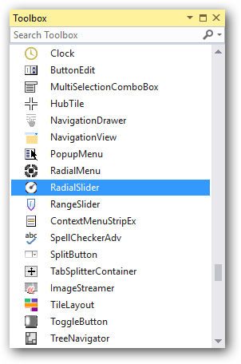
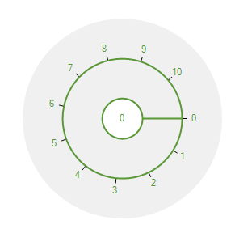
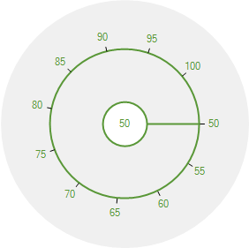

# Getting started with RadialSlider

This section briefly describes how to create a new Windows Forms project in Visual Studio and add the **RadialSlider** control with its basic functionalities.

## Assembly deployment

Refer to the [Control Dependencies](https://help.syncfusion.com/windowsforms/control-dependencies#radialslider) section to get the list of assemblies or details of NuGet package that needs to be added as reference to use the control in any application.

Refer to this [documentation](https://help.syncfusion.com/windowsforms/visual-studio-integration/nuget-packages) to find more details about installing NuGet packages in a Windows Forms application.

## Adding the RadialSlider control via designer

The following steps describe how to create an **RadialSlider** control via the designer.

1) Create a new Windows Forms application in Visual Studio.

2) Add the [RadialSlider](https://help.syncfusion.com/cr/windowsforms/Syncfusion.Tools.Windows~Syncfusion.Windows.Forms.Tools.RadialSlider.html) control to an application by dragging it from the toolbox to the design view. The following dependent assemblies will be added automatically:

* Syncfusion.Grid.Base
* Syncfusion.Grid.Windows
* Syncfusion.Shared.Base
* Syncfusion.Shared.Windows
* Syncfusion.Tools.Base
* Syncfusion.Tools.Windows

 

3) Set the desired properties for [RadialSlider](https://help.syncfusion.com/cr/windowsforms/Syncfusion.Tools.Windows~Syncfusion.Windows.Forms.Tools.RadialSlider.html) control using the **Properties** dialog.

## Adding the RadialSlider control via code

The following steps explain how to create a **RadialSlider** control programmatically:

1) Create a C# or VB application via Visual Studio.

2) Add the following assembly references to the project:

* Syncfusion.Grid.Base
* Syncfusion.Grid.Windows
* Syncfusion.Shared.Base
* Syncfusion.Shared.Windows
* Syncfusion.Tools.Base
* Syncfusion.Tools.Windows

3) Include the required namespace.





using Syncfusion.Windows.Forms.Tools;





Imports Syncfusion.Windows.Forms.Tools





4) Create an instance of the [RadialSlider](https://help.syncfusion.com/cr/windowsforms/Syncfusion.Tools.Windows~Syncfusion.Windows.Forms.Tools.RadialSlider.html) control, and then add it to the form.





RadialSlider radialSlider1 = new RadialSlider();
radialSlider1.Size = new System.Drawing.Size(282, 282);
this.Controls.Add(radialSlider1);





Dim radialSlider1 As RadialSlider = New RadialSlider
radialSlider1.Size = New System.Drawing.Size(282, 282)
Me.Controls.Add(radialSlider1)





## Values

The value of **RadialSlider** control can be restricted within the minimum and maximum limits.

* **MinimumValue** - The slider initial value depends on its minimum value, and the default minimum value is 0. The minimum value can be changed using the [MinimumValue](https://help.syncfusion.com/cr/windowsforms/Syncfusion.Tools.Windows~Syncfusion.Windows.Forms.Tools.RadialSlider~MinimumValue.html) property.

* **MaximumValue** - The slider end value depends on its maximum value, and the default maximum value is 10. The maximum value can be changed using the [MaximumValue](https://help.syncfusion.com/cr/windowsforms/Syncfusion.Tools.Windows~Syncfusion.Windows.Forms.Tools.RadialSlider~MaximumValue.html) property.

* **Value** - The `Value` property of slider is used to get the currently selected value or change it to the required value.





radialSlider1.MinimumValue = 50;
radialSlider1.MaximumValue = 100;
radialSlider1.Value = 50;





radialSlider1.MinimumValue = 50
radialSlider1.MaximumValue = 100
radialSlider1.Value = 50





## Slider Value Changed Event

You can get the current slider value using the [ValueChanged](https://help.syncfusion.com/cr/windowsforms/Syncfusion.Tools.Windows~Syncfusion.Windows.Forms.Tools.RadialSlider~ValueChanged_EV.html) event.





this.radialSlider1.ValueChanged += new Syncfusion.Windows.Forms.Tools.RadialSlider.ValueChangedEventHandler(radialSlider1_ValueChanged);

private void radialSlider1_ValueChanged(object sender, Syncfusion.Windows.Forms.Tools.RadialSlider.ValueChangedEventArgs args)
{
  this.richTextBox1.SelectionFont = new System.Drawing.Font(Font.Name, (float)this.radialSlider1.Value);
  this.Refresh();
}





AddHandler Me.radialSlider1.ValueChanged, AddressOf Me.radialSlider1_ValueChanged

Private Sub radialSlider1_ValueChanged(ByVal sender As Object, ByVal args As Syncfusion.Windows.Forms.Tools.RadialSlider.ValueChangedEventArgs)
Me.richTextBox1.SelectionFont = New System.Drawing.Font(Font.Name, CType(Me.radialSlider1.Value,Single))
Me.Refresh
End Sub





## Division

The division for the [RadialSlider](https://help.syncfusion.com/cr/windowsforms/Syncfusion.Tools.Windows~Syncfusion.Windows.Forms.Tools.RadialSlider.html) can be customized using the [SliderDivision](https://help.syncfusion.com/cr/windowsforms/Syncfusion.Tools.Windows~Syncfusion.Windows.Forms.Tools.RadialSlider~SliderDivision.html) property. The default slider division is 10.





radialSlider1.SliderDivision = 5;





Me.radialSlider1.SliderDivision = 5





## Text formatting

You can customize the text format for specific or all sliders by handling the [DrawText](https://help.syncfusion.com/cr/windowsforms/Syncfusion.Tools.Windows~Syncfusion.Windows.Forms.Tools.RadialSlider~DrawText_EV.html) event. You can change the content, foreground and font of the slider intervals, selected slider or selected value by using the [DrawTextEventArgs.Text](https://help.syncfusion.com/cr/windowsforms/Syncfusion.Tools.Windows~Syncfusion.Windows.Forms.Tools.RadialSlider+DrawTextEventArgs~Text.html), [DrawTextEventArgs.ForeColor](https://help.syncfusion.com/cr/windowsforms/Syncfusion.Tools.Windows~Syncfusion.Windows.Forms.Tools.RadialSlider+DrawTextEventArgs~ForeColor.html) and [DrawTextEventArgs.Font](https://help.syncfusion.com/cr/windowsforms/Syncfusion.Tools.Windows~Syncfusion.Windows.Forms.Tools.RadialSlider+DrawTextEventArgs~Font.html) properties. You can differentiate the slider intervals, selected slider and selected value by using the [DrawTextEventArgs.TextType](https://help.syncfusion.com/cr/windowsforms/Syncfusion.Tools.Windows~Syncfusion.Windows.Forms.Tools.RadialSlider+DrawTextEventArgs~TextType.html) enum property.




RadialSlider radialSlider = new RadialSlider();
radialSlider.DrawText += RadialSlider_DrawText;
radialSlider.MinimumValue = 0;
radialSlider.MaximumValue = 100;

private void RadialSlider_DrawText(object sender, RadialSlider.DrawTextEventArgs e) {
    int Value = int.Parse(e.Text);
    e.Text += "°C";
    if (e.TextType == TextType.Interval) {                
        if (Value <= 33) {
            e.Font = new Font("Arial", 8);
            e.ForeColor = Brushes.Green;
        }
        else if (Value > 33 && Value <= 66) {
            e.Font = new Font("Courier", 10);
            e.ForeColor = Brushes.Gold;
        }
        else {
            e.Font = new Font("Georgia", 10);
            e.ForeColor = Brushes.Red;
        }
    }
    else if(e.TextType== TextType.Pointer) {
        e.Font = new Font("Segoe UI Black", 8);
        e.ForeColor = Brushes.Blue;
    }
    else if (e.TextType == TextType.Value) {
        e.Font = new Font("MoolBoran", 12);
        e.ForeColor = Brushes.DeepPink;
    }
}




N> [View Sample in GitHub](https://github.com/SyncfusionExamples/syncfusion-winforms-radial-slider-examples/tree/master/Samples/Text_Formatting)

## Slider Style

The **RadialSlider** supports two different styles to its appearance using the [SliderStyle](https://help.syncfusion.com/cr/windowsforms/Syncfusion.Tools.Windows~Syncfusion.Windows.Forms.Tools.RadialSlider~SliderStyle.html) property.

* **Default** - Renders the slider control with two hollow circles and a small circle as center with its dividend ticks.

* **Frame** - Paints the background of the slider control with an HQ frame.





radialSlider1.SliderStyle = Syncfusion.Windows.Forms.Tools.SliderStyles.Frame;





radialSlider1.SliderStyle = Syncfusion.Windows.Forms.Tools.SliderStyles.Frame





The outside circle can be shown using the [ShowOuterCircle](https://help.syncfusion.com/cr/windowsforms/Syncfusion.Tools.Windows~Syncfusion.Windows.Forms.Tools.RadialSlider~ShowOuterCircle.html) property. The default value of this property is set to 'True'.





radialSlider1.ShowOuterCircle = true;





Me.radialSlider1.ShowOuterCircle = True





