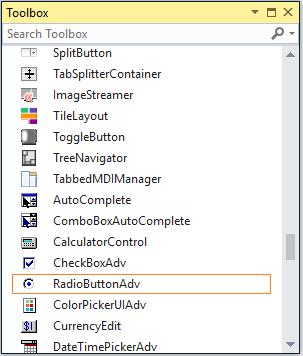

# Getting Started with Windows Forms Radio Button (RadioButtonAdv)

The section briefly describes how to create a new Windows Forms project in Visual Studio and add **"RadioButtonAdv"** with it's functionalities.

## Assembly deployment

Refer to the [control dependencies](https://help.syncfusion.com/windowsforms/control-dependencies#radiobuttonadv) section to get the list of assemblies or NuGet package details which needs to be added as reference to use the control in any application.

[Check here](https://help.syncfusion.com/windowsforms/installation/install-nuget-packages) to find more details on how to install nuget packages in Windows Forms application.

## Adding a RadioButtonAdv control through designer

The **"RadioButtonAdv"** control can be added through designer by following steps.

**"Step 1"**: Create a new Windows Forms application in Visual Studio.

**Step 2**: The **"RadioButtonAdv"** control can be added to an application by dragging it from the toolbox to design view. The following dependent assemblies will be added automatically.

* Syncfusion.Grid.Base
* Syncfusion.Grid.Windows
* Syncfusion.Shared.Base
* Syncfusion.Shared.Windows
* Syncfusion.Tools.Base
* Syncfusion.Tools.Windows

**Step 2**: Set the desired properties for **"RadioButtonAdv"** control through the **"Properties"** dialog.

## Adding a RadioButtonAdv control through code

The RadioButtonAdv control can be created programmatically as detailed below:

**Step 1**: Create a C# or VB application though Visual Studio.

**Step 2**: Add the following assembly reference to the project.

* Syncfusion.Grid.Base
* Syncfusion.Grid.Windows
* Syncfusion.Shared.Base
* Syncfusion.Shared.Windows
* Syncfusion.Tools.Base
* Syncfusion.Tools.Windows

**Step 3**: Include the required namespace.




using Syncfusion.Windows.Forms.Tools;





Imports Syncfusion.Windows.Forms.Tools




**Step 4**: Create an instance of **"RadioButtonAdv"** control.




private Syncfusion.Windows.Forms.Tools.RadioButtonAdv radioButtonAdv1;
this.radioButtonAdv1 = new Syncfusion.Windows.Forms.Tools.RadioButtonAdv();





Private radioButtonAdv1 As Syncfusion.Windows.Forms.Tools.RadioButtonAdv
Me.radioButtonAdv1 = New Syncfusion.Windows.Forms.Tools.RadioButtonAdv()




**Step 5**: Set the following properties for **"RadioButtonAdv"** control through by code.




this.radioButtonAdv1.Text = "radioButtonAdv1";
this.radioButtonAdv1.Font = new System.Drawing.Font("Microsoft Sans Serif", 8.25F, System.Drawing.FontStyle.Bold, System.Drawing.GraphicsUnit.Point, ((byte)(0)));
this.radioButtonAdv1.ForeColor = System.Drawing.Color.MistyRose;
this.radioButtonAdv1.BackColor = System.Drawing.Color.RosyBrown;

// Add the RadioButtonAdv control to the Form.
this.Controls.Add(this.radioButtonAdv1);





Me.radioButtonAdv1.Text = "radioButtonAdv1"
Me.radioButtonAdv1.Font = New System.Drawing.Font("Microsoft Sans Serif", 8.25F, System.Drawing.FontStyle.Bold, System.Drawing.GraphicsUnit.Point, CByte((0)))
Me.radioButtonAdv1.ForeColor = System.Drawing.Color.MistyRose
Me.radioButtonAdv1.BackColor = System.Drawing.Color.RosyBrown

// Add the RadioButtonAdv control to the Form.
Me.Controls.Add(Me.radioButtonAdv1)




