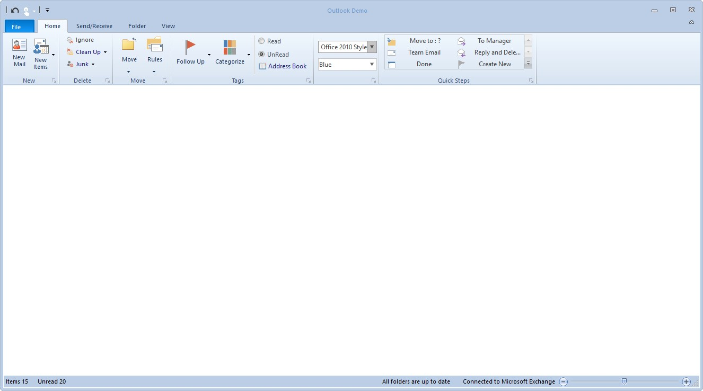
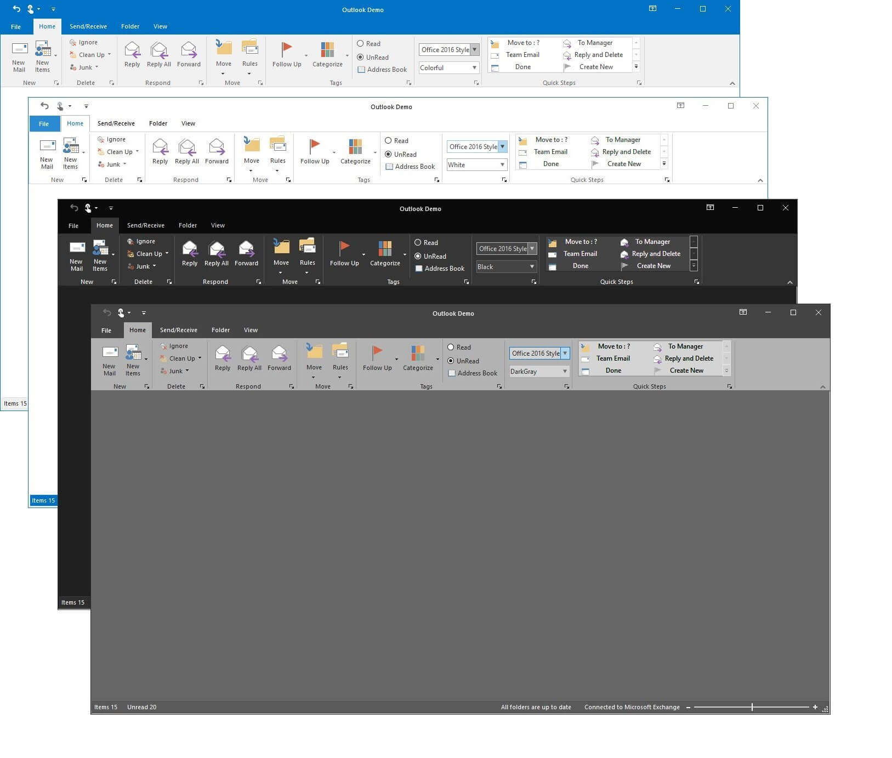
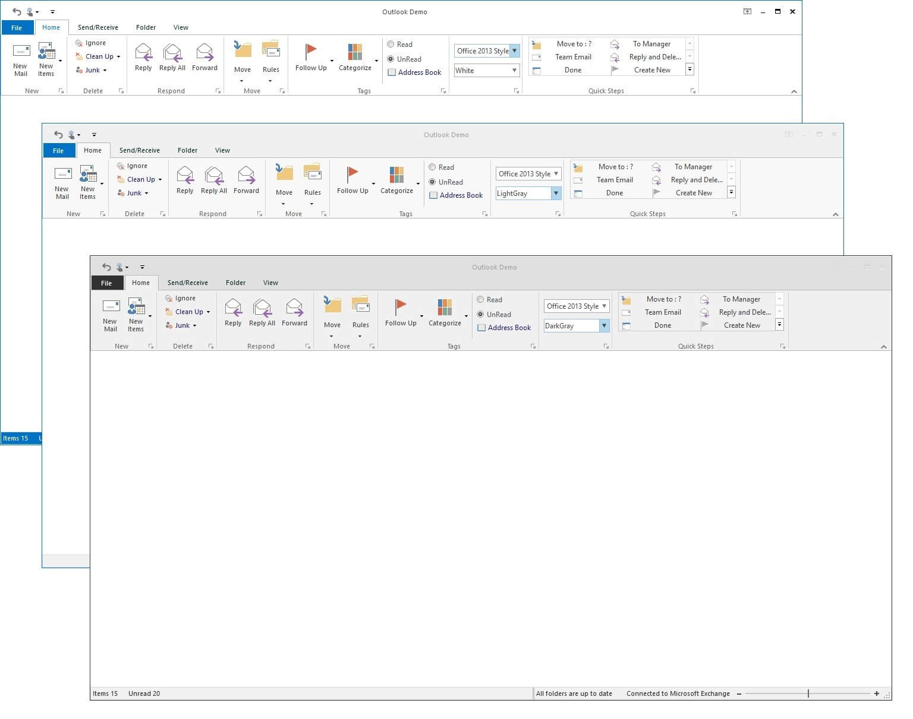
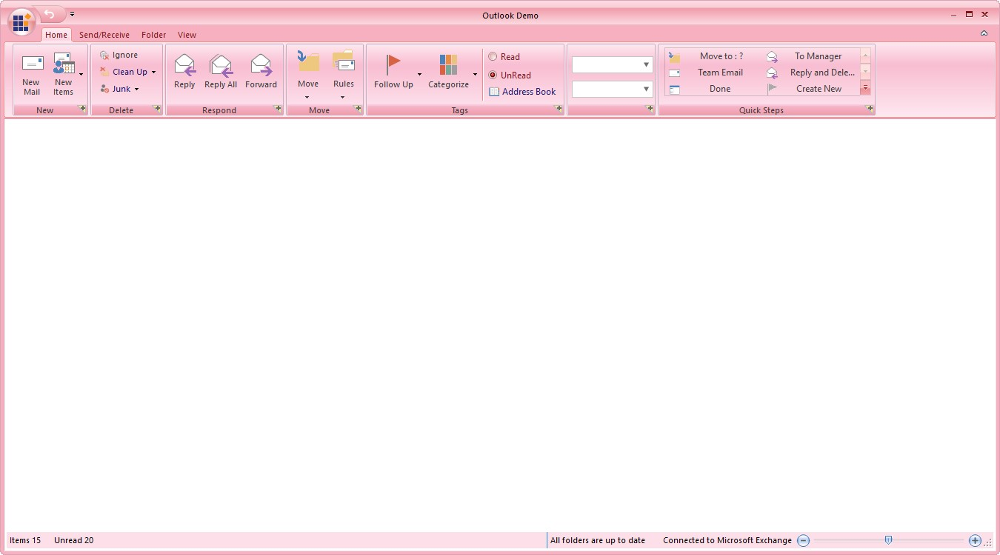
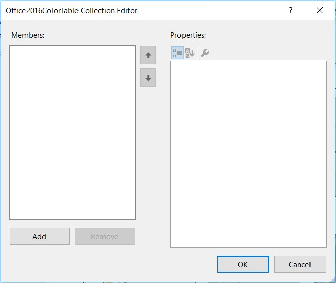
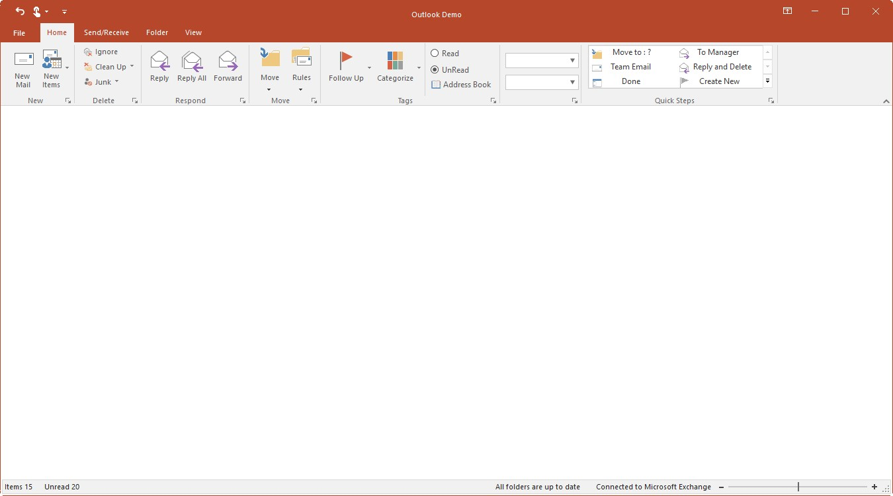
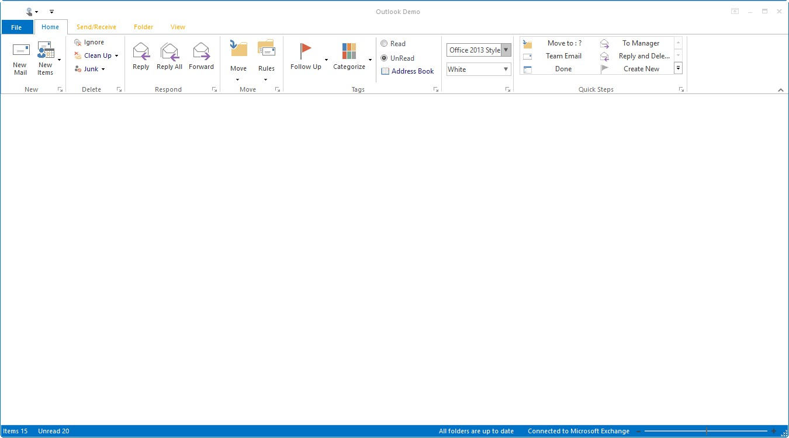
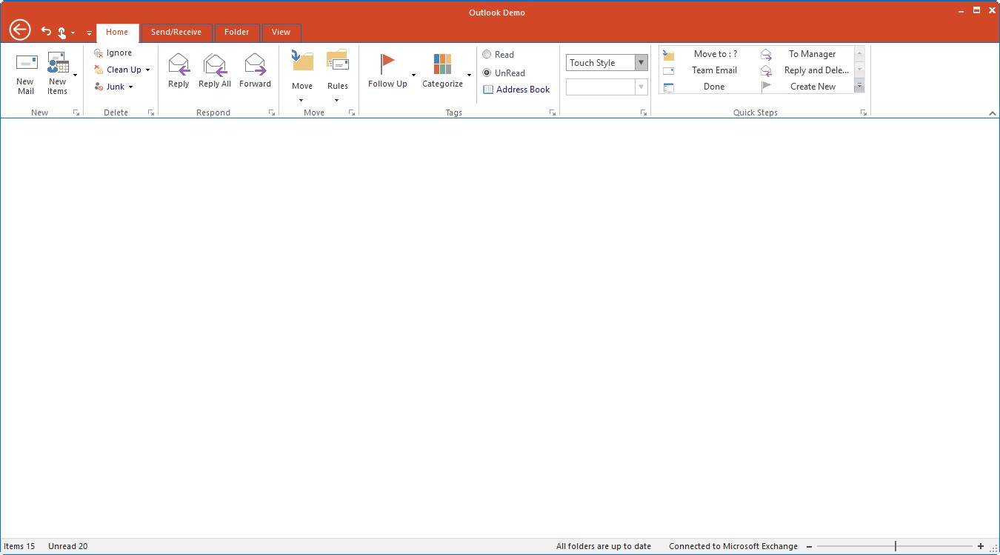

# Appearance in Windows Forms Ribbon (RibbonControlAdv)

The Ribbon control ships with several built-in themes such as Office2007, Office2010, Office2013, TouchStyle and Office2016.
All these themes can be applied with the ribbon property `RibbonStyle`.

## Apply Visual styles

Visual styles can be applied by using the ribbon property `RibbonStyle`

The following code example illustrates how to set style for the RibbonControlAdv.





this.ribbonControlAdv1.RibbonStyle = RibbonStyle.Office2016;





Me.ribbonControlAdv1.RibbonStyle = RibbonStyle.Office2016





*	Office 2016 Style

*	Touch Style

*	Office 2013 Style

*	Office 2010 Style

*	Office 2007 Style

## Style through SkinManager

Essential Tools for Windows Forms provides support to apply Office2007 Style for an application with its child controls. This feature enables you to easily apply uniform style for all the child controls in the application.

To apply Visual style through skin manager, follow the steps below

*	Drag the Skin Manager from the Toolbox tab to the designer.
*	Open the property grid and click the `Controls` property and select ribbon control as parent control.
*	set the visual style using `VisualTheme` property.

**Through code**

You can add Skin Manager to one of the controls in your form or to the entire ribbon control as needed by specifying the root control. 





SkinManager.SetVisualStyle(this.ribbonControlAdv1, VisualTheme.Office2007Blue);





SkinManager.SetVisualStyle(Me.ribbonControlAdv1, VisualTheme.Office2007Blue)





## Apply Color Scheme

**Office 2016 Color Scheme**

The RibbonControlAdv includes new color schemes as available in the Office 2016 suite to provide a more personalized experience with the RibbonControlAdv.

 RibbonControlAdv now supports four themes:

*	Colorful
*	White
*	DarkGray
*	Black

The following code sample illustrates how to set the Colorful theme for the Office 2016 style RibbonControlAdv.





this.ribbonControlAdv1.Office2016ColorScheme = Office2016ColorScheme.Colorful;





Me.ribbonControlAdv1.Office2016ColorScheme = Office2016ColorScheme.Colorful





**Office 2013 Color Scheme**

The RibbonControlAdv includes new color schemes as available in the Office 2013 suite to provide a more personalized experience with the RibbonControlAdv.

Office 2013 theme now supports three color schemes:

*	White
*	LightGray
*	DarkGray
*	Managed

The following code sample illustrates how to set the scheme for the Office 2013 style RibbonControlAdv.





this.ribbonControlAdv1.Office2013ColorScheme = Office2013ColorScheme.DarkGray;





Me.ribbonControlAdv1.Office2013ColorScheme = Office2013ColorScheme.DarkGray





**Office Color Scheme**

The Ribbon Control Adv has come up with the same visual style of Office 2007. The users can choose between three colors

*	Blue
*	Silver
*	Black
*	Default
*	Managed

It can be set through the `OfficeColorScheme` property of the RibbonControlAdv class.





this.ribbonControlAdv1.OfficeColorScheme = ToolStripEx.ColorScheme.Blue;





Me.ribbonControlAdv1.OfficeColorScheme = ToolStripEx.ColorScheme.Blue





**Custom Color Scheme**

To set custom color scheme, set the color scheme as Managed. Then set the desired color using the `Syncfusion.Windows.Forms.Tools.Office12ColorTable.ApplyManagedColors` method.





this.ColorScheme = ColorSchemeType.Managed;

this.ribbonControlAdv1.OfficeColorScheme = ToolStripEx.ColorScheme.Managed;

Office12ColorTable.ApplyManagedColors(this, Color.Red);





Me.ColorScheme = ColorSchemeType.Managed

Me.ribbonControlAdv1.OfficeColorScheme = ToolStripEx.ColorScheme.Managed

Office12ColorTable.ApplyManagedColors(Me, Color.Red)





## Color Table

RibbonControlAdv can now be fully customized by using the Color table in Office 2016, Office 2013 and Touch style.

**Office2016 Style Color Table**

RibbonControlAdv can now be fully customized in Office2016 style under Colorful theme. This can be achieved by using Office2016ColorTable property.

In the property window of the Ribbon, click the Office2016ColorTable property. The following window will be shown

Click Add button to customize the RibbonControlAdv with the Office2016ColorTable property.

To achieve the above customization through code behind





//Creating instance of color table
Office2016ColorTable color = new Office2016ColorTable();

//Ribbon Background Color Customization

//To set the Header color
color.HeaderColor = ColorTranslator.FromHtml("#b7472a");

// To set the TabItem Back Color
color.TabBackColor = ColorTranslator.FromHtml("#b7472a");

//To set the Title fore color
color.TitleColor = Color.White;

//Backstage customization

//To set the BackStageButton Hover color
color.BackStageItemHoverColor = ColorTranslator.FromHtml("#19478a");

// To set the BackStageButton SelectionColor
color.BackStageItemSelectionColor = Color.FromArgb(62, 109, 181);

// To set the BackStageButton ForeColor
color.BackStageItemForeColor = Color.White;

// To set the hover fore color for BackStage items.
color.BackStageItemHoverForeColor = Color.White;

// To set the selection fore color for BackStage items.
color.BackStageItemSelectionForeColor = Color.White;

// To set the Backstage title fore color
color.BackStageTitleColor = ColorTranslator.FromHtml("#3a3a3a");

// To set the BackStage SystemButton Background
color.BackStageSystemButtonBackground = ColorTranslator.FromHtml("#c5c5c5");

// To set the Backstage caption color
color.BackStageCaptionColor = ColorTranslator.FromHtml("#f1f1f1");

// Gallery Item Customization

//To set the GalleryItem TextColor
color.GalleryItemNormalTextColor = ColorTranslator.FromHtml("#7f7f7f");

//To set the GalleryItem Hover TextColor
color.GalleryItemHoveredTextColor = ColorTranslator.FromHtml("#2b2b2b");

//To set the Gallery item back color
color.GalleryItemNormalColor = ColorTranslator.FromHtml("#ffffff");

// To set the Gallery item checked color
color.GalleryItemCheckedColor = ColorTranslator.FromHtml("#afafaf");

// To set the Gallery item hover color
color.GalleryItemSelectedColor = ColorTranslator.FromHtml("#afafaf");

// ToolstripTabItem customization

//To set the Selected TabColor
// color.SelectedTabColor = ColorTranslator.FromHtml("#2a8ad4");
color.SelectedTabColor = ColorTranslator.FromHtml("#b7472a");

//To set the Hover Tab Fore Color
color.HoverTabForeColor = Color.White;

//To set the Checked Tab Color
color.CheckedTabColor = ColorTranslator.FromHtml("#f1f1f1");

//To set the Checked Tab Fore Color
color.CheckedTabForeColor = ColorTranslator.FromHtml("#b7472a");

// To set the TabItem fore color
color.TabForeColor = Color.White;

// ToolstripEx customization

// To set the Toolstrip back color
color.ToolStripBackColor = ColorTranslator.FromHtml("#f1f1f1");

// To set the ToolStrip caption back color
color.CaptionBackColor = ColorTranslator.FromHtml("#f1f1f1");

// To set the ToolStrip text color
color.CaptionForeColor = ColorTranslator.FromHtml("#666666");

// To set the ToolStripSplitter color
color.ToolStripSpliterColor = ColorTranslator.FromHtml("#d2d2d2");

//ToolStripItem customization

// To set the ToolStripItem fore color
color.ToolStripItemForeColor = ColorTranslator.FromHtml("#575757");

// To set the ToolstripButton pressed back color
color.ButtonBackgroundPressed = ColorTranslator.FromHtml("#969696");

// To set the ToolstripButton selected back color
color.ButtonBackgroundSelected = ColorTranslator.FromHtml("#c5c5c5");

// To set the selected SplitButton Background color
color.SplitButtonBackgroundSelected = ColorTranslator.FromHtml("#c5c5c5");

//Launcher customization

//To set the Launcher back color
color.LauncherColorNormal = ColorTranslator.FromHtml("#7e7e7e");

// To set the selected Launcher color
color.LauncherColorSelected = ColorTranslator.FromHtml("#505050");

// To set the Selected Launcher back color
color.LauncherBackColorSelected = ColorTranslator.FromHtml("#c5c5c5");

//RibbonPanel customization

// To set the RibbonPanel back color
color.PanelBackColor = ColorTranslator.FromHtml("#f1f1f1");

// To set the Ribbon panel border color
color.RibbonPanelBorderColor = ColorTranslator.FromHtml("#d2d2d2");

// To set the Ribbon minimize button back color
color.UpDownButtonBackColor = ColorTranslator.FromHtml("#c5c5c5");

//Context Menu customization

// To set the Context menu back color
color.ContextMenuBackColor = Color.White;

// To set the ContextMenu Title Back color
color.ContextMenuTitleBackground = Color.FromArgb(30, Color.LightGray);

// To set the ContextMenu Item selected back color
color.ContextMenuItemSelected = ColorTranslator.FromHtml("#c5c5c5");

// Quick DropDown button customization

// To set the Quick Access Button back color
color.QuickDropDownBackColor = ColorTranslator.FromHtml("#ffffff");

// To set the Quick Access Button hover back color
color.QuickDropDownSelectedcolor = ColorTranslator.FromHtml("#2a8dd4");

// To set the Quick Access Button pressed back color
color.QuickDropDownPressedcolor = ColorTranslator.FromHtml("#0067b0");

//System Button customization

// To set the System button back color
color.SystemButtonBackground = ColorTranslator.FromHtml("#2a8ad4");

// To set the Close Button back color
color.CloseButtonBackground = ColorTranslator.FromHtml("#e81123");

// To set the combobox dropdown color
color.DropDownBackColor = ColorTranslator.FromHtml("#ffffff");

//TabGroup Customization

// To set the TabGroup back color
color.TabGroupBackColor = Color.FromArgb(1, 70, 122);

// To set the TabGroup fore color
color.TabGroupForeColor = Color.FromArgb(165, 185, 210);

// Adds the color table instance to the ColorTable

this.ribbonControlAdv1.Office2016ColorTable.Add(color);





 Dim color As Office2016ColorTable = New Office2016ColorTable()

    color.HeaderColor = ColorTranslator.FromHtml("#b7472a")

    color.TabBackColor = ColorTranslator.FromHtml("#b7472a")

    color.TitleColor = Color.White

    color.BackStageItemHoverColor = ColorTranslator.FromHtml("#19478a")

    color.BackStageItemSelectionColor = Color.FromArgb(62, 109, 181)

    color.BackStageItemForeColor = Color.White

    color.BackStageItemHoverForeColor = Color.White

    color.BackStageItemSelectionForeColor = Color.White

    color.BackStageTitleColor = ColorTranslator.FromHtml("#3a3a3a")

    color.BackStageSystemButtonBackground = ColorTranslator.FromHtml("#c5c5c5")

    color.BackStageCaptionColor = ColorTranslator.FromHtml("#f1f1f1")

    color.GalleryItemNormalTextColor = ColorTranslator.FromHtml("#7f7f7f")

    color.GalleryItemHoveredTextColor = ColorTranslator.FromHtml("#2b2b2b")

    color.GalleryItemNormalColor = ColorTranslator.FromHtml("#ffffff")

    color.GalleryItemCheckedColor = ColorTranslator.FromHtml("#afafaf")

    color.GalleryItemSelectedColor = ColorTranslator.FromHtml("#afafaf")

    color.SelectedTabColor = ColorTranslator.FromHtml("#b7472a")

    color.HoverTabForeColor = Color.White

    color.CheckedTabColor = ColorTranslator.FromHtml("#f1f1f1")

    color.CheckedTabForeColor = ColorTranslator.FromHtml("#b7472a")

    color.TabForeColor = Color.White

    color.ToolStripBackColor = ColorTranslator.FromHtml("#f1f1f1")

    color.CaptionBackColor = ColorTranslator.FromHtml("#f1f1f1")

    color.CaptionForeColor = ColorTranslator.FromHtml("#666666")

    color.ToolStripSpliterColor = ColorTranslator.FromHtml("#d2d2d2")

    color.ToolStripItemForeColor = ColorTranslator.FromHtml("#575757")

    color.ButtonBackgroundPressed = ColorTranslator.FromHtml("#969696")

    color.ButtonBackgroundSelected = ColorTranslator.FromHtml("#c5c5c5")

    color.SplitButtonBackgroundSelected = ColorTranslator.FromHtml("#c5c5c5")

    color.LauncherColorNormal = ColorTranslator.FromHtml("#7e7e7e")

    color.LauncherColorSelected = ColorTranslator.FromHtml("#505050")

    color.LauncherBackColorSelected = ColorTranslator.FromHtml("#c5c5c5")

    color.PanelBackColor = ColorTranslator.FromHtml("#f1f1f1")

    color.RibbonPanelBorderColor = ColorTranslator.FromHtml("#d2d2d2")

    color.UpDownButtonBackColor = ColorTranslator.FromHtml("#c5c5c5")

    color.ContextMenuBackColor = Color.White

    color.ContextMenuTitleBackground = Color.FromArgb(30, Color.LightGray)

    color.ContextMenuItemSelected = ColorTranslator.FromHtml("#c5c5c5")

    color.QuickDropDownBackColor = ColorTranslator.FromHtml("#ffffff")

    color.QuickDropDownSelectedcolor = ColorTranslator.FromHtml("#2a8dd4")

    color.QuickDropDownPressedcolor = ColorTranslator.FromHtml("#0067b0")

    color.SystemButtonBackground = ColorTranslator.FromHtml("#2a8ad4")

    color.CloseButtonBackground = ColorTranslator.FromHtml("#e81123")

    color.DropDownBackColor = ColorTranslator.FromHtml("#ffffff")

    color.TabGroupBackColor = Color.FromArgb(1, 70, 122)

    color.TabGroupForeColor = Color.FromArgb(165, 185, 210)

    Me.ribbonControlAdv1.Office2016ColorTable.Add(color)





**Offcie2013 Style Color Table**

RibbonControlAdv can now be fully customized in Office 2013 style. This can be achieved by using Office2013ColorTable property.





//Creates an instance for the Office 2013 color table

Office2013ColorTable color = new Office2013ColorTable();

//To set backstage caption color
color.BackStageCaptionColor = Color.LightBlue;

//To set button background when pressed
color.ButtonBackgroundPressed = Color.White;

//To set button background when selected
color.ButtonBackgroundSelected = Color.White;

//To set caption background color
color.CaptionBackColor = Color.Orange;

//To set caption fore color
color.CaptionForeColor = Color.White;

//To set checked tab color
color.CheckedTabColor = Color.LightBlue;

//To set checked tab text color
color.CheckedTabForeColor = Color.White;

//To set close button color
color.CloseButtonColor = Color.Red;

//To set context menu back color
color.ContextMenuBackColor = Color.LightBlue;

//To set context menu item color when selected
color.ContextMenuItemSelected = Color.Black;

//To set header color
color.HeaderColor = Color.White;

//To set tab hover text color
color.HoverTabForeColor = Color.White;

//To set launcher back color when selected
color.LauncherBackColorSelected = Color.White;

//To set launcher normal color
color.LauncherColorNormal = Color.White;

//To set launcher selected color
color.LauncherColorSelected = Color.LightBlue;

//To set maximize button color
color.MaximizeButtonColor = Color.Gray;

//To set minimize button color
color.MinimizeButtonColor = Color.Gray;

//To set panel back color
color.PanelBackColor = Color.White;

//To set restore button color
color.RestoreButtonColor = Color.Gray;

//To set ribbon panel border color
color.RibbonPanelBorderColor = Color.Black;

//To set selected tab border color
color.SelectedTabBorderColor = Color.LightBlue;

//To set selected tab color
color.SelectedTabColor = Color.Blue;

//To set split button background color when pressed
color.SplitButtonBackgroundPressed = Color.LightBlue;

//To set split button background color when selected
color.SplitButtonBackgroundSelected = Color.LightBlue;

//To set system button background color
color.SystemButtonBackground = Color.Gray;

//To set tab back color
color.TabBackColor = Color.LightBlue;

//To set tab text color
color.TabForeColor = Color.White;

//To set title color
color.TitleColor = Color.LightBlue;

//To set tool strip back color
color.ToolStripBackColor = Color.LightBlue;

//To set tool strip border color
color.ToolStripBorderColor = Color.Black;

//To set toolstrip item text color
color.ToolStripItemForeColor = Color.White;

//To set toolstrip splitter color
color.ToolStripSpliterColor = Color.White;

//To set updown button back color
color.UpDownButtonBackColor = Color.White;

this.ribbonControlAdv1.Office2013ColorTable = color;





Dim color As Office2013ColorTable = New Office2013ColorTable()

    color.BackStageCaptionColor = Color.LightBlue

    color.ButtonBackgroundPressed = Color.White

    color.ButtonBackgroundSelected = Color.White

    color.CaptionBackColor = Color.Orange

    color.CaptionForeColor = Color.White

    color.CheckedTabColor = Color.LightBlue

    color.CheckedTabForeColor = Color.White

    color.CloseButtonColor = Color.Red

    color.ContextMenuBackColor = Color.LightBlue

    color.ContextMenuItemSelected = Color.Black

    color.HeaderColor = Color.White

    color.HoverTabForeColor = Color.White

    color.LauncherBackColorSelected = Color.White

    color.LauncherColorNormal = Color.White

    color.LauncherColorSelected = Color.LightBlue

    color.MaximizeButtonColor = Color.Gray

    color.MinimizeButtonColor = Color.Gray

    color.PanelBackColor = Color.White

    color.RestoreButtonColor = Color.Gray

    color.RibbonPanelBorderColor = Color.Black

    color.SelectedTabBorderColor = Color.LightBlue

    color.SelectedTabColor = Color.Blue

    color.SplitButtonBackgroundPressed = Color.LightBlue

    color.SplitButtonBackgroundSelected = Color.LightBlue

    color.SystemButtonBackground = Color.Gray

    color.TabBackColor = Color.LightBlue

    color.TabForeColor = Color.White

    color.TitleColor = Color.LightBlue

    color.ToolStripBackColor = Color.LightBlue

    color.ToolStripBorderColor = Color.Black

    color.ToolStripItemForeColor = Color.White

    color.ToolStripSpliterColor = Color.White

    color.UpDownButtonBackColor = Color.White

    Me.ribbonControlAdv1.Office2013ColorTable = color





**Touch Style Color Table**

RibbonControlAdv can now be fully customized in TouchStyle. This can be achieved by using TouchStyle ColorTable.

The following code demonstrate how to use the TouchStyleColorTable.





//Creates an instance for the TouchStyleColorTable

TouchStyleColorTable _touchColorTable = new TouchStyleColorTable();

//To set fore color of the Active tab item

_touchColorTable.ToolstripActiveTabItemForeColor = Color.RoyalBlue;
//To set fore color of the Inactive tab item

_touchColorTable.ToolstripTabItemForeColor = Color.White;
//To set the Button hover color

_touchColorTable.ButtonHoverColor = ColorTranslator.FromHtml("#cde6f7");
//To set the border color

_touchColorTable.ToolStripBorderColor = Color.Blue;

//To set the Menu button arrow color

_touchColorTable.MenuButtonArrowColor = Color.White;

//To set the Menu button hover in RibbonControlAdv

_touchColorTable.MenuButtonHoverArrowColor = Color.Pink;

//To set the header color of the RibbonControlAdv

_touchColorTable.HeaderColor = Color.DarkViolet;

//To set the body color of the dropdown items

_touchColorTable.DropDownBodyColor = Color.White;

//To set the fore color of the dropdown items

_touchColorTable.DropDownTextForeColor = Color.Black;

//To set the back color of the dropdown items

_touchColorTable.DropDownMenuItemBackground = ColorTranslator.FromHtml("#0272c5");

//To set the body color of the selected dropdown items

_touchColorTable.DropDownSelectedTextForeColor = Color.White;

//To set the border color of the ToolStripTabItem.

_touchColorTable.ToolstripTabItemBorder = ColorTranslator.FromHtml("#0272c5");

//To set the back color of active ToolStripTabItem

_touchColorTable.ActiveToolStripTabItemBackColor = ColorTranslator.FromHtml("#0272c5");

//To sets the back color of active ToolStripTabItem

_touchColorTable.BackStageButtonColor = ColorTranslator.FromHtml("#0272c5");

//To sets the Color of the BackStageButton for Hovering.

_touchColorTable.BackStageButtonHoverColor = Color.AliceBlue;

//To sets the Caption color for the Backstage.

_touchColorTable.BackStageCaptionColor = Color.BlanchedAlmond;

//To sets the color of the CloseButton in BackStageVisibleMode.

_touchColorTable.BackStageCloseButtonBackground = Color.BlueViolet;

//To sets the BackColor of the MenuButton.

_touchColorTable.BackStageNavigationButtonBackColor = ColorTranslator.FromHtml("#0272c5");

//To sets the ForeColor of the MenuButton.

_touchColorTable.BackStageNavigationButtonForeColor = Color.White;

//To sets the color for BackStageTab.

_touchColorTable.BackStageTabColor = ColorTranslator.FromHtml("#0272c5");

//To sets the Color of the BackStageTab for Hovering.

_touchColorTable.BackStageTabHoverColor = Color.BlanchedAlmond;

//To sets the color for ToolStripBorder.

_touchColorTable.BottomToolStripBackColor = ColorTranslator.FromHtml("#0272c5");

//To sets the color of the button for checked state.

_touchColorTable.ButtonCheckedColor = Color.Blue;

//To sets the color of the Button for pressed state.

_touchColorTable.ButtonPressedColor = Color.BlueViolet;

//To sets the color of the close button.

_touchColorTable.CloseButtonBackground = Color.CadetBlue;

//To sets the color of the Close Button in pressed state.

_touchColorTable.CloseButtonPressed = Color.Red;

//To sets the color for the DropDown Text.

_touchColorTable.DropDownTextForeColor = Color.Black;

//To sets the color for the DropDown Title.

_touchColorTable.DropDownTitleBackground = Color.WhiteSmoke;

//To sets the color for RibbonHeader.

_touchColorTable.HeaderColor = ColorTranslator.FromHtml("#0272c5");

//To set the value of the BackColor of the tab when the mouse is hover on it.

_touchColorTable.HoverTabBackColor = Color.Violet;

//To set the value of the ForeColor of the tab when the mouse is hover on it.

_touchColorTable.HoverTabBackColor = Color.Wheat;

//To sets the color for Image Margin.

_touchColorTable.ImageMargin = Color.Yellow;

//To sets the color for when mouse hovers MenuButtonArrow.

_touchColorTable.MenuButtonHoverArrowColor = ColorTranslator.FromHtml("#0272c5");

//To sets the color for OverFlowArrow.

_touchColorTable.OverFlowArrowColor = Color.Navy;

//To sets the color of the QATButton for hover state.

_touchColorTable.QATButtonHoverColor = Color.MediumAquamarine;

//To sets the color for QATDown Arrow.

_touchColorTable.QATDownArrowColor = Color.LimeGreen;

//To sets the back color of active RibbonPanel

_touchColorTable.RibbonPanelBackColor = ColorTranslator.FromHtml("#0272c5");

//To sets the color of the SplitButton for Pressed state.

_touchColorTable.SplitButtonPressed = ColorTranslator.FromHtml("#0272c5");

//To sets the color of the SplitButton for selected state.

_touchColorTable.SplitButtonSelected = Color.LightYellow;

//To sets the color for SystemButtonBackground.

_touchColorTable.SystemButtonBackground = ColorTranslator.FromHtml("#0272c5");

//To sets the color of the SystemButton in pressed state.

_touchColorTable.SystemButtonPressed = ColorTranslator.FromHtml("#0272c5");

//To sets the color for TabScrollArrow.

_touchColorTable.TabScrollArrowColor = ColorTranslator.FromHtml("#0272c5");

//To sets the color of the DropDown Arrow.

_touchColorTable.ToolStripArrowColor = Color.Red;

//To sets the color for ToolStripBorder.

_touchColorTable.ToolStripBorderColor = ColorTranslator.FromHtml("#0272c5");

//To sets the color for Button Border.

_touchColorTable.ToolstripButtonPressedBorder = ColorTranslator.FromHtml("#0272c5");

//To sets the color of the selectedTabBorder.

_touchColorTable.ToolstripSelectedTabItemBorder = Color.DodgerBlue;

//To sets the color for Splitter.

_touchColorTable.ToolStripSpliterColor = Color.Red;

//To sets the color of the TabForeColor.

_touchColorTable.ToolstripTabItemForeColor = Color.White;

// To set the hover fore color for BackStage items.

_touchColorTable.BackStageItemHoverForeColor = Color.White;

// To set the selection fore color for BackStage items.

_touchColorTable.BackStageItemSelectionForeColor = Color.White;

//To apply TouchStyleColorTable for RibbonControlAdv

this.ribbonControlAdv1.ApplyTouchStyleColorTable(_touchColorTable);





 Dim _touchColorTable As TouchStyleColorTable = New TouchStyleColorTable()

    _touchColorTable.ToolstripActiveTabItemForeColor = Color.RoyalBlue

    _touchColorTable.ToolstripTabItemForeColor = Color.White

    _touchColorTable.ButtonHoverColor = ColorTranslator.FromHtml("#cde6f7")

    _touchColorTable.ToolStripBorderColor = Color.Blue

    _touchColorTable.MenuButtonArrowColor = Color.White

    _touchColorTable.MenuButtonHoverArrowColor = Color.Pink

    _touchColorTable.HeaderColor = Color.DarkViolet

    _touchColorTable.DropDownBodyColor = Color.White

    _touchColorTable.DropDownTextForeColor = Color.Black

    _touchColorTable.DropDownMenuItemBackground = ColorTranslator.FromHtml("#0272c5")

    _touchColorTable.DropDownSelectedTextForeColor = Color.White

    _touchColorTable.ToolstripTabItemBorder = ColorTranslator.FromHtml("#0272c5")

    _touchColorTable.ActiveToolStripTabItemBackColor = ColorTranslator.FromHtml("#0272c5")

    _touchColorTable.BackStageButtonColor = ColorTranslator.FromHtml("#0272c5")

    _touchColorTable.BackStageButtonHoverColor = Color.AliceBlue

    _touchColorTable.BackStageCaptionColor = Color.BlanchedAlmond

    _touchColorTable.BackStageCloseButtonBackground = Color.BlueViolet

    _touchColorTable.BackStageNavigationButtonBackColor = ColorTranslator.FromHtml("#0272c5")

    _touchColorTable.BackStageNavigationButtonForeColor = Color.White

    _touchColorTable.BackStageTabColor = ColorTranslator.FromHtml("#0272c5")

    _touchColorTable.BackStageTabHoverColor = Color.BlanchedAlmond

    _touchColorTable.BottomToolStripBackColor = ColorTranslator.FromHtml("#0272c5")

    _touchColorTable.ButtonCheckedColor = Color.Blue

    _touchColorTable.ButtonPressedColor = Color.BlueViolet

    _touchColorTable.CloseButtonBackground = Color.CadetBlue

    _touchColorTable.CloseButtonPressed = Color.Red

    _touchColorTable.DropDownTextForeColor = Color.Black

    _touchColorTable.DropDownTitleBackground = Color.WhiteSmoke

    _touchColorTable.HeaderColor = ColorTranslator.FromHtml("#0272c5")

    _touchColorTable.HoverTabBackColor = Color.Violet

    _touchColorTable.HoverTabBackColor = Color.Wheat

    _touchColorTable.ImageMargin = Color.Yellow

    _touchColorTable.MenuButtonHoverArrowColor = ColorTranslator.FromHtml("#0272c5")

    _touchColorTable.OverFlowArrowColor = Color.Navy

    _touchColorTable.QATButtonHoverColor = Color.MediumAquamarine

    _touchColorTable.QATDownArrowColor = Color.LimeGreen

    _touchColorTable.RibbonPanelBackColor = ColorTranslator.FromHtml("#0272c5")

    _touchColorTable.SplitButtonPressed = ColorTranslator.FromHtml("#0272c5")

    _touchColorTable.SplitButtonSelected = Color.LightYellow

    _touchColorTable.SystemButtonBackground = ColorTranslator.FromHtml("#0272c5")

    _touchColorTable.SystemButtonPressed = ColorTranslator.FromHtml("#0272c5")

    _touchColorTable.TabScrollArrowColor = ColorTranslator.FromHtml("#0272c5")

    _touchColorTable.ToolStripArrowColor = Color.Red

    _touchColorTable.ToolStripBorderColor = ColorTranslator.FromHtml("#0272c5")

    _touchColorTable.ToolstripButtonPressedBorder = ColorTranslator.FromHtml("#0272c5")

    _touchColorTable.ToolstripSelectedTabItemBorder = Color.DodgerBlue

    _touchColorTable.ToolStripSpliterColor = Color.Red

    _touchColorTable.ToolstripTabItemForeColor = Color.White

    // To set the hover fore color for BackStage items.

    _touchColorTable.BackStageItemHoverForeColor = Color.White

    // To set the selection fore color for BackStage items.

    _touchColorTable.BackStageItemSelectionForeColor = Color.White

    Me.ribbonControlAdv1.ApplyTouchStyleColorTable(_touchColorTable)





## EnableHighContrastTheme

`EnableHighContrastTheme` property used to specify whether to use default high contrast theme color in RibbonControlAdv. By default, EnableHighContrastTheme property is set to True.





// to avoid the default high contrast theme color
this.ribbonControlAdv1.EnableHighContrastTheme = false; 





' to avoid the default high contrast theme color
Me.ribbonControlAdv1.EnableHighContrastTheme = false




