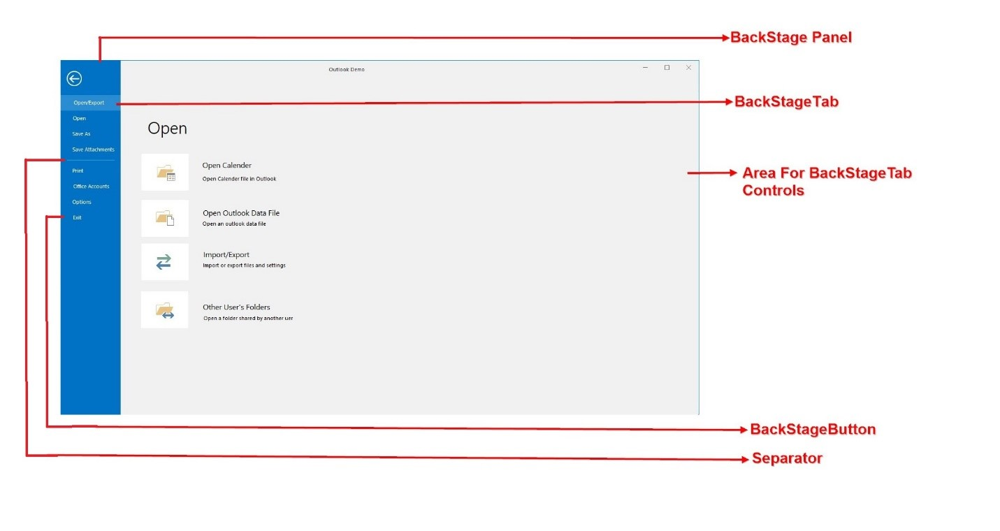
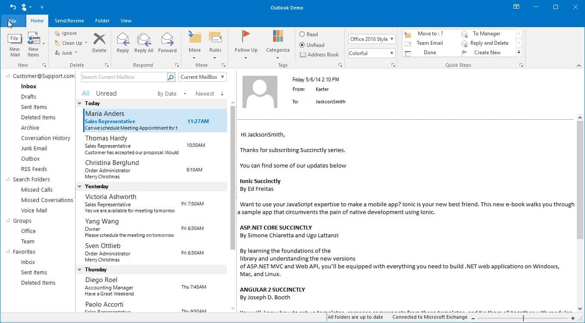
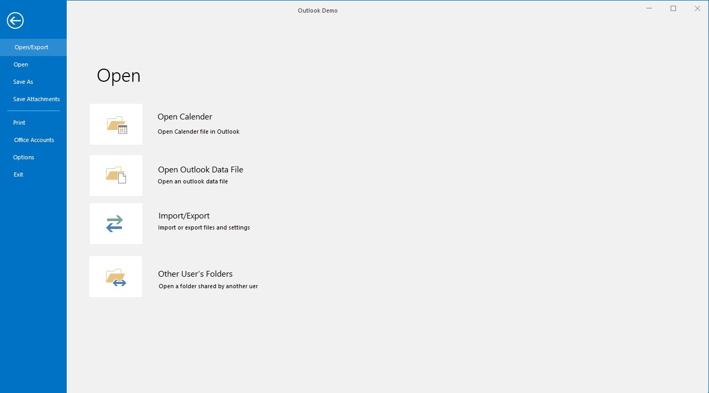
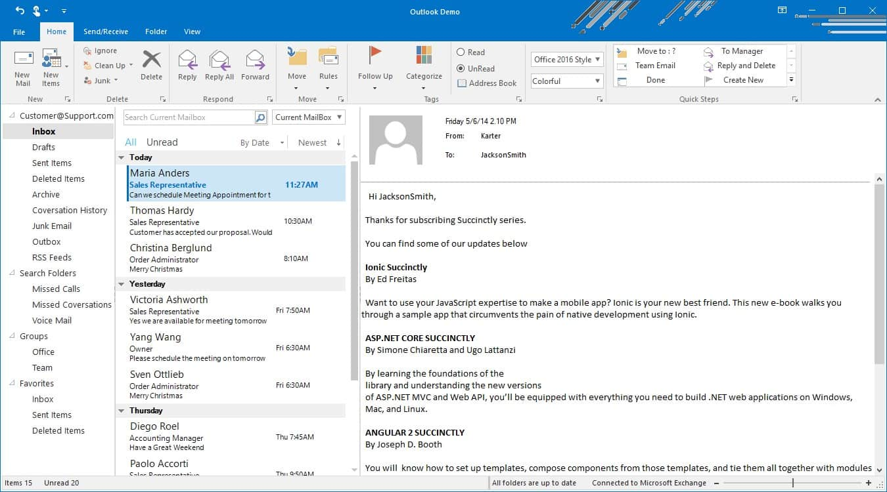
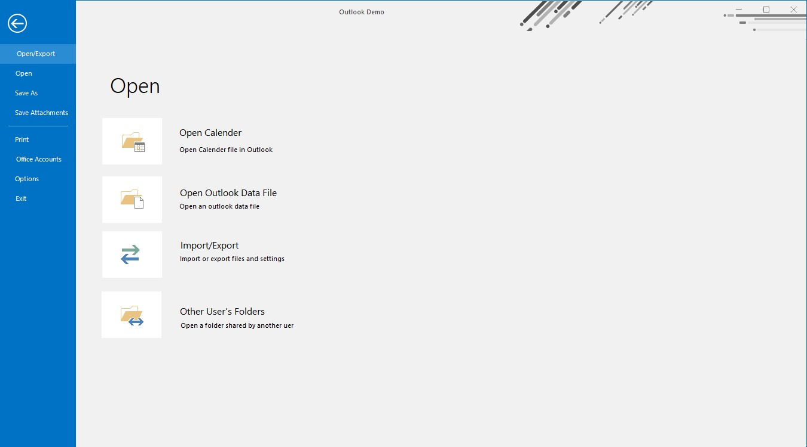
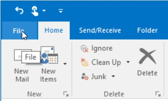
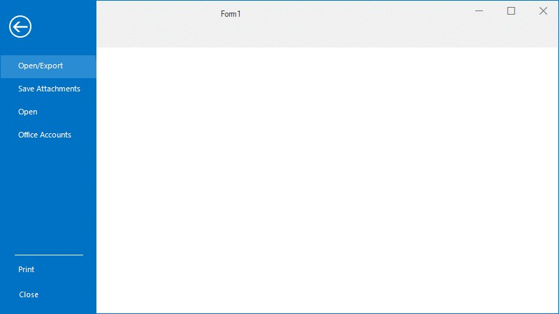

# BackStage settings in Ribbon

The Ribbon Backstage will appear when the user clicks on Menu button, it allows to make actions for the whole document such as Save, Save As and print. It can be used to show the recent changes in the document and even closing the application.

Backstage structure will have two areas, left side which contain all the items in backstage panel and the right side which shows content of the BackstageTab.

There are three items that can be used in BackStage. They are

*	BackStage Button – A clickable item which acts as a simple button.
*	BackStageTab – A simple tab, as you click on it, displays its content.
*	BackStageSeparator – A simple line which separates neighboring items and can be used to differentiate different set of items to improve readability.  

## Open BackStage

In designer backstage can be opened by using smart tag of the backstage control below the designer and select `ShowBackstage`.

Or backstage can be accessed by going into BackStage property grid and changing `IsVisible` as true.

In run time BackStage can be opened by right clicking on the `MenuButton`.

## Create BackStage Button

BackStage Button can be added through Smart tag of backstage view and it can be customized using property grid of that button.

Through coding





//Creating new backstage buttons
private Syncfusion.Windows.Forms.BackStageButton saveAsBackStageButton;
private Syncfusion.Windows.Forms.BackStageButton optionsBackStageButton;
private Syncfusion.Windows.Forms.BackStageButton exitBackStageButton;

//Creating new instance and customizing
this.optionsBackStageButton = new Syncfusion.Windows.Forms.BackStageButton();
this.saveAsBackStageButton = new Syncfusion.Windows.Forms.BackStageButton();
this.exitBackStageButton = new Syncfusion.Windows.Forms.BackStageButton();
this.optionsBackStageButton.Text = "Options";
this.saveAsBackStageButton.Text = "Save As";
this.exitBackStageButton.Text = "Exit";

//Adding them to backstage controls
this.backStage1.Controls.Add(optionsBackStageButton);
this.backStage1.Controls.Add(saveAsBackStageButton);
this.backStage1.Controls.Add(exitBackStageButton);





Private saveAsBackStageButton As Syncfusion.Windows.Forms.BackStageButton
Private optionsBackStageButton As Syncfusion.Windows.Forms.BackStageButton
Private exitBackStageButton As Syncfusion.Windows.Forms.BackStageButton)

Me.optionsBackStageButton = New Syncfusion.Windows.Forms.BackStageButton()
Me.saveAsBackStageButton = New Syncfusion.Windows.Forms.BackStageButton()
Me.exitBackStageButton = New Syncfusion.Windows.Forms.BackStageButton()
Me.optionsBackStageButton.Text = "Options"
Me.saveAsBackStageButton.Text = "Save As"
Me.exitBackStageButton.Text = "Exit"

Me.backStage1.Controls.Add(optionsBackStageButton)
Me.backStage1.Controls.Add(saveAsBackStageButton)
Me.backStage1.Controls.Add(exitBackStageButton)





## Create BackStage Tab

BackStage Tab can be added through smart tag of backstage view and it can be customized using the property grid.

Through coding





//Creating new backstage tabs
private Syncfusion.Windows.Forms.BackStageTab openExportBackStageTab;
private Syncfusion.Windows.Forms.BackStageTab saveAttachmentsBackStageTab;
private Syncfusion.Windows.Forms.BackStageTab openBackStageTab;
private Syncfusion.Windows.Forms.BackStageTab officeAccountsBackStageTab;
private Syncfusion.Windows.Forms.BackStageTab printBackStageTab;

//Creating new instance and customizing
this.openExportBackStageTab = new Syncfusion.Windows.Forms.BackStageTab();
this.saveAttachmentsBackStageTab = new Syncfusion.Windows.Forms.BackStageTab();
this.openBackStageTab = new Syncfusion.Windows.Forms.BackStageTab();
this.officeAccountsBackStageTab = new Syncfusion.Windows.Forms.BackStageTab();
this.printBackStageTab = new Syncfusion.Windows.Forms.BackStageTab();

this.openExportBackStageTab.Text = "Open/Export";
this.saveAttachmentsBackStageTab.Text = "Save Attachments";
this.openBackStageTab.Text = "Open";
this.officeAccountsBackStageTab.Text = "Office Accounts";
this.printBackStageTab.Text = "Print";

//Adding them to backstage controls
this.backStage1.Controls.Add(openExportBackStageTab);
this.backStage1.Controls.Add(saveAttachmentsBackStageTab);
this.backStage1.Controls.Add(openBackStageTab);
this.backStage1.Controls.Add(officeAccountsBackStageTab);
this.backStage1.Controls.Add(printBackStageTab);





Private openExportBackStageTab As Syncfusion.Windows.Forms.BackStageTab
Private saveAttachmentsBackStageTab As Syncfusion.Windows.Forms.BackStageTab
Private openBackStageTab As Syncfusion.Windows.Forms.BackStageTab
Private officeAccountsBackStageTab As Syncfusion.Windows.Forms.BackStageTab
Private printBackStageTab As Syncfusion.Windows.Forms.BackStageTab

Me.openExportBackStageTab.Text = "Open/Export"
Me.saveAttachmentsBackStageTab.Text = "Save Attachments"
Me.openBackStageTab.Text = "Open"
Me.officeAccountsBackStageTab.Text = "Office Accounts"
Me.printBackStageTab.Text = "Print"

Me.backStage1.Controls.Add(openExportBackStageTab)
Me.backStage1.Controls.Add(saveAttachmentsBackStageTab)
Me.backStage1.Controls.Add(openBackStageTab)
Me.backStage1.Controls.Add(officeAccountsBackStageTab)
Me.backStage1.Controls.Add(printBackStageTab)





### Adding Controls into BackStageTab

If backstage view is visible on the designer, select the tab and on left side empty space is available to add the controls for that tab, you can add the controls in that area from toolbox.

## Add Separator

Separator can be added through Smart tag as explained in adding backstage button and tab.

## Add Header Image

Header image can be added to the Ribbon with the property `RibbonHeaderImage`. There are several inbuilt images that can be used for Header.





this.ribbonControlAdv1.RibbonHeaderImage = RibbonHeaderImage.Lines; 





Me.ribbonControlAdv1.RibbonHeaderImage = RibbonHeaderImage.Lines





To set custom image to the Ribbon header, set an image to the property `CustomRibbonHeaderImage`.





//Image for RibbonHeader
Image headerImg = Image.FromFile(@"Pictures\HeaderImage.png");

this.ribbonControlAdv1.CustomRibbonHeaderImage = headerImg;





Dim headerImg As Image = Image.FromFile("Pictures\HeaderImage.png")

Me.ribbonControlAdv1.CustomRibbonHeaderImage = headerImg





## BackStage width

Width of backstage panel can be changed with the BackStage property `BackStagePanelWidth`.





this.backStage1.BackStagePanelWidth = 200;





Me.backStage1.BackStagePanelWidth = 200





## Restrict BackStage Opening

To restrict from opening Backstage, change the Ribbon property `MenuButtonEnabled` as false.





//This will restrict backstage from opening
this.ribbonControlAdv1.MenuButtonEnabled = false;





Me.ribbonControlAdv1.MenuButtonEnabled = False





## Menu Button

The file tab located at left end of the ribbon is the menu button, it is used to open backstage at run time.

### Menu Button Text

By default, the text for this button will be File, it can be changed with the ribbon property `MenuButtonText`.





this.ribbonControlAdv1.MenuButtonText = "Menu";





Me.ribbonControlAdv1.MenuButtonText = "Menu"





### Menu Button Width

To change the width of menu button, use the ribbon property `MenuButtonWidth`.





this.ribbonControlAdv1.MenuButtonWidth = 100;





Me.ribbonControlAdv1.MenuButtonWidth = 100





### Menu Button Color

To change the menu button color, use the ribbon property `MenuColor`.





this.ribbonControlAdv1.MenuColor = Color.Red;





Me.ribbonControlAdv1.MenuColor = Color.Red





## BackStage items placement

The `BackStage` items listed below can be positioned either at top or bottom by using the `Placement` property.

*	BackStageButton
*	BackStageTab
*	BackStageSeparator

The following code example illustrates how to position the BackStage items either at top or bottom.





using Syncfusion.Windows.Forms.Tools;

public partial class Form1 : RibbonForm
{
    private Syncfusion.Windows.Forms.Tools.RibbonControlAdv ribbonControlAdv1;
    private Syncfusion.Windows.Forms.Tools.ToolStripTabItem homeTabItem;
    private Syncfusion.Windows.Forms.Tools.ToolStripTabItem sendTabItem;
    private Syncfusion.Windows.Forms.Tools.ToolStripTabItem folderTabItem;
    private Syncfusion.Windows.Forms.Tools.ToolStripEx newToolStripEx;
    private Syncfusion.Windows.Forms.BackStageView backStageView1;
    private Syncfusion.Windows.Forms.BackStage backStage1;
    private Syncfusion.Windows.Forms.BackStageTab openExportBackStageTab;
    private Syncfusion.Windows.Forms.BackStageTab saveAttachmentsBackStageTab;
    private Syncfusion.Windows.Forms.BackStageTab openBackStageTab;
    private Syncfusion.Windows.Forms.BackStageTab officeAccountsBackStageTab;
    private Syncfusion.Windows.Forms.BackStageSeparator backStageSeparator;
    private Syncfusion.Windows.Forms.BackStageTab printBackStageTab;
    private Syncfusion.Windows.Forms.BackStageButton closeBackStageButton;

    public Form1()
    {
        InitializeComponent();
        this.ribbonControlAdv1 = new Syncfusion.Windows.Forms.Tools.RibbonControlAdv();
        this.homeTabItem = new Syncfusion.Windows.Forms.Tools.ToolStripTabItem();
        this.sendTabItem = new Syncfusion.Windows.Forms.Tools.ToolStripTabItem();
        this.folderTabItem = new Syncfusion.Windows.Forms.Tools.ToolStripTabItem();
        this.newToolStripEx = new Syncfusion.Windows.Forms.Tools.ToolStripEx();
        this.backStageView1 = new Syncfusion.Windows.Forms.BackStageView(this.components);
        this.backStage1 = new Syncfusion.Windows.Forms.BackStage();
        this.openExportBackStageTab = new Syncfusion.Windows.Forms.BackStageTab();
        this.saveAttachmentsBackStageTab = new Syncfusion.Windows.Forms.BackStageTab();
        this.openBackStageTab = new Syncfusion.Windows.Forms.BackStageTab();
        this.officeAccountsBackStageTab = new Syncfusion.Windows.Forms.BackStageTab();
        this.backStageSeparator = new Syncfusion.Windows.Forms.BackStageSeparator();
        this.printBackStageTab = new Syncfusion.Windows.Forms.BackStageTab();
        this.closeBackStageButton = new Syncfusion.Windows.Forms.BackStageButton();

        this.ribbonControlAdv1.BackStageView = this.backStageView1;
        this.ribbonControlAdv1.MenuButtonText = "File";
        this.ribbonControlAdv1.Size = new System.Drawing.Size(1036, 160);
        this.ribbonControlAdv1.RibbonStyle = RibbonStyle.Office2016;
        this.Controls.Add(ribbonControlAdv1);

        this.homeTabItem.Text = "Home";
        this.sendTabItem.Text = "Send";
        this.folderTabItem.Text = "Folder";

        this.ribbonControlAdv1.Header.AddMainItem(this.homeTabItem);
        this.ribbonControlAdv1.Header.AddMainItem(this.sendTabItem);
        this.ribbonControlAdv1.Header.AddMainItem(this.folderTabItem);

        this.newToolStripEx.GripStyle = System.Windows.Forms.ToolStripGripStyle.Hidden;
        this.homeTabItem.Panel.Controls.Add(newToolStripEx);

        this.backStageView1.BackStage = this.backStage1;
        this.backStageView1.HostControl = null;
        this.backStageView1.HostForm = this;
            
        this.openExportBackStageTab.Text = "Open/Export";
        this.saveAttachmentsBackStageTab.Text = "Save Attachments";
        this.openBackStageTab.Text = "Open";
        this.officeAccountsBackStageTab.Text = "Office Accounts";
        this.printBackStageTab.Text = "Print";
        this.closeBackStageButton.Text = "Close";

        this.backStageSeparator.Placement = Syncfusion.Windows.Forms.BackStageItemPlacement.Bottom;
        this.printBackStageTab.Placement = Syncfusion.Windows.Forms.BackStageItemPlacement.Bottom;
        this.closeBackStageButton.Placement = Syncfusion.Windows.Forms.BackStageItemPlacement.Bottom;

        this.backStage1.Controls.Add(openExportBackStageTab);
        this.backStage1.Controls.Add(saveAttachmentsBackStageTab);
        this.backStage1.Controls.Add(openBackStageTab);
        this.backStage1.Controls.Add(officeAccountsBackStageTab);
        this.backStage1.Controls.Add(backStageSeparator);
        this.backStage1.Controls.Add(printBackStageTab);
        this.backStage1.Controls.Add(closeBackStageButton);
    }
}





N>[View sample in GitHub]()

