# Getting Started

This section explains how to implement a similar UI as Microsoft Outlook using Ribbon.

## Add RibbonControlAdv in Designer

*	Drag and drop the ‘RibbonControlAdv’ from toolbox to designer. The required assembly references will be added automatically. It will generate the Ribbon as shown below:

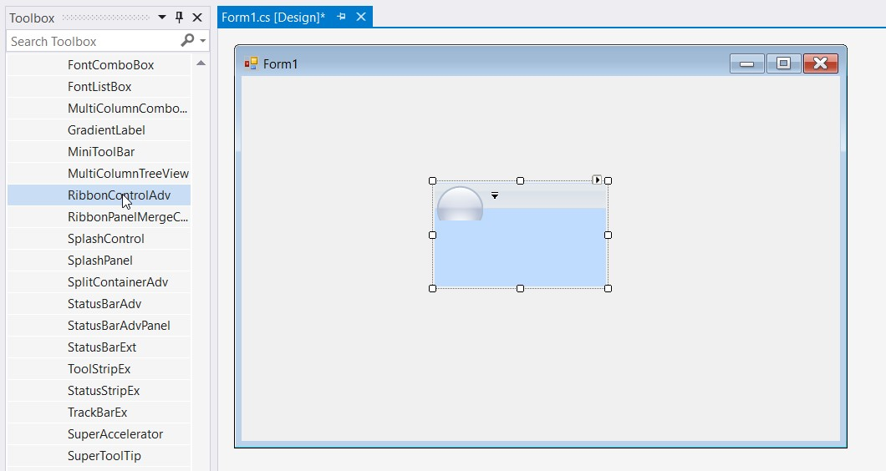

## Add RibbonControlAdv in Code

To add the RibbonControlAdv manually through code, follow the below steps.

1. Add the below required assembly reference to the project,

*	Syncfusion.Shared.Base
*	Syncfusion.Tools.Windows

2. New ‘RibbonControlAdv’ can be added to the forms using the `Controls.Add` method.   Create a new Ribbon control and initialize the ribbon and then add it to the Controls using below code.





//Adding a new ribbon control
private Syncfusion.Windows.Forms.Tools.RibbonControlAdv ribbonControlAdv1;

//Declare and initialize the new ribbon control
 this.ribbonControlAdv1 = new RibbonControlAdv();

//Adding ribbon control to form
this.Controls.Add(ribbonControlAdv1);





Private ribbonControlAdv1 As Syncfusion.Windows.Forms.Tools.RibbonControlAdv

Default Private Property Item(ByVal Optional  As ribbonControlAdv1 = New RibbonControlAdv()) As

Me.Controls.Add(ribbonControlAdv1)





## Configure RibbonForm

RibbonForm enables a similar look and feel of Microsoft Office. This section will guide you in applying different visual styles to RibbonControlAdv using RibbonForm.
By default, the Form in application will extend to Form class. Add the respective namespace and programmatically change it as RibbonForm class. 





using Syncfusion.Windows.Forms.Tools; 

public partial class Form1 : RibbonForm





Imports Syncfusion.Windows.Forms.Tools

Public Partial Class Form1
    Inherits RibbonForm

End Class





## Applying Visual Style

RibbonControlAdv appearance can be enhanced by using the `RibbonStyle` property of the Ribbon Control.

The following styles are supported by the Ribbon control.

*	Office2007
*	Office2010
*	Office2013
*	Office2016
*	TouchStyle

The following code example illustrates how to set style for the RibbonControlAdv through code.





this.ribbonControlAdv1.RibbonStyle = RibbonStyle.Office2016;





Me.ribbonControlAdv1.RibbonStyle = RibbonStyle.Office2016





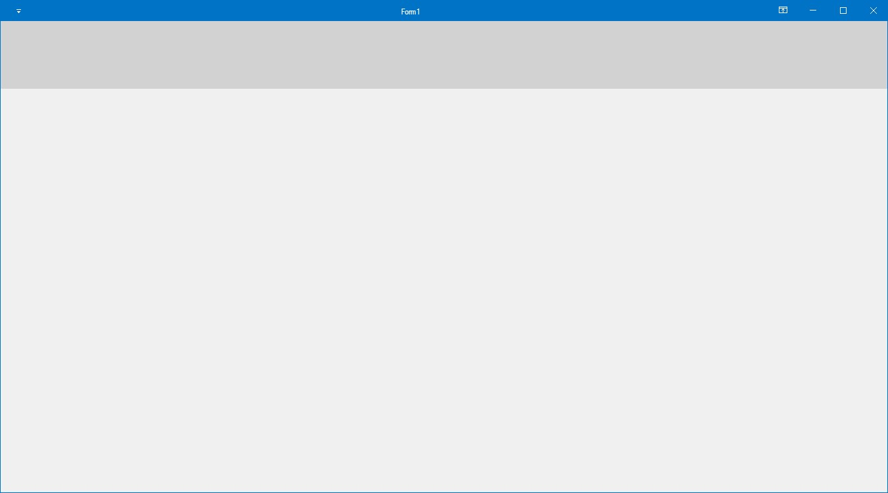

## Add Tabs to Ribbon

RibbonControlAdv lets you to create ToolStripTabItems easily using the smart tag. It also adds a RibbonPanel to which ToolStripItems can be added.

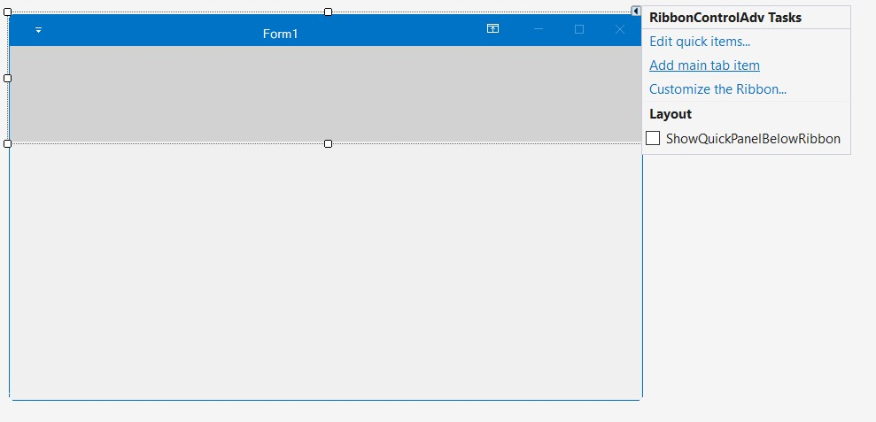

Customize the Tab item using the property grid.

A new TabItem can be added to the RibbonControlAdv programmatically using the `AddMainItem` method. Create a ToolStripTabItem and then add it to the RibbonControlAdv using the below method.





// Adding a new Tab Item
private Syncfusion.Windows.Forms.Tools.ToolStripTabItem homeTabItem;
private Syncfusion.Windows.Forms.Tools.ToolStripTabItem sendTabItem;
private Syncfusion.Windows.Forms.Tools.ToolStripTabItem folderTabItem;
private Syncfusion.Windows.Forms.Tools.ToolStripTabItem viewTabItem;

//Declare and initialize a ToolStripTabItem
this.homeTabItem = new ToolStripTabItem();
this.sendTabItem = new ToolStripTabItem();
this.folderTabItem = new ToolStripTabItem();
this.viewTabItem = new ToolStripTabItem();

this.homeTabItem.Text = "Home";
this.sendTabItem.Text = "Send";
this.folderTabItem.Text = "Folder";
this.viewTabItem.Text = "View";

//Add the tab item to the RibbonControlAdv
this.ribbonControlAdv1.Header.AddMainItem(this.homeTabItem);
this.ribbonControlAdv1.Header.AddMainItem(this.sendTabItem);
this.ribbonControlAdv1.Header.AddMainItem(this.folderTabItem);
this.ribbonControlAdv1.Header.AddMainItem(this.viewTabItem);





Private homeTabItem As Syncfusion.Windows.Forms.Tools.ToolStripTabItem
Private sendTabItem As Syncfusion.Windows.Forms.Tools.ToolStripTabItem
Private folderTabItem As Syncfusion.Windows.Forms.Tools.ToolStripTabItem
Private viewTabItem As Syncfusion.Windows.Forms.Tools.ToolStripTabItem

Me.homeTabItem = New ToolStripTabItem()
Me.sendTabItem = New ToolStripTabItem()
Me.folderTabItem = New ToolStripTabItem()
Me.viewTabItem = New ToolStripTabItem()

Me.homeTabItem.Text = "Home"
Me.sendTabItem.Text = "Send"
Me.folderTabItem.Text = "Folder"
Me.viewTabItem.Text = "View"

Me.ribbonControlAdv1.Header.AddMainItem(Me.homeTabItem)
Me.ribbonControlAdv1.Header.AddMainItem(Me.sendTabItem)
Me.ribbonControlAdv1.Header.AddMainItem(Me.folderTabItem)
Me.ribbonControlAdv1.Header.AddMainItem(Me.viewTabItem)





## Adding groups inside Tab

ToolStripEx is used to create groups inside a Tab, it can be added to the Ribbon panel using its smart tag or using `Add ToolStrip` verb in the property grid.





private Syncfusion.Windows.Forms.Tools.ToolStripEx newToolStripEx;
private Syncfusion.Windows.Forms.Tools.ToolStripEx deleteToolStripEx;
private Syncfusion.Windows.Forms.Tools.ToolStripEx respondToolStripEx;
private Syncfusion.Windows.Forms.Tools.ToolStripEx moveToolStripEx;
private Syncfusion.Windows.Forms.Tools.ToolStripEx tagsToolStripEx;
private Syncfusion.Windows.Forms.Tools.ToolStripEx colorSchemeToolStripEx;
private Syncfusion.Windows.Forms.Tools.ToolStripEx quickstepsToolStripEx;
private Syncfusion.Windows.Forms.Tools.ToolStripEx currentViewToolStripEx;
private Syncfusion.Windows.Forms.Tools.ToolStripEx messagesToolStripEx;
private Syncfusion.Windows.Forms.Tools.ToolStripEx layoutToolStripEx;
private Syncfusion.Windows.Forms.Tools.ToolStripEx peopleToolStripEx;
private Syncfusion.Windows.Forms.Tools.ToolStripEx windowToolStripEx;

this.newToolStripEx = new ToolStripEx();
this.deleteToolStripEx = new ToolStripEx();
this.respondToolStripEx = new ToolStripEx();
this.moveToolStripEx = new ToolStripEx();
this.tagsToolStripEx = new ToolStripEx();
this.colorSchemeToolStripEx = new ToolStripEx();
this.quickstepsToolStripEx = new ToolStripEx();
this.currentViewToolStripEx = new ToolStripEx();
this.messagesToolStripEx = new ToolStripEx();
this.layoutToolStripEx = new ToolStripEx();
this.peopleToolStripEx = new ToolStripEx();
this.windowToolStripEx = new ToolStripEx();

this.newToolStripEx.Text = "New";
this.deleteToolStripEx.Text = "Delete";
this.respondToolStripEx.Text = "Respond";
this.moveToolStripEx.Text = "Move";
this.tagsToolStripEx.Text = "Tags";
this.colorSchemeToolStripEx.Text = "Color Scheme";
this.quickstepsToolStripEx.Text = "Quick Steps";
this.currentViewToolStripEx.Text = "Current View";
this.messagesToolStripEx.Text = "Messages";
this.layoutToolStripEx.Text = "Layout";
this.peopleToolStripEx.Text = "People";
this.windowToolStripEx.Text = "Window";

this.homeTabItem.Panel.Controls.AddRange(new Control[] { newToolStripEx, deleteToolStripEx, respondToolStripEx, moveToolStripEx, tagsToolStripEx, colorSchemeToolStripEx, quickstepsToolStripEx});

this.viewTabItem.Panel.Controls.AddRange(new Control[] { currentViewToolStripEx, messagesToolStripEx, layoutToolStripEx, peopleToolStripEx, windowToolStripEx });





    Private newToolStripEx As Syncfusion.Windows.Forms.Tools.ToolStripEx
    Private deleteToolStripEx As Syncfusion.Windows.Forms.Tools.ToolStripEx
    Private respondToolStripEx As Syncfusion.Windows.Forms.Tools.ToolStripEx
    Private moveToolStripEx As Syncfusion.Windows.Forms.Tools.ToolStripEx
    Private tagsToolStripEx As Syncfusion.Windows.Forms.Tools.ToolStripEx
    Private colorSchemeToolStripEx As Syncfusion.Windows.Forms.Tools.ToolStripEx
    Private quickstepsToolStripEx As Syncfusion.Windows.Forms.Tools.ToolStripEx
    Private currentViewToolStripEx As Syncfusion.Windows.Forms.Tools.ToolStripEx
    Private messagesToolStripEx As Syncfusion.Windows.Forms.Tools.ToolStripEx
    Private layoutToolStripEx As Syncfusion.Windows.Forms.Tools.ToolStripEx
    Private peopleToolStripEx As Syncfusion.Windows.Forms.Tools.ToolStripEx
    Private windowToolStripEx As Syncfusion.Windows.Forms.Tools.ToolStripEx

    Me.newToolStripEx = New ToolStripEx()
    Me.deleteToolStripEx = New ToolStripEx()
    Me.respondToolStripEx = New ToolStripEx()
    Me.moveToolStripEx = New ToolStripEx()
    Me.tagsToolStripEx = New ToolStripEx()
    Me.colorSchemeToolStripEx = New ToolStripEx()
    Me.quickstepsToolStripEx = New ToolStripEx()
    Me.currentViewToolStripEx = New ToolStripEx()
    Me.messagesToolStripEx = New ToolStripEx()
    Me.layoutToolStripEx = New ToolStripEx()
    Me.peopleToolStripEx = New ToolStripEx()
    Me.windowToolStripEx = New ToolStripEx()

    Me.newToolStripEx.Text = "New"
    Me.deleteToolStripEx.Text = "Delete"
    Me.respondToolStripEx.Text = "Respond"
    Me.moveToolStripEx.Text = "Move"
    Me.tagsToolStripEx.Text = "Tags"
    Me.colorSchemeToolStripEx.Text = "Color Scheme"
    Me.quickstepsToolStripEx.Text = "Quick Steps"
    Me.currentViewToolStripEx.Text = "Current View"
    Me.messagesToolStripEx.Text = "Messages"
    Me.layoutToolStripEx.Text = "Layout"
    Me.peopleToolStripEx.Text = "People"
    Me.windowToolStripEx.Text = "Window"

    Me.homeTabItem.Panel.Controls.AddRange(New Control() {newToolStripEx, deleteToolStripEx, respondToolStripEx, moveToolStripEx, tagsToolStripEx, colorSchemeToolStripEx, quickstepsToolStripEx})

    Me.viewTabItem.Panel.Controls.AddRange(New Control() {currentViewToolStripEx, messagesToolStripEx, layoutToolStripEx, peopleToolStripEx, windowToolStripEx})





To add controls to the ToolStripEx, click the button  in it, as in the image below.

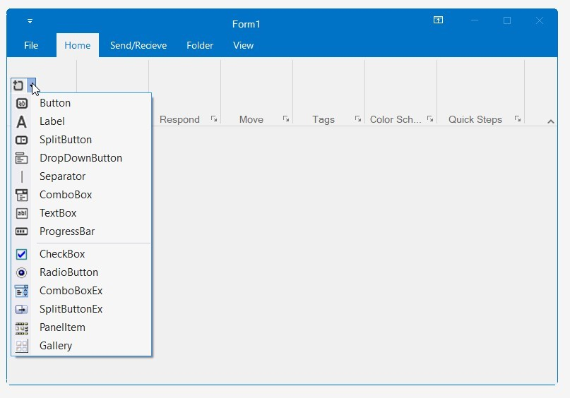

## Add Button Controls

### ToolStripButton

The Button is a control where the user can click to provide input to an application.

#### Adding ToolStripButton

For Adding `ToolStripButton` please refer `Adding ToolStripDropDownButton` and select `Button` from the Controls grid.

**Through Coding**





private System.Windows.Forms.ToolStripButton newMailButton;
private System.Windows.Forms.ToolStripButton IgnoreButton;
private System.Windows.Forms.ToolStripButton replyButton;
private System.Windows.Forms.ToolStripButton replyAllButton;
private System.Windows.Forms.ToolStripButton forwardButton;

this.newMailButton = new System.Windows.Forms.ToolStripButton();
this.IgnoreButton = new System.Windows.Forms.ToolStripButton();
this.replyButton = new System.Windows.Forms.ToolStripButton();
this.replyAllButton = new System.Windows.Forms.ToolStripButton();
this.forwardButton = new System.Windows.Forms.ToolStripButton();

this.newMailButton.Text = "New \r\nMail";
this.newMailButton.Image = Image.FromFile(@"Pictures\NewMail.png");

this.IgnoreButton.Text = "Ignore";
this.IgnoreButton.Image = Image.FromFile(@"Pictures\ignore.png");

this.replyButton.Text = "Reply";
this.replyButton.Image = Image.FromFile(@"Pictures\reply.png");

this.replyAllButton.Text = "Reply All";
this.replyAllButton.Image = Image.FromFile(@"Pictures\ReplyAll.png");

this.forwardButton.Text = "Forward";
this.forwardButton.Image = Image.FromFile(@"Pictures\forward.png");

this.newToolStripEx.Items.AddRange(new System.Windows.Forms.ToolStripItem[] {
this.newMailButton });
this.deleteToolStripEx.Items.AddRange(new System.Windows.Forms.ToolStripItem[] {
this.IgnoreButton });
this.respondToolStripEx.Items.AddRange(new System.Windows.Forms.ToolStripItem[] {
this.replyButton,
this.replyAllButton,
this.forwardButton});





    Private newMailButton As System.Windows.Forms.ToolStripButton
    Private IgnoreButton As System.Windows.Forms.ToolStripButton
    Private replyButton As System.Windows.Forms.ToolStripButton
    Private replyAllButton As System.Windows.Forms.ToolStripButton
    Private forwardButton As System.Windows.Forms.ToolStripButton

    Me.newMailButton = New System.Windows.Forms.ToolStripButton()
    Me.IgnoreButton = New System.Windows.Forms.ToolStripButton()
    Me.replyButton = New System.Windows.Forms.ToolStripButton()
    Me.replyAllButton = New System.Windows.Forms.ToolStripButton()
    Me.forwardButton = New System.Windows.Forms.ToolStripButton()

    Me.newMailButton.Text = "New " & vbCrLf & "Mail"
    Me.newMailButton.Image = Image.FromFile("Pictures\NewMail.png")
    Me.IgnoreButton.Text = "Ignore"
    Me.IgnoreButton.Image = Image.FromFile("Pictures\ignore.png")
    Me.replyButton.Text = "Reply"
    Me.replyButton.Image = Image.FromFile("Pictures\reply.png")
    Me.replyAllButton.Text = "Reply All"
    Me.replyAllButton.Image = Image.FromFile("Pictures\ReplyAll.png")
    Me.forwardButton.Text = "Forward"
    Me.forwardButton.Image = Image.FromFile("Pictures\forward.png")

    Me.newToolStripEx.Items.AddRange(New System.Windows.Forms.ToolStripItem() {Me.newMailButton})
    Me.deleteToolStripEx.Items.AddRange(New System.Windows.Forms.ToolStripItem() {Me.IgnoreButton})
    Me.respondToolStripEx.Items.AddRange(New System.Windows.Forms.ToolStripItem() {Me.replyButton, Me.replyAllButton, Me.forwardButton})
    




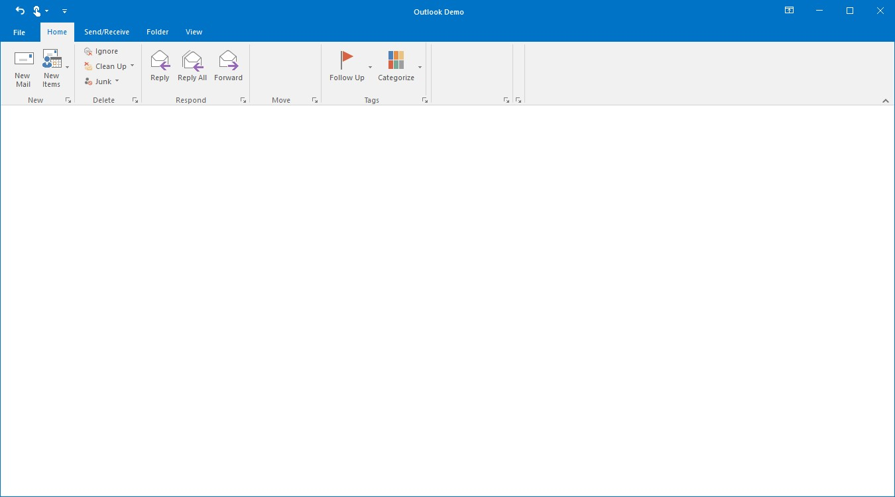

#### Holding the Selection of ToolStripButton

For holding the selection of ToolstripButton after lost focus, use the property `CheckOnClick`, if true, the ToolStripButton will stay selected even after click and will go unselected after next click on that button, it simply acts as a toggling functionality to that button.
The default value is false.





this.newMailButton.CheckOnClick = true;





Me.newMailButton.CheckOnClick = True





### ToolStripRadioButton

ToolStripRadioButton control is used to select an option like normal RadioButton.

#### Adding ToolStripRadioButton

For Adding `ToolStripRadioButton` please refer `Adding ToolStripDropDownButton` and select `RadioButton` from the Controls grid.

**Through Coding**





Syncfusion.Windows.Forms.Tools.ToolStripRadioButton readRadioButton;
Syncfusion.Windows.Forms.Tools.ToolStripRadioButton unreadRadioButton;
Syncfusion.Windows.Forms.Tools.ToolStripPanelItem readUnreadPanel;

this.readRadioButton = new ToolStripRadioButton();
this.unreadRadioButton = new ToolStripRadioButton();
this.readUnreadPanel = new ToolStripPanelItem();

this.readRadioButton.Text = "Read";
this.unreadRadioButton.Text = "Unread";

this.readUnreadPanel.Items.AddRange(new ToolStripItem[] { readRadioButton, unreadRadioButton });
this.tagsToolStripEx.Items.AddRange(new ToolStripItem[] { readUnreadPanel });





    Dim readRadioButton As Syncfusion.Windows.Forms.Tools.ToolStripRadioButton
    Dim unreadRadioButton As Syncfusion.Windows.Forms.Tools.ToolStripRadioButton
    Dim readUnreadPanel As Syncfusion.Windows.Forms.Tools.ToolStripPanelItem

    Me.readRadioButton = New ToolStripRadioButton()
    Me.unreadRadioButton = New ToolStripRadioButton()
    Me.readUnreadPanel = New ToolStripPanelItem()

    Me.readRadioButton.Text = "Read"
    Me.unreadRadioButton.Text = "Unread"

    Me.readUnreadPanel.Items.AddRange(New ToolStripItem() {readRadioButton, unreadRadioButton})
    Me.tagsToolStripEx.Items.AddRange(New ToolStripItem() {readUnreadPanel})





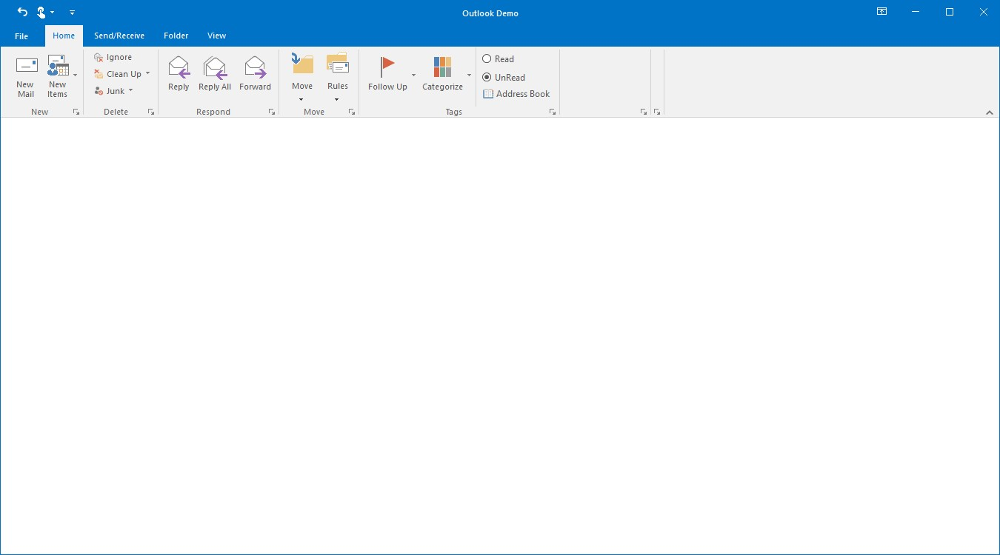

### ToolStripDropDownButton

DropDownButton appears like normal button with an extra drop arrow. It accepts DropDownMenuItem as its children. When clicked, displays added menu items.

#### Adding ToolStripDropDownButton

Click the button inside the ToolStripEx panel and select DropDownButton from the controls grid.

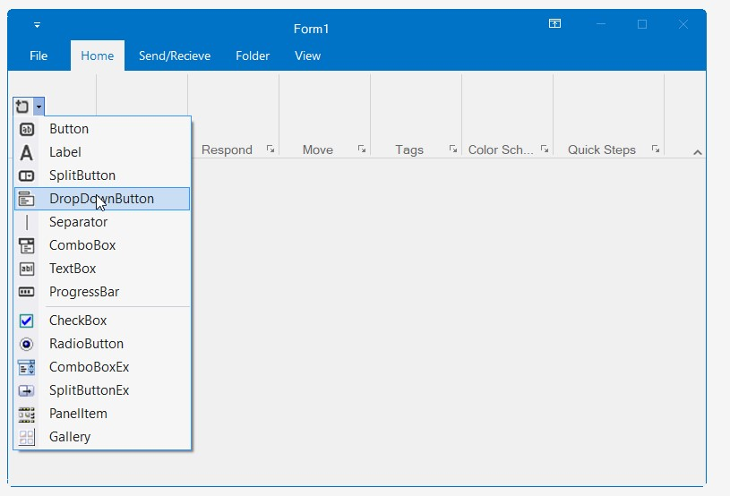

Through code





private System.Windows.Forms.ToolStripDropDownButton newItemsDropDownButton;
private System.Windows.Forms.ToolStripDropDownButton CleanUpDropDownButton;
private System.Windows.Forms.ToolStripDropDownButton JunkDropDownButton;
private System.Windows.Forms.ToolStripDropDownButton followUpDropDownButton;
private System.Windows.Forms.ToolStripDropDownButton categorizeDropDownButton;

this.newItemsDropDownButton = new System.Windows.Forms.ToolStripDropDownButton();
this.CleanUpDropDownButton = new System.Windows.Forms.ToolStripDropDownButton();
this.JunkDropDownButton = new System.Windows.Forms.ToolStripDropDownButton();
this.followUpDropDownButton = new System.Windows.Forms.ToolStripDropDownButton();
this.categorizeDropDownButton = new System.Windows.Forms.ToolStripDropDownButton();

this.newItemsDropDownButton.Text = "New Items";
this.CleanUpDropDownButton.Text = "Clean Up";
this.JunkDropDownButton.Text = "Junk";
this.followUpDropDownButton.Text = "Follow Up";
this.categorizeDropDownButton.Text = "Categorize";

this.newItemsDropDownButton.Image = Image.FromFile(@"Pictures\NewItems.png");
this.CleanUpDropDownButton.Image = Image.FromFile(@"Pictures\CleanUp.png");
this.JunkDropDownButton.Image = Image.FromFile(@"Pictures\junk.png");
this.followUpDropDownButton.Image = Image.FromFile(@"Pictures\FollowUp.png");
this.categorizeDropDownButton.Image = Image.FromFile(@"Pictures\categorize.png");

this.newToolStripEx.Items.Add(newItemsDropDownButton);

this.deleteToolStripEx.Items.AddRange(new System.Windows.Forms.ToolStripItem[] {
            this.CleanUpDropDownButton, this.JunkDropDownButton});
            
this.tagsToolStripEx.Items.AddRange(new System.Windows.Forms.ToolStripItem[] {
            this.followUpDropDownButton, this.categorizeDropDownButton





    Private newItemsDropDownButton As System.Windows.Forms.ToolStripDropDownButton
    Private CleanUpDropDownButton As System.Windows.Forms.ToolStripDropDownButton
    Private JunkDropDownButton As System.Windows.Forms.ToolStripDropDownButton
    Private followUpDropDownButton As System.Windows.Forms.ToolStripDropDownButton
    Private categorizeDropDownButton As System.Windows.Forms.ToolStripDropDownButton

    Me.newItemsDropDownButton = New System.Windows.Forms.ToolStripDropDownButton()
    Me.CleanUpDropDownButton = New System.Windows.Forms.ToolStripDropDownButton()
    Me.JunkDropDownButton = New System.Windows.Forms.ToolStripDropDownButton()
    Me.followUpDropDownButton = New System.Windows.Forms.ToolStripDropDownButton()
    Me.categorizeDropDownButton = New System.Windows.Forms.ToolStripDropDownButton()

    Me.newItemsDropDownButton.Text = "New Items"
    Me.CleanUpDropDownButton.Text = "Clean Up"
    Me.JunkDropDownButton.Text = "Junk"
    Me.followUpDropDownButton.Text = "Follow Up"
    Me.categorizeDropDownButton.Text = "Categorize"

    Me.newItemsDropDownButton.Image = Image.FromFile("Pictures\NewItems.png")
    Me.CleanUpDropDownButton.Image = Image.FromFile("Pictures\CleanUp.png")
    Me.JunkDropDownButton.Image = Image.FromFile("Pictures\junk.png")
    Me.followUpDropDownButton.Image = Image.FromFile("Pictures\FollowUp.png")
    Me.categorizeDropDownButton.Image = Image.FromFile("Pictures\categorize.png")

    Me.newToolStripEx.Items.Add(newItemsDropDownButton)
    Me.deleteToolStripEx.Items.AddRange(New System.Windows.Forms.ToolStripItem() {Me.CleanUpDropDownButton, Me.JunkDropDownButton})
    Me.tagsToolStripEx.Items.AddRange(New System.Windows.Forms.ToolStripItem() {Me.followUpDropDownButton, Me.categorizeDropDownButton})





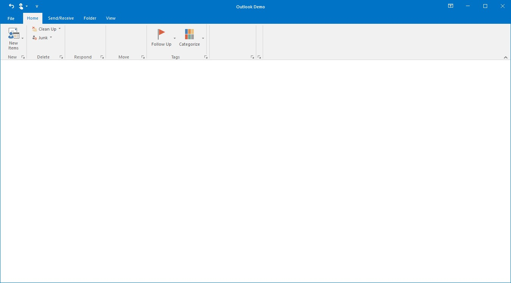

#### Adding DropDownMenuItems

DropDownMenuItems can be added through the button property `DropDownItems`, this will invoke an Item Collection editor and items can be added through this editor.

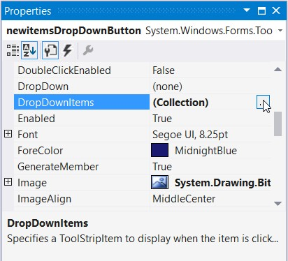

Items can also be added to the dropdown by clicking on the dropdown button and click the small arrow as shown in the image

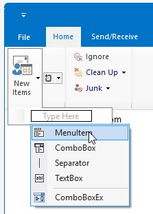

Through code





private System.Windows.Forms.ToolStripMenuItem emailMessageToolStripMenuItem;
private System.Windows.Forms.ToolStripMenuItem appointmentToolStripMenuItem;
private System.Windows.Forms.ToolStripMenuItem meetingToolStripMenuItem;
private System.Windows.Forms.ToolStripMenuItem contactToolStripMenuItem;

this.emailMessageToolStripMenuItem = new System.Windows.Forms.ToolStripMenuItem();
this.appointmentToolStripMenuItem = new System.Windows.Forms.ToolStripMenuItem();
this.meetingToolStripMenuItem = new System.Windows.Forms.ToolStripMenuItem();
this.contactToolStripMenuItem = new System.Windows.Forms.ToolStripMenuItem();

this.emailMessageToolStripMenuItem.Text = "E-mail Message";
this.appointmentToolStripMenuItem.Text = "Appointment";
this.meetingToolStripMenuItem.Text = "Meeting";
this.contactToolStripMenuItem.Text = "Contact";

this.newItemsDropDownButton.DropDownItems.AddRange(new System.Windows.Forms.ToolStripItem[] {
this.emailMessageToolStripMenuItem,
this.appointmentToolStripMenuItem,
this.meetingToolStripMenuItem,
this.contactToolStripMenuItem
});





Private emailMessageToolStripMenuItem As System.Windows.Forms.ToolStripMenuItem
Private appointmentToolStripMenuItem As System.Windows.Forms.ToolStripMenuItem
Private meetingToolStripMenuItem As System.Windows.Forms.ToolStripMenuItem
Private contactToolStripMenuItem As System.Windows.Forms.ToolStripMenuItem

Me.emailMessageToolStripMenuItem = New System.Windows.Forms.ToolStripMenuItem()
Me.appointmentToolStripMenuItem = New System.Windows.Forms.ToolStripMenuItem()
Me.meetingToolStripMenuItem = New System.Windows.Forms.ToolStripMenuItem()
Me.contactToolStripMenuItem = New System.Windows.Forms.ToolStripMenuItem()

Me.emailMessageToolStripMenuItem.Text = "E-mail Message"
Me.appointmentToolStripMenuItem.Text = "Appointment"
Me.meetingToolStripMenuItem.Text = "Meeting"
Me.contactToolStripMenuItem.Text = "Contact"

Me.toolStripDropDownButton.DropDownItems.AddRange(New System.Windows.Forms.ToolStripItem() {Me.emailMessageToolStripMenuItem, Me.appointmentToolStripMenuItem,Me.meetingToolStripMenuItem, Me.contactToolStripMenuItem})





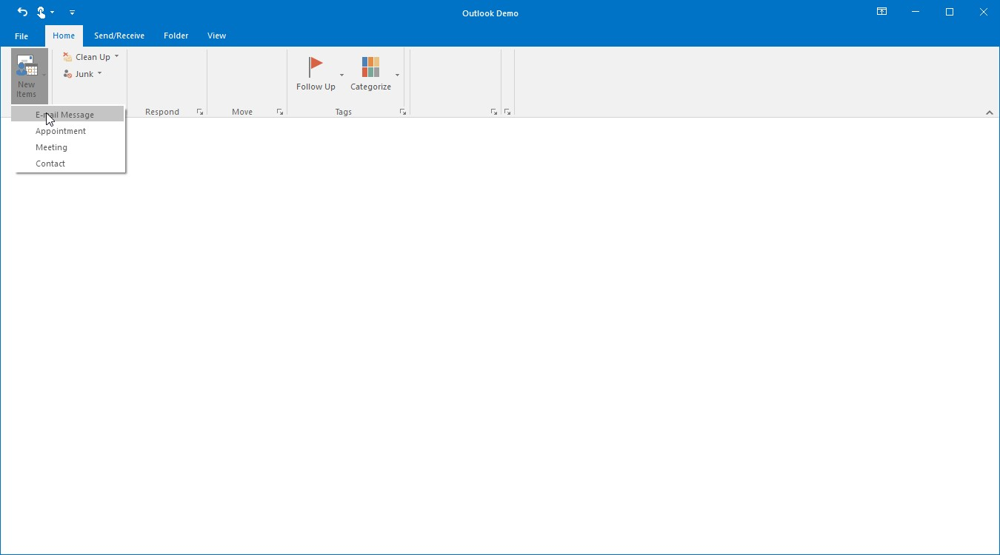

#### Properties of ToolStripDropDownButton

##### Foreground Settings

<table>
<tr>
<th>
Property  </th><th>
Description  </th></tr>
<tr>
<td>
Text  </td><td>
Gets or Sets the Text for the ToolStripDropDownButton. This text will be displayed, only if the DisplayStyle is Text or ImageAndText.  </td></tr>
<tr>
<td>
Font  </td><td>
Gets or Sets the font style for the display text.  </td></tr>
<tr>
<td>
ForeColor  </td><td>
Gets or Sets the fore color for the display text.  </td></tr>
<tr>
<td>
TextAlign  </td><td>
Gets or sets  the alignment of the text in the item. The options are,  TopLeft,   TopCenter,   TopRight,  MiddleLeft,   MiddleCenter,   MiddleRight,  BottomLeft,   BottomCenter and  BottomRight.  </td></tr>
<tr>
<td>
TextDirection  </td><td>
Gets or sets the direction of drawing the text. The direction are,  {{ '__Horizontal__ ' | markdownify }} - Text is placed horizontally,  {{ '__Vertical90__ ' | markdownify }} - Text is placed vertically and   {{ '__Vertical270__ ' | markdownify }} - Text is placed vertically at 270 degrees.  </td></tr>
<tr>
<td>
TextImageRelation  </td><td>
Gets or sets the relative location of the image to the text on the item. The options are,  {{ '__Overlay__ ' | markdownify }} - Image and text shares the same space in the control,  {{ '__ImageAboveText__ ' | markdownify }} - Image will be placed above the text,  {{ '__TextAboveImage__ ' | markdownify }} - Text will be placed above the image,  {{ '__ImageBeforeText__ ' | markdownify }} - Image will be placed before the text and   {{ '__TextBeforeImage__ ' | markdownify }} - Text will be placed before the image.  </td></tr>
</table>

##### Image Settings

<table>
<tr>
<th>
Property  </th><th>
Description  </th></tr>
<tr>
<td>
Image  </td><td>
Gets or Sets the image for the item.  </td></tr>
<tr>
<td>
ImageAlign  </td><td>
Gets or sets the alignment of the image. The options are,  TopLeft,   TopCenter,   TopRight,  MiddleLeft,   MiddleCenter,   MiddleRight,  BottomLeft,   BottomCenter and  BottomRight.  </td></tr>
<tr>
<td>
ImageScaling  </td><td>
Gets or Sets whether the image on the item will size to fit on the ToolStrip.  </td></tr>
<tr>
<td>
ImageTransparentColor  </td><td>
Gets or Sets the transparent color on the image, that supports transparency.  </td></tr>
</table>

##### Style Settings

<table>
<tr>
<th>
Property  </th><th>
Description  </th></tr>
<tr>
<td>
DisplayStyle  </td><td>
Gets or sets how the image and text are rendered. The styles are,  {{ '__Text__ ' | markdownify }} - Displays only text,  {{ '__Image__ ' | markdownify }} - Displays only image,  {{ '__ImageAndText__ ' | markdownify }} - Displays image and text.  </td></tr>
<tr>
<td>
Enabled  </td><td>
Gets or sets whether the item is enabled.  </td></tr>
<tr>
<td>
Visible  </td><td>
Gets or sets whether the item is visible.  </td></tr>
<tr>
<td>
Alignment  </td><td>
Gets or sets the alignment of the item within the ToolStrip. They can be set to beginning (Left) or end (Right) of the ToolStripEx control.  </td></tr>
<tr>
<td>
AutoSize  </td><td>
Gets or sets whether the item should size itself based on its image and text.  </td></tr>
</table>

##### ToolTip Settings

<table>
<tr>
<th>
Property  </th><th>
Description  </th></tr>
<tr>
<td>
AutoToolTip  </td><td>
When set to true, will display the text set in the Text property as the item's tooltip.  When set to false, will display the text set in the ToolTipText property.  </td></tr>
<tr>
<td>
ToolTipText  </td><td>
Gets or sets the text for the tooltip when AutoToolTip is set to false.  </td></tr>
</table>

##### RTL Support

<table>
<tr>
<th>
Property  </th><th>
Description  </th></tr>
<tr>
<td>
RightToLeft  </td><td>
Indicates whether the item should draw right to left for RTL languages.  </td></tr>
<tr>
<td>
RightToLeftAutoMirrorImage  </td><td>
Gets or sets whether image should mirror when RightToLeft is enabled for the item.  </td></tr>
</table>

##### DropDown settings

<table>
<tr>
<th>
Property  </th><th>
Description  </th></tr>
<tr>
<td>
DropDown  </td><td>
Gets or sets the ToolStripDropDown to be shown when the item is clicked.  </td></tr>
<tr>
<td>
DropDownItems  </td><td>
Invokes the Items Collection Editor and lets you add ToolStripItems to be displayed when the item is clicked.  </td></tr>
<tr>
<td>
ShowDropDownArrow  </td><td>
Gets or sets whether or not to show the drop down arrow on the ToolStripDropDown button.  </td></tr>
</table>

### ToolStripSplitButtonEx

SplitButtonEx can perform like both normal Button as well as DropDownButton. It allows to click the button directly by clicking the upper part of the button and also it display list of items while click on the arrow. 

#### Adding ToolStripSplitButtonEx

For Adding `ToolStripSplitButtonEx` please refer `Adding ToolStripDropDownButton` and select `SplitButtonEx` from the Controls grid.





private Syncfusion.Windows.Forms.Tools.ToolStripSplitButtonEx moveSplitButtonEx;

this.moveSplitButtonEx = new Syncfusion.Windows.Forms.Tools.ToolStripSplitButtonEx();

this.moveSplitButtonEx.Image = Image.FromFile(@"Pictures\move.png");
this.moveSplitButtonEx.Text = "Move";

this.moveToolStripEx.Items.AddRange(new System.Windows.Forms.ToolStripItem[] {
this.moveSplitButtonEx });





Private moveSplitButtonEx As Syncfusion.Windows.Forms.Tools.ToolStripSplitButtonEx

Me.moveSplitButtonEx = New Syncfusion.Windows.Forms.Tools.ToolStripSplitButtonEx()
Me.moveSplitButtonEx.Image = Image.FromFile("Pictures\move.png")
Me.moveSplitButtonEx.Text = "Move"

Me.moveToolStripEx.Items.AddRange(New System.Windows.Forms.ToolStripItem() {Me.moveSplitButtonEx})





### ToolStripSplitButton

The properties of SplitButton is like SplitButtonEx except DropDownButtonWidth property is available for SplitButton control.





private System.Windows.Forms.ToolStripSplitButton rulesSplitButton;

this.rulesSplitButton = new System.Windows.Forms.ToolStripSplitButton();

this.rulesSplitButton.Image = Image.FromFile(@"Pictures\rules.png");
this.rulesSplitButton.Text = "Rules";
this.rulesSplitButton.DropDownButtonWidth = 20;

this.moveToolStripEx.Items.AddRange(new System.Windows.Forms.ToolStripItem[] {
this.rulesSplitButton });





Private rulesSplitButton As System.Windows.Forms.ToolStripSplitButton

Me.rulesSplitButton = New System.Windows.Forms.ToolStripSplitButton()

Me.rulesSplitButton.Image = Image.FromFile("Pictures\rules.png")
Me.rulesSplitButton.Text = "Rules"
Me.rulesSplitButton.DropDownButtonWidth = 20

Me.moveToolStripEx.Items.AddRange(New System.Windows.Forms.ToolStripItem() {Me.rulesSplitButton})





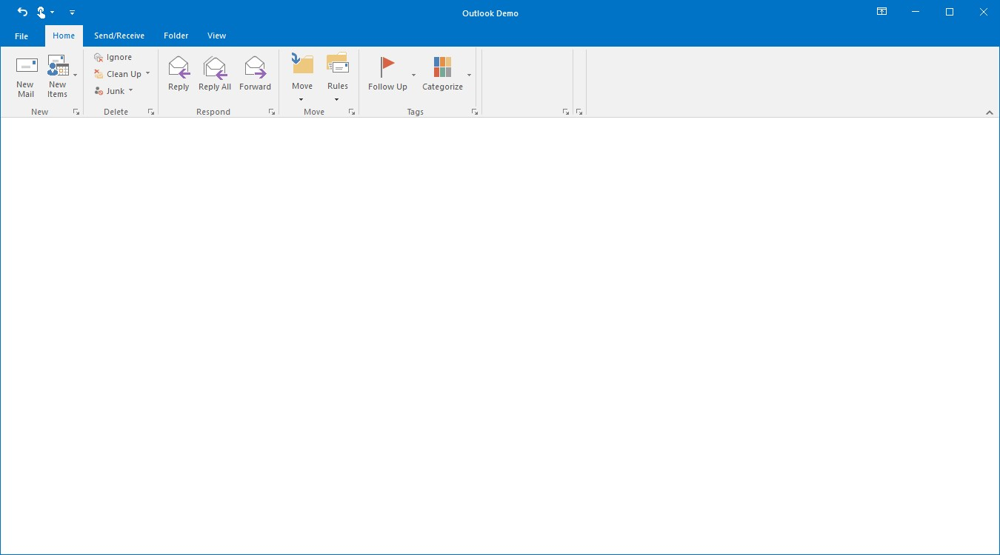

### Text alignment for DropDownMenuItems and SplitButtonMenuItems

Text alignment for the **"ToolStripMenuItem"** can be set using its [`TextAlign`](https://help.syncfusion.com/cr/windowsforms/Syncfusion.Windows.Forms.Tools.ToolStripEx.html) property. To enable this alignment, [`AllowMenuTextAlignment`](https://help.syncfusion.com/cr/windowsforms/Syncfusion.Windows.Forms.Tools.ToolStripEx.html#Syncfusion_Windows_Forms_Tools_ToolStripEx_AllowMenuTextAlignment) of its parent **"ToolStripEx"** must be set **"True"** mandatorily. The various options of [`TextAlign`](https://help.syncfusion.com/cr/windowsforms/Syncfusion.Windows.Forms.Tools.ToolStripEx.html) are listed below.

* TopLeft
* TopCenter
* TopRight
* MiddleLeft
* MiddleCenter
* MiddleRight
* BottomLeft
* BottomCenter
* BottomRight





clipboardToolstrip.AllowMenuTextAlignment = true;
pasteSpecialToolStripMenuItem.TextAlign = ContentAlignment.MiddleRight;
setAsToolStripMenuItem.TextAlign = ContentAlignment.MiddleRight;
setDefaultPasteToolStripMenuItem.TextAlign = ContentAlignment.MiddleRight;




clipboardToolstrip.AllowMenuTextAlignment = True
pasteSpecialToolStripMenuItem.TextAlign = ContentAlignment.MiddleRight
setAsToolStripMenuItem.TextAlign = ContentAlignment.MiddleRight
setDefaultPasteToolStripMenuItem.TextAlign = ContentAlignment.MiddleRight




## Add ToolStripComboBoxEx

ToolStripComboBox control is used to display the list of items, as ComboBox. It can be added to a ToolStripEx directly or through the panel.

### Adding control manually 





private Syncfusion.Windows.Forms.Tools.ToolStripComboBoxEx visualstyleComboBox;
private Syncfusion.Windows.Forms.Tools.ToolStripComboBoxEx schemeComboBox;

this.visualstyleComboBox = new ToolStripComboBoxEx();
this.schemeComboBox = new ToolStripComboBoxEx();

this.visualstyleComboBox.Items.AddRange(new object[] {
"Office 2016 Style",
"Office 2013 Style",
"Touch Style",
"Office 2010 Style",
"Office 2007 Style"});

this.colorSchemeToolStripEx.Items.AddRange(new ToolStripItem[] { visualstyleComboBox, schemeComboBox });





    Private visualstyleComboBox As Syncfusion.Windows.Forms.Tools.ToolStripComboBoxEx
    Private schemeComboBox As Syncfusion.Windows.Forms.Tools.ToolStripComboBoxEx

    Me.visualstyleComboBox = New ToolStripComboBoxEx()
    Me.schemeComboBox = New ToolStripComboBoxEx()

    Me.visualstyleComboBox.Items.AddRange(New Object() {"Office 2016 Style", "Office 2013 Style", "Touch Style", "Office 2010 Style", "Office 2007 Style"})

    Me.colorSchemeToolStripEx.Items.AddRange(New ToolStripItem() {visualstyleComboBox, schemeComboBox})





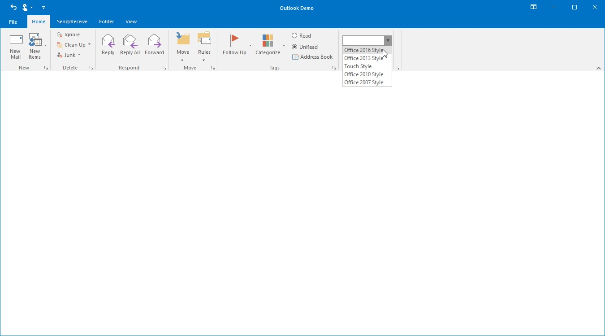

### DropDownStyle

*	Simple – There will be no dropdown button, all the items will be shown below the control.
*	DropDown – Contains a dropdown button and the text in ToolStripComboBoxEx can be edited.
*	DropDownList – Contains a dropdown button and restricts the editing of text in ToolStripComboBoxEx

### ToolStripComboBox

ToolStripComboBox is similar to ToolStripComboBoxEx with some changes in visual styles.

## Add ToolStripGallery

RibbonControlAdv provides options to add a collection of items and store them into a gallery. A gallery can be added to a ToolStripTabItem using Panel Button.

Gallery Items can be added through the Items Collection Editor from the Property grid of ToolStripGallery.

### Scroller Settings

Sets the Scroller for the Gallery, there are two types of scrollers

*	Standard Scroller – A normal scroller which scrolls up and down.
*	Compact Scroller – A Special scroller which has Up and Down arrow and contains another down arrow which opens all the items in the gallery.





//Adding new ToolStripGallery control
private Syncfusion.Windows.Forms.Tools.ToolStripGallery quickGallery;

//Creating an instance of the control
this.quickGallery = new Syncfusion.Windows.Forms.Tools.ToolStripGallery();

//gallery items
Syncfusion.Windows.Forms.Tools.ToolStripGalleryItem movetoGalleryItem = new Syncfusion.Windows.Forms.Tools.ToolStripGalleryItem();
Syncfusion.Windows.Forms.Tools.ToolStripGalleryItem toManagerGalleryItem = new Syncfusion.Windows.Forms.Tools.ToolStripGalleryItem();
Syncfusion.Windows.Forms.Tools.ToolStripGalleryItem teamEmailGalleryItem = new Syncfusion.Windows.Forms.Tools.ToolStripGalleryItem();
Syncfusion.Windows.Forms.Tools.ToolStripGalleryItem replyAndDeleteGalleryItem = new Syncfusion.Windows.Forms.Tools.ToolStripGalleryItem();
Syncfusion.Windows.Forms.Tools.ToolStripGalleryItem doneGalleryItem = new Syncfusion.Windows.Forms.Tools.ToolStripGalleryItem();
Syncfusion.Windows.Forms.Tools.ToolStripGalleryItem createNewGalleryItem = new Syncfusion.Windows.Forms.Tools.ToolStripGalleryItem();

movetoGalleryItem.Image = Image.FromFile(@"Pictures\moveto.png");
movetoGalleryItem.Text = " Move to : ?";
toManagerGalleryItem.Image = Image.FromFile(@"Pictures\ToManager.png");
toManagerGalleryItem.Text = "To Manager";
teamEmailGalleryItem.Image = Image.FromFile(@"Pictures\TeamEmail.png");
teamEmailGalleryItem.Text = "Team Email";
replyAndDeleteGalleryItem.Image = Image.FromFile(@"Pictures\ReplyAndDelete.png");
replyAndDeleteGalleryItem.Text = "Reply and Delete";
doneGalleryItem.Image = Image.FromFile(@"Pictures\done.png");
doneGalleryItem.Text = "Done";
createNewGalleryItem.Image = Image.FromFile(@"Pictures\CreateNew.png");
createNewGalleryItem.Text = " Create New";

//Adding items to the gallery
this.quickGallery.Items.Add(movetoGalleryItem);
this.quickGallery.Items.Add(toManagerGalleryItem);
this.quickGallery.Items.Add(teamEmailGalleryItem);
this.quickGallery.Items.Add(replyAndDeleteGalleryItem);
this.quickGallery.Items.Add(doneGalleryItem);
this.quickGallery.Items.Add(createNewGalleryItem);

//Adding Gallery to ToolStripEx
this.quickstepsToolStripEx.Items.AddRange(new System.Windows.Forms.ToolStripItem[] {
this.quickGallery});





    Private quickGallery As Syncfusion.Windows.Forms.Tools.ToolStripGallery

    Me.quickGallery = New Syncfusion.Windows.Forms.Tools.ToolStripGallery()

    Dim movetoGalleryItem As Syncfusion.Windows.Forms.Tools.ToolStripGalleryItem = New Syncfusion.Windows.Forms.Tools.ToolStripGalleryItem()
    Dim toManagerGalleryItem As Syncfusion.Windows.Forms.Tools.ToolStripGalleryItem = New Syncfusion.Windows.Forms.Tools.ToolStripGalleryItem()
    Dim teamEmailGalleryItem As Syncfusion.Windows.Forms.Tools.ToolStripGalleryItem = New Syncfusion.Windows.Forms.Tools.ToolStripGalleryItem()
    Dim replyAndDeleteGalleryItem As Syncfusion.Windows.Forms.Tools.ToolStripGalleryItem = New Syncfusion.Windows.Forms.Tools.ToolStripGalleryItem()
    Dim doneGalleryItem As Syncfusion.Windows.Forms.Tools.ToolStripGalleryItem = New Syncfusion.Windows.Forms.Tools.ToolStripGalleryItem()
    Dim createNewGalleryItem As Syncfusion.Windows.Forms.Tools.ToolStripGalleryItem = New Syncfusion.Windows.Forms.Tools.ToolStripGalleryItem()

    movetoGalleryItem.Image = Image.FromFile("Pictures\moveto.png")
    movetoGalleryItem.Text = " Move to : ?"
    toManagerGalleryItem.Image = Image.FromFile("Pictures\ToManager.png")
    toManagerGalleryItem.Text = "To Manager"
    teamEmailGalleryItem.Image = Image.FromFile("Pictures\TeamEmail.png")
    teamEmailGalleryItem.Text = "Team Email"
    replyAndDeleteGalleryItem.Image = Image.FromFile("Pictures\ReplyAndDelete.png")
    replyAndDeleteGalleryItem.Text = "Reply and Delete"
    doneGalleryItem.Image = Image.FromFile("Pictures\done.png")
    doneGalleryItem.Text = "Done"
    createNewGalleryItem.Image = Image.FromFile("Pictures\CreateNew.png")
    createNewGalleryItem.Text = " Create New"

    Me.quickGallery.Items.Add(movetoGalleryItem)
    Me.quickGallery.Items.Add(toManagerGalleryItem)
    Me.quickGallery.Items.Add(teamEmailGalleryItem)
    Me.quickGallery.Items.Add(replyAndDeleteGalleryItem)
    Me.quickGallery.Items.Add(doneGalleryItem)
    Me.quickGallery.Items.Add(createNewGalleryItem)

    Me.quickstepsToolStripEx.Items.AddRange(New System.Windows.Forms.ToolStripItem() {Me.quickGallery})





 
## Add ToolStripCheckBox

 ToolStripCheckBox is used to select or unselect options. It provides similar set of functionalities like normal CheckBox control in Ribbon.It can be added to a ToolStripEx directly or through a panel.

 



//Adding new ToolStripCheckBox
private Syncfusion.Windows.Forms.Tools.ToolStripCheckBox showAsConversationCheckBox;

//Creating an instance of the control
this.showAsConversationCheckBox = new Syncfusion.Windows.Forms.Tools.ToolStripCheckBox();

this.showAsConversationCheckBox.Text = "Show As Conversation";

//Adding control to the ToolStripEx
this.messagesToolStripEx.Items.Add(showAsConversationCheckBox);





Private showAsConversationCheckBox As Syncfusion.Windows.Forms.Tools.ToolStripCheckBox

Me.showAsConversationCheckBox = New Syncfusion.Windows.Forms.Tools.ToolStripCheckBox()
Me.showAsConversationCheckBox.Text = "Show As Conversation"

Me.messagesToolStripEx.Items.Add(showAsConversationCheckBox)





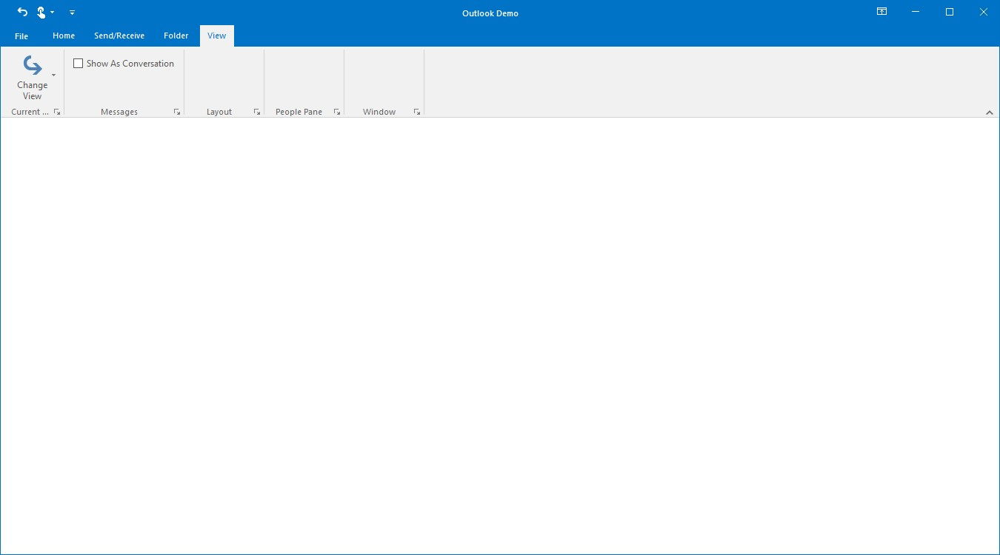

## Add ToolStripTextBox

Ribbon TextBox control provide similar set of functionalities like normal TextBox control in Ribbon Instance. It can be added to a ToolStripEx directly or through a panel.





//Adding new ToolStripTextBox
private System.Windows.Forms.ToolStripTextBox applicationNameTextBox;
private Syncfusion.Windows.Forms.Tools.ToolStripPanelItem applicationPanelItem;

this.applicationNameTextBox = new System.Windows.Forms.ToolStripTextBox();
this.applicationPanelItem = new Syncfusion.Windows.Forms.Tools.ToolStripPanelItem();

this.applicationNameTextBox.Text = "Outlook";
this.applicationNameTextBox.ForeColor = System.Drawing.SystemColors.HotTrack;

this.applicationPanelItem.Items.AddRange(new System.Windows.Forms.ToolStripItem[] {
this.applicationNameTextBox});

this.peopleToolStripEx.Items.AddRange(new System.Windows.Forms.ToolStripItem[] {
this.applicationPanelItem});





Private applicationNameTextBox As System.Windows.Forms.ToolStripTextBox
Private applicationPanelItem As Syncfusion.Windows.Forms.Tools.ToolStripPanelItem

Me.applicationNameTextBox = New System.Windows.Forms.ToolStripTextBox()
Me.applicationPanelItem = New Syncfusion.Windows.Forms.Tools.ToolStripPanelItem()
Me.applicationNameTextBox.Text = "Outlook"
Me.applicationNameTextBox.ForeColor = System.Drawing.SystemColors.HotTrack

Me.applicationPanelItem.Items.AddRange(New System.Windows.Forms.ToolStripItem() {Me.applicationNameTextBox})
Me.peopleToolStripEx.Items.AddRange(New System.Windows.Forms.ToolStripItem() {Me.applicationPanelItem})





In the code, the text box will be added to a panel and the panel will be added to the ToolStripEx. (For more details about panel refer `Arrange items using ToolStripPanelItem`)

## Add ToolStripProgressBar

ToolStripProgressBar can be used to provide a visual cue that the application is indeed working and the task is being completed item. It can be added to a ToolStripEx directly or through a panel.





//Adding new ToolStripProgressBar
private System.Windows.Forms.ToolStripProgressBar loadingProgressBar;
private Syncfusion.Windows.Forms.Tools.ToolStripPanelItem progressbarPanelItem;

//Creating new instance of the control
this.loadingProgressBar = new System.Windows.Forms.ToolStripProgressBar();
this.progressbarPanelItem = new Syncfusion.Windows.Forms.Tools.ToolStripPanelItem();

this.loadingProgressBar.Value = 50;

this.progressbarPanelItem.Items.AddRange(new System.Windows.Forms.ToolStripItem[] {
this.loadingProgressBar});

this.layoutToolStripEx.Items.AddRange(new System.Windows.Forms.ToolStripItem[] {
this.progressbarPanelItem});





Private loadingProgressBar As System.Windows.Forms.ToolStripProgressBar
Private progressbarPanelItem As Syncfusion.Windows.Forms.Tools.ToolStripPanelItem

Me.loadingProgressBar = New System.Windows.Forms.ToolStripProgressBar()
Me.progressbarPanelItem = New Syncfusion.Windows.Forms.Tools.ToolStripPanelItem()

Me.loadingProgressBar.Value = 50

Me.progressbarPanelItem.Items.AddRange(New System.Windows.Forms.ToolStripItem() {Me.loadingProgressBar})

Me.layoutToolStripEx.Items.AddRange(New System.Windows.Forms.ToolStripItem() {Me.progressbarPanelItem})





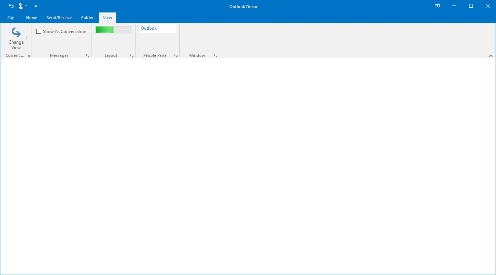

## Add ToolStripLabel

ToolStripLabel can be added to a ToolStripEx directly or through a panel. 





//Adding new ToolStripLabel
private System.Windows.Forms.ToolStripLabel applicationNameLabel;
private System.Windows.Forms.ToolStripLabel loadingToolStripLabel;

this.applicationNameLabel = new System.Windows.Forms.ToolStripLabel();
this.applicationNameLabel.Text = "Application Name";

this.loadingToolStripLabel = new System.Windows.Forms.ToolStripLabel();
this.loadingToolStripLabel.Text = "Loading Attachments";

this.applicationPanelItem.Items.Add(applicationNameLabel);
this.progressbarPanelItem.Items.Add(this.loadingToolStripLabel);





Private applicationNameLabel As System.Windows.Forms.ToolStripLabel
Private loadingToolStripLabel As System.Windows.Forms.ToolStripLabel

Me.applicationNameLabel = New System.Windows.Forms.ToolStripLabel()
Me.applicationNameLabel.Text = "Application Name"
Me.loadingToolStripLabel = New System.Windows.Forms.ToolStripLabel()
Me.loadingToolStripLabel.Text = "Loading Attachments"

Me.applicationPanelItem.Items.Add(applicationNameLabel)
Me.progressbarPanelItem.Items.Add(Me.loadingToolStripLabel)





## Add ToolStripSeparator

Ribbon Separator is used to separate the similar set of Ribbon elements in Ribbon. It can separate RibbonButtons according to their purpose and it can be added to a ToolStripEx directly or through a panel.





//Adding new toolStripSeparator
private System.Windows.Forms.toolStripSeparator toolStripSeparator;

//Creating new instance of the control
this.toolStripSeparator = new toolStripSeparator();

//Adding the control to the ToolStripEx
this.tagsToolStripEx.Items.Add(toolStripSeparator);





Private toolStripSeparator As System.Windows.Forms.toolStripSeparator

Me.toolStripSeparator = New toolStripSeparator()

Me.tagsToolStripEx.Items.Add(toolStripSeparator)





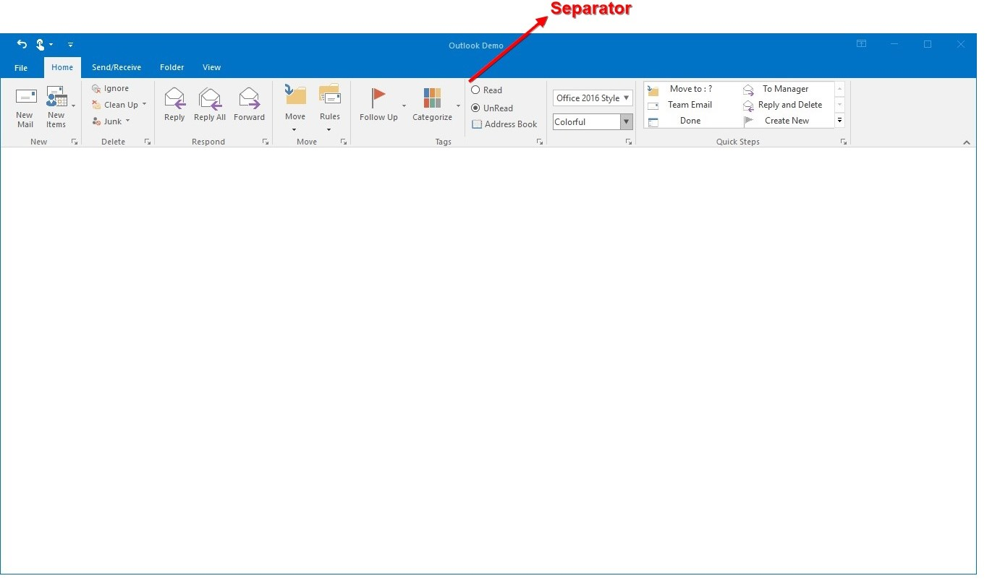

## Arrange item using ToolStripPanelItem

ToolStripPanelItem provides support for aligning the controls in multiple lines. It supports nesting of panels without any limitation on the level of nesting. Not only controls but, any number of panels can be added to a panel.

Using the `RowCount` property of ToolStripPanelItem, controls can be arranged in any number of rows inside a ToolStripPanelItem.

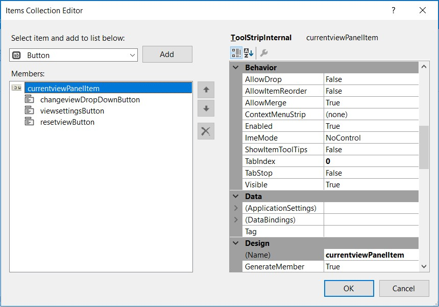

### Adding Controls to Panel Item

Accessing ToolStripPanelItem.Items property, Items Collection Editor dialog pops-up. The item can be added and customized using this dialog.





private Syncfusion.Windows.Forms.Tools.ToolStripPanelItem currentViewPanelItem;
private System.Windows.Forms.ToolStripDropDownButton changeViewDropDownButton;
private System.Windows.Forms.ToolStripDropDownButton viewSettingsButton;
private System.Windows.Forms.ToolStripDropDownButton resetViewButton;

this.currentViewPanelItem = new Syncfusion.Windows.Forms.Tools.ToolStripPanelItem();
this.changeViewDropDownButton = new ToolStripDropDownButton();
this.viewSettingsButton = new ToolStripDropDownButton();
this.resetViewButton = new ToolStripDropDownButton();

//Specifies the number of rows in the panel
this.currentViewPanelItem.RowCount = 1;

this.changeViewDropDownButton.Text = "Change\r\nView";
this.viewSettingsButton.Text = "View\r\nSettings";
this.resetViewButton.Text = "Reset\r\nView";

this.currentViewPanelItem.Items.AddRange(new System.Windows.Forms.ToolStripItem[] {
this.changeViewDropDownButton,
this.viewSettingsButton,
this.resetViewButton});

this.currentViewToolStripEx.Items.AddRange(new System.Windows.Forms.ToolStripItem[] {
this.currentViewPanelItem});





Private currentViewPanelItem As Syncfusion.Windows.Forms.Tools.ToolStripPanelItem
Private changeViewDropDownButton As System.Windows.Forms.ToolStripDropDownButton
Private viewSettingsButton As System.Windows.Forms.ToolStripDropDownButton
Private resetViewButton As System.Windows.Forms.ToolStripDropDownButton

Me.currentViewPanelItem = New Syncfusion.Windows.Forms.Tools.ToolStripPanelItem()
Me.changeViewDropDownButton = New ToolStripDropDownButton()
Me.viewSettingsButton = New ToolStripDropDownButton()
Me.resetViewButton = New ToolStripDropDownButton()

Me.currentViewPanelItem.RowCount = 1
    
Me.changeViewDropDownButton.Text = "Change" & vbCrLf & "View"
Me.viewSettingsButton.Text = "View" & vbCrLf & "Settings"
Me.resetViewButton.Text = "Reset" & vbCrLf & "View"

Me.currentViewPanelItem.Items.AddRange(New System.Windows.Forms.ToolStripItem() {Me.changeViewDropDownButton, Me.viewSettingsButton, Me.resetViewButton})
Me.currentViewToolStripEx.Items.AddRange(New System.Windows.Forms.ToolStripItem() {Me.currentViewPanelItem})





## Add QAT

`QuickAccessToolBar` is a customizable bar that provides one click access to the frequently used items.
By default, the location of QAT will be above the Ribbon, its location can be changed using the property `ShowQuickPanelBelowRibbon`.

### QuickAccessToolBar Items

#### Adding Items to QAT

QAT item can be added by right clicking the ribbon item and choosing `Add to Quick Access Toolbar` from the context menu.

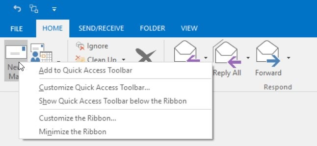

## Add BackStage

Ribbon enables you to work in the document and Backstage enables you to work with the document. Using this you can alter contents and provide end-user options that are related to specific solution requirements.

The following are steps to create a BackStageView:

1. Drag and drop the BackStageView from the Toolbox.

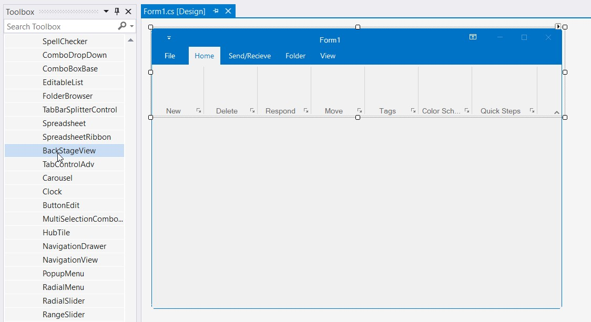

2. Select the backStageView control below the designer and click the smart tag from the focus rectangle and then click `ShowBackstage`.

3. Set BackStageView to RibbonControlAdv

Set a name to the menu button with the property `MenuButtonText` 





this.ribbonControlAdv1.MenuButtonText = "File";





Me.ribbonControlAdv1.MenuButtonText = "File"





4. An Empty BackStage will be created. By clicking the File menu button, BackStage will be shown.

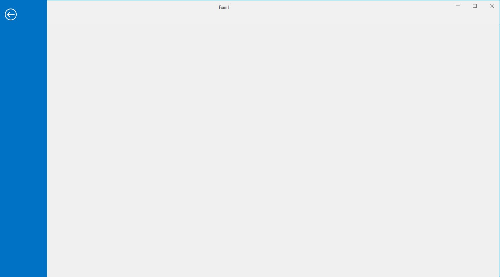

### Add BackStage Tab

BackStage Tab can be added through Smart tag of backstage view.

**Through Coding**





//Creating new backstage tabs
private Syncfusion.Windows.Forms.BackStageTab openExportBackStageTab;
private Syncfusion.Windows.Forms.BackStageTab saveAttachmentsBackStageTab;
private Syncfusion.Windows.Forms.BackStageTab openBackStageTab;
private Syncfusion.Windows.Forms.BackStageTab officeAccountsBackStageTab;
private Syncfusion.Windows.Forms.BackStageTab printBackStageTab;

//Creating new instance and customizing
this.openExportBackStageTab = new Syncfusion.Windows.Forms.BackStageTab();
this.saveAttachmentsBackStageTab = new Syncfusion.Windows.Forms.BackStageTab();
this.openBackStageTab = new Syncfusion.Windows.Forms.BackStageTab();
this.officeAccountsBackStageTab = new Syncfusion.Windows.Forms.BackStageTab();
this.printBackStageTab = new Syncfusion.Windows.Forms.BackStageTab();

this.openExportBackStageTab.Text = "Open/Export";
this.saveAttachmentsBackStageTab.Text = "Save Attachments";
this.openBackStageTab.Text = "Open";
this.officeAccountsBackStageTab.Text = "Office Accounts";
this.printBackStageTab.Text = "Print";

//Adding them to backstage controls
this.backStage1.Controls.Add(openExportBackStageTab);
this.backStage1.Controls.Add(saveAttachmentsBackStageTab);
this.backStage1.Controls.Add(openBackStageTab);
this.backStage1.Controls.Add(officeAccountsBackStageTab);
this.backStage1.Controls.Add(printBackStageTab);





    Private openExportBackStageTab As Syncfusion.Windows.Forms.BackStageTab
    Private saveAttachmentsBackStageTab As Syncfusion.Windows.Forms.BackStageTab
    Private openBackStageTab As Syncfusion.Windows.Forms.BackStageTab
    Private officeAccountsBackStageTab As Syncfusion.Windows.Forms.BackStageTab
    Private printBackStageTab As Syncfusion.Windows.Forms.BackStageTab

    Me.openExportBackStageTab = New Syncfusion.Windows.Forms.BackStageTab()
    Me.saveAttachmentsBackStageTab = New Syncfusion.Windows.Forms.BackStageTab()
    Me.openBackStageTab = New Syncfusion.Windows.Forms.BackStageTab()
    Me.officeAccountsBackStageTab = New Syncfusion.Windows.Forms.BackStageTab()
    Me.printBackStageTab = New Syncfusion.Windows.Forms.BackStageTab()

    Me.openExportBackStageTab.Text = "Open/Export"
    Me.saveAttachmentsBackStageTab.Text = "Save Attachments"
    Me.openBackStageTab.Text = "Open"
    Me.officeAccountsBackStageTab.Text = "Office Accounts"
    Me.printBackStageTab.Text = "Print"

    Me.backStage1.Controls.Add(openExportBackStageTab)
    Me.backStage1.Controls.Add(saveAttachmentsBackStageTab)
    Me.backStage1.Controls.Add(openBackStageTab)
    Me.backStage1.Controls.Add(officeAccountsBackStageTab)
    Me.backStage1.Controls.Add(printBackStageTab)





### Add BackStage Button

BackStage Button can be added through Smart tag of backstage view.

**Through Coding**





//Creating new backstage buttons
private Syncfusion.Windows.Forms.BackStageButton saveAsBackStageButton;
private Syncfusion.Windows.Forms.BackStageButton optionsBackStageButton;
private Syncfusion.Windows.Forms.BackStageButton exitBackStageButton;

//Creating new instance and customizing
this.optionsBackStageButton = new Syncfusion.Windows.Forms.BackStageButton();
this.saveAsBackStageButton = new Syncfusion.Windows.Forms.BackStageButton();
this.exitBackStageButton = new Syncfusion.Windows.Forms.BackStageButton();
this.optionsBackStageButton.Text = "Options";
this.saveAsBackStageButton.Text = "Save As";
this.exitBackStageButton.Text = "Exit";

//Adding them to backstage controls
this.backStage1.Controls.Add(optionsBackStageButton);
this.backStage1.Controls.Add(saveAsBackStageButton);
this.backStage1.Controls.Add(exitBackStageButton);





    Private saveAsBackStageButton As Syncfusion.Windows.Forms.BackStageButton
    Private optionsBackStageButton As Syncfusion.Windows.Forms.BackStageButton
    Private exitBackStageButton As Syncfusion.Windows.Forms.BackStageButton

    Me.optionsBackStageButton = New Syncfusion.Windows.Forms.BackStageButton()
    Me.saveAsBackStageButton = New Syncfusion.Windows.Forms.BackStageButton()
    Me.exitBackStageButton = New Syncfusion.Windows.Forms.BackStageButton()
    Me.optionsBackStageButton.Text = "Options"
    Me.saveAsBackStageButton.Text = "Save As"
    Me.exitBackStageButton.Text = "Exit"

    Me.backStage1.Controls.Add(optionsBackStageButton)
    Me.backStage1.Controls.Add(saveAsBackStageButton)
    Me.backStage1.Controls.Add(exitBackStageButton)





`BackStageSeparator` – a thin line that separates the neighboring items.
Separator can be added through Smart tag as explained in adding backstage button and tab.

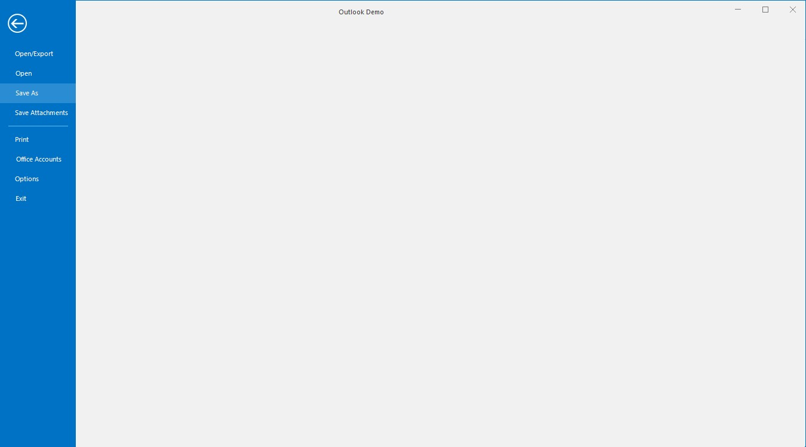

## Add ApplicationMenu

The RibbonControlAdv has the office menu button at the top left corner of the form. Controls can be added to the panels of the office menu button dropdown through designer.

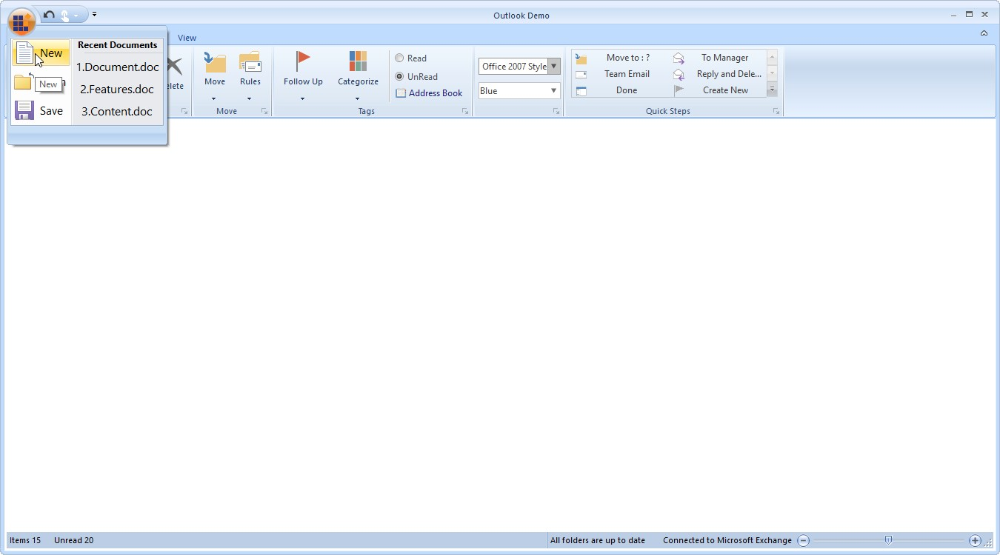

N> ApplicationMenu can be accessed only when ribbon style is Office2007

