# Quick Access Toolbar

`QuickAccessToolBar`**(QAT)** is a customizable bar that provides one click access to the most important and frequently used items.

The visibility of this toolbar can be controlled using `QuickPanelVisible` property.





this.ribbonControlAdv1.QuickPanelVisible = true;





Me.ribbonControlAdv1.QuickPanelVisible = True



 

## Adding Items to QAT

### Add items through ContextMenu

To add item to the QAT through context menu, follow the below steps.

*	Right click on the item.

*	click `Add to Quick Access Toolbar`.

Item will be added to the Quick Access Toolbar.

### Add Items through Customize Window

Items / controls can be added to the QuickAccessToolbar by clicking on the Edit quick items in the smart tag of the RibbonControlAdv. This opens Customize Quick Access Toolbar Dialog which displays the existing tool strip items. You can add the required items to the Quick Access Toolbar.

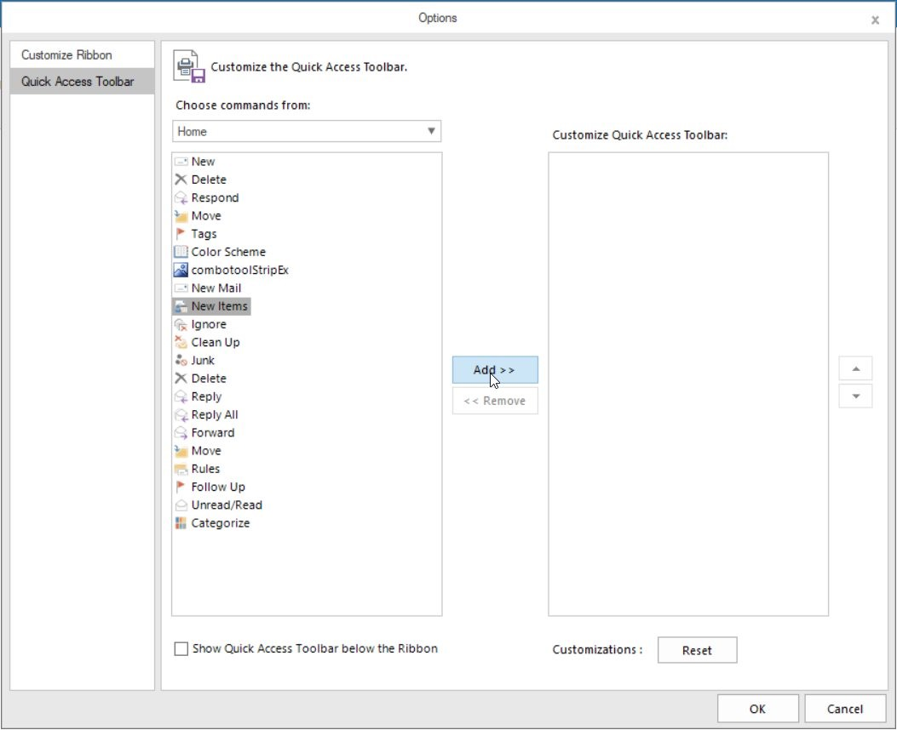

This window can be opened even during run time by opening context menu and select `Customize Quick Access Toolbar`.

### Add Items through Code

To add the item to QAT by using method `AddQuickItem`.





//Adding the button to QAT

this.ribbonControlAdv1.Header.AddQuickItem(new QuickButtonReflectable(boldButton));

//Adding the SplitButton to QAT

this.ribbonControlAdv1.Header.AddQuickItem(new QuickSplitButtonReflectable(fontColorSplitButton));

//Adding the BackStageTab to QAT

this.ribbonControlAdv1.Header.AddQuickItem(new BackStageTabReflectable(backStageTab1));

//Adding the RadioButton to QAT

this.ribbonControlAdv1.Header.AddQuickItem(new QuickRadioButtonReflectable(toolStripRadioButton1));

//Adding the DropDownButton to QAT

this.ribbonControlAdv1.Header.AddQuickItem(new QuickDropDownButtonReflectable(toolStripDropDownButton1));

 //Adding the TextBox to QAT

this.ribbonControlAdv1.Header.AddQuickItem(new QuickTextboxReflectable(toolStripTextBox1));

//Adding the ProgressBar to QAT

this.ribbonControlAdv1.Header.AddQuickItem(new ProgressbarReflectable(toolStripProgressBar1));





'Adding the button to QAT

Me.ribbonControlAdv1.Header.AddQuickItem(New QuickButtonReflectable(boldButton))

'Adding the SplitButton to QAT

Me.ribbonControlAdv1.Header.AddQuickItem(New QuickSplitButtonReflectable(fontColorSplitButton))

'Adding the BackStageTab to QAT

Me.ribbonControlAdv1.Header.AddQuickItem(New BackStageTabReflectable(backStageTab1))

'Adding the RadioButton to QAT

Me.ribbonControlAdv1.Header.AddQuickItem(New QuickRadioButtonReflectable(toolStripRadioButton1))

'Adding the DropDownButton to QAT

Me.ribbonControlAdv1.Header.AddQuickItem(New QuickDropDownButtonReflectable(toolStripDropDownButton1))

'Adding the TextBox to QAT

Me.ribbonControlAdv1.Header.AddQuickItem(New QuickTextboxReflectable(toolStripTextBox1))

'Adding the ProgressBar to QAT

Me.ribbonControlAdv1.Header.AddQuickItem(New ProgressbarReflectable(toolStripProgressBar1))





Added the boldButton and fontColorSplitButton in QAT 

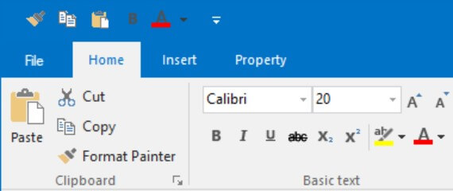

## Add items to QAT in simplified layout

The RibbonControlAdv allows to add items to the Quick Access Toolbar (QAT) with the help of the QAT window or through the context menu shortcut. Items added during normal or simplified layout will always be visible even when switching between layouts. To know more about the simplified layout, refer [here](https://help.syncfusion.com/windowsforms/ribbon/simplifiedlayout).

## Removing QAT Item

QAT item can be removed with right click on item in QAT and select `Remove from Quick Access Toolbar`.

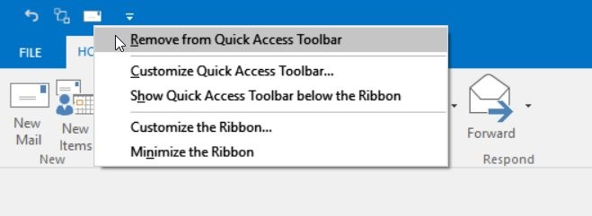

QAT item can also be removed by using Customize window, just select the QAT item in the right panel and select `Remove`.

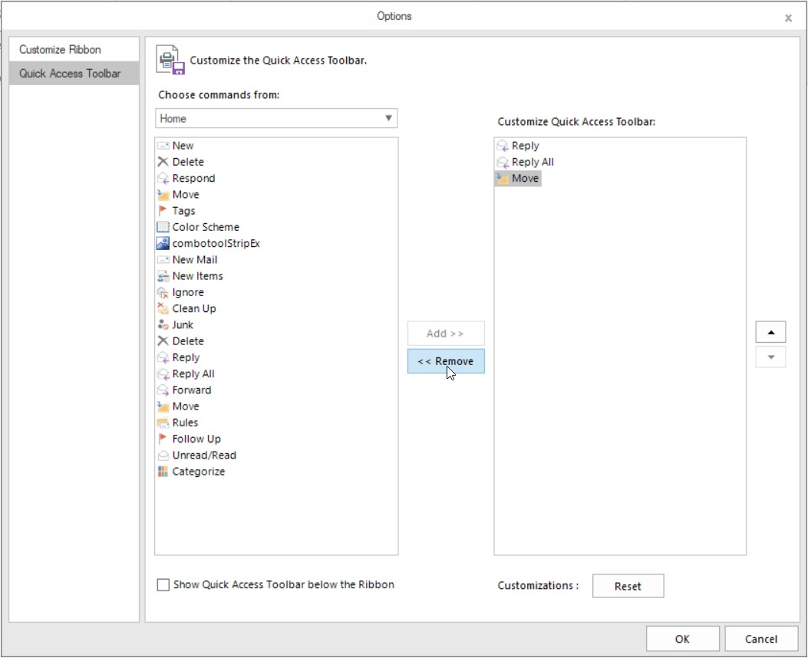

Through code QAT item can be removed at specified index. 





//Removes quick item at 0 index
this.ribbonControlAdv1.Header.QuickItems.RemoveAt(0);





Me.ribbonControlAdv1.Header.QuickItems.RemoveAt(0)





## Restrict Item from adding

An item can be restricted from adding to QAT. This can be achieved by using the method
`SetUseInCustomQuickAccessDialog`. By default, all the items value is set to true.

The following code snippet illustrates the same





//This will restrict toolstripButton1 from adding to QAT.
this.ribbonControlAdv1.SetUseInCustomQuickAccessDialog(toolStripButton1, false);





Me.ribbonControlAdv1.SetUseInCustomQuickAccessDialog(toolStripButton1, False)





## Quick Access Menu

### Add Item to QAT menu

To add item into QAT, please follow the below steps

*	Open the property window of the item to be added and change the property `UseInQuickAccessMenu on ribboncontrolAdv1` as true.

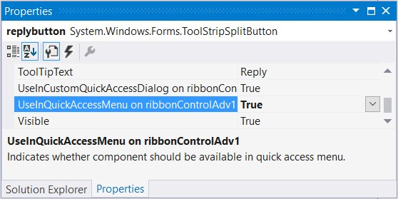

*	The item will be added to Quick Access menu

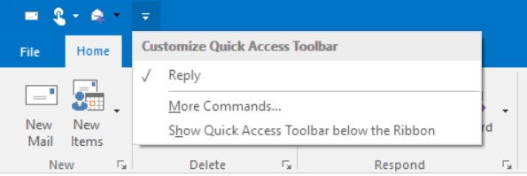

### Hide Quick Access Menu

The visibility of Quick Access Menu can be changed with the property `ShowQuickItemsDropDownButton`, make this property value as false to hide the quick access menu.





//To hide Quick access menu
this.ribbonControlAdv1.ShowQuickItemsDropDownButton = false;





Me.ribbonControlAdv1.ShowQuickItemsDropDownButton = False





## Hide Quick Access Toolbar

To hide Quick Access Toolbar, set the property `QuickPanelVisible` as false.





//To hide Quick access toolbar
this.ribbonControlAdv1.QuickPanelVisible = false;





Me.ribbonControlAdv1.QuickPanelVisible = False





## Image for QAT Item

### Separate image for QAT item

Like MS Outlook we can now give separate icons for the Items added in QuickAccessToolbar collection using the `QATImageProvider`.

Follow the below steps to provide separate QAT image for the ToolstripItems.

1.	Create an instance for the QATImageProvider





// Instance for the QATImageProvider
QATImageProvider qatImageProvider = new QATImageProvider(this.ribbonControlAdv1);





Dim qatImageProvider As QATImageProvider = New QATImageProvider(Me.ribbonControlAdv1)





2.	Set the image for the ToolstripItems.





//Image to be set for ToolstripItems
Image img = Image.FromFile("..//..//Resources/new.png");

// Sets the QAT image to the ToolstripItem
qatImageProvider.SetQATImage(this.newToolStripButton, img); 





Dim img As Image = Image.FromFile("..//..//Resources/new.png")

qatImageProvider.SetQATImage(Me.newToolStripButton, img)





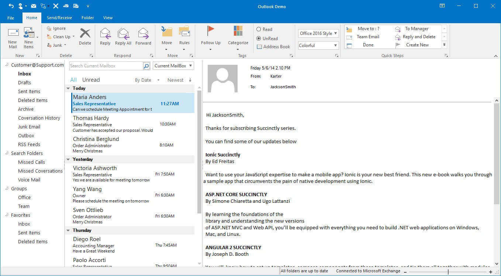

3.	To remove the QAT image set for the ToolstripItems, set null for the image in the QATImageProvider.

When no separate icon is added to the ribbon item, the default icon of that ribbon item will be added in QAT.

## Adding BackStage Item to QAT

New items for QAT can be created through customize window. Follow the steps below to create new QAT items. 

1. Open Customize window (for opening refer `Add items through customize window` in QAT).

2. Select `File` from the `Choose Commands from:` combo box, all the items in the backstage will be shown there and can be added to QAT.

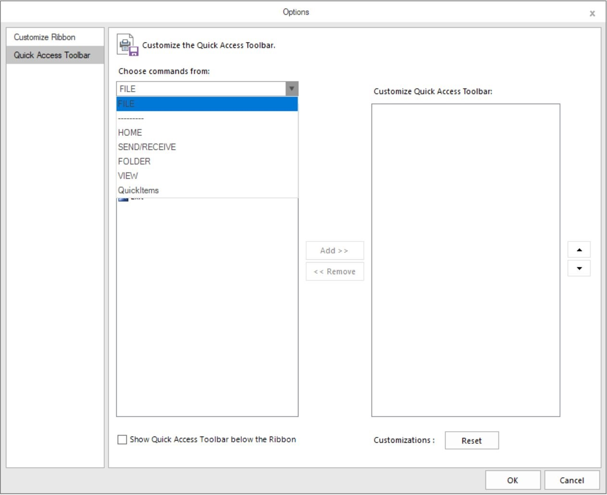

## Create New QAT Item

New items for QAT can be created through customize window. Follow the steps below to create new QAT items.

1. Open the Customize window (refer `Add items through customize window` in QAT) and 

2. Select `QuickItems` from `Choose commands from:` combo box

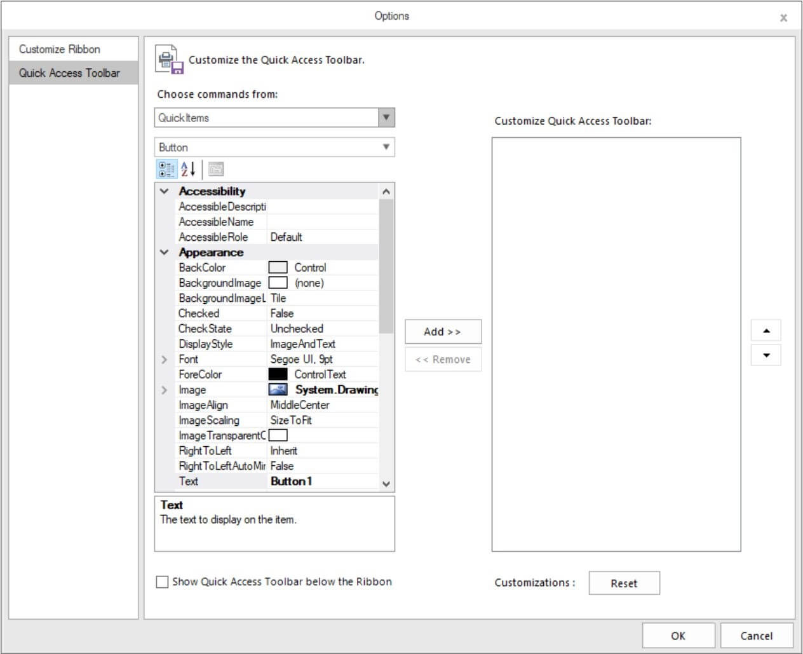

3. Select the type of control in the second Combo box and the customization can be done with property grid below and it can be added to the QAT. 

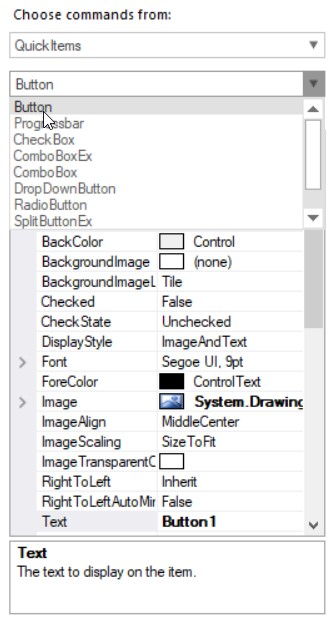

### Through code

New item can be added to QAT by using method `AddQuickItem`.





//Creating a new ToolStripButton
private ToolStripButton undoButton;

//Creating a new instance of the control and customizing the button
this.undoButton = new ToolStripButton();
this.undoButton.Image = Image.FromFile("..//..//Resources//Undo.png");
this.undoButton.ToolTipText = "Undo";

//Adding the button to QAT
this.ribbonControlAdv1.Header.AddQuickItem(undoButton);





Private undoButton As ToolStripButton

Me.undoButton = New ToolStripButton()
Me.undoButton.Image = Image.FromFile("..//..//Resources//Undo.png")
Me.undoButton.ToolTipText = "Undo"

Me.ribbonControlAdv1.Header.AddQuickItem(undoButton)





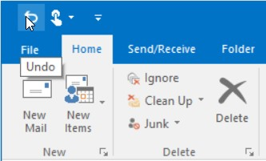

## Events
<table>
<tr>
<th>
Events</th><th>
Description</th><th>
EventArgs</th></tr>

<tr>
<td>
BeforeCustomizeDropDownPopup</td><td>
Occurs before the DropDown of QuickItemsDropDownButton is shown.</td><td>
DropDownEventArgs</td></tr>
<tr>
<td>
AfterCustomizeDropDownPopup</td><td>
Occurs after the DropDown of QuickItemsDropDownButton is shown.</td><td>
EventArgs</td></tr>
<tr>
<td>
RibbonControlAdv1.Header.QuickItems.BeforeAddItem</td><td>
Occurs before ToolStripItem added to the QuickAccessPanel collection.</td><td>
RibbonItemsEventArgs</td></tr>
<tr>
<td>
RibbonControlAdv1.Header.QuickItems.BeforeRemoveItem</td><td>
Occurs before ToolStripItem is removed from the QuickAccessPanel collection.</td><td>
RibbonItemsEventArgs</td></tr>
<tr>
<td>
RibbonControlAdv.Header.QuickItemAdded</td><td>
Occurs when an item is added to the Quick Menu.</td><td>
ToolStripItemEventArgs</td></tr>
</table>