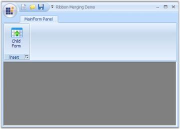

# Ribbon Merging

RibbonControlAdv allows merging the RibbonPanel in a child form to the RibbonPanel in the parent form without a single line of code.

To merge the RibbonPanel in the ChildForm with the RibbonPanel in the parent form, follow the below given steps.

### Through Designer

In a Ribbonform, add a RibbonControlAdv control and the required ToolStripTabItems and the ToolStripEx items.

From the ToolBox, add a RibbonPanelMergeContainer to the ChildForm. ToolStripEx can be added into this by right Clicking on it. 

Now add this ChildForm to the RibbonForm that is the MDIParent of the ChildForm in the default manner.



ChildForm frm = new ChildForm(); 

frm.MdiParent = this; 

frm.Show();





Dim frm As ChildForm = New ChildForm()

frm.MdiParent = Me

frm.Show()



N> The form's IsMDIContainer property must be set as true. Also the MDIParent Ribbonform should host a RibbonControlAdv to get the ChildForm's panels to be merged.

Run the sample to view the ChildForm and the RibbonPanel merged with the RibbonControlAdv in the ParentForm.

 
