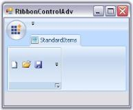

# Title Settings 

This section describes how to customize a normal windows form's title bar appearance using the RibbonControlAdv.

### Form Title Bar Settings

When an application is created, it is usually displayed with the form title bar. The RibbonControlAdv provides option to replace this title bar with the built-in RibbonControlAdv system buttons and this can be enabled by setting the IsFormManager property to true. 



this.ribbonControlAdv1.IsFormManager = true;





Me.ribbonControlAdv1.IsFormManager = True



## Title Settings

The below properties deals with Ribbon title settings.

_Table_ _774_: _Property Table_

<table>
<tr>
<th>
 Property</th><th>
Description</th></tr>
<tr>
<td>
TitleAlignment</td><td>
Sets the alignment of the Title.</td></tr>
<tr>
<td>
TitleFont</td><td>
Sets the font style of the title.</td></tr>
<tr>
<td>
TitleColor</td><td>
Sets the font color of the title.</td></tr>
</table>



this.ribbonControlAdv1.TitleAlignment = Syncfusion.Windows.Forms.Tools.TextAlignment.Center;

this.ribbonControlAdv1.TitleFont = new System.Drawing.Font("Arial", 9.75F);

this.ribbonControlAdv1.TitleColor = Color.GreenYellow;





Me.ribbonControlAdv1.TitleAlignment = Syncfusion.Windows.Forms.Tools.TextAlignment.Center

Me.ribbonControlAdv1.TitleFont = New System.Drawing.Font("Arial", 9.75F)

Me.ribbonControlAdv1.TitleColor = Color.GreenYellow


