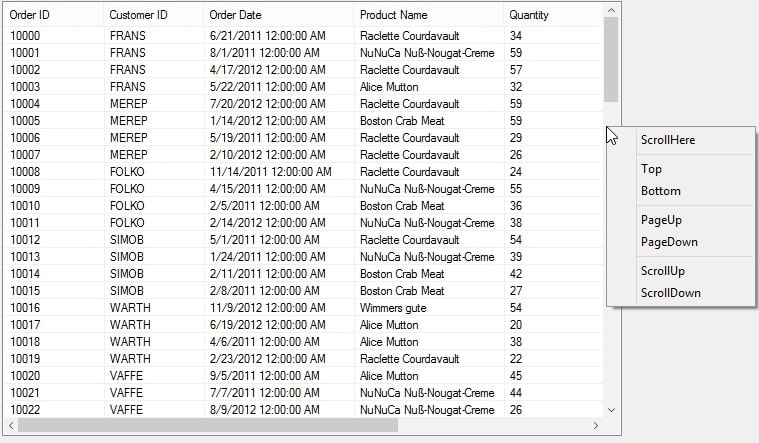

# Context Menu in Windows Forms Scroll Frame (SfScrollFrame)

The `SfScrollFrame` supports UI scrolling through the context menu like the Microsoft scrollbars. It appears when right clicking on both the horizontal and vertical scrollbars. You can scroll left, right, top, and bottom of the control by clicking the corresponding context menu options. 

## Disabling the default context menu for ScrollBar

The default context menu of the SfScrollFrame can be restricted by setting the `Cancel` property of the [ContextMenuShowingEventArgs](https://help.syncfusion.com/cr/windowsforms/Syncfusion.WinForms.Controls.Events.ContextMenuShowingEventArgs.html) to `true` using the `ContextMenuShowing` event.

N> This is applicable for both the horizontal and vertical scrollbars.



this.sfScrollFrame1.VerticalScrollBar.ContextMenuShowing += VerticalScrollBar_ContextMenuShowing;
this.sfScrollFrame1.HorizontalScrollBar.ContextMenuShowing += HorizontalScrollBar_ContextMenuShowing;

void HorizontalScrollBar_ContextMenuShowing(object sender, Syncfusion.WinForms.Scroll.ContextMenuShowingEventArgs e)
{
    // Disables the showing of context menu on the horizontal scrollbar.
    e.Cancel = true;
}

void VerticalScrollBar_ContextMenuShowing(object sender, Syncfusion.WinForms.Scroll.ContextMenuShowingEventArgs e)
{
    // Disables the showing of context menu on the vertical scrollbar.
    e.Cancel = true;
}




### Showing the custom context menu in ScrollBar

The custom context menu can be shown by setting the `ContextMenu` property of the `ContextMenuShowingEventArgs` with custom [ContextMenu](https://help.syncfusion.com/cr/windowsforms/Syncfusion.WinForms.Controls.Events.ContextMenuShowingEventArgs.html#Syncfusion_WinForms_Controls_Events_ContextMenuShowingEventArgs__ctor_System_Drawing_Point_System_Windows_Forms_ContextMenu_) using the [ContextMenuShowing](https://help.syncfusion.com/cr/windowsforms/Syncfusion.WinForms.Controls.ScrollBarBase.html) event.

N> This is applicable for both the horizontal and vertical scrollbars.



this.sfScrollFrame1.HorizontalScrollBar.ContextMenuShowing += HorizontalScrollBar_ContextMenuShowing;
this.sfScrollFrame1.VerticalScrollBar.ContextMenuShowing += VerticalScrollBar_ContextMenuShowing;

void VerticalScrollBar_ContextMenuShowing(object sender, Syncfusion.WinForms.Scroll.ContextMenuShowingEventArgs e)
{
    ContextMenu contextMenu = new System.Windows.Forms.ContextMenu();
    contextMenu.MenuItems.Add("Custom Item");

    //Set the custom context menu for display.
    e.ContextMenu = contextMenu;
}

void HorizontalScrollBar_ContextMenuShowing(object sender, Syncfusion.WinForms.Scroll.ContextMenuShowingEventArgs e)
{
    ContextMenu contextMenu = new System.Windows.Forms.ContextMenu();
    contextMenu.MenuItems.Add("Custom Item");

    //Set the e.Context menu to display the Custom menu item.
    e.ContextMenu = contextMenu;
}



### Adding an additional menu item in default context menu

The custom menu item can be added to the default context menu of the ScrollBars by adding the custom menu items using the [ContextMenu](https://help.syncfusion.com/cr/windowsforms/Syncfusion.WinForms.Controls.Events.ContextMenuShowingEventArgs.html#Syncfusion_WinForms_Controls_Events_ContextMenuShowingEventArgs__ctor_System_Drawing_Point_System_Windows_Forms_ContextMenu_) property of the `ContextMenuShowingEventArgs` with custom `ContextMenu` using the [ContextMenuShowing](https://help.syncfusion.com/cr/windowsforms/Syncfusion.WinForms.Controls.ScrollBarBase.html) event.

N> This is applicable for both the horizontal and vertical scrollbars.



this.sfScrollFrame1.VerticalScrollBar.ContextMenuShowing += VerticalScrollBar_ContextMenuShowing;

void VerticalScrollBar_ContextMenuShowing(object sender, Syncfusion.WinForms.Scroll.ContextMenuShowingEventArgs e)
{
    //Add the custom context menu item to the default context menu.
    MenuItem item = new MenuItem("Display ScrollValue", DisplayScrollValue);
    e.ContextMenu.MenuItems.Add(item);
}



