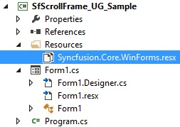
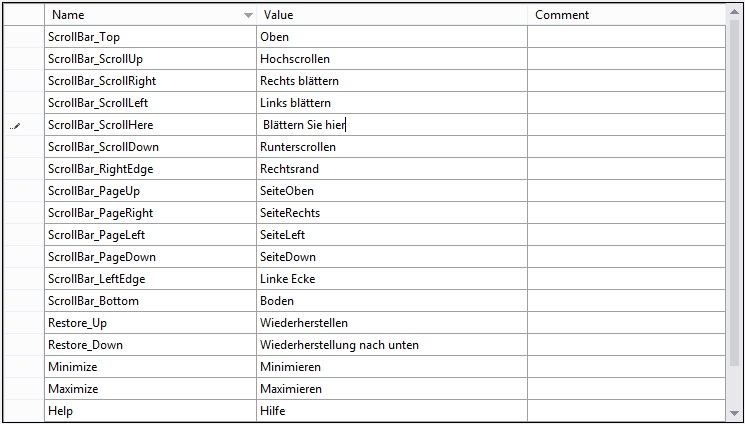
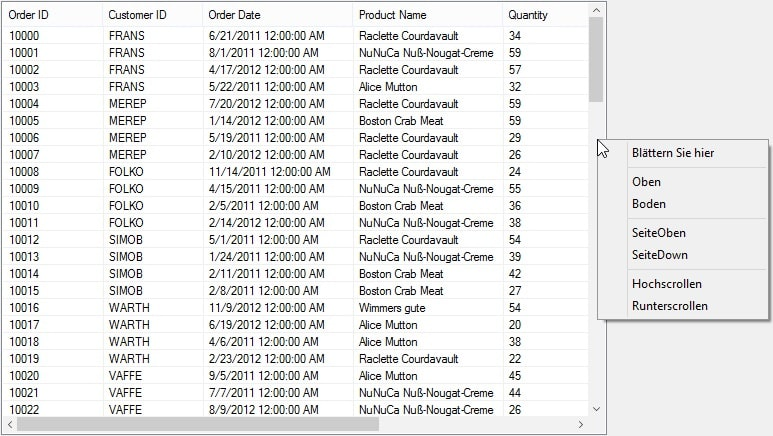
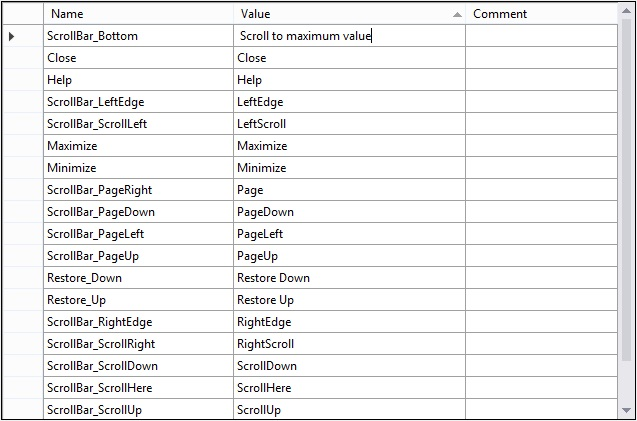
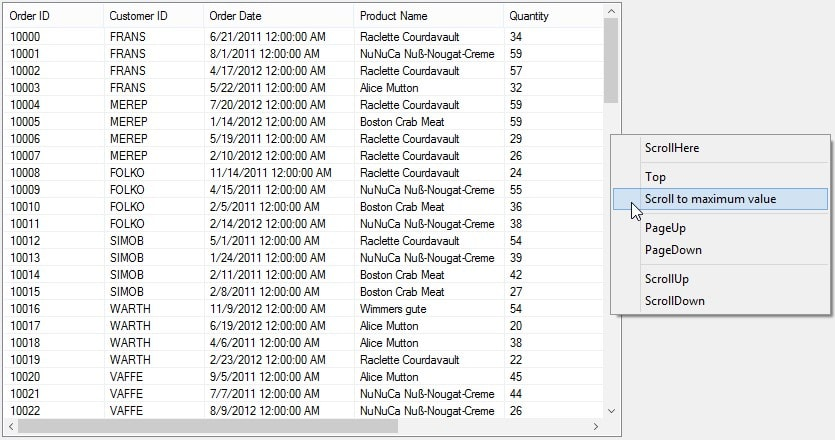

## Localization

Localization is the process of translating the application resources into different language for the specific cultures. You can localize the default context menu of the scrollbars by adding resource file. Application culture can be changed by setting the CurrentUICulture before InitializeComponent() method.

### Adding Resx file to application

To add the resx file for the application, follow steps:

1. Create new folder and named as Resources in your application.

2. Add the default resource file of `SfScrollFrame` into Resources folder. You can download the Syncfusion.Core.WinForms.resx [here](http://www.syncfusion.com/downloads/support/directtrac/general/ze/Syncfusion.Core.WinForms-1127975576).

3. Right-click on the Resources folder, select Add and then NewItem. 

4. In Add New Item wizard, select the Resource File option and name the filename as Syncfusion.Core.WinForms.&lt;culture name&gt;.resx. For example, you have to give name as Syncfusion.Core.WinForms.de-DE.resx for German culture. 

5. The culture name indicates the name of language and country
 

6. Now, select Add option to add the resource file in Resources folder. 

7. Add the Name or Value pair in Resource Designer of Syncfusion.Core.WinForms.de-DE.resx file and change its corresponding value to the corresponding culture.
  

### Editing the default culture resource

You can edit the default resource file by adding it to Resources folder of your application where SfScrollFrame reads the static texts from here. You can download the default resource file from [here](http://www.syncfusion.com/downloads/support/directtrac/general/ze/Syncfusion.Core.WinForms-1127975576).

### Localize when the resource file present in different assembly or different namespace

If resource (.resx) files are added into different assembly other than start up application, call the `SetResources` method of `LocalizationResource` follows.



System.Threading.Thread.CurrentThread.CurrentUICulture = new System.Globalization.CultureInfo("de-DE");
LocalizationResourceBase.SetResources(typeof(ClassName).Assembly, "nameSpace");
InitializeComponent();

