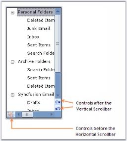

# Getting Started with Windows Forms ScrollersFrame

This section explains attaching the ScrollersFrame to the controls and its basic functionalities.

## Assembly deployment

The following assembly should be added as reference to use the ScrollersFrame in any application.

<table>
<tr>
<th>
Required assembly  </th><th>
Description  </th></tr>
<tr>
<td>
{{'[Syncfusion.Shared.Base](http://help.syncfusion.com/cr/cref_files/windowsforms/Syncfusion.Shared.Base.html#"")'| markdownify }}  </td><td>
Contains style related properties and functionalities for the ScrollersFrame.   </td></tr>
</table>

## Attach ScrollersFrame to control

Add a control to the Windows Forms that should be attached with the Office2007Style scrollbars. Select the control in the [ScrollersFrame.AttachedTo](https://help.syncfusion.com/cr/windowsforms/Syncfusion.Shared.Base~Syncfusion.Windows.Forms.ScrollersFrame~AttachedTo.html) property.



//Attaching Scrolls using AttachedTo property
this.scrollersFrame1.AttachedTo = this.treeViewAdv1;


'Attaching Scrolls using AttachedTo property
Me.scrollersFrame1.AttachedTo = Me.treeViewAdv1



N> This property lists all the controls added to the form. User can select any one control, for which scrolls should be attached.

## Adding controls to the scrollbar

The ControlsAfter and ControlsBefore collection properties are available for the ScrollersFrame that lets you add controls before or after the scrollbars.



//Adding controls to the scrolls through ControlsAfter or ControlsBefore
this.scrollersFrame2.HorizontalScroller.ControlsBefore.Add(buttonAdv3);
this.scrollersFrame2.VerticalScroller.ControlsAfter.Add(buttonAdv1);
this.scrollersFrame2.VerticalScroller.ControlsAfter.Add(buttonAdv2);


'Adding controls to the scrolls through ControlsAfter or ControlsBefore 
Me.scrollersFrame2.HorizontalScroller.ControlsBefore.Add(buttonAdv3)
Me.scrollersFrame2.VerticalScroller.ControlsAfter.Add(buttonAdv1)
Me.scrollersFrame2.VerticalScroller.ControlsAfter.Add(buttonAdv2)



## Programmatic scrolling

The horizontal and vertical scrollers has `Value` property that represents the current position of the scroll box on the scrollbar control at runtime. This value can be changed using the `HorizontalSmallChange` and `VerticalSmallChange` properties.

<table>
<tr>
<th>
Property</th><th>
Description</th></tr>
<tr>
<td>
HorizontalSmallChange</td><td>
Gets or sets a value to be added or subtracted from the <code>Value</code> Property, when the horizontal scroll box is moved a small distance. Default value is 1.</td></tr>
<tr>
<td>
VerticalSmallChange</td><td>
Gets or sets a value to be added or subtracted from the <code>Value</code> Property, when the vertical scroll box is moved a small distance. Default value is 1.</td></tr>
</table>



this.scrollersFrame2.VerticalSmallChange = 25;
this.scrollersFrame2.HorizontalSmallChange = 25;


Me.scrollersFrame2.VerticalSmallChange = 25
Me.scrollersFrame2.HorizontalSmallChange  = 25



## Visual Styles

Visual Styles for the ScrollersFrame control can be edited through the `VisualStyle` property.	

<table>
<tr>
<th>
Property</th><th>
Description</th></tr>
<tr>
<td>
VisualStyle</td><td>
Sets the visual style for the scrollbars. Supported visual styles are Classic, WindowsXP, Office2007, Office2007Generic, and Office2016.</td></tr>
<tr>
<td>
OfficeColorSchemes</td><td>
Sets the Office color schemes for the scrollbars when VisualStyle is set to Office2007 or Office2007Generic style. The color schemes are, blue, silver, and black.</td></tr>
<tr>
<td>
Office2016ColorSchemes
</td>
<td>
Sets the Office2016 color schemes for the scrollbars when setting the VisualStyle to Office2016 style. The color schemes are black, white, colorful, and dark gray.
</td>
</tr>
</table>



this.scrollersFrame1.VisualStyle = Syncfusion.Windows.Forms.ScrollBarCustomDrawStyles.Office2007;


Me.scrollersFrame1.VisualStyle = Syncfusion.Windows.Forms.ScrollBarCustomDrawStyles.Office2007





this.scrollersFrame1.OfficeColorScheme = Syncfusion.Windows.Forms.Office2007ColorScheme.Silver;


Me.scrollersFrame1.OfficeColorScheme = Syncfusion.Windows.Forms.Office2007ColorScheme.Silver



### Custom colors

You can also apply custom colors to the ScrollersFrame by setting the OfficeColorScheme to `Managed` and specify the custom color through the `ApplyManagedColors` method.



this.scrollersFrame1.OfficeColorScheme = Syncfusion.Windows.Forms.Office2007ColorScheme.Managed;
Office2007Colors.ApplyManagedColors(this, Color.LightSkyBlue);


Me.scrollersFrame1.OfficeColorScheme = Syncfusion.Windows.Forms.Office2007ColorScheme.Managed
Office2007Colors.ApplyManagedColors(Me, Color.LightSkyBlue)



