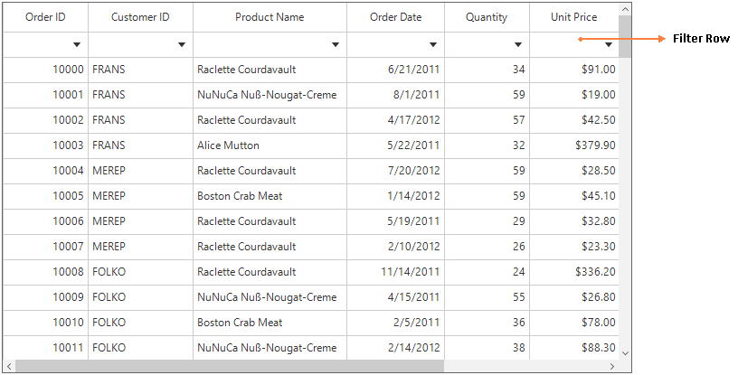
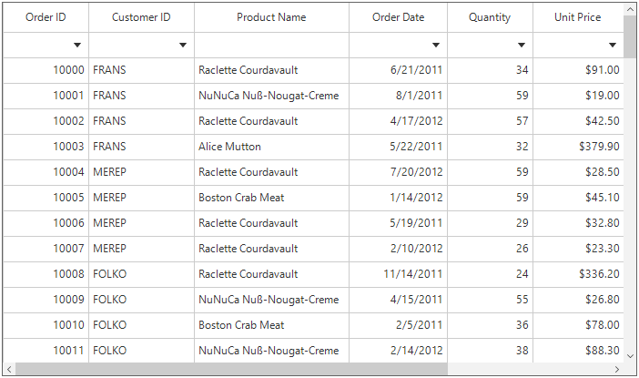
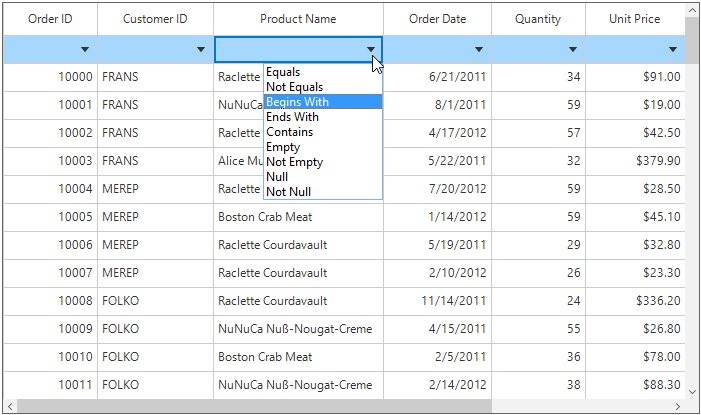
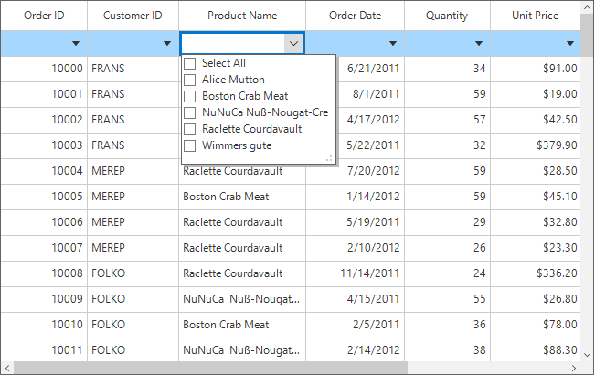
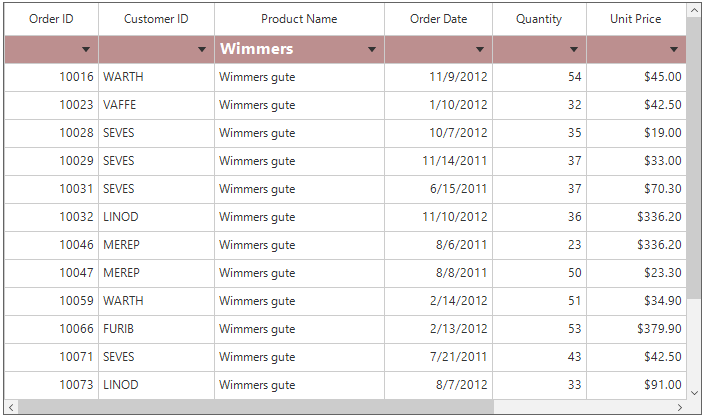
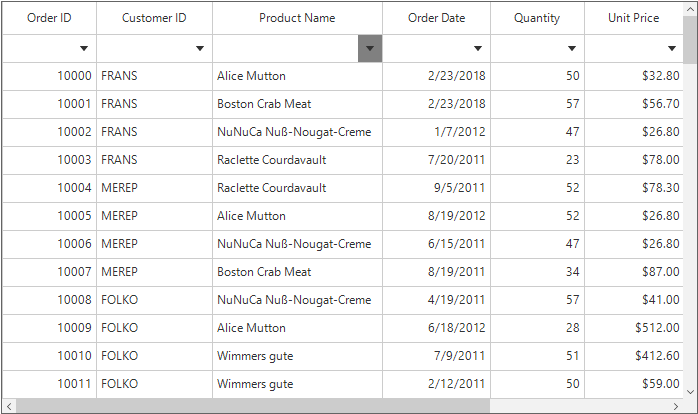

# FilterRow
SfDataGrid provides built-in row (called FilterRow) to filter the records. This FilterRow can be enabled by specifying the position where it should be displayed by setting [SfDataGrid.FilterRowPosition](https://help.syncfusion.com/cr/cref_files/windowsforms/sfdatagrid/Syncfusion.SfDataGrid.WinForms~Syncfusion.WinForms.DataGrid.SfDataGrid~FilterRowPosition.html) property.



//Adding FilterRow at the top
this.sfDataGrid1.FilterRowPosition = RowPosition.Top;



The index of the filter row can be get by using the [GetFilterRowIndex](https://help.syncfusion.com/cr/cref_files/windowsforms/sfdatagrid/Syncfusion.SfDataGrid.WinForms~Syncfusion.WinForms.DataGrid.DataGridIndexResolver~GetFilterRowIndex.html) method.



//Gets the filter row index.
int filterRowIndex = this.sfDataGrid1.GetFilterRowIndex();



You can also check whether the given row index is the filter row index or not by using the [IsFilterRowIndex](https://help.syncfusion.com/cr/cref_files/windowsforms/sfdatagrid/Syncfusion.SfDataGrid.WinForms~Syncfusion.WinForms.DataGrid.DataGridIndexResolver~IsFilterRowIndex.html) helper method.



//To check whether the given row index is the filter row or not.
bool isFilterRow = this.sfDataGrid1.IsFilterRowIndex(filterRowIndex);



## Built-in FilterRow Editor Types
By default, FilterRow loads the editors based on underlying property type to filter the data easily. The default editor of the column can be changed by using [GridColumn.FilterRowEditorType](https://help.syncfusion.com/cr/cref_files/windowsforms/sfdatagrid/Syncfusion.SfDataGrid.WinForms~Syncfusion.WinForms.DataGrid.GridColumnBase~FilterRowEditorType.html) property.



//To load the text box filter for the particular column.
this.sfDataGrid1.Columns[1].FilterRowEditorType = "TextBox";



There are following types of the default filter row editors available in the SfDataGrid,
<table>
<tr>
<td>
FilterRowEditorType
</td>
<td>
Editor Control
</td>
<td>
Renderer
</td>
<td>
Description
</td>
</tr>
<tr>
<td>
TextBox
</td>
<td>
TextBox
</td>
<td>
FilterRowTextBoxRenderer
</td>
<td>
Used to filter the string values.
</td>
</tr>
<tr>
<td>
Numeric
</td>
<td>
SfNumericTextBox
</td>
<td>
FilterRowNumericRenderer
</td>
<td>
Used to filter the numeric values.
</td>
</tr>
<tr>
<td>
CheckBox
</td>
<td>
-
</td>
<td>
FilterRowCheckBoxCellRenderer
</td>
<td>
Used to filter the Boolean values.
</td>
</tr>
<tr>
<td>
DateTime
</td>
<td>
SfDataTiemEdit
</td>
<td>
FilterRowDateTimeCellRenderer
</td>
<td>
Used to filter the DateTime values.
</td>
</tr>
</table>

## FilterRow Options
Based on the editor type, FilterRowCell displays the filter conditions in dropdown where you can easily switch between the conditions to filter the data. The filter options can be disabled by setting [GridColumn.ShowFilterRowOptions](https://help.syncfusion.com/cr/cref_files/windowsforms/sfdatagrid/Syncfusion.SfDataGrid.WinForms~Syncfusion.WinForms.DataGrid.GridColumnBase~ShowFilterRowOptions.html) property to `false`. 



// Collapse the visibility of the FilterRow options
this.sfDataGrid1.Columns[2].ShowFilterRowOptions = false;



Below are the filter conditions supported by different filter row editors in SfDataGrid.
<table>
<tr>
<td>
{{'**Numeric Editor**'| markdownify }}
</td>
<td>
{{'**TextBox Editor**'| markdownify }}
</td>
<td>
{{'**DateTime Editor**'| markdownify }}
</td>
<td>
{{'**CheckBox Editor**'| markdownify }}
</td>
</tr>
<tr>
<td>
When integer, double, short, decimal, byte or long are bound to the 
GridColumn, the Numeric editor type is loaded in FilterRowCell.
</td>
<td>
When string value is bounded to the 
GridColumn or the items is dynamic, then TextBox editor type is loaded in FilterRowCell.
</td>
<td>
When DateTime type is bounded to the 
GridColumn, then DateTime editor is loaded in FilterRowCell.
</td>
<td>
When Boolean type is bounded to the 
GridColumn , then CheckBoxEditor is loaded in FilterRowCell
</td>
</tr>
<tr>
<td>
The default filter condition is Equals, the below filter conditions are available in numeric filter.
1. Equals
2. Not Equal
3. Null
4. Not Null
5. Less Than
6. Less Than or Equal
7. Greater Than
8. Greater Than or Equal
</td>
<td>
The default filter condition is Begins With, the below filter conditions are available in text filter.
1. Equals
2. Not Equal
3. Null
4. Not Null
5. Begins With
6. Ends With
7. Contains
8. Empty
9. Not Empty
</td>
<td>
The default filter condition is Equals, the below filter conditions are available in date time filter.
1. Equals
2. Not Equal
3. Null
4. Not Null
5. Before
6. Before or Equal
7. After
8. After or Equal
</td>
<td>
Always equals filter condition will be applied for filtering the CheckBox value.
</td>
</tr>
</table>

## Filtering null values 
The null values of the columns can be filtered by using the filter row options such as Null and Not Null. This options is enabled by default for all the filter row editors. To disable the null filter options from the filter options list, use the [AllowBlankFilters](https://help.syncfusion.com/cr/cref_files/windowsforms/sfdatagrid/Syncfusion.SfDataGrid.WinForms~Syncfusion.WinForms.DataGrid.GridColumnBase~AllowBlankFilters.html) property of the GridColumn. The default value of this property is `true`.



// To remove the null filter conditions from the FilterRow options.
this.sfDataGrid1.Columns[1].AllowBlankFilters = false;



## Immediate Filtering
By default, filters are applied to the columns when moving to other cells or pressing enter key. This can be changed to apply the filtering while typing by setting the [GridColumn.ImmediateUpdateColumnFilter](https://help.syncfusion.com/cr/cref_files/windowsforms/sfdatagrid/Syncfusion.SfDataGrid.WinForms~Syncfusion.WinForms.DataGrid.GridColumnBase~ImmediateUpdateColumnFilter.html) as true.



// Enable the immediate filtering for the column.
this.sfDataGrid1.Columns[0].ImmediateUpdateColumnFilter = true;



### Delay Immediate Filtering
By default, filtering will be applied immediately while entering the character in the filter row when the ` ImmediateUpdateColumnFilter` is enabled. The time delay for applying the filtering can be set by using the [FilterDelay](https://help.syncfusion.com/cr/cref_files/windowsforms/sfdatagrid/Syncfusion.SfDataGrid.WinForms~Syncfusion.WinForms.DataGrid.SfDataGrid~FilterDelay.html) property.



this.sfDataGrid.FilterRowPosition = RowPosition.Top;
this.sfDataGrid.Columns[0].ImmediateUpdateColumnFilter = true;

// Set the filter delay for the SfDataGrid.
this.sfDataGrid.FilterDelay = 1000;



## Disable the Filtering for Particular FilterRow cell
By default the filtering will be applied based on the edited value of the filter row cell. To avoid the filtering through the filter row cell, cancel the editing of the cell using the [CurrentCellBeginEdit](https://help.syncfusion.com/cr/cref_files/windowsforms/sfdatagrid/Syncfusion.SfDataGrid.WinForms~Syncfusion.WinForms.DataGrid.SfDataGrid~CurrentCellBeginEdit_EV.html) event.



this.sfDataGrid1.CurrentCellBeginEdit += sfDataGrid1_CurrentCellBeginEdit;
void sfDataGrid1_CurrentCellBeginEdit(object sender, CurrentCellBeginEditEventArgs e)
{
    //Cancel the editing for filter row cell in OrderID Column
    if (e.DataColumn.GridColumn.MappingName == "OrderID" && this.sfDataGrid1.IsFilterRowIndex(e.DataRow.RowIndex))
    {
        e.Cancel = true;
    }
}



## Appearance
The fore color and back color of the filter row can be customized by using the [FilterRowStyle](https://help.syncfusion.com/cr/cref_files/windowsforms/sfdatagrid/Syncfusion.SfDataGrid.WinForms~Syncfusion.WinForms.DataGrid.Styles.DataGridStyle~FilterRowStyle.html) property.



this.sfDataGrid1.Style.FilterRowStyle.BackColor = Color.RosyBrown;
this.sfDataGrid1.Style.FilterRowStyle.TextColor = Color.White;
this.sfDataGrid1.Style.FilterRowStyle.Font = new GridFontInfo(new Font("Segoe UI", 12f, FontStyle.Bold));



## Customizing FilterRow CellRenderer
SfDataGrid allows to customize the filter row renderer behavior by overriding the corresponding renderer associated with the filter row cell. Each renderer have a set of virtual methods for handling the filter row behaviors. It also provides the support to create a new renderers instead of overriding the existing renderer. 
The default TextBox editor behavior can be customized by overriding [FilterRowTextBoxCellRenderer](https://help.syncfusion.com/cr/cref_files/windowsforms/sfdatagrid/Syncfusion.SfDataGrid.WinForms~Syncfusion.WinForms.DataGrid.RowFilter.FilterRowTextBoxCellRenderer.html) class and add the custom renderer to [FilterRowCellRenderers](https://help.syncfusion.com/cr/cref_files/windowsforms/sfdatagrid/Syncfusion.SfDataGrid.WinForms~Syncfusion.WinForms.DataGrid.SfDataGrid~FilterRowCellRenderers.html) collection.



public class FilterRowTextBoxRendererExt : FilterRowTextBoxCellRenderer
{
    public FilterRowTextBoxRendererExt()
        : base()
    {}            

    protected override void DrawDropDownButton(Graphics g, Rectangle rect, Color backColor)
    {
        //Modify the back color for the drop down button.
        backColor = Color.Gray;
        base.DrawDropDownButton(g, rect, backColor);
    }
}



Adding custom filter row cell renderer to the `FilterRowCellRenderers` collection on the button click,



private void btnApplyFilter_Click(object sender, System.EventArgs e)
{
    //Add the custom renderer to the FilterRowCellRenderers collection.
    this.sfDataGrid.FilterRowCellRenderers.Add("CustomEditor", new FilterRowTextBoxRendererExt());

    //Set the Custom filter row renderer for the column.
    sfDataGrid.Columns[2].FilterRowEditorType = "CustomEditor";
    sfDataGrid.FilterRowPosition = RowPosition.Top;            
}



