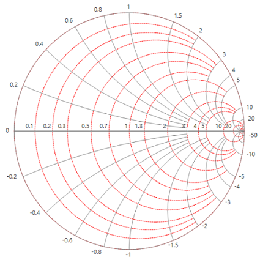
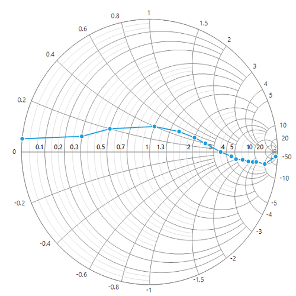
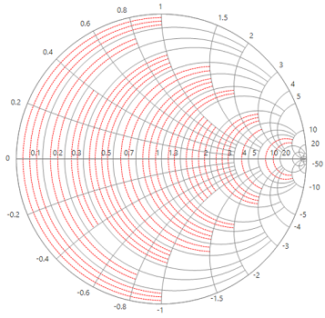
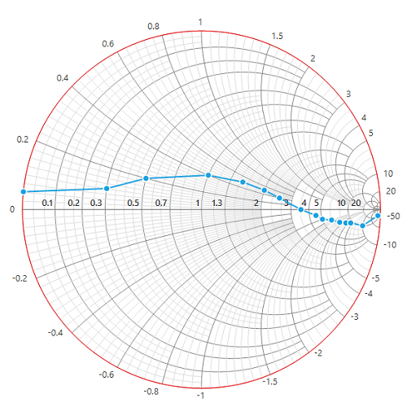
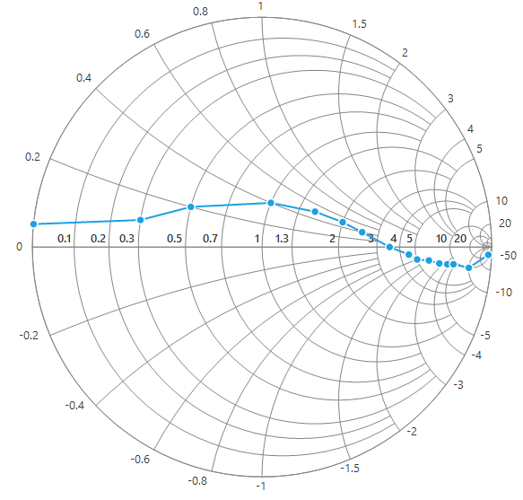
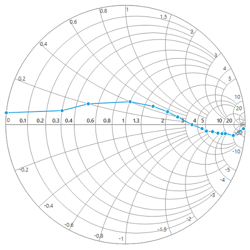

# Axes in Windows Forms Smith Chart (SfSmithChart)

Smith chart supports the following two axes for plotting:

* Horizontal axis
* Radial axis

## Horizontal axis

Horizontal axis scale is used to plot the normalized resistance values on impedance Smith chart and normalized conductance values on admittance Smith chart.

The following topics explain the customization of horizontal axis.

## Major gridlines customization

### Visibility

Major gridlines visibility can be customized using the [`MajorGridlinesVisible`](https://help.syncfusion.com/cr/windowsforms/Syncfusion.WinForms.SmithChart.ChartAxis.html#Syncfusion_WinForms_SmithChart_ChartAxis_MajorGridlinesVisible) property.





sfSmithChart1.HorizontalAxis.MajorGridlinesVisible = false;





sfSmithChart1.HorizontalAxis.MajorGridlinesVisible = False





### Style

Major gridlines style can be customized using the properties [`MajorGridlinesDashStyle`](https://help.syncfusion.com/cr/windowsforms/Syncfusion.WinForms.SmithChart.AxisStyle.html#Syncfusion_WinForms_SmithChart_AxisStyle_MajorGridlinesDashStyle), [`MajorGridlinesColor`](https://help.syncfusion.com/cr/windowsforms/Syncfusion.WinForms.SmithChart.AxisStyle.html#Syncfusion_WinForms_SmithChart_AxisStyle_MajorGridlinesColor), [`MajorGridlinesWidth`](https://help.syncfusion.com/cr/windowsforms/Syncfusion.WinForms.SmithChart.AxisStyle.html#Syncfusion_WinForms_SmithChart_AxisStyle_MajorGridlinesWidth) as you see in the below code snippet.





sfSmithChart1.HorizontalAxis.Style.MajorGridlinesDashStyle = System.Drawing.Drawing2D.DashStyle.Dash;

sfSmithChart1.HorizontalAxis.Style.MajorGridlinesColor = Color.Red;

sfSmithChart1.HorizontalAxis.Style.MajorGridlinesWidth = 1;





sfSmithChart1.HorizontalAxis.Style.MajorGridlinesDashStyle = System.Drawing.Drawing2D.DashStyle.Dash

sfSmithChart1.HorizontalAxis.Style.MajorGridlinesColor = Color.Red

sfSmithChart1.HorizontalAxis.Style.MajorGridlinesWidth = 1





## Minor gridlines customization

### Visibility

By default, the minor gridlines are not added to axis. The visibility of the minor gridlines can be controlled by using the [`MinorGridlinesVisible`](https://help.syncfusion.com/cr/windowsforms/Syncfusion.WinForms.SmithChart.ChartAxis.html#Syncfusion_WinForms_SmithChart_ChartAxis_MinorGridlinesVisible) property.





sfSmithChart1.HorizontalAxis.MinorGridlinesVisible = true;





sfSmithChart1.HorizontalAxis.MinorGridlinesVisible = True





### Style

Minor gridlines style can be customized by using the [`MinorGridlinesDashStyle`](https://help.syncfusion.com/cr/windowsforms/Syncfusion.WinForms.SmithChart.AxisStyle.html#Syncfusion_WinForms_SmithChart_AxisStyle_MinorGridlinesDashStyle),  [`MinorGridlinesColor`](https://help.syncfusion.com/cr/windowsforms/Syncfusion.WinForms.SmithChart.AxisStyle.html#Syncfusion_WinForms_SmithChart_AxisStyle_MinorGridlinesColor), [`MinorGridlinesWidth`](https://help.syncfusion.com/cr/windowsforms/Syncfusion.WinForms.SmithChart.AxisStyle.html#Syncfusion_WinForms_SmithChart_AxisStyle_MinorGridlinesWidth) and [`MinorGridlinesCount`](https://help.syncfusion.com/cr/windowsforms/Syncfusion.WinForms.SmithChart.ChartAxis.html#Syncfusion_WinForms_SmithChart_ChartAxis_MinorGridlinesCount) properties as shown in the following code snippet.





sfSmithChart1.HorizontalAxis.MinorGridlinesVisible = true;

sfSmithChart1.HorizontalAxis.Style.MinorGridlinesDashStyle = System.Drawing.Drawing2D.DashStyle.Dash;

sfSmithChart1.HorizontalAxis.Style.MinorGridlinesColor = Color.Red;

sfSmithChart1.HorizontalAxis.Style.MinorGridlinesWidth = 1;

sfSmithChart1.HorizontalAxis.MinorGridlinesCount = 10;





sfSmithChart1.HorizontalAxis.MinorGridlinesVisible = True

sfSmithChart1.HorizontalAxis.Style.MinorGridlinesDashStyle = System.Drawing.Drawing2D.DashStyle.Dash

sfSmithChart1.HorizontalAxis.Style.MinorGridlinesColor = Color.Red

sfSmithChart1.HorizontalAxis.Style.MinorGridlinesWidth = 1

sfSmithChart1.HorizontalAxis.MinorGridlinesCount = 10





## Axis line 

To customize the visibility and appearance of an axis line, use the [`AxisLineVisible`](https://help.syncfusion.com/cr/windowsforms/Syncfusion.WinForms.SmithChart.ChartAxis.html#Syncfusion_WinForms_SmithChart_ChartAxis_AxisLineVisible), [`AxisLineDashStyle`](https://help.syncfusion.com/cr/windowsforms/Syncfusion.WinForms.SmithChart.AxisStyle.html#Syncfusion_WinForms_SmithChart_AxisStyle_AxisLineDashStyle) and [`AxisLineColor`](https://help.syncfusion.com/cr/windowsforms/Syncfusion.WinForms.SmithChart.AxisStyle.html#Syncfusion_WinForms_SmithChart_AxisStyle_AxisLineColor) properties.

The following code snippet represents the axis line color customization.





sfSmithChart1.HorizontalAxis.Style.AxisLineColor = Color.Red; 





sfSmithChart1.HorizontalAxis.Style.AxisLineColor = Color.Red





## Label Placement

The [`LabelPlacement`](https://help.syncfusion.com/cr/windowsforms/Syncfusion.WinForms.SmithChart.ChartAxis.html#Syncfusion_WinForms_SmithChart_ChartAxis_LabelPlacement) property is used to position the axis label either inside or outside of the chart plotting area. By default, the labels are placed outside.





sfSmithChart1.HorizontalAxis.LabelPlacement = LabelPlacement.Inside;





sfSmithChart1.HorizontalAxis.LabelPlacement = LabelPlacement.Inside





## Label intersect action

When the axis labels overlap with each other based on the chart dimensions and label size, you can avoid the overlapping by using the [`LabelIntersectAction`](https://help.syncfusion.com/cr/windowsforms/Syncfusion.WinForms.SmithChart.ChartAxis.html#Syncfusion_WinForms_SmithChart_ChartAxis_LabelIntersectAction) property. The default value of the [`LabelIntersectAction`](https://help.syncfusion.com/cr/windowsforms/Syncfusion.WinForms.SmithChart.ChartAxis.html#Syncfusion_WinForms_SmithChart_ChartAxis_LabelIntersectAction) property is Hide.





sfSmithChart1.HorizontalAxis.LabelIntersectAction = LabelIntersectActions.Hide;





sfSmithChart1.HorizontalAxis.LabelIntersectAction = LabelIntersectActions.Hide





## Radial Axis

Radial axis scale is used to plot the normalized reactance values in impedance Smith chart and normalized susceptance values in admittance Smith chart.

## Major gridlines customization

### Visibility

Major gridlines visibility can be customized using the [`MajorGridlinesVisible`](https://help.syncfusion.com/cr/windowsforms/Syncfusion.WinForms.SmithChart.ChartAxis.html#Syncfusion_WinForms_SmithChart_ChartAxis_MajorGridlinesVisible) property.





sfSmithChart1.RadialAxis.MajorGridlinesVisible = false;





sfSmithChart1.RadialAxis.MajorGridlinesVisible = False





### Style

Major gridlines style can be customized using the [`MajorGridlinesDashStyle`](https://help.syncfusion.com/cr/windowsforms/Syncfusion.WinForms.SmithChart.AxisStyle.html#Syncfusion_WinForms_SmithChart_AxisStyle_MajorGridlinesDashStyle), [`MajorGridlinesColor`](https://help.syncfusion.com/cr/windowsforms/Syncfusion.WinForms.SmithChart.AxisStyle.html#Syncfusion_WinForms_SmithChart_AxisStyle_MajorGridlinesColor), [`MajorGridlinesWidth`](https://help.syncfusion.com/cr/windowsforms/Syncfusion.WinForms.SmithChart.AxisStyle.html#Syncfusion_WinForms_SmithChart_AxisStyle_MajorGridlinesWidth) properties as shown in the following code snippet.





sfSmithChart1.RadialAxis.Style.MajorGridlinesDashStyle = System.Drawing.Drawing2D.DashStyle.Dash;

sfSmithChart1.RadialAxis.Style.MajorGridlinesColor = Color.Red;

sfSmithChart1.RadialAxis.Style.MajorGridlinesWidth = 1;





sfSmithChart1.RadialAxis.Style.MajorGridlinesDashStyle = System.Drawing.Drawing2D.DashStyle.Dash

sfSmithChart1.RadialAxis.Style.MajorGridlinesColor = Color.Red

sfSmithChart1.RadialAxis.Style.MajorGridlinesWidth = 1





## Minor gridlines customization

### Visibility

Minor grid lines visibility can be customized using the [`MinorGridlinesVisible`](https://help.syncfusion.com/cr/windowsforms/Syncfusion.WinForms.SmithChart.ChartAxis.html#Syncfusion_WinForms_SmithChart_ChartAxis_MinorGridlinesVisible) property .





sfSmithChart1.RadialAxis.MinorGridlinesVisible = true;





sfSmithChart1.RadialAxis.MinorGridlinesVisible = True





### Style

Minor gridlines style can be customized using the [`MinorGridlinesDashStyle`](https://help.syncfusion.com/cr/windowsforms/Syncfusion.WinForms.SmithChart.AxisStyle.html#Syncfusion_WinForms_SmithChart_AxisStyle_MinorGridlinesDashStyle),  [`MinorGridlinesColor`](https://help.syncfusion.com/cr/windowsforms/Syncfusion.WinForms.SmithChart.AxisStyle.html#Syncfusion_WinForms_SmithChart_AxisStyle_MinorGridlinesColor), [`MinorGridlinesWidth`](https://help.syncfusion.com/cr/windowsforms/Syncfusion.WinForms.SmithChart.AxisStyle.html#Syncfusion_WinForms_SmithChart_AxisStyle_MinorGridlinesWidth) and [`MinorGridlinesCount`](https://help.syncfusion.com/cr/windowsforms/Syncfusion.WinForms.SmithChart.ChartAxis.html#Syncfusion_WinForms_SmithChart_ChartAxis_MinorGridlinesCount) properties as shown in the following code snippet.





sfSmithChart1.RadialAxis.MinorGridlinesVisible = true;

sfSmithChart1.RadialAxis.Style.MinorGridlinesColor = Color.PaleVioletRed;

sfSmithChart1.RadialAxis.Style.MinorGridlinesDashStyle = System.Drawing.Drawing2D.DashStyle.Dash;

sfSmithChart1.RadialAxis.Style.MinorGridlinesWidth = 1;

sfSmithChart1.RadialAxis.MinorGridlinesCount = 10;





sfSmithChart1.RadialAxis.MinorGridlinesVisible = True

sfSmithChart1.RadialAxis.Style.MinorGridlinesColor = Color.PaleVioletRed

sfSmithChart1.RadialAxis.Style.MinorGridlinesDashStyle = System.Drawing.Drawing2D.DashStyle.Dash

sfSmithChart1.RadialAxis.Style.MinorGridlinesWidth = 1

sfSmithChart1.RadialAxis.MinorGridlinesCount = 10





## Axis line 

To customize the visibility and appearance of an axis line, use the [`AxisLineVisible`](https://help.syncfusion.com/cr/windowsforms/Syncfusion.WinForms.SmithChart.ChartAxis.html#Syncfusion_WinForms_SmithChart_ChartAxis_AxisLineVisible), [`AxisLineDashStyle`](https://help.syncfusion.com/cr/windowsforms/Syncfusion.WinForms.SmithChart.AxisStyle.html#Syncfusion_WinForms_SmithChart_AxisStyle_AxisLineDashStyle), [`AxisLineColor`](https://help.syncfusion.com/cr/windowsforms/Syncfusion.WinForms.SmithChart.AxisStyle.html#Syncfusion_WinForms_SmithChart_AxisStyle_AxisLineColor) properties.

The following code snippet represents the axis line color customization.





sfSmithChart1.RadialAxis.Style.AxisLineColor = Color.Red;





sfSmithChart1.RadialAxis.Style.AxisLineColor = Color.Red





## Label Placement

The [`LabelPlacement`](https://help.syncfusion.com/cr/windowsforms/Syncfusion.WinForms.SmithChart.ChartAxis.html#Syncfusion_WinForms_SmithChart_ChartAxis_LabelPlacement) property is used to position the axis label either inside or outside of the chart plotting area. By default, the labels are placed outside.





sfSmithChart1.RadialAxis.LabelPlacement = LabelPlacement.Inside;





sfSmithChart1.RadialAxis.LabelPlacement = LabelPlacement.Inside





## Label intersect action

When the axis labels overlap with each other based on the chart dimensions and label size, you can avoid overlapping by using the [`LabelIntersectAction`](https://help.syncfusion.com/cr/windowsforms/Syncfusion.WinForms.SmithChart.ChartAxis.html#Syncfusion_WinForms_SmithChart_ChartAxis_LabelIntersectAction) property. The default value of the [`LabelIntersectAction`](https://help.syncfusion.com/cr/windowsforms/Syncfusion.WinForms.SmithChart.ChartAxis.html#Syncfusion_WinForms_SmithChart_ChartAxis_LabelIntersectAction) property is Hide.





sfSmithChart1.RadialAxis.LabelIntersectAction = LabelIntersectActions.Hide;





sfSmithChart1.RadialAxis.LabelIntersectAction = LabelIntersectActions.Hide





## Events

[`LabelCreated`](https://help.syncfusion.com/cr/windowsforms/Syncfusion.WinForms.SmithChart.ChartAxis.html) : Occurs when the axis labels are created.

Supports for both the axes.





sfSmithChart1.RadialAxis.LabelCreated += RadialAxis_LabelCreated;

private void RadialAxis_LabelCreated(object sender, EventArgs e)

{

var axisLabel = e as ChartAxisLabelEventArgs;

if (axisLabel.Label.Text == "1")

axisLabel.Label.Text = "One";

}





Private sfSmithChart1.RadialAxis.LabelCreated += RadialAxis_LabelCreated

Private Sub RadialAxis_LabelCreated(ByVal sender As Object, ByVal e As EventArgs)

Dim axisLabel = TryCast(e, ChartAxisLabelEventArgs)

If axisLabel.Label.Text = "1" Then

axisLabel.Label.Text = "One"

End If

End Sub





