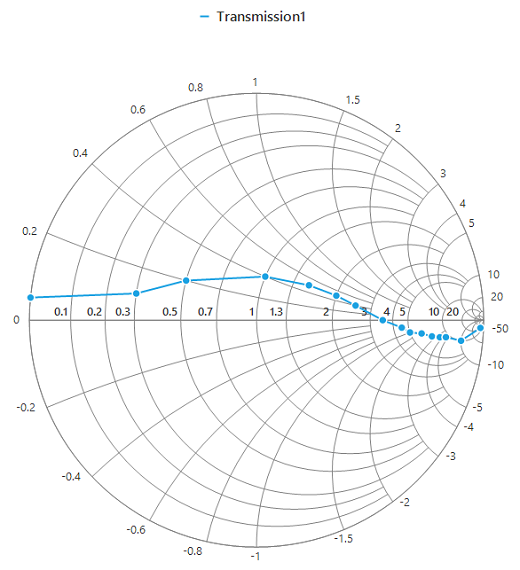
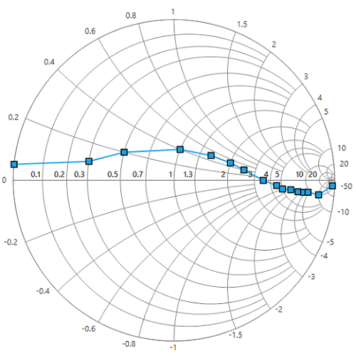
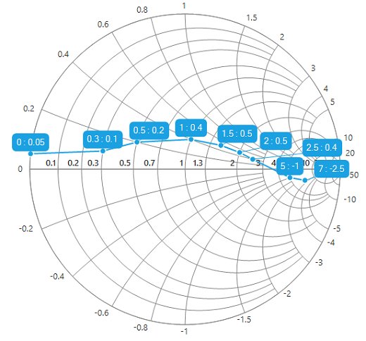

# Data Markers in Windows Forms Smith Chart (SfSmithChart)

Data markers are used to provide information about data point to users. You can add shapes and labels to adorn each data point.

## Marker shapes

Shapes can be added to the series to indicate each data point, and it can be enabled by using the [`MarkerVisible`](https://help.syncfusion.com/cr/windowsforms/Syncfusion.WinForms.SmithChart.ChartSeries.html#Syncfusion_WinForms_SmithChart_ChartSeries_MarkerVisible) property of series. The [`MarkerType`](https://help.syncfusion.com/cr/windowsforms/Syncfusion.WinForms.SmithChart.ChartSeries.html#Syncfusion_WinForms_SmithChart_ChartSeries_MarkerType) property provides different shapes such as rectangle, circle, diamond, etc. to indicate the data points.





LineSeries series = new LineSeries(); 

series.MarkerVisible = true;





Dim series As New LineSeries()

series.MarkerVisible = True





## Marker customization

Markers can be customized by using the [`MarkerBackColor`](https://help.syncfusion.com/cr/windowsforms/Syncfusion.WinForms.SmithChart.ChartSeries.html#Syncfusion_WinForms_SmithChart_ChartSeries_MarkerBackColor), [`MarkerBorderColor`](https://help.syncfusion.com/cr/windowsforms/Syncfusion.WinForms.SmithChart.ChartSeries.html#Syncfusion_WinForms_SmithChart_ChartSeries_MarkerBorderColor), [`MarkerHeight`](https://help.syncfusion.com/cr/windowsforms/Syncfusion.WinForms.SmithChart.ChartSeries.html#Syncfusion_WinForms_SmithChart_ChartSeries_MarkerHeight), [`MarkerWidth`](https://help.syncfusion.com/cr/windowsforms/Syncfusion.WinForms.SmithChart.ChartSeries.html#Syncfusion_WinForms_SmithChart_ChartSeries_MarkerWidth), [`MarkerVisible`](https://help.syncfusion.com/cr/windowsforms/Syncfusion.WinForms.SmithChart.ChartSeries.html#Syncfusion_WinForms_SmithChart_ChartSeries_MarkerVisible) and [`MarkerType`](https://help.syncfusion.com/cr/windowsforms/Syncfusion.WinForms.SmithChart.ChartSeries.html#Syncfusion_WinForms_SmithChart_ChartSeries_MarkerType) properties as shown in the following code snippet.





LineSeries series = new LineSeries(); 
series.MarkerVisible = true;
series.MarkerType = MarkerType.Rectangle;
series.MarkerHeight = 8;
series.MarkerWidth = 8;
series.MarkerBorderColor = Color.Black;
sfSmithChart1.Series.Add(series);





Dim series As New LineSeries()
series.MarkerVisible = True
series.MarkerType = MarkerType.Rectangle
series.MarkerHeight = 8
series.MarkerWidth = 8
series.MarkerBorderColor = Color.Black
sfSmithChart1.Series.Add(series)





## Marker image

Images can also be used as data markers to various shapes. This can be done by setting the [`MarkerType`](https://help.syncfusion.com/cr/windowsforms/Syncfusion.WinForms.SmithChart.ChartSeries.html#Syncfusion_WinForms_SmithChart_ChartSeries_MarkerType) property to Image and providing the image source for [`MarkerImage`](https://help.syncfusion.com/cr/windowsforms/Syncfusion.WinForms.SmithChart.ChartSeries.html#Syncfusion_WinForms_SmithChart_ChartSeries_MarkerImage) property. Add the required image in the Resources folder of your sample, and refer that image to the MarkerImage property.





series.MarkerType = MarkerType.Image;

series.MarkerWidth = 20;

series.MarkerHeight = 20;

series.MarkerImage = Properties.Resources.Marker;





series.MarkerType = MarkerType.Image

series.MarkerWidth = 20

series.MarkerHeight = 20

series.MarkerImage = My.Resources.Marker





## Data labels 

Data labels provide additional information about the data point. By default, the data labels are displayed at the top of the data point, and it will be automatically aligned smartly if it collides with the other label.

Connector line will be generated automatically if the data label collides with any other label. The following screenshot displays the smart alignment of data labels.

