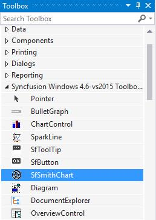
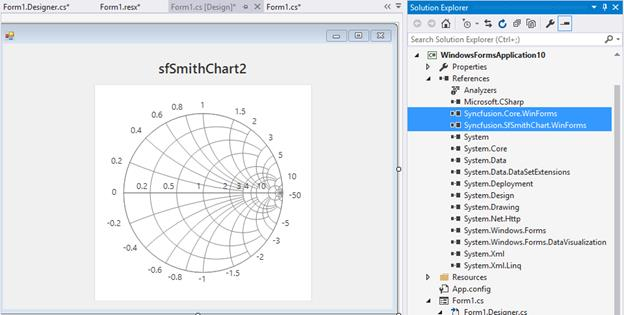
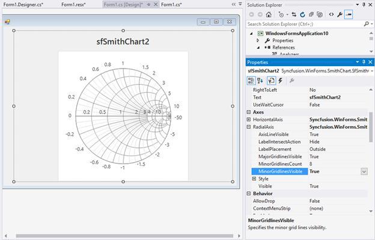
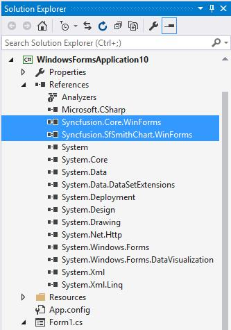
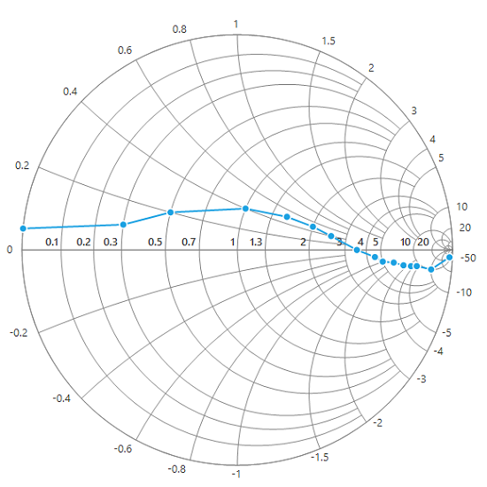
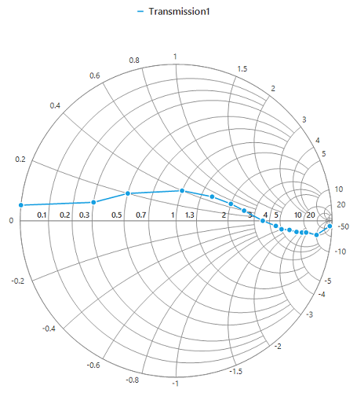

## Assembly deployment

Refer [control dependencies](https://help.syncfusion.com/windowsforms/control-dependencies#sfsmithchart) section to get the list of assemblies or NuGet package needs to be added as reference to use the control in any application.

Please find more details regarding how to install the nuget packages in windows form application in the below link:

[How to install nuget packages](https://help.syncfusion.com/windowsforms/nuget-packages)

# Configuring a smith chart control

This section explains the steps required to build an application with Smith chart.

## Creating a simple smith chart through the designer

Smith chart control can be added through designer by following the below steps.

* Create a new **Windows** **Form** **Application****.**
* Drag and drop the smith chart control from the toolbox into the designer.

* Once you drop the control into the designer page, smith chart control will be added successfully along with the required assemblies. The below mentioned assemblies will be added automatically into the application.

1. Syncfusion.SfSmithChart.WinForms
2. Syncfusion.Core.WinForms.

Appearance and behavior related aspects of the smith chart can be controlled by setting the appropriate properties through the properties grid.

For example, in the below image [`MinorGridlinesVisible`](https://help.syncfusion.com/cr/windowsforms/Syncfusion.WinForms.SmithChart.ChartAxis.html#Syncfusion_WinForms_SmithChart_ChartAxis_MinorGridlinesVisible) property of radial axis is modified via property grid.

## Creating a simple smith chart through code

Smith chart control can be added through code behind by following the below steps.

* Create a new Windows Form Application.
* Add the below assemblies into the project file.
1. Syncfusion.SfSmithChart.WinForms
2. Syncfusion.Core.WinForms.

* Also include the below name space.





using Syncfusion.WinForms.SmithChart;





Imports Syncfusion.WinForms.SmithChart





## Populating data

Data points for the smith chart series can be added in two ways.

* By specifying DataSource.
* By directly adding points in the series.

### By Specifying DataSource

You can add the data source to series by using the below properties.

* `DataSource` : Used to hold the data source. The data source or data collection can be bound with DataSource.
* [`ResistanceMember`](https://help.syncfusion.com/cr/windowsforms/Syncfusion.WinForms.SmithChart.ChartSeries.html#Syncfusion_WinForms_SmithChart_ChartSeries_ResistanceMember) : It is a string property that needs to be bound with resistance axis (or HorizontalAxis). 
* [`ReactanceMember`](https://help.syncfusion.com/cr/windowsforms/Syncfusion.WinForms.SmithChart.ChartSeries.html#Syncfusion_WinForms_SmithChart_ChartSeries_ReactanceMember) : It is a string property that needs to be bound with reactance axis (Or RadialAxis).





public partial class SmithChartSample
{
public SmithChartSample()
{
SmithChartModel model = new SmithChartModel();
sfSmithChart.BackColor = Color.White;
series = new LineSeries();
series.MarkerVisible = true;
series.TooltipVisible = true;
series.LegendText = "Transmission";
series.DataSource = model.Trace1;
series.ResistanceMember = "Resistance";
series.ReactanceMember = "Reactance";
sfSmithChart1.Series.Add(series);
}
}

public class TransmissionData

{

public double Resistance { get; set; }

public double Reactance { get; set; }

}

public class SmithChartModel

{

public SmithChartModel()

{

Trace1 = new ObservableCollection<TransmissionData>();

Trace1.Add(new TransmissionData() { Resistance = 0, Reactance = 0.05 });

Trace1.Add(new TransmissionData() { Resistance = 0.3, Reactance = 0.1 });

Trace1.Add(new TransmissionData() { Resistance = 0.5, Reactance = 0.2 });

Trace1.Add(new TransmissionData() { Resistance = 1.0, Reactance = 0.4 });

Trace1.Add(new TransmissionData() { Resistance = 1.5, Reactance = 0.5 });

Trace1.Add(new TransmissionData() { Resistance = 2.0, Reactance = 0.5 });

Trace1.Add(new TransmissionData() { Resistance = 2.5, Reactance = 0.4 });

Trace1.Add(new TransmissionData() { Resistance = 3.5, Reactance = 0.0 });

Trace1.Add(new TransmissionData() { Resistance = 4.5, Reactance = -0.5 });

Trace1.Add(new TransmissionData() { Resistance = 5, Reactance = -1.0 });

Trace1.Add(new TransmissionData() { Resistance = 6, Reactance = -1.5 });

Trace1.Add(new TransmissionData() { Resistance = 7, Reactance = -2.5 });

Trace1.Add(new TransmissionData() { Resistance = 8, Reactance = -3.5 });

Trace1.Add(new TransmissionData() { Resistance = 9, Reactance = -4.5 });

Trace1.Add(new TransmissionData() { Resistance = 10, Reactance = -10 });

Trace1.Add(new TransmissionData() { Resistance = 20, Reactance = -50 });

}

public ObservableCollection<TransmissionData> Trace1 { get; set; }

}





Public Partial Class SmithChartSample
    Public Sub New()
        Dim model As SmithChartModel = New SmithChartModel()
        sfSmithChart.BackColor = Color.White
        series = New LineSeries()
        series.MarkerVisible = True
        series.TooltipVisible = True
        series.LegendText = "Transmission"
        series.DataSource = model.Trace1
        series.ResistanceMember = "Resistance"
        series.ReactanceMember = "Reactance"
        sfSmithChart1.Series.Add(series)
    End Sub
End Class

Public Class TransmissionData
    Public Property Resistance As Double
    Public Property Reactance As Double
End Class

Public Class SmithChartModel
    Public Sub New()
        Trace1 = New ObservableCollection(Of TransmissionData)()
        Trace1.Add(New TransmissionData() With {
            .Resistance = 0,
            .Reactance = 0.05
        })
        Trace1.Add(New TransmissionData() With {
            .Resistance = 0.3,
            .Reactance = 0.1
        })
        Trace1.Add(New TransmissionData() With {
            .Resistance = 0.5,
            .Reactance = 0.2
        })
        Trace1.Add(New TransmissionData() With {
            .Resistance = 1.0,
            .Reactance = 0.4
        })
        Trace1.Add(New TransmissionData() With {
            .Resistance = 1.5,
            .Reactance = 0.5
        })
        Trace1.Add(New TransmissionData() With {
            .Resistance = 2.0,
            .Reactance = 0.5
        })
        Trace1.Add(New TransmissionData() With {
            .Resistance = 2.5,
            .Reactance = 0.4
        })
        Trace1.Add(New TransmissionData() With {
            .Resistance = 3.5,
            .Reactance = 0.0
        })
        Trace1.Add(New TransmissionData() With {
            .Resistance = 4.5,
            .Reactance = -0.5
        })
        Trace1.Add(New TransmissionData() With {
            .Resistance = 5,
            .Reactance = -1.0
        })
        Trace1.Add(New TransmissionData() With {
            .Resistance = 6,
            .Reactance = -1.5
        })
        Trace1.Add(New TransmissionData() With {
            .Resistance = 7,
            .Reactance = -2.5
        })
        Trace1.Add(New TransmissionData() With {
            .Resistance = 8,
            .Reactance = -3.5
        })
        Trace1.Add(New TransmissionData() With {
            .Resistance = 9,
            .Reactance = -4.5
        })
        Trace1.Add(New TransmissionData() With {
            .Resistance = 10,
            .Reactance = -10
        })
        Trace1.Add(New TransmissionData() With {
            .Resistance = 20,
            .Reactance = -50
        })
    End Sub

    Public Property Trace1 As ObservableCollection(Of TransmissionData)
End Class





###By directly adding points in the series

You can add the each point in series `Points` collection to render the series.





             lineSeries = sfSmithChart.Series[0] as LineSeries;
             Random random = new Random();
             for (int i = 0; i < 100; i++)
             {
             double val = random.Next(0, 5);
             double val1 = random.Next(-5, 5);
             lineSeries.Points.Add(val, val1);
             }
 




    lineSeries = TryCast(sfSmithChart.Series(0), LineSeries)
    Dim random As Random = New Random()

    For i As Integer = 0 To 100 - 1
        Dim val As Double = random.[Next](0, 5)
        Dim val1 As Double = random.[Next](-5, 5)
        lineSeries.Points.Add(val, val1)
    Next





### Initialize the Smith Chart

To initialize the smith chart and add to the application, use the below code.





SfSmithChart chart = new SfSmithChart();

this.Controls.Add(chart);





Dim chart As New SfSmithChart()

Me.Controls.Add(chart)





As a result of above steps, the following output will be reproduced.

### Adding header to the smith chart

[`Text`](https://help.syncfusion.com/cr/windowsforms/Syncfusion.WinForms.SmithChart.SfSmithChart.html#Syncfusion_WinForms_SmithChart_SfSmithChart_Text) property of the smith chart is used to add title to the smith chart control. 





chart.Text = "Impedance Transmission";





chart.Text = "Impedance Transmission"





### Adding Axes

By default, both horizontal and radial axes are added to the smith chart. As a result, the required customization for the axes can be specified directly instead of initializing and adding the axes to the control. If needed, this can also be done.

Below snippet describes the customization for the axes.





chart.HorizontalAxis.MinorGridlinesVisible = true;

chart.RadialAxis.MinorGridlinesVisible = true;





chart.HorizontalAxis.MinorGridlinesVisible = True

chart.RadialAxis.MinorGridlinesVisible = True





As a result of adding text and axes to the control, the following output is produced.

### Adding Series

You can plot a line on the smith chart by adding line series.

Initialize the series for representing the data. Marker can be made visible using the [`MarkerVisible`](https://help.syncfusion.com/cr/windowsforms/Syncfusion.WinForms.SmithChart.ChartSeries.html#Syncfusion_WinForms_SmithChart_ChartSeries_MarkerVisible) property for indicating the data point.





LineSeries series = new LineSeries();





Dim series As New LineSeries()





Also, specify the DataSource, ResistanceMember, and ReactanceMember properties to populate the data in smith chart.





LineSeries series = new LineSeries();

series.MarkerVisible = true;

series.DataSource = model.Trace1;

series.ResistanceMember = "Resistance";

series.ReactanceMember = "Reactance";

chart.Series.Add(series);





Dim series As New LineSeries()

series.MarkerVisible = True

series.DataSource = model.Trace1

series.ResistanceMember = "Resistance"

series.ReactanceMember = "Reactance"

chart.Series.Add(series)





* `DataSource` : Used to hold the data source. The data source or data collection can be bound with DataSource.
* [`ResistanceMember`](https://help.syncfusion.com/cr/windowsforms/Syncfusion.WinForms.SmithChart.ChartSeries.html#Syncfusion_WinForms_SmithChart_ChartSeries_ResistanceMember) : It is a string property that needs to be bound with resistance axis (or HorizontalAxis). 
* [`ReactanceMember`](https://help.syncfusion.com/cr/windowsforms/Syncfusion.WinForms.SmithChart.ChartSeries.html#Syncfusion_WinForms_SmithChart_ChartSeries_ReactanceMember) : It is a string property that needs to be bound with reactance axis (Or RadialAxis).

After adding the series, the following output is produced.

### Adding legends to the chart

Legends can be made visible by using the following code.





chart.Legend.Visible = true;





chart.Legend.Visible = True





Text for the legend can be described in the series itself using the [`LegendText`](https://help.syncfusion.com/cr/windowsforms/Syncfusion.WinForms.SmithChart.ChartSeries.html#Syncfusion_WinForms_SmithChart_ChartSeries_LegendText)  property.





series.LegendText = "Transmission1";





series.LegendText = "Transmission1"





The following code example demonstrates the complete code for creating a smith chart.





SfSmithChart chart = new SfSmithChart();

chart.Text = "Impedance Transmission";

chart.BackColor = Color.White;

chart.HorizontalAxis.MinorGridlinesVisible = true;

chart.RadialAxis.MinorGridlinesVisible = true;

LineSeries series = new LineSeries();

series.MarkerVisible = true;

series.LegendText = "Transmission1";

series.DataSource = model.Trace1;

series.ResistanceMember = "Resistance";

series.ReactanceMember = "Reactance";

chart.Series.Add(series);

chart.Legend.Visible = true;

chart.Dock = DockStyle.Fill;

this.Controls.Add(chart);





Dim chart As New SfSmithChart()

chart.Text = "Impedance Transmission"

chart.BackColor = Color.White

chart.HorizontalAxis.MinorGridlinesVisible = True

chart.RadialAxis.MinorGridlinesVisible = True

Dim series As New LineSeries()

series.MarkerVisible = True

series.LegendText = "Transmission1"

series.DataSource = model.Trace1

series.ResistanceMember = "Resistance"

series.ReactanceMember = "Reactance"

chart.Series.Add(series) 

chart.Legend.Visible = True

chart.Dock = DockStyle.Fill

Me.Controls.Add(chart)





Now, run the application to produce the following output.

