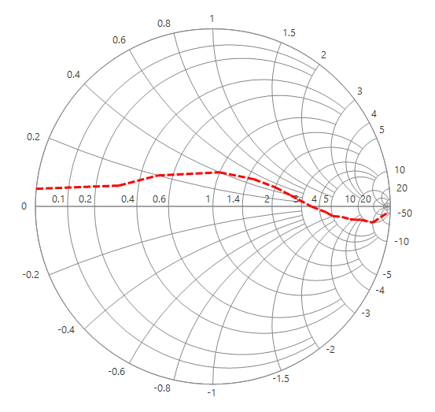
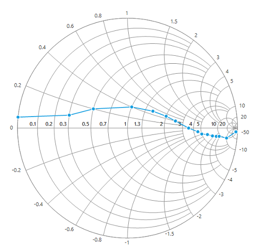

# Series

Chart series is the visual representation of given data. The following APIs are used for generating the series.

`DataSource` : Data collection that is to be given to plot the data.

[`ResistanceMember`](https://help.syncfusion.com/cr/cref_files/windowsforms/Syncfusion.SfSmithChart.WinForms~Syncfusion.WinForms.SmithChart.ChartSeries~ResistanceMember.html) : A string property that represents the resistance values in impedance Smith chart and conductance values in admittance Smith chart.

[`ReactanceMember`](https://help.syncfusion.com/cr/cref_files/windowsforms/Syncfusion.SfSmithChart.WinForms~Syncfusion.WinForms.SmithChart.ChartSeries~ReactanceMember.html) : A string property that represents the reactance values in impedance Smith chart and susceptance values in admittance Smith chart.





LineSeries series = new LineSeries();

series.DataSource = model.Trace1;

series.ResistanceMember = "Resistance";

series.ReactanceMember = "Reactance";

sfSmithChart1.Series.Add(series);





Dim series As New LineSeries()

series.DataSource = model.Trace1

series.ResistanceMember = "Resistance"

series.ReactanceMember = "Reactance"

sfSmithChart1.Series.Add(series)





## Customizing the line series

The line stroke and width can be customized by using the [`Interior`](https://help.syncfusion.com/cr/cref_files/windowsforms/Syncfusion.SfSmithChart.WinForms~Syncfusion.WinForms.SmithChart.ChartSeries~Interior.html), [`StrokeWidth`](https://help.syncfusion.com/cr/cref_files/windowsforms/Syncfusion.SfSmithChart.WinForms~Syncfusion.WinForms.SmithChart.LineSeries~StrokeWidth.html) and *DashStyle* properties of line series.





series.Interior = Color.Red;

series.StrokeWidth = 3;

series.DashStyle = DashStyle.Dash;





series.Interior = Color.Red

series.StrokeWidth = 3

series.DashStyle = DashStyle.Dash;





## Series visibility

To hide the series programmatically, set the [`Visible`](https://help.syncfusion.com/cr/cref_files/windowsforms/Syncfusion.SfSmithChart.WinForms~Syncfusion.WinForms.SmithChart.ChartSeries~Visible.html) property to false for the specific series.





LineSeries series = new LineSeries();          

series.MarkerVisible = true;            

series.DataSource = model.Trace1;

series.ResistanceMember = "Resistance";

series.ReactanceMember = "Reactance";

sfSmithChart1.Series.Add(series);

LineSeries series1 = new LineSeries();

series1.MarkerVisible = true;

series1.DataSource = model.Trace2;

series1.ResistanceMember = "Resistance";

series1.ReactanceMember = "Reactance";           

series1.Visible = false;

sfSmithChart1.Series.Add(series1);





Dim series As New LineSeries()

series.MarkerVisible = True

series.DataSource = model.Trace1

series.ResistanceMember = "Resistance"

series.ReactanceMember = "Reactance"

sfSmithChart1.Series.Add(series)

Dim series1 As New LineSeries()

series1.MarkerVisible = True

series1.DataSource = model.Trace2

series1.ResistanceMember = "Resistance"

series1.ReactanceMember = "Reactance"

series1.Visible = False

sfSmithChart1.Series.Add(series1)





