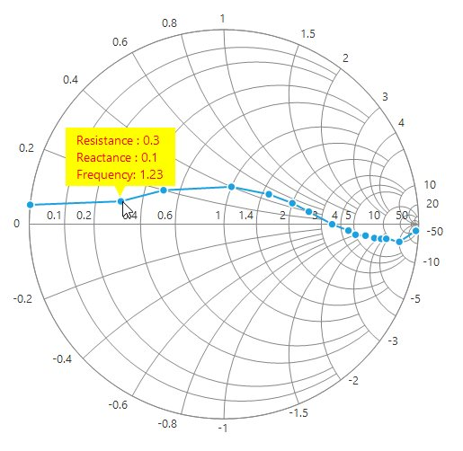

# User interactions

## Tooltip

Tooltip for the data points can be enabled by setting the [`TooltipVisible`](https://help.syncfusion.com/cr/cref_files/windowsforms/Syncfusion.SfSmithChart.WinForms~Syncfusion.WinForms.SmithChart.ChartSeries~TooltipVisible.html) property value to true in the series.





LineSeries series = new LineSeries();          

series.TooltipVisible = true;

sfSmithChart1.Series.Add(series);





Dim series As New LineSeries()

series.TooltipVisible = True

sfSmithChart1.Series.Add(series)





## Tooltip format

Tooltip’s format can be specified by using the [`TooltipFormat`](https://help.syncfusion.com/cr/cref_files/windowsforms/Syncfusion.SfSmithChart.WinForms~Syncfusion.WinForms.SmithChart.ChartSeries~TooltipFormat.html) property in the series.

### Format details

{0} : Takes the resistance value in impedance chart and conductance value in admittance chart.

{1} : Takes the reactance value in impedance chart and susceptance value in admittance chart.

{2} : Takes the series name, i.e., the [`LegendText`](https://help.syncfusion.com/cr/cref_files/windowsforms/Syncfusion.SfSmithChart.WinForms~Syncfusion.WinForms.SmithChart.ChartSeries~LegendText.html) property of the series.

By default, the tooltip shows only resistance or conductance and reactance or susceptance values. It can be customized as shown in the following code snippet.





series.TooltipFormat = "Resistance : {0}" + Environment.NewLine + "Reactance : {1}" + Environment.NewLine + "Series : {2}";





series.TooltipFormat = "Resistance : {0}" & Environment.NewLine & "Reactance : {1}" & Environment.NewLine & "Series : {2}"





## Tooltip customization

The appearance of the tooltip can be customized using the [`BackColor`](https://help.syncfusion.com/cr/cref_files/windowsforms/Syncfusion.SfSmithChart.WinForms~Syncfusion.WinForms.SmithChart.TooltipOptions~BackColor.html), [`BorderColor`](https://help.syncfusion.com/cr/cref_files/windowsforms/Syncfusion.SfSmithChart.WinForms~Syncfusion.WinForms.SmithChart.TooltipOptions~BorderColor.html), [`ForeColor`](https://help.syncfusion.com/cr/cref_files/windowsforms/Syncfusion.SfSmithChart.WinForms~Syncfusion.WinForms.SmithChart.TooltipOptions~ForeColor.html), [`Font`](https://help.syncfusion.com/cr/cref_files/windowsforms/Syncfusion.SfSmithChart.WinForms~Syncfusion.WinForms.SmithChart.TooltipOptions~Font.html), [`BorderWidth`](https://help.syncfusion.com/cr/cref_files/windowsforms/Syncfusion.SfSmithChart.WinForms~Syncfusion.WinForms.SmithChart.TooltipOptions~BorderWidth.html) and [`ShadowVisible`](https://help.syncfusion.com/cr/cref_files/windowsforms/Syncfusion.SfSmithChart.WinForms~Syncfusion.WinForms.SmithChart.TooltipOptions~ShadowVisible.html) in TooltipOptions class.





sfSmithChart1.TooltipOptions.BackColor = Color.Green;

sfSmithChart1.TooltipOptions.BorderColor = Color.Black;

sfSmithChart1.TooltipOptions.ForeColor = Color.White;

sfSmithChart1.TooltipOptions.ShadowVisible = true;

sfSmithChart1.TooltipOptions.Font = new Font("Verdana", 10);

sfSmithChart1.TooltipOptions.BorderWidth = 1;





sfSmithChart1.TooltipOptions.BackColor = Color.Green

sfSmithChart1.TooltipOptions.BorderColor = Color.Black

sfSmithChart1.TooltipOptions.ForeColor = Color.White

sfSmithChart1.TooltipOptions.ShadowVisible = True

sfSmithChart1.TooltipOptions.Font = New Font("Verdana", 10)

sfSmithChart1.TooltipOptions.BorderWidth = 1





## Event

### TooltipOpening event 

TooltipOpening event is called before the rendering of the tooltip. By using the below mentioned arguments of this event, we can customize the tooltip text of each point and its styles.

**Data** – Contains the tooltip point ViewModel data or X, Y point.
**SeriesIndex** – Contains the current series index value of the series collection.
**PointIndex** – Contains the point index value of the point collection. 
**Text** – Used to customize the tooltip text displaying on mouse over.
**Style** – Used to customize tooltip back color, forecolor and its font style.





//Hook the tooltip opening event 
sfSmithChart1.TooltipOpening += SfSmithChart1_TooltipOpening;

private void SfSmithChart1_TooltipOpening(object sender, TooltipOpeningEventArgs e)
{
    var data = e.Data as Model;
    if(e.PointIndex == 1)
    {
        e.Text += Environment.NewLine + "Frequency: " + data.Frequency;
        e.Style.ForeColor = Color.Red;
        e.Style.BackColor = Color.Yellow;
    }
}





//Hook the tooltip opening event 
sfSmithChart1.TooltipOpening += SfSmithChart1_TooltipOpening;

Private Sub SfSmithChart1_TooltipOpening(ByVal sender As Object, ByVal e As TooltipOpeningEventArgs)
Dim data = TryCast(e.Data, Model)

    If e.PointIndex Is 1 Then
        e.Text += Environment.NewLine & "Frequency: " + data.Frequency
        e.Style.ForeColor = Color.Red
        e.Style.BackColor = Color.Yellow
    End If
	
End Sub





