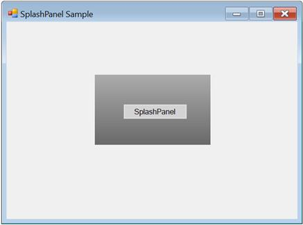

# Getting Started with Windows Forms Splash Panel

This section explains how to add `SplashPanel` in a Windows Forms and overview of its basic functionalities.

## Assembly deployment

Refer to the [control dependencies](https://help.syncfusion.com/windowsforms/control-dependencies#splashpanel) section to get the assemblies or NuGet package needs to be added as reference to use the control in any application.

Find more details about installing the nuget packages in a Windows Forms application in the following link [How to install nuget packages](https://help.syncfusion.com/windowsforms/installation/install-nuget-packages).

## Creating the project

Create a new Windows Forms project in Visual Studio to display the `SplashPanel` control with basic functionalities.

## Through designer

The `SplashPanel` control provides full support for the Windows Forms designer.

**Step 1**: Drag-and-drop the SplashPanel control from the toolbox onto the form.

    

**Step 2**: Set the properties for the SplashPanel control and also drag and drop any child controls you want to add to the panel. Set the TimerInterval property to specify the period of time, the SplashPanel needs to be visible.

**Step 3**: Specify the startup location of the SplashPanel using the DesktopAlignment property.

**Step 4**: Launch the SplashPanel control by calling the ShowSplash() method.

**Step 5** You can cancel the SplashPanel by calling the HideSplash() method.

    

## Through code

To create a SplashPanel programmatically, with a user control in it, follow the below steps.

**Step 1**: Create a new Visual C# or VB.NET application in Visual Studio .NET.

**Step 2**: Add the required assembly reference.
	
	1. Syncfusion.Shared.Base.dll

	2. Syncfusion.Tools.Windows.dll

**Step 3**: Add the namespaces given below to your form.




using Syncfusion.Windows.Forms.Tools;
using Syncfusion.Drawing;
using Syncfusion.Windows.Forms.Tools;
using Syncfusion.Drawing;
using System.Reflection;





Imports Syncfusion.Windows.Forms.Tools
Imports Syncfusion.Drawing
Imports Syncfusion.Windows.Forms.Tools
Imports Syncfusion.Drawing
Imports System.Reflection




**Step 4**: Declare the SplashPanel and Button control.




private Syncfusion.Windows.Forms.Tools.SplashPanel splashPanel1;
private System.Windows.Forms.Button button1;





Friend WithEvents splashPanel1 As Syncfusion.Windows.Forms.Tools.SplashPanel
Friend WithEvents button1 As System.Windows.Forms.Button




**Step 5**: Initialize the controls and make it visible.




this.splashPanel1 = new Syncfusion.Windows.Forms.Tools.SplashPanel();
this.button1 = new System.Windows.Forms.Button();
this.splashPanel1.SuspendLayout();





Me.splashPanel1 = New Syncfusion.Windows.Forms.Tools.SplashPanel
Me.button1 = New System.Windows.Forms.Button
Me.splashPanel1.SuspendLayout()




**Step 6**: Set the properties for the SplashPanel and Button control.




// Set the properties for SplashPanel.
this.splashPanel1.AnimationSpeed = 10;
this.splashPanel1.BackgroundColor = new Syncfusion.Drawing.BrushInfo(Syncfusion.Drawing.GradientStyle.Vertical, System.Drawing.SystemColors.Highlight, System.Drawing.SystemColors.HighlightText);
this.splashPanel1.Controls.Add(this.button1);
this.splashPanel1.DesktopAlignment = Syncfusion.Windows.Forms.Tools.SplashAlignment.Center;
this.splashPanel1.DiscreetLocation = new System.Drawing.Point(0, 0);
this.splashPanel1.Font = new System.Drawing.Font("Comic Sans MS", 9.75F, System.Drawing.FontStyle.Bold, System.Drawing.GraphicsUnit.Point, ((System.Byte)(0)));
this.splashPanel1.ForeColor = System.Drawing.Color.Pink;
this.splashPanel1.Location = new System.Drawing.Point(16, 16);
this.splashPanel1.Name = "splashPanel1";
this.splashPanel1.ShowAnimation = true;
this.splashPanel1.SuspendAutoCloseWhenMouseOver = false;
this.splashPanel1.TabIndex = 0;
this.splashPanel1.TimerInterval = 5000;

// Set the properties for Button control.
this.button1.BackColor = System.Drawing.Color.DimGray;
this.button1.Location = new System.Drawing.Point(56, 40);
this.button1.Name = "button1";
this.button1.Size = new System.Drawing.Size(96, 23);
this.button1.TabIndex = 0;
this.button1.Text = "SplashPanel";

// Add the SplashPanel to the Form.
this.Controls.Add(this.splashPanel1);





' Set the properties for SplashPanel.
Me.splashPanel1.AnimationSpeed = 10
Me.splashPanel1.BackgroundColor = New Syncfusion.Drawing.BrushInfo(Syncfusion.Drawing.GradientStyle.Vertical, System.Drawing.SystemColors.Highlight, System.Drawing.SystemColors.HighlightText)
Me.splashPanel1.Controls.Add(Me.button1)
Me.splashPanel1.DesktopAlignment = Syncfusion.Windows.Forms.Tools.SplashAlignment.Center
Me.splashPanel1.DiscreetLocation = New System.Drawing.Point(0, 0)
Me.splashPanel1.Font = New System.Drawing.Font("Comic Sans MS", 9.75F, System.Drawing.FontStyle.Bold, System.Drawing.GraphicsUnit.Point, (CByte(0)))
Me.splashPanel1.ForeColor = System.Drawing.Color.Pink
Me.splashPanel1.Location = New System.Drawing.Point(16, 16)
Me.splashPanel1.Name = "splashPanel1"
Me.splashPanel1.ShowAnimation = True
Me.splashPanel1.SuspendAutoCloseWhenMouseOver = False
Me.splashPanel1.TabIndex = 0
Me.splashPanel1.TimerInterval = 5000

' Set the properties for Button control.
Me.button1.BackColor = System.Drawing.Color.DimGray
Me.button1.Location = New System.Drawing.Point(56, 40)
Me.button1.Name = "button1"
Me.button1.Size = New System.Drawing.Size(96, 23)
Me.button1.TabIndex = 0
Me.button1.Text = "SplashPanel"

' Add the SplashPanel to the Form.
Me.Controls.Add(Me.splashPanel1)




**Step 7**: Call and define the ShowSplash() method as follows.




// In the Form properties, add the below code before resuming the layout.
this.ShowSplash(false);

// Define the ShowSplash() method.
private void ShowSplash(bool isModal)
{
	Point pt = Point.Empty;
	SplashPanel currentPanel = this.splashPanel1;
	int interval = 5000;
	currentPanel = this.splashPanel1;
    if(currentPanel.DesktopAlignment == SplashAlignment.Custom)
	pt = Control.MousePosition;
	currentPanel.ShowSplash(pt, this, isModal);
}





' In the Form properties, add the below code before resuming the layout.
Me.ShowSplash(False)

' Define the ShowSplash() method.
Private Sub ShowSplash(ByVal isModal As Boolean)
Dim pt As Point = Point.Empty
Dim currentPanel As SplashPanel = Me.SplashPanel1
Dim interval As Integer = 5000
currentPanel = Me.SplashPanel1
currentPanel.TimerInterval = interval
If currentPanel.DesktopAlignment = SplashAlignment.Custom Then
pt = Control.MousePosition
End If
currentPanel.ShowSplash(pt, Me, isModal)
End Sub




**Step 8**: Run the application.

    