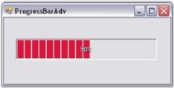

# Getting Started with Windows Forms Splash Screen (Splash)

This section explains how to add the `SplashControl` in a Windows Forms application and overview of its basic functionalities.

## Assembly deployment

Refer to the [control dependencies](https://help.syncfusion.com/windowsforms/control-dependencies#splashcontrol) section to get the assemblies or NuGet package needs to be added as reference to use the control in any application.

Find more details about installing the nuget packages in a Windows Forms application in the following link [How to install nuget packages](https://help.syncfusion.com/windowsforms/installation/install-nuget-packages).

## Creating the project

Create a new Windows Forms project in Visual Studio to display the `SplashControl` with basic functionalities.

## Through designer

The `SplashControl` provides full support for the Windows Forms designer.

**Step 1**: Drag and drop the SplashControl from the toolbox onto the form. The SplashControl will be created in the components area of the form. The following required assembly reference will be added automatically.

         * Syncfusion.Shared.Base.dll
         * Syncfusion.Tools.Windows.dll

    

**Step 2**: Set the SplashImage and the TimerInterval properties through the property grid.

**Step 3**: Set the AutoMode property. This property controls how the SplashControl will be invoked. If the AutoMode property is set to 'True', the SplashControl will automatically launch itself during the parent form's load event.

**Step 4**: The SplashPanel can also be viewed at design time using the Preview Splash option by clicking the smart tag as shown below.

    

**Step 5**: Now run the application.

**Step 6**: If the AutoMode property is set to 'False', the splash screen will have to be invoked explicitly by calling the ShowSplash() method.

**Step 7**: Handle the SplashClosed event to do your processing after the splash screen is closed.

    

**Step 8**: You can cancel the SplashControl while it is displaying the splash screen by calling the HideSplash() method.

## Through code

A SplashControl can be created through code by following the below steps.

**Step 1**: Create a C# or VB.NET application though Visual Studio.

**Step 2**: Add the required assembly references.

	   1. Syncfusion.Shared.Base.dll
	
	   2. Syncfusion.Tools.Windows.dll

**Step 3**: Declare and initialize a `SplashControl` using the below code.

​



private Syncfusion.Windows.Forms.Tools.SplashControl splashControl1;
this.splashControl1 = new Syncfusion.Windows.Forms.Tools.SplashControl();
this.SuspendLayout();





Friend WithEvents SplashControl1 As Syncfusion.Windows.Forms.Tools.SplashControl
Me.splashControl1 = New Syncfusion.Windows.Forms.Tools.SplashControl() 
Me.SuspendLayout()




{{ codesnippet1 | OrderList_Indent_Level_1 }}

**Step 4**: Set the following properties.

​



this.splashControl1.CustomSplashPanel = null;
this.splashControl1.HostForm = this;
this.splashControl1.HostFormWindowState = System.Windows.Forms.FormWindowState.Normal;
this.splashControl1.TimerInterval = 3000;





Me.SplashControl1.CustomSplashPanel = Nothing
Me.SplashControl1.HostForm = Me
Me.SplashControl1.HostFormWindowState = System.Windows.Forms.FormWindowState.Normal
Me.SplashControl1.TimerInterval = 3000




{{ codesnippet2 | OrderList_Indent_Level_1 }}

**Step 5**: Run the application.

    
