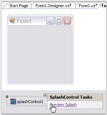
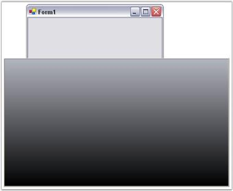

# Creating SplashControl

This section will give a step by step procedure to design a SplashControl through designer and also through programmatical approach.

## Through Designer

The SplashControl provides full support for the Windows Forms designer.

1. Drag and drop the SplashControl from the toolbox onto the form. The SplashControl will be created in the components area of the form.

    

2. Set the SplashImage and the TimerInterval properties through the property grid.
3. Set the AutoMode property. This property controls how the SplashControl will be invoked. If the AutoMode property is set to 'True', the SplashControl will automatically launch itself during the parent form's load event.
4. The SplashPanel can also be viewed at design time using the Preview Splash option by clicking the smart tag as shown below.

    

5. Now run the application.
6. If the AutoMode property is set to 'False', the splash screen will have to be invoked explicitly by calling the ShowSplash() method.
7. Handle the SplashClosed event to do your processing after the splash screen is closed.

    

8. You can cancel the SplashControl while it is displaying the splash screen by calling the HideSplash() method.

## Through Code

A SplashControl can be created through code by following the below steps.

1. Create a C# or VB.NET application though Visual Studio.
2. Add the required assembly references.
3. Declare and initialize a SplashControl using the below code.

   ~~~ cs
   
        private Syncfusion.Windows.Forms.Tools.SplashControl splashControl1;
		
		this.splashControl1 = new Syncfusion.Windows.Forms.Tools.SplashControl();
		
		this.SuspendLayout();

   ~~~
   {:.pretty-print }

   ~~~ vbnet
   
        Friend WithEvents SplashControl1 As Syncfusion.Windows.Forms.Tools.SplashControl
		
		Me.splashControl1 = New Syncfusion.Windows.Forms.Tools.SplashControl() 
		
		Me.SuspendLayout()

   ~~~
   {:.pretty-print }

4. Set the following properties.

   ~~~ cs
   
        this.splashControl1.CustomSplashPanel = null;
		
		this.splashControl1.HostForm = this;
		
		this.splashControl1.HostFormWindowState = System.Windows.Forms.FormWindowState.Normal;
		
		this.splashControl1.TimerInterval = 3000;

   ~~~
   {:.pretty-print }

   ~~~ vbnet

        Me.SplashControl1.CustomSplashPanel = Nothing

		Me.SplashControl1.HostForm = Me

		Me.SplashControl1.HostFormWindowState = System.Windows.Forms.FormWindowState.Normal

		Me.SplashControl1.TimerInterval = 3000

   ~~~
   {:.pretty-print }

5. Run the application.

    

