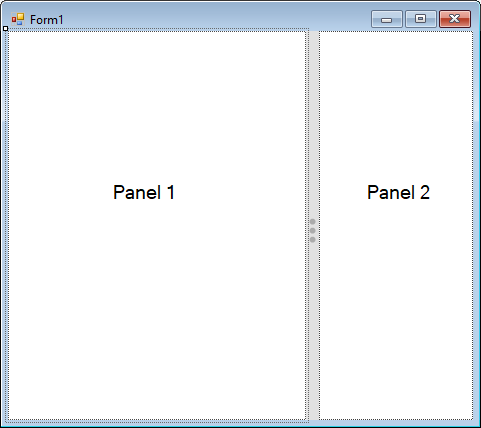
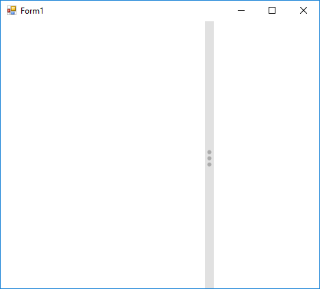
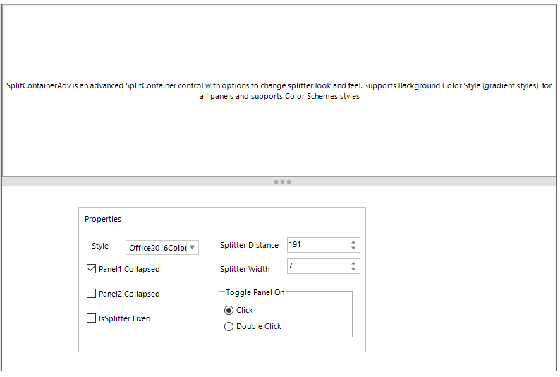

# Getting Started in Windows Forms SplitContainer (SplitContainerAdv)

This section describes how to add [Windows Forms SplitContainer](https://www.syncfusion.com/winforms-ui-controls/splitcontainer) (SplitContainerAdv) control in a Windows Forms application.

## Assembly deployment

Refer to the [control dependencies](https://help.syncfusion.com/windowsforms/control-dependencies#splitcontaineradv) section to get the list of assemblies or NuGet package that needs to be added as a reference to use the control in any application.

You can find more details about installing the NuGet packages in a Windows Forms application in the following link: 

[How to install nuget packages](https://help.syncfusion.com/windowsforms/visual-studio-integration/nuget-packages)

## Create a simple application with SplitContainerAdv

### Create a project

Create a new Windows Forms project in Visual Studio to display the [SplitContainerAdv](https://help.syncfusion.com/cr/windowsforms/Syncfusion.Windows.Forms.Tools.SplitContainerAdv.html).

## Adding control via designer

The Windows Forms SplitContainer (SplitContainerAdv) control can be added to the application by dragging it from the toolbox to a designer view. The following required assembly references will be added automatically:

* Syncfusion.Grid.Base.dll
* Syncfusion.Grid.Windows.dll
* Syncfusion.Shared.Base.dll
* Syncfusion.Shared.Windows.dll
* Syncfusion.Tools.Base.dll
* Syncfusion.Tools.Windows.dll

Child controls can be added to the SplitContainerAdv by dragging it from the toolbox and dropping it in desired panel. Here labels are added into SplitContainerAdv Panels.

## Adding control manually using code

To add control manually in C#, follow the given steps:

**Step 1** - Add the following required assembly references to the project:

* Syncfusion.Grid.Base.dll
* Syncfusion.Grid.Windows.dll
* Syncfusion.Shared.Base.dll
* Syncfusion.Shared.Windows.dll
* Syncfusion.Tools.Base.dll
* Syncfusion.Tools.Windows.dll

**Step 2** - Include the namespaces **Syncfusion.Tools.Windows**.





using Syncfusion.Tools.Windows;





Imports Syncfusion.Tools.Windows



 

**Step 3** - Create `SplitContainerAdv` control instance and add it to the form.





SplitContainerAdv splitContainerAdv1 = new SplitContainerAdv();

this.splitContainerAdv1.Style = Syncfusion.Windows.Forms.Tools.Enums.Style.Office2016Colorful;

this.splitContainerAdv1.Dock = System.Windows.Forms.DockStyle.Fill;

this.Controls.Add(splitContainerAdv1);





Dim splitContainerAdv1 As SplitContainerAdv = New SplitContainerAdv()

Me.splitContainerAdv1.Style = Syncfusion.Windows.Forms.Tools.Enums.Style.Office2016Colorful

Me.splitContainerAdv1.Dock = System.Windows.Forms.DockStyle.Fill

Me.Controls.Add(SplitContainerAdv1)





**Add controls to SplitContainerAdv**

Create instance of the required Controls and add it to panels such as [Panel1](https://help.syncfusion.com/cr/windowsforms/Syncfusion.Windows.Forms.Tools.SplitContainerAdv.html#Syncfusion_Windows_Forms_Tools_SplitContainerAdv_Panel1) or [Panel2](https://help.syncfusion.com/cr/windowsforms/Syncfusion.Windows.Forms.Tools.SplitContainerAdv.html#Syncfusion_Windows_Forms_Tools_SplitContainerAdv_Panel2) of the SplitContainerAdv.





// Create instance of the controls

Label label1 = new Label();
Label label2 = new Label();

this.label1.Text = "Panel 1";
this.label1.Font = new System.Drawing.Font("Microsoft Sans Serif", 14.25F, System.Drawing.FontStyle.Regular, System.Drawing.GraphicsUnit.Point, ((byte)(0)));
this.label2.Text = "Panel 2";
this.label2.Font = new System.Drawing.Font("Microsoft Sans Serif", 14.25F, System.Drawing.FontStyle.Regular, System.Drawing.GraphicsUnit.Point, ((byte)(0)));

// Add it to panels of SplitContainerAdv
this.splitContainerAdv1.Panel1.Controls.Add(this.label1);
this.splitContainerAdv1.Panel2.Controls.Add(this.label2);





' Create instance of the controls

Dim label1 As New Label()
Dim label2 As New Label()

Me.label1.Text = "Panel 1"
Me.label1.Font = New System.Drawing.Font("Microsoft Sans Serif", 14.25F, System.Drawing.FontStyle.Regular, System.Drawing.GraphicsUnit.Point, (CByte(0)))
Me.label2.Text = "Panel 2"
Me.label2.Font = New System.Drawing.Font("Microsoft Sans Serif", 14.25F, System.Drawing.FontStyle.Regular, System.Drawing.GraphicsUnit.Point, (CByte(0)))

' Add it to panels of SplitContainerAdv
Me.splitContainerAdv1.Panel1.Controls.Add(Me.label1)
Me.splitContainerAdv1.Panel2.Controls.Add(Me.label2)





## Splitter orientation

The SplitContainerAdv Panels can be oriented horizontally or vertically using the [Orientation](https://help.syncfusion.com/cr/windowsforms/Syncfusion.Windows.Forms.Tools.SplitContainerAdv.html#Syncfusion_Windows_Forms_Tools_SplitContainerAdv_Orientation) property.



//Setting orientation
this.splitContainerAdv1.Orientation = System.Windows.Forms.Orientation.Vertical;


‘Setting orientation
Me.splitContainerAdv1.Orientation = System.Windows.Forms.Orientation.Vertical

 

* **Horizontal**

* **Vertical**

