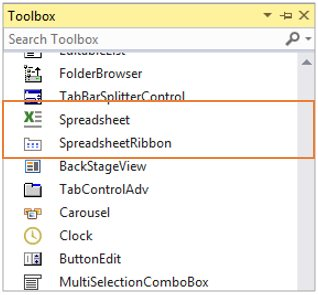
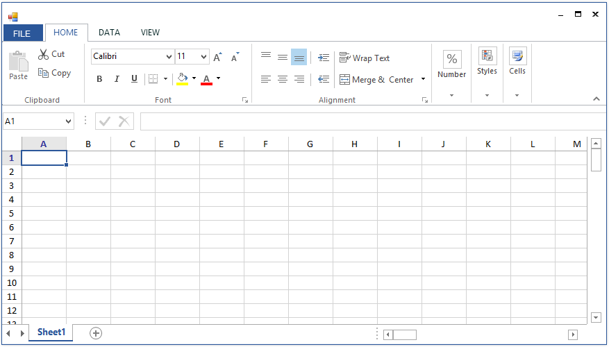
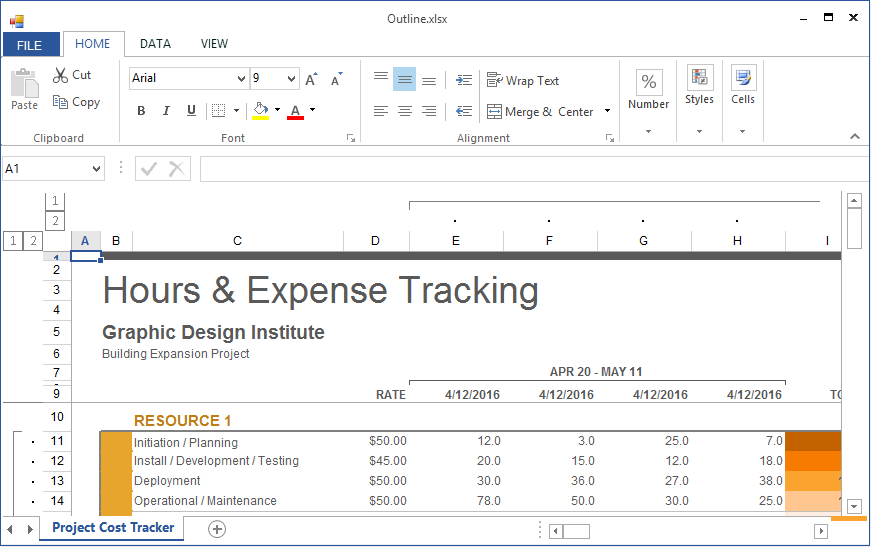

# Getting Started

This section helps you to get started with the Spreadsheet

## Assemblies Deployment

Below table describes, list of assemblies required to be added in project when the Spreadsheet control is used in your application.

<table>
<tr>
<th>
Assembly</th><th>
Description</th></tr>
<tr>
<td>
Syncfusion.Spreadsheet.Windows.dll</td><td>
Contains the classes  that handles all the UI Operations of Spreadsheet such as importing of sheets, applying formulas/styles etc.</td></tr>
<tr>
<td>
Syncfusion.Shared.Base.dll</td><td>
Contains the classes which holds the controls like TabBarPage, TabBarSplitterControl etc.</td></tr>
<tr>
<td>
Syncfusion.Tools.Windows.dll</td><td>
Contains the classes which holds the controls like Ribbon, ToolStripPanelItem,MaskedEditBox,ToolStripGallery,BackStageButton  etc which are used in Spreadsheet.</td></tr>
<tr>
<td>
Syncfusion.XlsIO.Base.dll</td><td>
Contains the base classes which is responsible for read and write in Excel files, Worksheet Manipulations, Formula calculations etc.</td></tr>
</table>
Below are the assemblies list that can be added when you want to enable certain features in Spreadsheet control. 

<table>
<tr>
<th>
Optional Assemblies</th><th>
Description</th></tr>
<tr>
<td>
Syncfusion.SpreadsheetHelper.Windows.dll</td><td>
Contains the classes which is responsible for importing charts and sparklines into Spreadsheet</td></tr>
<tr>
<td>
Syncfusion.ExcelChartToImageConverter.WPF.dll</td><td>
Contains the classes which is responsible for converting charts as image</td></tr>
<tr>
<td>
Syncfusion.Chart.Base.dll</td><td>
Contains the base classes which is responsible for importing charts like Line charts, Pie charts, Sparklines etc.</td></tr>
<tr>
<td>
Syncfusion.Chart.Windows.dll</td><td>
Contains the classes which is responsible for creating charts that holds axes, series, legends etc.</td></tr>
<tr>
<td>
Syncfusion.ExcelToPDFConverter.Base.dll</td><td>
Contains the base and fundamental classes which is responsible for converting excel to PDF.</td></tr>
<tr>
<td>
Syncfusion.Pdf.Base.dll</td><td>
Contains the base and fundamental classes for creating PDF.</td></tr>
</table>

## Create a Simple Application with Spreadsheet

Spreadsheet control can be added into the application either via designer or via coding. 

### Adding a Control via Designer

1.Create new Windows Forms application in Visual Studio.

2.Open the Visual Studio **Tool** **box**. Navigate to Syncfusion Controls tab, and find the  Spreadsheet/SpreadsheetRibbon toolbox items 

3.Drag `Spreadsheet` and drop in the Designer area from the Toolbox

4.Ribbon can be added to the application by dragging `SpreadsheetRibbon` to the Designer area.

5.To make an interaction between Ribbon items and `Spreadsheet`, bind the Spreadsheet as DataContext to the `SpreadsheetRibbon`.

### Adding Control via Coding

Spreadsheet is available in the following namespace `Syncfusion.Windows.Forms.Spreadsheet` and it can be created programmatically by using below code. 

_For_ _Spreadsheet_





private Spreadsheet spreadsheet;

spreadsheet = new Spreadsheet();
            
SpreadsheetRibbon ribbon = new SpreadsheetRibbon() { Spreadsheet = spreadsheet };

spreadsheet.Dock = DockStyle.Fill;

spreadsheet.Anchor = AnchorStyles.Left | AnchorStyles.Top;
          
this.Controls.Add(spreadsheet);
            
this.Controls.Add(ribbon);





_You_ _can_ _get_ _the_ _following_ _output_ _when_ _execute_ _the_ _application_.

## Creating a new Excel Workbook

A new workbook can be created by using a [Create](http://help.syncfusion.com/cr/cref_files/windowsforms/spreadsheet/Syncfusion.Spreadsheet.Windows~Syncfusion.Windows.Forms.Spreadsheet.Spreadsheet~Create.html) method with specified number of worksheets. By default, a workbook will be created with single worksheet.




    spreadsheet.Create(2);




## Opening an existing Excel Workbook

The Excel Workbook can be opened in Spreadsheet using the [Open](http://help.syncfusion.com/cr/cref_files/windowsforms/spreadsheet/Syncfusion.Spreadsheet.Windows~Syncfusion.Windows.Forms.Spreadsheet.Spreadsheet~Open.html) method in various ways,




//Using Stream,

 spreadsheet.Open (Stream file);

//Using String,

 spreadsheet.Open (string file);

//Using Workbook,

 spreadsheet.Open(IWorkbook workbook);
      






    spreadsheet.Open (@"..\..\Data\Outline.xlsx");




Opening Excel File in Spreadsheet
   {:.caption}

## Saving the Excel Workbook

The Excel workbook can be saved in Spreadsheet using [Save](http://help.syncfusion.com/cr/cref_files/windowsforms/spreadsheet/Syncfusion.Spreadsheet.Windows~Syncfusion.Windows.Forms.Spreadsheet.Spreadsheet~Save.html) method. If the workbook already exists in the system drive, it will be saved in the same location, otherwise Save Dialog box opens to save the workbook in user specified location. 




    spreadsheet.Save();




You can also use [SaveAs](http://help.syncfusion.com/cr/cref_files/windowsforms/spreadsheet/Syncfusion.Spreadsheet.Windows~Syncfusion.Windows.Forms.Spreadsheet.Spreadsheet~SaveAs.html) method directly to save the existing excel file with modifications.

The `SaveAs` method in Spreadsheet can be used in various ways,




//Using Stream,

 spreadsheet.SaveAs (Stream file);

//Using String,

 spreadsheet.SaveAs (string file);

//For Dialog box,

 spreadsheet.SaveAs();
      



## Displaying Charts and Sparklines

For importing charts and sparklines in Spreadsheet, add the following assembly as reference into the application.
 
Assembly: **Syncfusion.SpreadsheetHelper.Windows.dll** 

### Charts
 
Create an instance of Syncfusion.Windows.Forms.SpreadsheetHelper.[GraphicChartCellRenderer](http://help.syncfusion.com/cr/cref_files/windowsforms/spreadsheethelper/Syncfusion.SpreadsheetHelper.Windows~Syncfusion.Windows.Forms.SpreadsheetHelper.GraphicChartCellRenderer.html) and add that renderer into [GraphicCellRenderers](http://help.syncfusion.com/cr/cref_files/windowsforms/spreadsheet/Syncfusion.Spreadsheet.Windows~Syncfusion.Windows.Forms.Spreadsheet.GraphicCells.GraphicModel~GraphicCellRenderers.html) collection by using the helper method [AddGraphicChartCellRenderer](http://help.syncfusion.com/cr/cref_files/windowsforms/spreadsheet/Syncfusion.Spreadsheet.Windows~Syncfusion.Windows.Forms.Spreadsheet.GraphicCells.GraphicCellHelper~AddGraphicChartCellRenderer.html) which is available under the namespace `Syncfusion.Windows.Forms.Spreadsheet.GraphicCells`. 




public MainWindow()
{
  InitializeComponent();
  
  //For importing charts,
  this.spreadsheet.AddGraphicChartCellRenderer(new GraphicChartCellRenderer());
}




### Sparklines

Create an instance of Syncfusion.Windows.Forms.SpreadsheetHelper.[SparklineCellRenderer](http://help.syncfusion.com/cr/cref_files/windowsforms/spreadsheethelper/Syncfusion.SpreadsheetHelper.Windows~Syncfusion.Windows.Forms.SpreadsheetHelper.SparklineCellRenderer.html) and add that renderer into Spreadsheetby using the helper method [AddSparklineCellRenderer](http://help.syncfusion.com/cr/cref_files/windowsforms/spreadsheet/Syncfusion.Spreadsheet.Windows~Syncfusion.Windows.Forms.Spreadsheet.GraphicCells.GraphicCellHelper~AddSparklineCellRenderer.html) which is available under the namespace `Syncfusion.Windows.Forms.Spreadsheet.GraphicCells`.




public MainWindow()
{
  InitializeComponent();
      
  //For importing sparklines,
  this.spreadsheet.AddSparklineCellRenderer(new SparklineCellRenderer());
}


