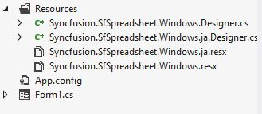
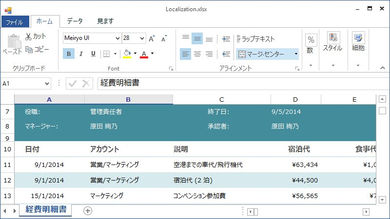

# Localization

Localization is the process of configuring the application to a specific language. Spreadsheet provides support to localize all the static text in a Ribbon and all dialogs to any desired language. Localization can be done by adding resource file and setting the specific culture in the application.

Spreadsheet allows you to set custom resource using Resx file. You can define your string values in resource file for a specific culture and set the culture in your application.

## Set Current UI Culture to the Application

To set the CultureInformation in the Application, set the `CurrentUICulture` before the InitializeComponent() method is called. 

Setting of the culture information,



   
public MainWindow()
{
    System.Threading.Thread.CurrentThread.CurrentUICulture = new System.Globalization.CultureInfo("ja-JP");

    InitializeComponent();
}




Now, the Application is set to the Japanese Culture info. 

## Localization using Resource file

The following steps show how to implement the localization in Spreadsheet,

* Create folder name as ‘Resources’ in your application.
* Add default [Resx](http://www.syncfusion.com/downloads/support/directtrac/general/ze/Syncfusion.SfSpreadsheet.Windows991194474) (resource) file of `Spreadsheet` in the 'Resources' folder named as Syncfusion.Spreadsheet.Windows.resx
* Create Resx(resource) file and name it as Syncfusion.Spreadsheet.Windows.[Culture name].resx. For example, Syncfusion.Spreadsheet.Windows.ja.resx for japanese culture.
  For your reference, Japanese [Resx](http://www.syncfusion.com/downloads/support/directtrac/general/ze/Syncfusion.SfSpreadsheet.Windows991194474) file

* Add the resource key such as name and its corresponding localized value in Resource Designer of Syncfusion.Spreadsheet.Windows.ja.resx file.

The following screenshot shows you the localization in Spreadsheet,

