# Editing in Windows Forms Syntax Editor

The EditControl allows end users to modify and edit the text documents and source code files. Some of the important features are:

* Clipboard operations such as cut, copy, and paste operations.
* Undo and redo with grouping actions.
* Selection modes. 
* Provides fully functional context menu. 
* Indent and outdent functionalities.
* Changes tracking.
* Provides extensive styling support for new line.
* Comment out lines.
* Space indicator.
* Provides complete unicode support.

The following section explains the above listed features.

## Clipboard operations

The EditControl provides keyboard and context menu support to cut, copy, and paste. It stores the data in clipboard for cut and copy operations and retrieves the data from clipboard for paste operation.

### Keyboard and mouse actions

The keyboard shortcuts for performing cut, copy, or paste operation in the EditControl are done by using respective commands mentioned in the following table.

<table>
<tr>
<th>
Command</th><th>
Shortcut</th></tr>
<tr>
<td>
Copy</td><td>
CTRL+C, CTRL+INSERT</td></tr>
<tr>
<td>
Paste</td><td>
CTRL+V, SHIFT+INSERT</td></tr>
<tr>
<td>
Cut</td><td>
CTRL+X, SHIFT+DEL</td></tr>
</table>

### Programmatic clipboard options

Provides extensive support to cut, copy, or paste the text data programmatically. The following functions and properties in the EditControl facilitates these clipboard operations.

<table>
<tr>
<th>
Functions</th><th>
Description</th></tr>
<tr>
<td>
{{ '[Copy](https://help.syncfusion.com/cr/windowsforms/Syncfusion.Windows.Forms.Edit.EditControl.html#Syncfusion_Windows_Forms_Edit_EditControl_Copy)' | markdownify }}</td><td>
Copies the selected text content into the clipboard.</td></tr>
<tr>
<td>
{{ '[Cut](https://help.syncfusion.com/cr/windowsforms/Syncfusion.Windows.Forms.Edit.EditControl.html#Syncfusion_Windows_Forms_Edit_EditControl_Cut)' | markdownify }}</td><td>
Cuts the selected text content from the EditControl and maintains it in clipboard.</td></tr>
<tr>
<td>
{{ '[Paste](https://help.syncfusion.com/cr/windowsforms/Syncfusion.Windows.Forms.Edit.EditControl.html#Syncfusion_Windows_Forms_Edit_EditControl_Paste)' | markdownify }}</td><td>
Retrieves the copied content from clipboard and pastes it into the EditControl.</td></tr>
<tr>
<td>
{{ '[ClearClipboard](https://help.syncfusion.com/cr/windowsforms/Syncfusion.Windows.Forms.Edit.EditControl.html#Syncfusion_Windows_Forms_Edit_EditControl_ClearClipboard)' | markdownify }}</td><td>
Clears all content in the clipboard associated with EditControl. This is generally used immediately after the application loads to clear any junk from the previous clipboard operation.</td></tr>
</table>

<table>
<tr>
<th>
Properties</th><th>
Description</th></tr>
<tr>
<td>
{{ '[CanCopy](https://help.syncfusion.com/cr/windowsforms/Syncfusion.Windows.Forms.Edit.EditControl.html#Syncfusion_Windows_Forms_Edit_EditControl_CanCopy)' | markdownify }}</td><td>
Indicates whether it is possible to perform copy operation or not in the EditControl.</td></tr>
<tr>
<td>
{{ '[CanCut](https://help.syncfusion.com/cr/windowsforms/Syncfusion.Windows.Forms.Edit.EditControl.html#Syncfusion_Windows_Forms_Edit_EditControl_CanCut)' | markdownify }}</td><td>
Indicates whether it is possible to perform cut operation or not in the EditControl.</td></tr>
<tr>
<td>
{{ '[CanPaste](https://help.syncfusion.com/cr/windowsforms/Syncfusion.Windows.Forms.Edit.EditControl.html#Syncfusion_Windows_Forms_Edit_EditControl_CanCut)' | markdownify }}</td><td>
Indicates whether it is possible to perform paste operation or not in the EditControl.</td></tr>
</table>





// Copies the selected text into the clipboard.

this.editControl1.Copy();

// Cuts the selected text contents from EditControl and maintains it in the clipboard.

this.editControl1.Cut();

// Retrieves copied contents from the clipboard and pastes it into EditControl.

this.editControl1.Paste();

// Indicates whether it is possible to perform copy operation in EditControl.

bool canCopy = this.editControl1.CanCopy;

// Indicates whether it is possible to perform cut operation in EditControl.

bool canCut = this.editControl1.CanCut;

// Indicates whether it is possible to perform paste operation in EditControl.

bool canPaste = this.editControl1.CanPaste;

// Clears all contents in the clipboard associated with EditControl.

this.editControl1.ClearClipboard();





' Copies the selected text into the clipboard.

Me.editControl1.Copy()

' Cuts the selected text contents from EditControl and maintains it in the clipboard. 

Me.editControl1.Cut()

' Retrieves copied contents from the clipboard and pastes it into EditControl.

Me.editControl1.Paste()

' Indicates whether it is possible to perform copy operation in EditControl.

Dim canCopy as bool = Me.editControl1.CanCopy

' Indicates whether it is possible to perform cut operation in EditControl.

Dim canCut as bool = Me.editControl1.CanCut

' Indicates whether it is possible to perform paste operation in EditControl.

Dim canPaste as bool = Me.editControl1.CanPaste

' Clears all contents in the clipboard associated with EditControl.

Me.editControl1.ClearClipboard()





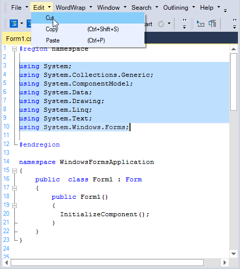

### Cryptography 

The cryptography of the system is based on the FIPS compliant algorithms for encryption, hashing, and security.

#### FIPS mode enabled

Follow the steps to enable FIPS in your machine:

    1. Click Start, open Control Panel, then click on Administrative Tools.
    2. Double-click Local Security Policy.
    3. Double-click Local Policies.
    4. Click Security Options. Under Policies listed in the right pane, double-click System cryptography: Use FIPS compliant algorithms for encryption, hashing, and signing.
    5. Select Enabled to enable FIPS on your machine.

#### Purpose of EnableMD5 in clipboard operations

When FIPS is enabled, clipboard operations of the EditControl are affected due to the usage MD5 algorithm. To avoid this before enabling FIPS, you must disable the EditControl MD5 algorithm by setting the [EnableMD5](https://help.syncfusion.com/cr/windowsforms/Syncfusion.Windows.Forms.Edit.EditControl.html#Syncfusion_Windows_Forms_Edit_EditControl_EnableMD5) property to `false`.





this.editControl1.EnableMD5 = false;





Me.editControl1.EnableMD5 = False





## Undo and redo

Provides keyboard and context menu support for undo and redo operations that erases last change in a document and reinsert it. The [CanUndo](https://help.syncfusion.com/cr/windowsforms/Syncfusion.Windows.Forms.Edit.EditControl.html#Syncfusion_Windows_Forms_Edit_EditControl_CanUndo) and [CanRedo](https://help.syncfusion.com/cr/windowsforms/Syncfusion.Windows.Forms.Edit.EditControl.html#Syncfusion_Windows_Forms_Edit_EditControl_CanRedo) properties gets a flag that determines whether the undo and redo operations can be performed in the EditControl. 

<table>
<tr>
<th>
Command</th><th>
Shortcut</th></tr>
<tr>
<td>
Undo</td><td>
Performs undo (CTRL+Z) operation.</td></tr>
<tr>
<td>
Redo</td><td>
Performs redo (CTRL+Y) operation.</td></tr>
</table>





// Indicates whether it is possible to Undo in the EditControl. 

bool canUndo = this.editControl1.CanUndo;

// Indicates whether it is possible to Redo in the EditControl. 

bool canRedo = this.editControl1.CanRedo;





' Indicates whether it is possible to Undo in the EditControl.

Dim canUndo as bool = Me.editControl1.CanUndo

' Indicates whether it is possible to Redo in the EditControl.

Dim canRedo as bool = Me.editControl1.CanRedo





### Grouping actions

Grouping actions allows you to specify a set of actions as groups for undo or redo purpose. When an action group is created and a set of actions is added to it, the entire set is considered as one entity. This implies that set of actions can be performed or undone by using the `Redo` or `Undo` function call. You can use the UndoGroupOpen, UndoGroupClose, and UndoGroupCancel functions to programmatically manipulate the undo or redo action grouping. Grouping is enabled by using the `GroupUndo` property of the EditControl. It specifies whether grouping should be enabled or disabled for undo or redo action or not.

<table>
<tr>
<th>
Property</th><th>
Description</th></tr>
<tr>
<td>
{{ '[GroupUndo](https://help.syncfusion.com/cr/windowsforms/Syncfusion.Windows.Forms.Edit.EditControl.html#Syncfusion_Windows_Forms_Edit_EditControl_GroupUndo)' | markdownify }}</td><td>
Specifies whether grouping should be enabled for undo or redo action or not.</td></tr>
</table>

<table>
<tr>
<th>
Functions</th><th>
Description</th></tr>
<tr>
<td>
{{ '[UndoGroupOpen](https://help.syncfusion.com/cr/windowsforms/Syncfusion.Windows.Forms.Edit.EditControl.html#Syncfusion_Windows_Forms_Edit_EditControl_UndoGroupOpen)' | markdownify }}</td><td>
Begins a new action group.</td></tr>
<tr>
<td>
{{ '[Undo](https://help.syncfusion.com/cr/windowsforms/Syncfusion.Windows.Forms.Edit.EditControl.html#Syncfusion_Windows_Forms_Edit_EditControl_Undo)' | markdownify }}</td><td>
Performs undo operation.</td></tr>
<tr>
<td>
{{ '[Redo](https://help.syncfusion.com/cr/windowsforms/Syncfusion.Windows.Forms.Edit.EditControl.html#Syncfusion_Windows_Forms_Edit_EditControl_Redo)' | markdownify }}</td><td>
Performs redo operation.</td></tr>
<tr>
<td>
{{ '[UndoGroupClose](https://help.syncfusion.com/cr/windowsforms/Syncfusion.Windows.Forms.Edit.EditControl.html#Syncfusion_Windows_Forms_Edit_EditControl_UndoGroupClose)' | markdownify }}</td><td>
Helps to close the action group.</td></tr>
</table>





// Enable grouping for Undo or Redo actions.

this.editControl1.GroupUndo = true;

// Invoke the UndoGroupOpen function to begin a new action group.

this.editControl1.UndoGroupOpen();

// Accomplish Undo operation.

this.editControl1.Undo();

// Accomplish Redo operation. 

this.editControl1.Redo();

// Invoke the UndoGroupClose function to close the action group

this.editControl1.UndoGroupClose();





' Enable grouping for Undo or Redo actions.

Me.editControl1.GroupUndo = True

' Invoke the UndoGroupOpen function to begin a new action group.

Me.editControl1.UndoGroupOpen()

' Accomplish Undo operation.

Me.editControl1.Undo()

' Accomplish Redo operation.

Me.editControl1.Redo()

' Invoke the UndoGroupClose function to close the action group

Me.editControl1.UndoGroupClose()





### Reset undo redo buffer

[ResetUndoInfo](https://help.syncfusion.com/cr/windowsforms/Syncfusion.Windows.Forms.Edit.EditControl.html#Syncfusion_Windows_Forms_Edit_EditControl_ResetUndoInfo) function in the EditControl helps to reset undo and redo operations. The following table explains this function.

<table>
<tr>
<th>
Functions</th><th>
Description</th></tr>
<tr>
<td>
ResetUndoInfo</td><td>
Clear the undo buffer. So, the undo operation is not allowed on the contents or actions previously added or performed up to that point.</td></tr>
</table>

N> The undo or redo buffer is cleared after the 'Save' operation.





// Clears the Undo buffer. 

this.editControl1.ResetUndoInfo();





' Clears the Undo buffer.

Me.editControl1.ResetUndoInfo()





### Discard undo redo buffer

You can discard an already opened action group by invoking [UndoGroupCancel](https://help.syncfusion.com/cr/windowsforms/Syncfusion.Windows.Forms.Edit.EditControl.html#Syncfusion_Windows_Forms_Edit_EditControl_UndoGroupCancel) function in the EditControl.


   

   
// Helps to cancel an already open action group.

this.editControl1.UndoGroupCancel();




   
' Helps to cancel an already open action group.

Me.editControl1.UndoGroupCancel()





N> Refer to the following sample link that demonstrates the clipboard operations functionalities of the EditControl:
C:\Users\&lt;User&gt;\AppData\Local\Syncfusion\EssentialStudio\Version Number\\Windows\Edit.Windows\Samples\Text Operations\Clipboard Operations

## Selection modes 

The EditControl supports normal selection and rectangular block selection to select the rectangular portion of text instead of whole line like Visual Studio code editor.

### Default  

This mode enables user to select whole line. 


   

   
//To Enable Default mode.

this.editControl1.SelectionMode = Syncfusion.Windows.Forms.Edit.SelectionModes.Default;




   
'To Enable Default mode.

Me.editControl1.SelectionMode = Syncfusion.Windows.Forms.Edit.SelectionModes.Default



   
   

### Programmatic selection

[SelectAll](https://help.syncfusion.com/cr/windowsforms/Syncfusion.Windows.Forms.Edit.EditControl.html#Syncfusion_Windows_Forms_Edit_EditControl_SelectAll), [StartSelection](https://help.syncfusion.com/cr/windowsforms/Syncfusion.Windows.Forms.Edit.EditControl.html#Syncfusion_Windows_Forms_Edit_EditControl_StartSelection), and [StopSelection](https://help.syncfusion.com/cr/windowsforms/Syncfusion.Windows.Forms.Edit.EditControl.html#Syncfusion_Windows_Forms_Edit_EditControl_StopSelection) functions helps to programmatically select text in the EditControl.


   


// Selects all text in EditControl.

this.editControl1.SelectAll();





' Selects all text in EditControl.

Me.editControl1.SelectAll()





The following code snippet demonstrates how to select the text using `StartSelection` and `StopSelection` functions in the EditControl.





this.editControl1.StartSelection(1, 1);
this.editControl1.StopSelection(20, 20);    





Me.editControl1.StartSelection(1, 1)
Me.editControl1.StopSelection(20, 20)  





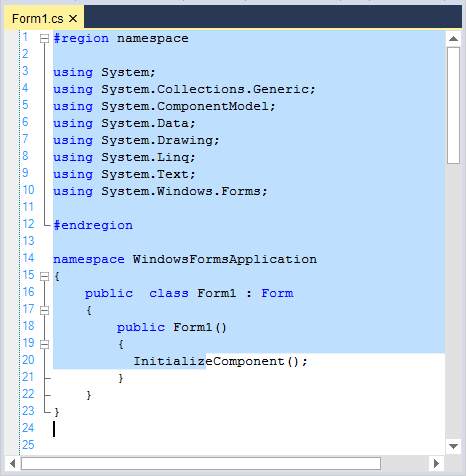
     
### Block   

This mode enables user to select a certain rectangle portion instead of whole line. The selection includes all characters captured in the rectangle defined by the first and last characters in the selection. Anything typed or pasted into the selected area is inserted at the same point on each line. 


   


//To Enable Block selection mode.

this.editControl1.SelectionMode = Syncfusion.Windows.Forms.Edit.SelectionModes.Block;





'To Enable Block selection mode.

Me.editControl1.SelectionMode = Syncfusion.Windows.Forms.Edit.SelectionModes.Block





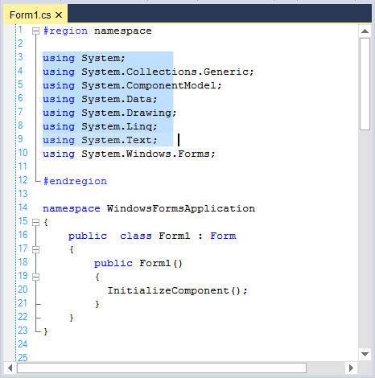

## Text handling

The EditControl offers support for text manipulation operations like appending, deleting, and inserting multiple lines of the text.

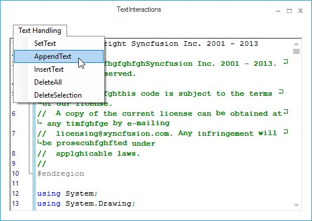

### Total number of lines

The [PhysicalLineCount](https://help.syncfusion.com/cr/windowsforms/Syncfusion.Windows.Forms.Edit.EditControl.html#Syncfusion_Windows_Forms_Edit_EditControl_PhysicalLineCount) property helps to find the total number of lines loaded in the EditControl.





Console.WriteLine(this.editControl1.PhysicalLineCount);





Console.WriteLine(Me.editControl1.PhysicalLineCount)





### Visible number of lines 

The [VisibleLineCount](https://help.syncfusion.com/cr/windowsforms/Syncfusion.Windows.Forms.Edit.EditControl.html#Syncfusion_Windows_Forms_Edit_EditControl_VisibleLineCount) property helps to find visible number of lines in the EditControl. It excludes lines in the collapsed block region. 





Console.WriteLine(this.editControl1.VisibleLineCount);





Console.WriteLine(Me.editControl1.VisibleLineCount)





### Append text

Text can be appended to the EditControl by using the following function.

<table>
<tr>
<th>
Functions</th><th>
Description</th></tr>
<tr>
<td>
{{ '[AppendText](https://help.syncfusion.com/cr/windowsforms/Syncfusion.Windows.Forms.Edit.EditControl.html#Syncfusion_Windows_Forms_Edit_EditControl_AppendText_System_String_)' | markdownify }}</td><td>
Appends specified text to the end of the existing contents of the EditControl.</td></tr>
</table>





// Appends the given string to the end of the text in EditControl.

this.editControl1.AppendText(" text to be appended ");





' Appends the given string to the end of the text in the EditControl.

Me.editControl1.AppendText(" text to be appended ")





### Insert text

Insert mode can be enabled in the EditControl by setting the [InsertMode](https://help.syncfusion.com/cr/windowsforms/Syncfusion.Windows.Forms.Edit.EditControl.html#Syncfusion_Windows_Forms_Edit_EditControl_InsertMode) property. Its default value is `true`. Text can be inserted anywhere inside the EditControl by using the [InsertText](https://help.syncfusion.com/cr/windowsforms/Syncfusion.Windows.Forms.Edit.EditControl.html#Syncfusion_Windows_Forms_Edit_EditControl_InsertText_System_Int32_System_Int32_System_String_) function. The mode of the <kbd>INSERT</kbd> key can be toggled by using the [ToggleInsertMode](https://help.syncfusion.com/cr/windowsforms/Syncfusion.Windows.Forms.Edit.EditControl.html#Syncfusion_Windows_Forms_Edit_EditControl_ToggleInsertMode) function in the EditControl.





this.editControl1.InsertMode = true;

this.editControl1.InsertText(7, 5, "Inserting Text");

// Toggle the insert mode.

this.editControl1.ToggleInsertMode();





Me.editControl1.InsertMode = True

Me.editControl1.InsertText(7, 5, "Inserting Text")

' Toggle the insert mode.

Me.editControl1.ToggleInsertMode()





**Insert multiple lines**

Collection of text lines can be inserted by using the [Lines](https://help.syncfusion.com/cr/windowsforms/Syncfusion.Windows.Forms.Edit.EditControl.html#Syncfusion_Windows_Forms_Edit_EditControl_Lines) property. The property is explained as follows.

<table>
<tr>
<th>
Property</th><th>
Description</th></tr>
<tr>
<td>
Lines</td><td>
Lets you to specify multiple lines of text to the EditControl in the form of a string array. This feature is similar to the one in .NET RichTextBox control.</td></tr>
</table>





// Specifies multiple lines of text to the EditControl in the form of a string array.

this.editControl1.Lines = new string[] {" first line ", " second line ", " third line "};





// Specifies multiple lines of text to the EditControl in the form of a string array.

Me.editControl1.Lines = new string[] {" first line ", " second line ", " third line "}





**Insert text based on conditions**

Text can also be inserted based on condition using the following properties.

<table>
<tr>
<th>
Properties</th><th>
Description</th></tr>
<tr>
<td>
{{ '[AllowDrop](https://help.syncfusion.com/cr/windowsforms/Syncfusion.Windows.Forms.Edit.EditControl.html#Syncfusion_Windows_Forms_Edit_EditControl_AllowDrop)' | markdownify }}</td><td>
Specifies whether drag and drop operations are allowed for the control or not.</td></tr>
<tr>
<td>
{{ '[AllowInsertBeforeReadOnlyNewLine](https://help.syncfusion.com/cr/windowsforms/Syncfusion.Windows.Forms.Edit.EditControl.html#Syncfusion_Windows_Forms_Edit_EditControl_AllowInsertBeforeReadonlyNewLine)' | markdownify }}</td><td>
Specifies whether inserting text should be allowed at the beginning of the readonly region at the start of new line or not.</td></tr>
<tr>
<td>
{{ '[InsertDroppedFileIntoText](https://help.syncfusion.com/cr/windowsforms/Syncfusion.Windows.Forms.Edit.EditControl.html#Syncfusion_Windows_Forms_Edit_EditControl_InsertDroppedFileIntoText)' | markdownify }}</td><td>
Specifies whether the outer file dragged and dropped onto the EditControl should be inserted into the current content. When this property is set to `false`, the current file is closed, and the dropped outer file is opened.</td></tr>
<tr>
<td>
{{ '[RespectTabStopsOnInsertingText](https://help.syncfusion.com/cr/windowsforms/Syncfusion.Windows.Forms.Edit.EditControl.html#Syncfusion_Windows_Forms_Edit_EditControl_RespectTabStopsOnInsertingText)' | markdownify }}</td><td>
Specifies whether the tab stops should be valued on inserting blocks of the text or not.</td></tr>
<tr>
<td>
{{ '[ShowFileDropNotification](https://help.syncfusion.com/cr/windowsforms/Syncfusion.Windows.Forms.Edit.EditControl.html#Syncfusion_Windows_Forms_Edit_EditControl_ShowFileDropNotification)' | markdownify }}</td><td>
Specifies whether the notification message is to be displayed when the outer file is dragged and dropped onto the EditControl or not.</td></tr>
</table>





// Allows text insertion only at the beginning of the ReadOnly region at the start of a new line.

this.editControl1.AllowInsertBeforeReadonlyNewLine = true;

//To set the EditControl that allows to Drag and Dropping files

this.editControl1.AllowDrop = true; 

// Specifies whether the outer file dragged and dropped onto the EditControl should be inserted into the current content.

this.editControl1.InsertDroppedFileIntoText = true;

// To hide the notification message displayed when the outer file is dragged and dropped onto the EditControl.

this.editControl1.ShowFileDropNotification = false;





' Allows text insertion only at the beginning of the ReadOnly region at the start of a new line.

Me.editControl1.AllowInsertBeforeReadonlyNewLine = True

'To set the EditControl that allows to Drag and Dropping files

Me.editControl1.AllowDrop = True

‘Specifies whether the outer file dragged and dropped onto the EditControl should be inserted into the current content.

Me.editControl1.InsertDroppedFileIntoText = True

' To hide the notification message displayed when the outer file is dragged and dropped onto the EditControl.

Me.editControl1.ShowFileDropNotification = False





### Delete text

Text can be deleted in the EditControl by using the following functions.

<table>
<tr>
<th>
Functions</th><th>
Description</th></tr>
<tr>
<td>
{{ '[DeleteChar](https://help.syncfusion.com/cr/windowsforms/Syncfusion.Windows.Forms.Edit.EditControl.html#Syncfusion_Windows_Forms_Edit_EditControl_DeleteChar)' | markdownify }}</td><td>
Deletes a character to the right of the current cursor position.</td></tr>
<tr>
<td>
{{ '[DeleteCharLeft](https://help.syncfusion.com/cr/windowsforms/Syncfusion.Windows.Forms.Edit.EditControl.html#Syncfusion_Windows_Forms_Edit_EditControl_DeleteCharLeft)' | markdownify }}
</td><td>
Deletes a character to the left of the current cursor position.</td></tr>
<tr>
<td>
{{ '[DeleteWord](https://help.syncfusion.com/cr/windowsforms/Syncfusion.Windows.Forms.Edit.EditControl.html#Syncfusion_Windows_Forms_Edit_EditControl_DeleteWord)' | markdownify }}</td><td>
Deletes a word to the right of the current cursor position.</td></tr>
<tr>
<td>
{{ '[DeleteWordLeft](https://help.syncfusion.com/cr/windowsforms/Syncfusion.Windows.Forms.Edit.EditControl.html#Syncfusion_Windows_Forms_Edit_EditControl_DeleteWordLeft)' | markdownify }}</td><td>
Deletes a word to the left of the current cursor position.</td></tr>
<tr>
<td>
{{ '[DeleteAll](https://help.syncfusion.com/cr/windowsforms/Syncfusion.Windows.Forms.Edit.EditControl.html#Syncfusion_Windows_Forms_Edit_EditControl_DeleteAll)' | markdownify }}</td><td>
Deletes all text in the document.</td></tr>
<tr>
<td>
{{ '[DeleteText](https://help.syncfusion.com/cr/windowsforms/Syncfusion.Windows.Forms.Edit.EditControl.html#Syncfusion_Windows_Forms_Edit_EditControl_DeleteText_Syncfusion_Windows_Forms_Edit_Utils_CoordinatePoint_Syncfusion_Windows_Forms_Edit_Utils_CoordinatePoint_)' | markdownify }}</td><td>
Deletes a specified text.</td></tr>
</table>





// Deletes the character to the right of the cursor.

this.editControl1.DeleteChar();

// Deletes the character to the left of the cursor.

this.editControl1.DeleteCharLeft();

// Deletes a word to the right of the current cursor position.

this.editControl1.DeleteWord();

// Deletes a word to the left of the current cursor position.

this.editControl1.DeleteWordLeft();

// To delete all the text.

this.editControl1.DeleteAll();

// To delete a selection.

this.editControl1.DeleteText(this.editControl1.Selection.Top, this.editControl1.Selection.Bottom);





' Deletes the character to the right of the cursor.

Me.editControl1.DeleteChar()

' Deletes the character to the left of the cursor.

Me.editControl1.DeleteCharLeft()

' Deletes a word to the right of the current cursor position.

Me.editControl1.DeleteWord()

' Deletes a word to the left of the current cursor position.

Me.editControl1.DeleteWordLeft()

' Deletes all the text.

Me.editControl1.DeleteAll()

' Deletes a selection.

Me.editControl1.DeleteText(Me.editControl1.Selection.Top, Me.editControl1.Selection.Bottom)





N> Refer to the following sample link that demonstrates the above `Text Handling` functionalities of EditControl:
C:\Users\&lt;User&gt;\AppData\Local\Syncfusion\EssentialStudio\Version Number\Windows\Edit.Windows\Samples\Interactive Features\TextInteractions

## Indent or outdent

Indentation support helps to format the source code to improve readability. By pressing <kbd>TAB</kbd> or <kbd>SPACE</kbd> key, the appropriate number of tabs or spaces will be added to the beginning of each line in the selected block. Similarly, when the <kbd>SHIFT+TAB</kbd> keys combination is pressed, the added tabs or spaces gets removed.

You can also set the tab size to the desired number of spaces by using the [TabSize](https://help.syncfusion.com/cr/windowsforms/Syncfusion.Windows.Forms.Edit.EditControl.html#Syncfusion_Windows_Forms_Edit_EditControl_TabSize) property in the EditControl. By default, the TabSize property value is set to 2.





// "n" is the integer value specifying the number of spaces.

this.editControl1.TabSize = n;





' "n" is the integer value specifying the number of spaces.

Me.editControl1.TabSize = n





The following functions are used to indent and outdent text in the EditControl.

<table>
<tr>
<th>
Functions</th><th>
Description</th></tr>
<tr>
<td>
{{ '[IndentText](https://help.syncfusion.com/cr/windowsforms/Syncfusion.Windows.Forms.Edit.EditControl.html#Syncfusion_Windows_Forms_Edit_EditControl_IndentText_Syncfusion_Windows_Forms_Edit_Utils_CoordinatePoint_Syncfusion_Windows_Forms_Edit_Utils_CoordinatePoint_)' | markdownify }}</td><td>
Indents the text in a specified range.</td></tr>
<tr>
<td>
{{ '[IndentSelection](https://help.syncfusion.com/cr/windowsforms/Syncfusion.Windows.Forms.Edit.EditControl.html)' | markdownify }}</td><td>
Indents the selected text.</td></tr>
<tr>
<td>
{{ '[OutdentText](https://help.syncfusion.com/cr/windowsforms/Syncfusion.Windows.Forms.Edit.EditControl.html#Syncfusion_Windows_Forms_Edit_EditControl_OutdentText_Syncfusion_Windows_Forms_Edit_Utils_CoordinatePoint_Syncfusion_Windows_Forms_Edit_Utils_CoordinatePoint_)' | markdownify }}</td><td>
Outdent the text in a specified range.</td></tr>
<tr>
<td>
{{ '[OutdentSelection](https://help.syncfusion.com/cr/windowsforms/Syncfusion.Windows.Forms.Edit.EditControl.html#Syncfusion_Windows_Forms_Edit_EditControl_OutdentSelection)' | markdownify }}</td><td>
Outdent the selected text.</td></tr>
</table>





// Indents text in the specified range.

this.editControl1.IndentText(new Point(5, 5), new Point(10, 10));

// Indents selected text.

this.editControl1.IndentSelection();

// Outdent text in the specified range.

this.editControl1.OutdentText(new Point(5, 5), new Point(10, 10));

// Outdent selected text.

this.editControl1.OutdentSelection();





' Indents text in the specified range.

Me.editControl1.IndentText(New Point(5, 5), New Point(10, 10))

' Indents selected text.

Me.editControl1.IndentSelection()

' Outdent text in the specified range.

Me.editControl1.OutdentText(New Point(5, 5), New Point(10, 10))

' Outdent selected text.

Me.editControl1.OutdentSelection()





### Default indentation

Indentation guidelines are vertical lines to connect the matching brackets. This feature can be enabled or disabled by setting the [ShowIndentationGuidelines](https://help.syncfusion.com/cr/windowsforms/Syncfusion.Windows.Forms.Edit.EditControl.html#Syncfusion_Windows_Forms_Edit_EditControl_ShowIndentationGuidelines) property. Its default value is `true`. To hide the indentation guidelines in the EditControl, turned off to `false`. The indent guideline for the current region can also be set by using the [ShowIndentGuideline](https://help.syncfusion.com/cr/windowsforms/Syncfusion.Windows.Forms.Edit.EditControl.html#Syncfusion_Windows_Forms_Edit_EditControl_ShowIndentGuideline) function.





// Indentation Guidelines are displayed.

this.editControl1.ShowIndentationGuidelines = true;

// Hide Indentation Guideline.

this.editControl1.HideIndentGuideline();

// Show Indentation Guideline.

this.editControl1.ShowIndentGuideline();





' Indentation Guidelines are displayed.

Me.editControl1.ShowIndentationGuidelines = True

' Hide Indentation Guideline.

Me.editControl1.HideIndentGuideline()

' Show Indentation Guideline.

Me.editControl1.ShowIndentGuideline()





**Positioning**

Provides support to position the caret to the beginning or end of the indentation block by using the [JumpToIndentBlockStart](https://help.syncfusion.com/cr/windowsforms/Syncfusion.Windows.Forms.Edit.EditControl.html#Syncfusion_Windows_Forms_Edit_EditControl_JumpToIndentBlockStart) and [JumpToIndentBlockEnd](https://help.syncfusion.com/cr/windowsforms/Syncfusion.Windows.Forms.Edit.EditControl.html#Syncfusion_Windows_Forms_Edit_EditControl_JumpToIndentBlockEnd) functions respectively.





this.editControl1.JumpToIndentBlockStart();

this.editControl1.JumpToIndentBlockEnd();





Me.editControl1.JumpToIndentBlockStart()

Me.editControl1.JumpToIndentBlockEnd()





### Auto indentation

Provides advanced text indentation support to suit the requirements of the user. The properties given in the following table can be used to customize the auto indentation settings of the EditControl.

<table>
<tr>
<th>
Properties</th><th>
Description</th></tr>
<tr>
<td>
{{ '[AutoIndentMode](https://help.syncfusion.com/cr/windowsforms/Syncfusion.Windows.Forms.Edit.EditControl.html#Syncfusion_Windows_Forms_Edit_EditControl_AutoIndentMode)' | markdownify }}</td><td>
Specifies the mode of auto indentation with None, Block, and Smart options.</td></tr>
<tr>
<td>
{{ '[AutoIndentGuideline](https://help.syncfusion.com/cr/windowsforms/Syncfusion.Windows.Forms.Edit.EditControl.html#Syncfusion_Windows_Forms_Edit_EditControl_AutoIndentGuideline)' | markdownify }}</td><td>
Specifies a value that specifies whether the indent guideline should be shown automatically after the cursor repositioning or not.</td></tr>
</table>





// Sets the AutoIntentMode.

this.editControl1.AutoIndentMode = Syncfusion.Windows.Forms.Edit.Enums.AutoIndentMode.None;





' Sets the AutoIntentMode.

Me.editControl1.AutoIndentMode = Syncfusion.Windows.Forms.Edit.Enums.AutoIndentMode.None





If Enter is pressed when the AutoIndentMode is set to None, the text is not indented.

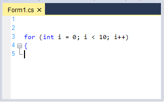

When the AutoIndentMode is set to Smart, the next line is indented by one TabSize from the first column of the previous line on pressing Enter.

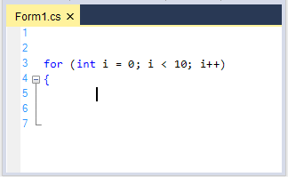

When the AutoIndentMode is set to Block, the next line begins at the same column as the previous line on pressing the ENTER key.

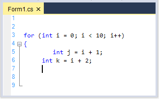

**Lexem support for AutoIndent block mode**

In the EditControl, the [EnableSmartInBlockIndent](https://help.syncfusion.com/cr/windowsforms/Syncfusion.Windows.Forms.Edit.EditControl.html#Syncfusion_Windows_Forms_Edit_EditControl_EnableSmartInBlockIndent) property ensures the AutoIndent Block mode with respect to the lexem’s config.indent. With this property, the Block mode will work like Smart mode for conditional statements.

When this property is enabled, the lines will be aligned to the position of the previous indented line. The lines will begin at the original start position if disabled. The property is explained in the following table.

<table>
<tr>
<th>
Property</th><th>
Description</th></tr>
<tr>
<td>
EnableSmartInBlockIndent</td><td>
Specifies a value to make the Block mode work like Smart mode for conditional statements</td></tr>
</table>





// Specifies a value to make the Block mode work like Smart mode for conditional statements.

this.editcontrol1.EnableSmartInBlockIndent = true;





// Specifies a value to make the Block mode work like Smart mode for conditional statements.

Me.editcontrol1.EnableSmartInBlockIndent = True





The Auto Indentation characters can also be specified by setting the Indent field to True in the lexem definition of the configuration file, as shown below.



<lexem BeginBlock="{" EndBlock="}" Type="Operator" IsComplex="true" IsCollapsable="true" Indent="true"  CollapseName="{...}" IndentationGuideline="true">



### Customize indent appearance

Indentation guidelines and bracket highlighting blocks can be customized by using the following properties.

<table>
<tr>
<th>
Properties</th><th>
Description</th></tr>
<tr>
<td>
{{ '[IndentLineColor](https://help.syncfusion.com/cr/windowsforms/Syncfusion.Windows.Forms.Edit.EditControl.html#Syncfusion_Windows_Forms_Edit_EditControl_IndentLineColor)' | markdownify }}</td><td>
Specifies color of the indent line.</td></tr>
<tr>
<td>
{{ '[IndentBlockHighlightingColor](https://help.syncfusion.com/cr/windowsforms/Syncfusion.Windows.Forms.Edit.EditControl.html#Syncfusion_Windows_Forms_Edit_EditControl_IndentBlockHighlightingColor)' | markdownify }}</td><td>
Specifies color of the indent start and end blocks.</td></tr>
<tr>
<td>
{{ '[IndentationBlockBackgroundBrush](https://help.syncfusion.com/cr/windowsforms/Syncfusion.Windows.Forms.Edit.EditControl.html#Syncfusion_Windows_Forms_Edit_EditControl_IndentationBlockBackgroundBrush)' | markdownify }}</td><td>
Specifies brush for the indentation block background.</td></tr>
<tr>
<td>
{{ '[IndentationBlockBorderColor](https://help.syncfusion.com/cr/windowsforms/Syncfusion.Windows.Forms.Edit.EditControl.html#Syncfusion_Windows_Forms_Edit_EditControl_IndentationBlockBorderColor)' | markdownify }}</td><td>
Specifies color of indentation block border line.</td></tr>
<tr>
<td>
{{ '[IndentationBlockBorderStyle](https://help.syncfusion.com/cr/windowsforms/Syncfusion.Windows.Forms.Edit.EditControl.html#Syncfusion_Windows_Forms_Edit_EditControl_IndentationBlockBorderStyle)' | markdownify }}</td><td>
Specifies style of the indentation block border line.</td></tr>
<tr>
<td>
{{ '[ShowIndentationBlockBorders](https://help.syncfusion.com/cr/windowsforms/Syncfusion.Windows.Forms.Edit.EditControl.html#Syncfusion_Windows_Forms_Edit_EditControl_ShowIndentationBlockBorders)' | markdownify }}</td><td>
Specifies whether the indentation block borders should be drawn or not.</td></tr>
</table>





this.editControl1.IndentLineColor = Color.OrangeRed;

this.editControl1.IndentBlockHighlightingColor = Color.IndianRed;

this.editControl1.IndentationBlockBackgroundBrush = new Syncfusion.Drawing.BrushInfo(Syncfusion.Drawing.GradientStyle.BackwardDiagonal, System.Drawing.SystemColors.Info, System.Drawing.Color.Khaki);

this.editControl1.IndentationBlockBorderColor = System.Drawing.Color.Crimson;

this.editControl1.IndentationBlockBorderStyle = Syncfusion.Windows.Forms.Edit.Enums.FrameBorderStyle.DashDot;

this.editControl1.ShowIndentationBlockBorders = true;





Me.editControl1.IndentLineColor = Color.OrangeRed

Me.editControl1.IndentBlockHighlightingColor = Color.IndianRed

Me.editControl1.IndentationBlockBackgroundBrush = New Syncfusion.Drawing.BrushInfo(Syncfusion.Drawing.GradientStyle.BackwardDiagonal, System.Drawing.SystemColors.Info, System.Drawing.Color.Khaki)

Me.editControl1.IndentationBlockBorderColor = System.Drawing.Color.Crimson

Me.editControl1.IndentationBlockBorderStyle = Syncfusion.Windows.Forms.Edit.Enums.FrameBorderStyle.DashDot

Me.editControl1.ShowIndentationBlockBorders = True





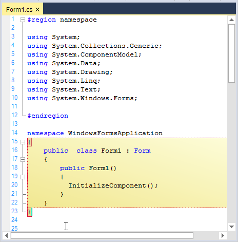

## Commands

Provides extensive support for various commands same as Visual Studio code editor.

### Default key commands

The keyboard shortcuts for the commands in the EditControl are listed as follows.

<table>
<tr>
<th>
Command</th><th>
Shortcut</th></tr>
<tr>
<th colspan = "2">
Clipboard</th></tr>
<tr>
<td>
Copy</td><td>
CTRL+C, CTRL+INSERT</td></tr>
<tr>
<td>
Paste</td><td>
CTRL+V, SHIFT+INSERT</td></tr>
<tr>
<td>
Cut</td><td>
CTRL+X, SHIFT+DEL</td></tr>
<tr>
<td>
SelectAll</td><td>
CTRL+A</td></tr>
<tr>
<th colspan = "2">
File Operation</th></tr>
<tr>
<td>
Save</td><td>
CTRL+S</td></tr>
<tr>
<td>
SaveAs</td><td>
CTRL+SHIFT+S</td></tr>
<tr>
<td>
New</td><td>
CTRL+N</td></tr>
<tr>
<td>
Open</td><td>
CTRL+O</td></tr>
<tr>
<th colspan = "2">
Printing</th></tr>
<tr>
<td>
Print</td><td>
CTRL+P</td></tr>
<tr>
<td>
PrintPreview</td><td>
Printing.PrintPreview</td></tr>
<tr>
<th colspan = "2">
Positioning</th></tr>
<tr>
<td>
Go to line</td><td>
CTRL+G</td></tr>
<tr>
<td>
Go to start</td><td>
CTRL+HOME</td></tr>
<tr>
<td>
Go to end</td><td>
CTRL+END</td></tr>
<tr>
<th colspan = "2">
Search and Replace</th></tr>
<tr>
<td>
Find</td><td>
CTRL+F</td></tr>
<tr>
<td>
FindNext</td><td>
F3</td></tr>
<tr>
<td>
FindSelected</td><td>
CTRL+F3</td></tr>
<tr>
<td>
Replace</td><td>
CTRL+H</td></tr>
<tr>
<th colspan = "2">
Undo and Redo</th></tr>
<tr>
<td>
Undo </td><td>
CTRL+Z</td></tr>
<tr>
<td>
Redo</td><td>
CTRL+Y</td></tr>
<tr>
<th colspan = "2">
Bookmark</th></tr>
<tr>
<td>
Toggle unnamed bookmark</td><td>
CTRL+F2, CTRL+K->CTRL+K</td></tr>
<tr>
<td>
Go to next bookmark</td><td>
F2, CTRL+K->CTRL+N</td></tr>
<tr>
<td>
Go to previous bookmark</td><td>
F3, CTRL+K->CTRL+P</td></tr>
<tr>
<td>
Toggle named bookmark</td><td>
CTRL+[index of bookmark]</td></tr>
<tr>
<td>
Go to named bookmark</td><td>
CTRL+SHIFT+[index of bookmark]</td></tr>
<tr>
<td>
Bookmark clear</td><td>
Ctrl+Shift+F2</td></tr>
<tr>
<th colspan = "2">
Tab</th></tr>
<tr>
<td>
Add leading tab</td><td>
TAB with multiple line selection</td></tr>
<tr>
<td>
Remove leading tab</td><td>
SHIFT+TAB</td></tr>
<tr>
<th colspan = "2">
Outlining</th></tr>
<tr>
<td>
Switch on outlining and collapse all</td><td>
CTRL+M->CTRL+O</td></tr>
<tr>
<td>
Switch off outlining</td><td>
CTRL+M->CTRL+P</td></tr>
<tr>
<td>
Toggle outlining</td><td>
CTRL+M->CTRL+M</td></tr>
<tr>
<th colspan = "2">
WhiteSpace</th></tr>
<tr>
<td>
Show white space</td><td>
CTRL+SHIFT+W</td></tr>
<tr>
<th colspan = "2">
Intellisense</th></tr>
<tr>
<td>
Show context prompt</td><td>
CTRL+SHIFT+SPACEBAR</td></tr>
<tr>
<td>
Show context choice</td><td>
CTRL+SPACEBAR</td></tr>
</table>

The parent form of the EditControl can be closed while pressing Esc key when setting the [AcceptsEscape](https://help.syncfusion.com/cr/windowsforms/Syncfusion.Windows.Forms.Edit.EditControl.html#Syncfusion_Windows_Forms_Edit_EditControl_AcceptsEscape) property to `false`. Its default is `true`. This operation is performed only when the parent form contains `Cancel` button.

### Performing user-defined action for default command

By using the [RegisteringDefaultKeyBindings](https://help.syncfusion.com/cr/windowsforms/Syncfusion.Windows.Forms.Edit.EditControl.html) and [ProcessCommand](https://help.syncfusion.com/cr/windowsforms/Syncfusion.Shared.Utils.KeyBinding.IKeyCommand.html) events, you can perform user-defined action for the default command. The following table contains the default command and respective string to use while adding it to commands in the EditControl.

<table>
<tr>
<th>
Command</th><th>
String</th></tr>
<tr>
<th colspan = "2">
Clipboard</th></tr>
<tr>
<td>
Copy</td><td>
Clipboard.Copy</td></tr>
<tr>
<td>
Paste</td><td>
Clipboard.Paste</td></tr>
<tr>
<td>
Cut</td><td>
Clipboard.Cut</td></tr>
<tr>
<td>
SelectAll</td><td>
Edit.SelectAll</td></tr>
<tr>
<th colspan = "2">
File Operation</th></tr>
<tr>
<td>
Save</td><td>
File.Save</td></tr>
<tr>
<td>
SaveAs</td><td>
File.SaveAs</td></tr>
<tr>
<td>
New</td><td>
File.New</td></tr>
<tr>
<td>
Open</td><td>
File.Open</td></tr>
<tr>
<th colspan = "2">
Printing</th></tr>
<tr>
<td>
Print</td><td>
Printing.Print</td></tr>
<tr>
<th colspan = "2">
Positioning</th></tr>
<tr>
<td>
Go to line</td><td>
Edit.GoTo</td></tr>
<tr>
<td>
Go to start</td><td>
Navigation.DocumentStart</td></tr>
<tr>
<td>
Go to end</td><td>
Navigation.DocumentEnd</td></tr>
<tr>
<th colspan = "2">
Search and Replace</th></tr>
<tr>
<td>
Find</td><td>
Edit.Find</td></tr>
<tr>
<td>
FindNext</td><td>
Edit.FindNext</td></tr>
<tr>
<td>
Replace</td><td>
Edit.Replace</td></tr>
<tr>
<th colspan = "2">
Undo and Redo</th></tr>
<tr>
<td>
Undo </td><td>
Edit.Undo</td></tr>
<tr>
<td>
Redo</td><td>
Edit.Redo</td></tr>
<tr>
<th colspan = "2">
Bookmark</th></tr>
<tr>
<td>
Toggle unnamed bookmark</td><td>
Edit.Bookmarks.Toggle</td></tr>
<tr>
<td>
Go to next bookmark</td><td>
Edit.Bookmarks.Next</td></tr>
<tr>
<td>
Go to previous bookmark</td><td>
Edit.Bookmarks.Previous</td></tr>
<tr>
<td>
Toggle named bookmark</td><td>
Edit.Bookmarks.Toggle[index of bookmark]</td></tr>
<tr>
<td>
Go to named bookmark</td><td>
Edit.Bookmarks.Switch[index of bookmark]</td></tr>
<tr>
<td>
Bookmark clear</td><td>
Edit.Bookmarks.Clear</td></tr>
<tr>
<th colspan = "2">
Tab</th></tr>
<tr>
<td>
Add leading tab</td><td>
Edit.AddLeadingTab</td></tr>
<tr>
<td>
Remove leading tab</td><td>
Edit.RemoveLeadingTab</td></tr>
<tr>
<th colspan = "2">
Outlining</th></tr>
<tr>
<td>
Switch on outlining and collapse all</td><td>
Edit.Collapsing.On</td></tr>
<tr>
<td>
Switch off outlining</td><td>
Edit.Collapsing.Off</td></tr>
<tr>
<td>
Toggle outlining</td><td>
Edit.Collapsing.Toggle</td></tr>
<tr>
<th colspan = "2">
Intellisense</th></tr>
<tr>
<td>
Show context prompt</td><td>
Editor.ContextPrompt</td></tr>
<tr>
<td>
Show code snippets</td><td>
Editor.CodeSnippets</td></tr>
<tr>
<td>
Show context choice</td><td>
Editor.ContextChoice</td></tr>
</table>





this.editControl1.RegisteringDefaultKeyBindings += new EventHandler(EditControl1_RegisteringDefaultKeyBindings);

// Performing some actions using the ProcessCommandEventHandler events while opening a new file in EditControl.

private void this.EditControl1_RegisteringDefaultKeyBindings(object sender, EventArgs e)
{

     this.editControl1.Commands.Add( "File.Open" ).ProcessCommand += new ProcessCommandEventHandler( Command_Open );

}

// Define the action that needs to be performed.

private void Command_Open()
{

      /* Do the desired task. */

}





AddHandler Me.editControl1.RegisteringDefaultKeyBindings, AddressOf EditControl1_RegisteringDefaultKeyBindings

// Performing some actions using the ProcessCommandEventHandler events while opening a new file in EditControl.

Private  Sub Me.editControl1_RegisteringDefaultKeyBindings(ByVal sender As Object, ByVal e As EventArgs)

     Me.editControl1.Commands.Add("File.Open").ProcessCommand += New ProcessCommandEventHandler(Command_Open)

End Sub

' Define the action that needs to be performed.

Private Sub Command_Open()

     ' Do the desired task.

End Sub





### Custom command binding

By using the [RegisteringKeyCommands](https://help.syncfusion.com/cr/windowsforms/Syncfusion.Windows.Forms.Edit.EditControl.html) event, you can bind the desired custom keystroke combinations to the desired command.

This following code example registers the "File.Open" command and binds a <kbd>Ctrl+Q</kbd> keystroke combination to it.





this.editControl1.RegisteringKeyCommands += new EventHandler(EditControl1_RegisteringKeyCommands);

// Bind custom key combinations to the action name using the RegisteringKeyCommands event. 

private void this.EditControl1_RegisteringKeyCommands(object sender, EventArgs e)
{

      this.editControl1.KeyBinder.BindToCommand( Keys.Control | Keys.Q, "File.Open" );

}





AddHandler Me.editControl1.RegisteringKeyCommands, AddressOf EditControl1_RegisteringKeyCommands

' Bind custom key combinations to the action name using the RegisteringKeyCommands event.  

Private  Sub Me.EditControl1_RegisteringKeyCommands(ByVal sender As Object, ByVal e As EventArgs)

     Me.editControl1.KeyBinder.BindToCommand(Keys.Control | Keys.Q, "File.Open")

End Sub





## Accept tab 

Provides support to insert the `TAB` character in the EditControl instead of moving the focus to the next control in the tab order while pressing <kbd>TAB</kbd> key. This functionalities can be enabled only when the [UseTabs](https://help.syncfusion.com/cr/windowsforms/Syncfusion.Windows.Forms.Edit.EditControl.html#Syncfusion_Windows_Forms_Edit_EditControl_UseTabs) property is `true`.

<table>
<tr>
<th>
Properties</th><th>
Description</th></tr>
<tr>
<td>
{{ '[UseTabs](https://help.syncfusion.com/cr/windowsforms/Syncfusion.Windows.Forms.Edit.EditControl.html#Syncfusion_Windows_Forms_Edit_EditControl_UseTabs)' | markdownify }}</td><td>
Specifies whether the tab symbol is allowed or spaces should be used instead. Setting this property to `true` allows you to insert tabs whereas, setting to `false` allows you to insert spaces.</td></tr>
<tr>
<td>
{{ '[UseTabStops](https://help.syncfusion.com/cr/windowsforms/Syncfusion.Windows.Forms.Edit.EditControl.html#Syncfusion_Windows_Forms_Edit_EditControl_UseTabStops)' | markdownify }}</td><td>
Specifies a value that indicates whether tab stops should be used.</td></tr>
<tr>
<td>
{{ '[TabStopsArray](https://help.syncfusion.com/cr/windowsforms/Syncfusion.Windows.Forms.Edit.EditControl.html#Syncfusion_Windows_Forms_Edit_EditControl_TabStopsArray)' | markdownify }}</td><td>
Specifies an array of tab stops.</td></tr>
</table>





this.editControl1.UseTabs = true;

this.editControl1.UseTabStops = true;

this.editControl1.TabStopsArray = new int[] { 8, 16, 24, 32, 40};





Me.editControl1.UseTabs = True

Me.editControl1.UseTabStops = True

Me.EditControl1.TabStopsArray = New Integer() {8, 16, 24, 32, 40}





## Insert space or keep tabs

The following functions can be used to convert the spaces in a selected region into tabs and vice versa. Tab symbols can also be added, inserted, or removed from the selected text.

<table>
<tr>
<th>
Functions</th><th>
Description</th></tr>
<tr>
<td>
{{ '[AddTabsToSelection](https://help.syncfusion.com/cr/windowsforms/Syncfusion.Windows.Forms.Edit.EditControl.html#Syncfusion_Windows_Forms_Edit_EditControl_AddTabsToSelection)' | markdownify }}</td><td>
Adds leading tab symbol to the selected lines, or just inserts the tab symbol.</td></tr>
<tr>
<td>
{{ '[RemoveTabsFromSelection](https://help.syncfusion.com/cr/windowsforms/Syncfusion.Windows.Forms.Edit.EditControl.html#Syncfusion_Windows_Forms_Edit_EditControl_RemoveTabsFromSelection)' | markdownify }}</td><td>
Removes leading tab symbol (or its spaces equivalent) from the selected lines.</td></tr>
</table>





// Add or insert leading tab symbol to selected lines.

this.editControl1.AddTabsToSelection();

// Remove leading tab symbol from selected lines.

this.editControl1.RemoveTabsFromSelection();





' Add or insert leading tab symbol to selected lines.

Me.editControl1.AddTabsToSelection()

' Remove leading tab symbol from selected lines.

Me.editControl1.RemoveTabsFromSelection()





### Keep tab character

The [TransferFocusOnTab](https://help.syncfusion.com/cr/windowsforms/Syncfusion.Windows.Forms.Edit.EditControl.html#Syncfusion_Windows_Forms_Edit_EditControl_TransferFocusOnTab) property allows you to specify whether the EditControl should process TAB key as a text input or transfer focus to the next control (by the order of TabIndex property value) on the form or the user control that hosts the EditControl.





// Insert tabs into the EditControl as text input. 

this.editControl1.TransferFocusOnTab = false;

// Transfer focus to the next control.

this.editControl1.TransferFocusOnTab = true;





' Insert tabs into the EditControl as text input.

this.editControl1.TransferFocusOnTab = False

' Transfer focus to the next control.

this.editControl1.TransferFocusOnTab = True





### Change tab character size

The [TabSize](https://help.syncfusion.com/cr/windowsforms/Syncfusion.Windows.Forms.Edit.EditControl.html#Syncfusion_Windows_Forms_Edit_EditControl_TabSize) property helps to insert the number of spaces when pressing the TAB key. This functionality is enabled only when the [UseTabs](https://help.syncfusion.com/cr/windowsforms/Syncfusion.Windows.Forms.Edit.EditControl.html#Syncfusion_Windows_Forms_Edit_EditControl_UseTabs) property in the EditControl is `true`.





// Size of the tab in terms of space.

this.editControl1.TabSize = 8;





' Size of the tab in terms of space.

Me.editControl1.TabSize = 8





## Context menu options

Provides a built-in context menu options to perform editing operations like undo, redo, cut, copy, paste, select all, and so on. It includes some advanced features like indent selection, comment selection, adding bookmarks, and much more. 

### Default context menu options 

Context menu is enabled by using the [editControl1.ContextMenuManager.Enabled](https://help.syncfusion.com/cr/windowsforms/Syncfusion.Windows.Forms.Edit.Implementation.ContextMenuManager.html#Syncfusion_Windows_Forms_Edit_Implementation_ContextMenuManager_Enabled) property. The ContextMenu can be enabled or disabled by using the [ContextMenuEnabled](https://help.syncfusion.com/cr/windowsforms/Syncfusion.Windows.Forms.Edit.EditControl.html#Syncfusion_Windows_Forms_Edit_EditControl_ContextMenuEnabled) property in EditControl. Its default value is `true`. 

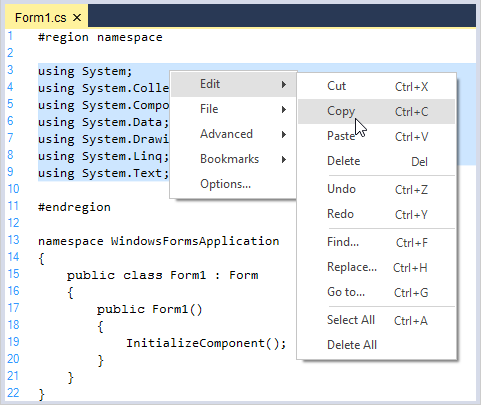

Set the appearance of the context menu by specifying the desired ContextMenuProvider.





// Show Office2003 style context menu.

this.editControl1.ContextMenuManager.ContextMenuProvider = new Syncfusion.Windows.Forms.Tools.XPMenus.XPMenusProvider();

// Show Standard style context menu.

this.editControl1.ContextMenuManager.ContextMenuProvider = new Syncfusion.Windows.Forms.StandardMenusProvider();





' Show Office2003 style context menu

Me.editControl1.ContextMenuManager.ContextMenuProvider = New Syncfusion.Windows.Forms.Tools.XPMenus.XPMenusProvider()

' Show Standard style context menu

Me.editControl1.ContextMenuManager.ContextMenuProvider = New Syncfusion.Windows.Forms.StandardMenusProvider()





### Remove default context menu

By using the [MenuFill](https://help.syncfusion.com/cr/windowsforms/Syncfusion.Windows.Forms.Edit.EditControl.html) event in EditControl, you can remove the default context menu items. 





// Handle the MenuFill event which is called each time the context menu is displayed.

this.editControl1.MenuFill += new EventHandler(cm_FillMenu);

private void cm_FillMenu(object sender, EventArgs e)
{

ContextMenuManager cm = (ContextMenuManager) sender;

// To clear default context menu items.

cm.ClearMenu();

}





' Handle the MenuFill event which is called each time the context menu is displayed.

AddHandler Me.editControl1.MenuFill, AddressOf cm_FillMenu

Private Sub cm_FillMenu(ByVal sender As Object, ByVal e As EventArgs)

Dim cm As ContextMenuManager = CType(sender, ContextMenuManager)

' To clear default context menu items.

cm.ClearMenu();





### Disable particular item from context menu

Context menu item can be disabled by using the `SetContextMenuItemEnabled` function by passing the following parameters:

* String: Setting ContextMenuItem name by preceding **&**.
* Bool: Setting the bool value to `true` or `false`.





  private void EditControl1_MenuFill(object sender, EventArgs e)
  {
      ContextMenuManager contextMenu = (ContextMenuManager)sender;
            
      contextMenu.ContextMenuProvider.SetContextMenuItemEnabled("&Edit", false);
      
  }     





    Private Sub EditControl1_MenuFill(ByVal sender As Object, ByVal e As EventArgs)
    
         Dim contextMenu As ContextMenuManager = CType(sender, ContextMenuManager)
            
         contextMenu.ContextMenuProvider.SetContextMenuItemEnabled("&Edit", False)

    End Sub     





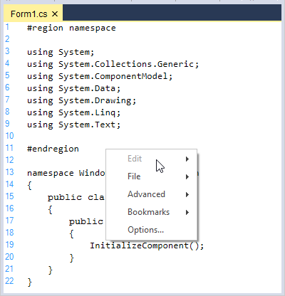

### Change shortcut key for context menu options

By using the [RegisteringKeyCommands](https://help.syncfusion.com/cr/windowsforms/Syncfusion.Windows.Forms.Edit.EditControl.html) event, you can change the shortcut key for context menu options.

This following code example registers the "Clipboard.Cut" command and binds a <kbd>Ctrl+L</kbd> keystroke combination to it.





this.editControl1.RegisteringKeyCommands += new EventHandler(EditControl1_RegisteringKeyCommands);

// Bind custom key combinations to the action name using the RegisteringKeyCommands event. 

private void this.EditControl1_RegisteringKeyCommands(object sender, EventArgs e)
{

      this.editControl1.KeyBinder.BindToCommand(Keys.Control | Keys.L, "Clipboard.Cut");

}





AddHandler Me.editControl1.RegisteringKeyCommands, AddressOf EditControl1_RegisteringKeyCommands

' Bind custom key combinations to the action name using the RegisteringKeyCommands event.  

Private  Sub Me.EditControl1_RegisteringKeyCommands(ByVal sender As Object, ByVal e As EventArgs)

     Me.editControl1.KeyBinder.BindToCommand(Keys.Control | Keys.L, "Clipboard.Cut")

End Sub





N> Refer to the respective command string in the [Commands](https://help.syncfusion.com/windowsforms/syntaxeditor/editing#commands) section.

### Add custom context menu item

EditControl also provides an extensive support to add the custom context menu items. You can handle the [MenuFill](https://help.syncfusion.com/cr/windowsforms/Syncfusion.Windows.Forms.Edit.EditControl.html) event to add Menu Items to the context menu. This is illustrated in the below code snippet. 





// Handle the MenuFill event which is called each time the context menu is displayed.

this.editControl1.MenuFill += new EventHandler(cm_FillMenu);

private void cm_FillMenu(object sender, EventArgs e)
{

ContextMenuManager cm = (ContextMenuManager) sender;

// Add a separator.

cm.AddSeparator();

// Add custom context menu items and their Click event handlers.

cm.AddMenuItem("&Find", new EventHandler(ShowFindDialog));
cm.AddMenuItem("&Replace", new EventHandler(ShowReplaceDialog));
cm.AddMenuItem("&Goto", new EventHandler(ShowGoToDialog));

// If you need to get access to the underlying menu provider you can access it using the below given code.

Syncfusion.Windows.Forms.IContextMenuProvider contextMenuProvider = this.editControl1.ContextMenuManager.ContextMenuProvider;

}

// Calling the in-built dialogs.
void ShowFindDialog(object sender, EventArgs e)
{
   this.editControl1.ShowFindDialog();
}

void ShowReplaceDialog(object sender, EventArgs e)
{
   this.editControl1.ShowReplaceDialog();
}

void ShowGoToDialog(object sender, EventArgs e)
{
   this.editControl1.ShowGoToDialog();
}





' Handle the MenuFill event which is called each time the context menu is displayed.

AddHandler Me.editControl1.MenuFill, AddressOf cm_FillMenu

Private Sub cm_FillMenu(ByVal sender As Object, ByVal e As EventArgs)

Dim cm As ContextMenuManager = CType(sender, ContextMenuManager)

' Add a separator.

cm.AddSeparator()

' Add custom context menu items and their Click eventhandlers.

cm.AddMenuItem("&Find", New EventHandler(AddressOf ShowFindDialog))
cm.AddMenuItem("&Replace", New EventHandler(AddressOf ShowReplaceDialog))
cm.AddMenuItem("&Goto", New EventHandler(AddressOf ShowGoToDialog))

' If you need to get access to the underlying menu provider you can access it using the below given code.

Dim contextMenuProvider As Syncfusion.Windows.Forms.IContextMenuProvider = Me.editControl1.ContextMenuManager.ContextMenuProvider

End Sub 'cm_FillMenu

' Calling the in-built dialogs.

Sub ShowFindDialog(ByVal sender As Object, ByVal e As EventArgs)

Me.editControl1.FindDialog()

End Sub 

Sub ShowReplaceDialog(ByVal sender As Object, ByVal e As EventArgs)

Me.editControl1.ReplaceDialog()

End Sub

Sub ShowGoToDialog(ByVal sender As Object, ByVal e As EventArgs)

Me.editControl1.GoToDialog()

End Sub





## Line modification marker

The EditControl tracks the changed lines by displaying markers at the beginning of modified or inserted lines after the last file save operation. Changed lines marking feature can be enabled by setting the [MarkChangedLines](https://help.syncfusion.com/cr/windowsforms/Syncfusion.Windows.Forms.Edit.EditControl.html#Syncfusion_Windows_Forms_Edit_EditControl_MarkChangedLines) property to `true`. To enable this functionality in the EditControl, the [ShowSelectionMargin](https://help.syncfusion.com/cr/windowsforms/Syncfusion.Windows.Forms.Edit.EditControl.html#Syncfusion_Windows_Forms_Edit_EditControl_ShowSelectionMargin) property should also be enabled.





this.editControl1.MarkChangedLines = true;

this.editControl1.ShowSelectionMargin = true;





Me.editControl1.MarkChangedLines = True

Me.editControl1.ShowSelectionMargin = true





### Modified line marker color

The [ChangedLinesMarkingLineColor](https://help.syncfusion.com/cr/windowsforms/Syncfusion.Windows.Forms.Edit.EditControl.html#Syncfusion_Windows_Forms_Edit_EditControl_ChangedLinesMarkingLineColor) property helps to customize the color for changed lines in the EditControl.





this.editControl1.ChangedLinesMarkingLineColor = Color.Red;





Me.editControl1.ChangedLinesMarkingLineColor = Color.Red





### Saved line marker color

The [SavedLinesMarkingLineColor](https://help.syncfusion.com/cr/windowsforms/Syncfusion.Windows.Forms.Edit.EditControl.html#Syncfusion_Windows_Forms_Edit_EditControl_SavedLinesMarkingLineColor) property helps to customize the color for saved lines in the EditControl.





this.editControl1.SavedLinesMarkingLineColor = Color.Orange;





Me.editControl1.SavedLinesMarkingLineColor = Color.Orange





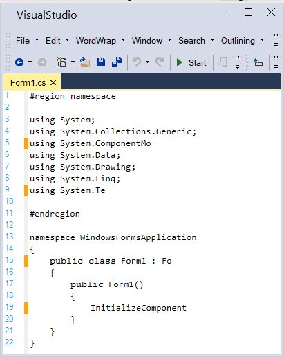

## Comment out lines

Provides support for commenting and uncommenting a particular or group of lines. Comments can be set for a single line, selected text, and for text within a specified range by using the following functions.

<table>
<tr>
<th>
Functions</th><th>
Description</th></tr>
<tr>
<td>
{{ '[CommentLine](https://help.syncfusion.com/cr/windowsforms/Syncfusion.Windows.Forms.Edit.EditControl.html#Syncfusion_Windows_Forms_Edit_EditControl_CommentLine)' | markdownify }}</td><td>
Comments single line.</td></tr>
<tr>
<td>
{{ '[CommentSelection](https://help.syncfusion.com/cr/windowsforms/Syncfusion.Windows.Forms.Edit.EditControl.html#Syncfusion_Windows_Forms_Edit_EditControl_CommentSelection)' | markdownify }}</td><td>
Comments selected text.</td></tr>
<tr>
<td>
{{ '[CommentText](https://help.syncfusion.com/cr/windowsforms/Syncfusion.Windows.Forms.Edit.EditControl.html#Syncfusion_Windows_Forms_Edit_EditControl_CommentText_System_Drawing_Point_System_Drawing_Point_)' | markdownify }}</td><td>
Comments text in a specified range.</td></tr>
</table>





this.editControl1.CommentLine(1);

this.editControl1.CommentSelection();

this.editControl1.CommentText(new Point(1, 1), new Point(7, 7));





Me.editControl1.CommentLine(1)

Me.editControl1.CommentSelection()

Me.editControl1.CommentText(New Point(1, 1), New Point(7, 7))





Comments can be removed by using the following functions.

<table>
<tr>
<th>
Functions</th><th>
Description</th></tr>
<tr>
<td>
{{ '[UnCommentLine](https://help.syncfusion.com/cr/windowsforms/Syncfusion.Windows.Forms.Edit.EditControl.html#Syncfusion_Windows_Forms_Edit_EditControl_UnCommentLine)' | markdownify }}</td><td>
UnComments single line.</td></tr>
<tr>
<td>
{{ '[UnCommentSelection](https://help.syncfusion.com/cr/windowsforms/Syncfusion.Windows.Forms.Edit.EditControl.html#Syncfusion_Windows_Forms_Edit_EditControl_UncommentSelection)' | markdownify }}</td><td>
UnComments selected text.</td></tr>
<tr>
<td>
{{ '[UnCommentText](https://help.syncfusion.com/cr/windowsforms/Syncfusion.Windows.Forms.Edit.EditControl.html#Syncfusion_Windows_Forms_Edit_EditControl_UncommentText_System_Drawing_Point_System_Drawing_Point_)' | markdownify }}</td><td>
UnComments text in a specified range.</td></tr>
</table>





this.editControl1.UnCommentLine();

this.editControl1.UncommentSelection();

this.editControl1.UncommentText(new Point(1, 1), new Point(7, 7));





Me.editControl1.UnCommentLine()

Me.editControl1.UncommentSelection()

Me.editControl1.UncommentText(New Point(1, 1), New Point(7, 7))))





## New line styles

The [EditControl](https://help.syncfusion.com/cr/windowsforms/Syncfusion.Windows.Forms.Edit.EditControl.html) allows you to specify a end of line style, or get the currently used end of line style in the text. The [SetNewLineStyle](https://help.syncfusion.com/cr/windowsforms/Syncfusion.Windows.Forms.Edit.EditControl.html#Syncfusion_Windows_Forms_Edit_EditControl_SetNewLineStyle_Syncfusion_IO_NewLineStyle_) method sets the current end of line style in the `EditControl`. The `SetNewLineStyle` method accepts values from the [NewLineStyle](https://help.syncfusion.com/cr/windowsforms/Syncfusion.IO.NewLineStyle.html) enumerator which has values like `Windows`, `Mac`, `Unix`, and `Control`. Similarly, the [GetNewLineStyle](https://help.syncfusion.com/cr/windowsforms/Syncfusion.Windows.Forms.Edit.EditControl.html#Syncfusion_Windows_Forms_Edit_EditControl_GetNewLineStyle) method returns a `NewLineStyle` enumerator value which indicates the currently used end of line style in the `EditControl`.

### Changing the ​default end of line style

The [DefaultNewLineStyle](https://help.syncfusion.com/cr/windowsforms/Syncfusion.Windows.Forms.Edit.EditControl.html#Syncfusion_Windows_Forms_Edit_EditControl_DefaultNewLineStyle) property is used to apply the end of line style when loading an existing document or creating a new document in the [EditControl](https://help.syncfusion.com/cr/windowsforms/Syncfusion.Windows.Forms.Edit.EditControl.html). The default value of the `DefaultNewLineStyle` property is `Control`.





using System;
using System.Drawing;
using System.Windows.Forms;
using Syncfusion.Windows.Forms.Tools;

namespace Edit_demos
{  
    public partial class Form1 : Form
    {
        private Syncfusion.Windows.Forms.Edit.EditControl editControl1;
        public Form1()
        {
            InitializeComponent();
            this.editControl1 = new Syncfusion.Windows.Forms.Edit.EditControl();          
            this.editControl1.Location = new Point(20, 100);
            this.editControl1.Size = new Size(600, 400);
            this.editControl1.ShowEndOfLine = true;
            this.editControl1.DefaultNewLineStyle = Syncfusion.IO.NewLineStyle.Windows;
            this.editControl1.LoadFile();
            this.Controls.Add(editControl1);
        }
    }
}





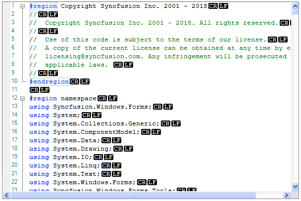

### Changing end of line style at runtime

The [EditControl](https://help.syncfusion.com/cr/windowsforms/Syncfusion.Windows.Forms.Edit.EditControl.html) allows to change the end of line style at run time by using the [SetNewLineStyle](https://help.syncfusion.com/cr/windowsforms/Syncfusion.Windows.Forms.Edit.EditControl.html#Syncfusion_Windows_Forms_Edit_EditControl_SetNewLineStyle_Syncfusion_IO_NewLineStyle_) method.





using System;
using System.Drawing;
using System.Windows.Forms;
using Syncfusion.Windows.Forms.Tools;

namespace Edit_demos
{  
    public partial class Form1 : Form
    {
        private Syncfusion.Windows.Forms.Edit.EditControl editControl1;
        private Syncfusion.Windows.Forms.Tools.ComboBoxAdv comboboxAdv1;
        public Form1()
        {
            InitializeComponent();
            this.editControl1 = new Syncfusion.Windows.Forms.Edit.EditControl();          
            this.editControl1.Location = new Point(20, 100);
            this.editControl1.Size = new Size(600, 400);
            this.editControl1.ShowEndOfLine = true;
            this.editControl1.LoadFile();
            this.Controls.Add(editControl1);

            comboboxAdv1 = new Syncfusion.Windows.Forms.Tools.ComboBoxAdv();
            this.comboboxAdv1.Location = new System.Drawing.Point(24, 118);
            this.comboboxAdv1.Size = new Size(120, 80);
            this.comboboxAdv1.Items.Add("Windows");
            this.comboboxAdv1.Items.Add("Mac");
            this.comboboxAdv1.Items.Add("Unix");
            this.comboboxAdv1.Items.Add("Control");
            this.comboboxAdv1.SelectedIndexChanged += ComboboxAdv1_SelectedIndexChanged;
            this.Controls.Add(this.comboboxAdv1);
        }

        private void ComboboxAdv1_SelectedIndexChanged(object sender, EventArgs e)
        {
            if((sender as ComboBoxAdv).SelectedIndex == 0)
                editControl1.SetNewLineStyle(Syncfusion.IO.NewLineStyle.Windows);
            else if ((sender as ComboBoxAdv).SelectedIndex == 1)
                editControl1.SetNewLineStyle(Syncfusion.IO.NewLineStyle.Mac);
            else if ((sender as ComboBoxAdv).SelectedIndex == 2)
                editControl1.SetNewLineStyle(Syncfusion.IO.NewLineStyle.Unix);
            else if ((sender as ComboBoxAdv).SelectedIndex == 3)
                editControl1.SetNewLineStyle(Syncfusion.IO.NewLineStyle.Control);
        }
    }
}





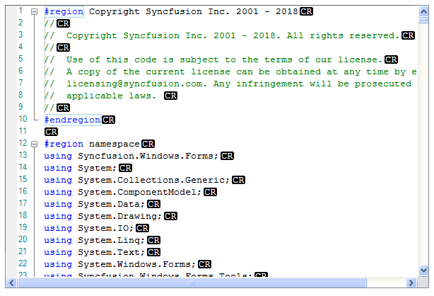

### Show or hide the end of line

The [EditControl](https://help.syncfusion.com/cr/windowsforms/Syncfusion.Windows.Forms.Edit.EditControl.html) allows to show or hide the end of line style characters by using the [ShowEndOfLine](https://help.syncfusion.com/cr/windowsforms/Syncfusion.Windows.Forms.Edit.EditControl.html#Syncfusion_Windows_Forms_Edit_EditControl_ShowEndOfLine) property. The default value of `ShowEndOfLine` property is `false`





using System;
using System.Drawing;
using System.Windows.Forms;
using Syncfusion.Windows.Forms.Tools;

namespace Edit_demos
{  
    public partial class Form1 : Form
    {
        private Syncfusion.Windows.Forms.Edit.EditControl editControl1;
        public Form1()
        {
            InitializeComponent();
            this.editControl1 = new Syncfusion.Windows.Forms.Edit.EditControl();          
            this.editControl1.Location = new Point(20, 100);
            this.editControl1.Size = new Size(600, 400);
            this.editControl1.ShowEndOfLine = true;
            this.editControl1.LoadFile();
            this.Controls.Add(editControl1);
        }
    }
}





### Appearance customization

The backcolor and forecolor of the end of line characters can be customized by using the [EndOfLineBackColor](https://help.syncfusion.com/cr/windowsforms/Syncfusion.Windows.Forms.Edit.EditControl.html#Syncfusion_Windows_Forms_Edit_EditControl_EndOfLineBackColor) and [EndOfLineForeColor](https://help.syncfusion.com/cr/windowsforms/Syncfusion.Windows.Forms.Edit.EditControl.html#Syncfusion_Windows_Forms_Edit_EditControl_EndOfLineForeColor) properties.





using System;
using System.Drawing;
using System.Windows.Forms;
using Syncfusion.Windows.Forms.Tools;

namespace Edit_demos
{  
    public partial class Form1 : Form
    {
        private Syncfusion.Windows.Forms.Edit.EditControl editControl1;
        public Form1()
        {
            InitializeComponent();
            this.editControl1 = new Syncfusion.Windows.Forms.Edit.EditControl();          
            this.editControl1.Location = new Point(20, 100);
            this.editControl1.Size = new Size(600, 400);
            this.editControl1.ShowEndOfLine = true;
            this.editControl1.DefaultNewLineStyle = Syncfusion.IO.NewLineStyle.Windows;
            this.editControl1.EndOfLineBackColor = Color.Red;
            this.editControl1.EndOfLineForeColor = Color.White;
            this.editControl1.LoadFile();
            this.Controls.Add(editControl1);
        }
    }
}





> Note: [View sample in GitHub](https://github.com/SyncfusionExamples/How-to-customize-the-end-of-line-style-in-Winforms-EditControl)

## Space indicators

The EditControl has the ability to indicate whitespace in its contents with default indicators explained as follows:

1. Single spaces are indicated by using dots.
2. Tabs are indicated by using right arrows.
3. Line feeds are indicated by using a special line feed symbol.

### Configure the space indicator

You can configure the whitespace indicators by setting the [ShowWhiteSpaces](https://help.syncfusion.com/cr/windowsforms/Syncfusion.Windows.Forms.Edit.EditControl.html#Syncfusion_Windows_Forms_Edit_EditControl_ShowWhitespaces) property to `true`. By default, this property is set to `false`.

<table>
<tr>
<th>Property</th>
<th>Description</th>
</tr>
<tr>
<td>ShowWhiteSpaces</td>
<td>Specifies value indicating whether whitespace should be shown as special symbols or not.</td>
</tr>
</table>

You can also toggle the visibility of the whitespace indicators by using the [ToggleShowingWhiteSpaces](https://help.syncfusion.com/cr/windowsforms/Syncfusion.Windows.Forms.Edit.EditControl.html#Syncfusion_Windows_Forms_Edit_EditControl_ToggleShowingWhiteSpaces) function.





// Enabling white space indicators.

this.editControl1.ShowWhitespaces = true;

// Toggle the visibility of the white space indicators.

this.editControl1.ToggleShowingWhiteSpaces();





' Enabling white space indicators.

Me.editControl1.ShowWhitespaces = True

' Toggle the visibility of the white space indicators.

Me.editControl1.ToggleShowingWhiteSpaces()





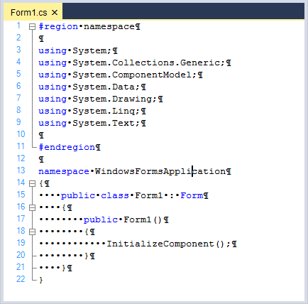

**Showing or hiding indicators**

You can selectively show or hide the whitespace indicators by using the following sub-properties of the [WhiteSpaceIndicators](https://help.syncfusion.com/cr/windowsforms/Syncfusion.Windows.Forms.Edit.EditControl.html#Syncfusion_Windows_Forms_Edit_EditControl_WhiteSpaceIndicators) property: ShowSpaces, ShowTabs, and ShowNewLines.

<table>
<tr>
<th>
Properties</th><th>
Description</th></tr>
<tr>
<td>
{{ '[ShowSpaces](https://help.syncfusion.com/cr/windowsforms/Syncfusion.Windows.Forms.Edit.Utils.ShowWhiteSpaceProperties.html#Syncfusion_Windows_Forms_Edit_Utils_ShowWhiteSpaceProperties_ShowSpaces)' | markdownify }}</td><td>
Indicates whether spaces should be replaced with symbols or not.</td></tr>
<tr>
<td>
{{ '[ShowTabs](https://help.syncfusion.com/cr/windowsforms/Syncfusion.Windows.Forms.Edit.Utils.ShowWhiteSpaceProperties.html#Syncfusion_Windows_Forms_Edit_Utils_ShowWhiteSpaceProperties_ShowTabs)' | markdownify }}</td><td>
Indicates whether tabs should be replaced with symbols or not.</td></tr>
<tr>
<td>
{{ '[ShowNewLines](https://help.syncfusion.com/cr/windowsforms/Syncfusion.Windows.Forms.Edit.Utils.ShowWhiteSpaceProperties.html#Syncfusion_Windows_Forms_Edit_Utils_ShowWhiteSpaceProperties_ShowNewLines)' | markdownify }}</td><td>
Indicates whether new lines should be replaced with symbols or not.</td></tr>
</table>





// Custom indicator for Line Feed.

this.editControl1.WhiteSpaceIndicators.ShowSpaces = true;

// Custom indicator for Tab.

this.editControl1.WhiteSpaceIndicators.ShowTabs = true;

// Custom indicator for Space Character.

this.editControl1.WhiteSpaceIndicators.SpaceNewLines = true;





' Custom indicator for Line Feed. 

Me.editControl1.WhiteSpaceIndicators.ShowSpaces = True 

' Custom indicator for Tab.

Me.editControl1.WhiteSpaceIndicators.ShowTabs = True 

' Custom indicator for Space Character. 

Me.editControl1.WhiteSpaceIndicators.SpaceNewLines = True





### Space indicator character

You can also set the indicators to indicate single spaces, tabs, and line feeds by using the NewLineString, TabString, and SpaceChar sub-properties of the WhiteSpaceIndicators property as follows.

<table>
<tr>
<th>
Properties</th><th>
Description</th></tr>
<tr>
<td>
{{ '[NewLineString](https://help.syncfusion.com/cr/windowsforms/Syncfusion.Windows.Forms.Edit.Utils.ShowWhiteSpaceProperties.html#Syncfusion_Windows_Forms_Edit_Utils_ShowWhiteSpaceProperties_NewLineString)' | markdownify }}</td><td>
Specifies the string that represents line feed in WhiteSpace mode.</td></tr>
<tr>
<td>
{{ '[TabString](https://help.syncfusion.com/cr/windowsforms/Syncfusion.Windows.Forms.Edit.Utils.ShowWhiteSpaceProperties.html#Syncfusion_Windows_Forms_Edit_Utils_ShowWhiteSpaceProperties_TabString)' | markdownify }}</td><td>
Specifies the string that represents Tab in WhiteSpace mode.</td></tr>
<tr>
<td>
{{ '[SpaceChar](https://help.syncfusion.com/cr/windowsforms/Syncfusion.Windows.Forms.Edit.Utils.ShowWhiteSpaceProperties.html#Syncfusion_Windows_Forms_Edit_Utils_ShowWhiteSpaceProperties_SpaceChar)' | markdownify }}</td><td>
Specifies the character that represents line feed in WhiteSpace mode.</td></tr>
</table>





// Custom indicator for Line Feed.

this.editControl1.WhiteSpaceIndicators.NewLineString = "LF";

// Custom indicator for Tab.

this.editControl1.WhiteSpaceIndicators.TabString = "TAB";

// Custom indicator for Space Character.

this.editControl1.WhiteSpaceIndicators.SpaceChar = "s";





' Custom indicator for Line Feed.

Me.editControl1.WhiteSpaceIndicators.NewLineString = "LF"

' Custom indicator for Tab.

Me.editControl1.WhiteSpaceIndicators.TabString = "TAB"

' Custom indicator for Space Character.

Me.editControl1.WhiteSpaceIndicators.SpaceChar = "s"





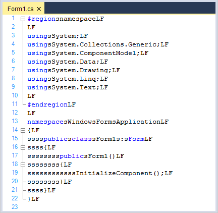

## Unicode

`Unicode` is a standard used to encode all the languages of the world in computers. All Unicode text is saved in UTF-8 format by default. It also supports other text encoding formats specified in the System.Text.Encoding class like ASCII, UTF7, UTF8, and BigEndianUnicode.

The following screenshot illustrates the use of Chinese, Arabic, Hindi, Russian, and Greek text in the EditControl.

N> Refer to the following sample link that demonstrates the `Unicode` support in EditControl:
C:\Users\&lt;User&gt;\AppData\Local\Syncfusion\EssentialStudio\Version Number\Windows\Edit.Windows\Samples\Text Operations\Unicode
