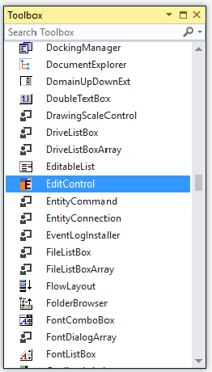
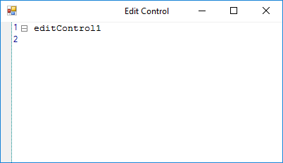
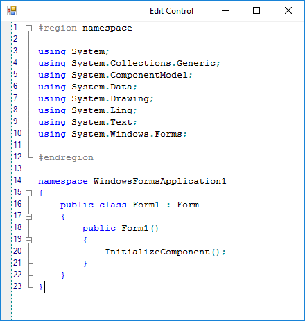

# Getting Started with Windows Forms Syntax Editor

This section explains how to create an interactive code editor application like Microsoft Visual Studio Editor by using the EditControl.

## Assembly deployment

Refer to the [Control Dependencies](https://help.syncfusion.com/windowsforms/control-dependencies#editcontrol) section to get the list of assemblies or details of NuGet package that needs to be added as reference to use the control in any application.

Refer to [NuGet Packages](https://help.syncfusion.com/windowsforms/installation/install-nuget-packages) to learn how to install nuget packages in a Windows Forms application.

## Adding EditControl via designer

1) Create a new Windows Forms project in Visual Studio.

2) Add the [EditControl](https://help.syncfusion.com/cr/windowsforms/Syncfusion.Windows.Forms.Edit.EditControl.html) to an application by dragging it from the toolbox to a designer view. The following dependent assemblies will be added automatically:

* Syncfusion.Shared.Base
* Syncfusion.Tools.Windows
* Syncfusion.Edit.Windows

## Adding EditControl via code

To add the control manually in C#, follow the given steps:

1) Create a C# or VB application via Visual Studio.

2) Add the following assembly references to the project:

* Syncfusion.Shared.Base
* Syncfusion.Tools.Windows
* Syncfusion.Edit.Windows

3) Create an instance of the [EditControl](https://help.syncfusion.com/cr/windowsforms/Syncfusion.Windows.Forms.Edit.EditControl.html), and then add it to the form.





// Create the EditControl instance.

private Syncfusion.Windows.Forms.Edit.EditControl editControl1;

editControl1 = new Syncfusion.Windows.Forms.Edit.EditControl();

// Set an appropriate size for the EditControl.

editControl1.Size = new Size(50, 50);

// Set the Dock property to the appropriate DockStyle enumeration value if desired.

editControl1.Dock = DockStyle.Fill;

// Set an appropriate BorderStyle to the EditControl instance.

editControl1.BorderStyle = BorderStyle.Fixed3D;

// Adding the edit control to the form.

this.Controls.Add(editControl1);





'Create the EditControl instance.

private editControl1 As Syncfusion.Windows.Forms.Edit.EditControl

editControl1 = New Syncfusion.Windows.Forms.Edit.EditControl()

'Set an appropriate size for the EditControl.

editControl1.Size = New Size(50, 50)

' Set the Dock property to the appropriate DockStyle enumeration value if desired.

editControl1.Dock = DockStyle.Fill

'Set an appropriate BorderStyle to the EditControl instance.

editControl1.BorderStyle = BorderStyle.Fixed3D

' Adding the edit control to the form.

Me.Controls.Add(editControl1)





## Loading a file into document

This option helps to load a file into the EditControl.





// Loading the files into edit control by passing the file name as parameter to the LoadFile function.

this.editControl1.LoadFile(Path.GetDirectoryName(Application.ExecutablePath) + @"\..\..\FileName.cs");





` Loading the files into edit control by passing the file name as parameter to the LoadFile function.

Me.editControl1.LoadFile(Path.GetDirectoryName(Application.ExecutablePath) + @"\..\..\FileName.cs")





## Syntax highlighting

The [EditControl](https://help.syncfusion.com/cr/windowsforms/Syncfusion.Windows.Forms.Edit.EditControl.html) offers mostly-used languages such as C#, VB, XML, HTML, JScript, PowerShell, and SQL as built-in languages. It also provides support to configure a new custom language.

The EditControl has built-in syntax highlighting support for the following languages:

* C#
* VB.NET
* XML
* HTML
* Java
* SQL
* PowerShell
* C
* JavaScript
* VBScript
* Delphi





// Considering configuration settings for C# as an example. Using the [KnownLanguages](https://help.syncfusion.com/cr/windowsforms/Syncfusion.Windows.Forms.Edit.Enums.KnownLanguages.html) enumerator.

this.editControl1.ApplyConfiguration(KnownLanguages.CSharp);





' Considering configuration settings for C# as an example. Using the [KnownLanguages](https://help.syncfusion.com/cr/windowsforms/Syncfusion.Windows.Forms.Edit.Enums.KnownLanguages.html) enumerator.

Me.editControl1.ApplyConfiguration(KnownLanguages.CSharp)





## Custom language configuration

The EditControl provides supports custom language configuration. You can plug-in an external configuration file that defines a custom language to the EditControl using the [Configurator.Open](https://help.syncfusion.com/cr/windowsforms/Syncfusion.Windows.Forms.Edit.EditControl.html#Syncfusion_Windows_Forms_Edit_EditControl_Configurator) and [ApplyConfiguration](https://help.syncfusion.com/cr/windowsforms/Syncfusion.Windows.Forms.Edit.EditControl.html#Syncfusion_Windows_Forms_Edit_EditControl_ApplyConfiguration_Syncfusion_Windows_Forms_Edit_Enums_KnownLanguages_) functions.

1) Create a configuration file.



<?xml version="1.0" encoding="utf-8" ?>
<ArrayOfConfigLanguage>
	<ConfigLanguage name="LISP">
			<format name="Text" Font="Courier New, 10pt" FontColor="Salmon" />
		<formats>
			<format name="KeyWord" Font="Courier New, 10pt" FontColor="Blue" />
			<format name="String" Font="Courier New, 10pt, style=Bold" FontColor="Red" />
			<format name="Operator" Font="Courier New, 10pt" FontColor="DarkCyan" />
		</formats>
		<extensions>
			<extension>lsp</extension>
		</extensions>
		<lexems>
			<lexem BeginBlock="(" Type="Operator" />
			<lexem BeginBlock=")" Type="Operator" />
			<lexem BeginBlock="'" Type="Operator" />
			<lexem BeginBlock="car" Type="KeyWord" />
			<lexem BeginBlock="cdr" Type="KeyWord" />
			<lexem BeginBlock="cons" Type="KeyWord" />
		</lexems>
		<splits>
			<split>#Region</split>
			<split>#End Region</split>
		</splits>
	</ConfigLanguage>
</ArrayOfConfigLanguage>



2) Apply the configuration file into the EditControl.





private string configFile = Path.GetDirectoryName(Application.ExecutablePath) + @"\..\..\config.xml";

// Plug-in an external configuration file.

this.editControl1.Configurator.Open(configFile);

// Apply the configuration defined in the configuration file.

this.editControl1.ApplyConfiguration("LISP");





private string configFile = Path.GetDirectoryName(Application.ExecutablePath) + @"\..\..\config.xml";

' Plug-in an external configuration file.

Me.editControl1.Configurator.Open(configFile)

' Apply the configuration defined in the configuration file.

Me.editControl1.ApplyConfiguration("LISP")





N> You can refer to our [WinForms Syntax Editor](https://www.syncfusion.com/winforms-ui-controls/syntax-editor) feature tour page for its unique feature sets. You can also explore our [WinForms Syntax Editor example](https://github.com/syncfusion/winforms-demos/tree/master/edit) that shows how to create interactive code editor applications with syntax highlighting, text indentation, intellisense, etc,.