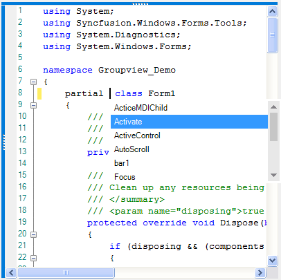
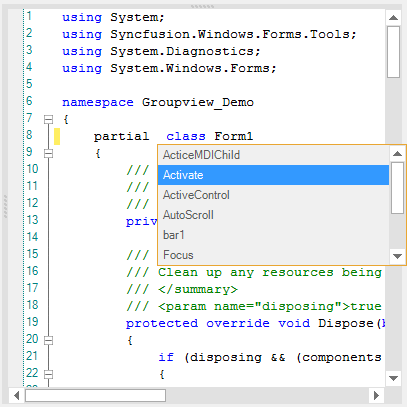
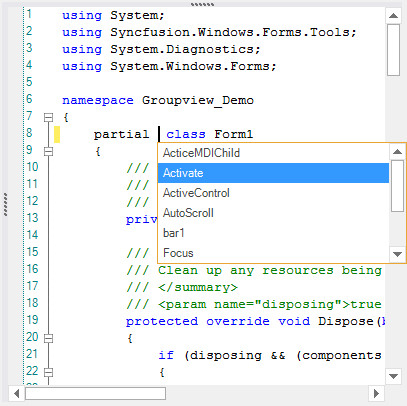
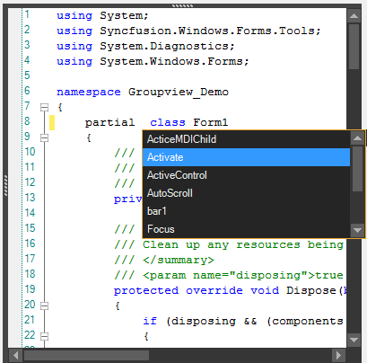

# Style in Windows Forms Syntax Editor

The EditControl control has rich set of themes for professional representation. You can easily modify the look and feel of the EditControl using the built-in themes.

It has the below themes.

•	Default

•	WindowsXP

•	Office2016Colorful

•	Office2016White

•	Office2016DarkGray

•	Office2016Black

The following code example allows you to set the style for the EditControl.

## Default

This option helps to set the Default theme.





this.editControl1.Style = Syncfusion.Windows.Forms.Edit.EditControlStyle.Default;





Me.editControl1.Style = Syncfusion.Windows.Forms.Edit.EditControlStyle.Default





## WindowsXP

This option helps to set the WindowsXP theme.





this.editControl1.Style = Syncfusion.Windows.Forms.Edit.EditControlStyle.WindowsXP;





Me.editControl1.Style = Syncfusion.Windows.Forms.Edit.EditControlStyle.WindowsXP





## Office2016Colorful

This option helps to set the Office2016Colorful theme.





this.editControl1.Style = Syncfusion.Windows.Forms.Edit.EditControlStyle.Office2016Colorful;





Me.editControl1.Style = Syncfusion.Windows.Forms.Edit.EditControlStyle.Office2016Colorful





## Office2016White

This option helps to set the Office2016White theme.





this.editControl1.Style = Syncfusion.Windows.Forms.Edit.EditControlStyle.Office2016White;





Me.editControl1.Style = Syncfusion.Windows.Forms.Edit.EditControlStyle.Office2016White





## Office2016DarkGray

This option helps to set the Office2016DarkGray theme.





this.editControl1.Style = Syncfusion.Windows.Forms.Edit.EditControlStyle.Office2016DarkGray;





Me.editControl1.Style = Syncfusion.Windows.Forms.Edit.EditControlStyle.Office2016DarkGray





## Office2016Black

This option helps to set the Office2016Black theme.





this.editControl1.Style = Syncfusion.Windows.Forms.Edit.EditControlStyle.Office2016Black;





Me.editControl1.Style = Syncfusion.Windows.Forms.Edit.EditControlStyle.Office2016Black





