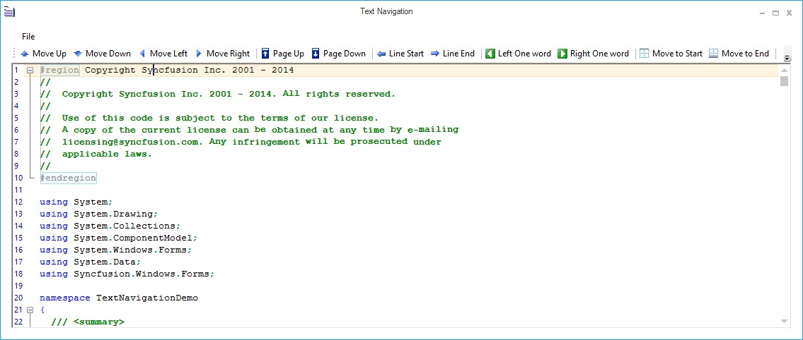
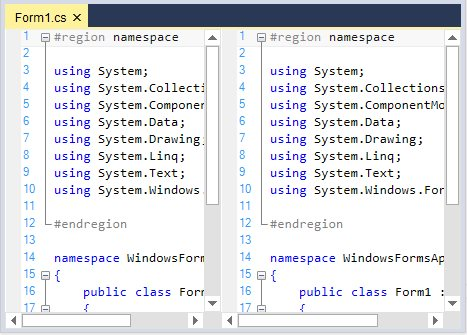

# Text Navigation in Windows Forms Syntax Editor

The EditControl offers extensive support for text navigation. You can perform navigation at the character, word, line, page, or entire document levels. This section briefly explains navigation of text in the EditControl.

## Character based navigation

The following functions enables text navigation in the EditControl in terms of characters or columns.

<table>
<tr>
<th>
Functions</th><th>
Description</th></tr>
<tr>
<td>
{{ '[MoveUp](https://help.syncfusion.com/cr/windowsforms/Syncfusion.Windows.Forms.Edit.EditControl.html#Syncfusion_Windows_Forms_Edit_EditControl_MoveUp)' | markdownify }}</td><td>
Moves cursor up, if possible.</td></tr>
<tr>
<td>
{{ '[MoveDown](https://help.syncfusion.com/cr/windowsforms/Syncfusion.Windows.Forms.Edit.EditControl.html#Syncfusion_Windows_Forms_Edit_EditControl_MoveDown)' | markdownify }}</td><td>
Moves cursor down, if possible.</td></tr>
<tr>
<td>
{{ '[MoveLeft](https://help.syncfusion.com/cr/windowsforms/Syncfusion.Windows.Forms.Edit.EditControl.html#Syncfusion_Windows_Forms_Edit_EditControl_MoveLeft)' | markdownify }}
</td><td>
Moves cursor left, if possible.</td></tr>
<tr>
<td>
{{ '[MoveRight](https://help.syncfusion.com/cr/windowsforms/Syncfusion.Windows.Forms.Edit.EditControl.html#Syncfusion_Windows_Forms_Edit_EditControl_MoveRight)' | markdownify }}</td><td>
Moves cursor right, if possible.</td></tr>
</table>





this.editControl1.MoveUp();

this.editControl1.MoveDown();

this.editControl1.MoveLeft();

this.editControl1.MoveRight();





Me.editControl1.MoveUp()

Me.editControl1.MoveDown()

Me.editControl1.MoveLeft()

Me.editControl1.MoveRight()





## Word based navigation

The following functions enables text navigation in the EditControl in terms of words.

<table>
<tr>
<th>
Functions</th><th>
Description</th></tr>
<tr>
<td>
{{ '[MoveLeftWord](https://help.syncfusion.com/cr/windowsforms/Syncfusion.Windows.Forms.Edit.EditControl.html#Syncfusion_Windows_Forms_Edit_EditControl_MoveLeftWord)' | markdownify }}</td><td>
Moves caret to the left by one word.</td></tr>
<tr>
<td>
{{ '[MoveRightWord](https://help.syncfusion.com/cr/windowsforms/Syncfusion.Windows.Forms.Edit.EditControl.html#Syncfusion_Windows_Forms_Edit_EditControl_MoveRightWord)' | markdownify }}</td><td>
Moves caret to the right by one word.</td></tr>
</table>





this.editControl1.MoveLeftWord();

this.editControl1.MoveRightWord();





Me.editControl1.MoveLeftWord()

Me.editControl1.MoveRightWord()





## Line based navigation

The following functions enables text navigation in the EditControl in terms of lines.

<table>
<tr>
<th>
Functions</th><th>
Description</th></tr>
<tr>
<td>
{{ '[MoveToLineStart](https://help.syncfusion.com/cr/windowsforms/Syncfusion.Windows.Forms.Edit.EditControl.html#Syncfusion_Windows_Forms_Edit_EditControl_MoveToLineStart)' | markdownify }}</td><td>
Moves caret to the beginning of the line. First whitespace will be skipped.</td></tr>
<tr>
<td>
{{ '[MoveToLineEnd](https://help.syncfusion.com/cr/windowsforms/Syncfusion.Windows.Forms.Edit.EditControl.html#Syncfusion_Windows_Forms_Edit_EditControl_MoveToLineEnd)' | markdownify }}</td><td>
Moves caret to the end of the line.</td></tr>
</table>





this.editControl1.MoveToLineStart();

this.editControl1.MoveToLineEnd();





Me.editControl1.MoveToLineStart()

Me.editControl1.MoveToLineEnd()





## Page based navigation

The following functions enables text navigation in the EditControl in terms of pages.

<table>
<tr>
<th>
Functions</th><th>
Description</th></tr>
<tr>
<td>
{{ '[MovePageUp](https://help.syncfusion.com/cr/windowsforms/Syncfusion.Windows.Forms.Edit.EditControl.html#Syncfusion_Windows_Forms_Edit_EditControl_MovePageUp)' | markdownify }}</td><td>
Moves caret one page up.</td></tr>
<tr>
<td>
{{ '[MovePageDown](https://help.syncfusion.com/cr/windowsforms/Syncfusion.Windows.Forms.Edit.EditControl.html#Syncfusion_Windows_Forms_Edit_EditControl_MovePageDown)' | markdownify }}</td><td>
Moves caret one page down.</td></tr>
</table>





this.editControl1.MovePageUp();

this.editControl1.MovePageDown();





Me.editControl1.MovePageUp()

Me.editControl1.MovePageDown()





## Block based navigation

Position the keyboard cursor at the beginning and end of the indentation block by using the [JumpToIndentBlockStart](https://help.syncfusion.com/cr/windowsforms/Syncfusion.Windows.Forms.Edit.EditControl.html#Syncfusion_Windows_Forms_Edit_EditControl_JumpToIndentBlockStart) and [JumpToIndentBlockEnd](https://help.syncfusion.com/cr/windowsforms/Syncfusion.Windows.Forms.Edit.EditControl.html#Syncfusion_Windows_Forms_Edit_EditControl_JumpToIndentBlockEnd) functions respectively.





this.editControl1.JumpToIndentBlockStart();

this.editControl1.JumpToIndentBlockEnd();





Me.editControl1.JumpToIndentBlockStart()

Me.editControl1.JumpToIndentBlockEnd()





## Document based navigation

The following functions enables text navigation in the EditControl in terms of documents.

<table>
<tr>
<th>
Functions</th><th>
Description</th></tr>
<tr>
<td>
{{ '[MoveToBeginning](https://help.syncfusion.com/cr/windowsforms/Syncfusion.Windows.Forms.Edit.EditControl.html#Syncfusion_Windows_Forms_Edit_EditControl_MoveToBeginning)' | markdownify }}</td><td>
Moves caret to the beginning of the file.</td></tr>
<tr>
<td>
{{ '[MoveToEnd](https://help.syncfusion.com/cr/windowsforms/Syncfusion.Windows.Forms.Edit.EditControl.html#Syncfusion_Windows_Forms_Edit_EditControl_MoveToEnd)' | markdownify }}</td><td>
Moves caret to the end of the file.</td></tr>
</table>





this.editControl1.MoveToBeginning();

this.editControl1.MoveToEnd();





Me.editControl1.MoveToBeginning()

Me.editControl1.MoveToEnd()





### Retrieve current word

Retrieves the current word in the EditControl by using the [GetCurrentWord](https://help.syncfusion.com/cr/windowsforms/Syncfusion.Windows.Forms.Edit.EditControl.html#Syncfusion_Windows_Forms_Edit_EditControl_GetCurrentWord) function.





Console.WriteLine(this.editControl1.GetCurrentWord().ToString());





Me.WriteLine(this.editControl1.GetCurrentWord().ToString())





### Retrieve current column index in line

Retrieves the current word column index in the EditControl by using the [GetCurrentWordColumn](https://help.syncfusion.com/cr/windowsforms/Syncfusion.Windows.Forms.Edit.EditControl.html#Syncfusion_Windows_Forms_Edit_EditControl_GetCurrentWordColumn) function and [CurrentColumn](https://help.syncfusion.com/cr/windowsforms/Syncfusion.Windows.Forms.Edit.EditControl.html#Syncfusion_Windows_Forms_Edit_EditControl_CurrentColumn) property.





Console.WriteLine(this.editControl1.GetCurrentWordColumn().ToString());

Console.WriteLine(this.editControl1.CurrentColumn);





Me.WriteLine(this.editControl1.GetCurrentWordColumn().ToString())

Me.WriteLine(this.editControl1.CurrentColumn)





### Retrieve current line index

Retrieves the current word column index in the EditControl by using the [CurrentLine](https://help.syncfusion.com/cr/windowsforms/Syncfusion.Windows.Forms.Edit.EditControl.html#Syncfusion_Windows_Forms_Edit_EditControl_CurrentLine) property.





Console.WriteLine(this.editControl1.CurrentLine);





Me.WriteLine(this.editControl1.CurrentLine)





N> Refer to the following sample link that demonstrates the text navigation functionalities in the EditControl:
C:\Users\&lt;User&gt;\AppData\Syncfusion\EssentialStudio\Version Number\Windows\Edit.Windows\Samples\Text Navigation\Text Navigation

## Scrolling

The EditControl offers extremely smooth scrolling behavior by using the idle-time processing and dynamic scroll area expansion techniques. The scrolling behavior is smooth even when loading large files though the EditControl scrolls by several hundred lines for a small movement of the scroller.

The scrollers in the EditControl can be optionally shown or hidden by using the following properties.

<table>
<tr>
<th>
Properties</th><th>
Description</th></tr>
<tr>
<td>
{{ '[ShowVerticalScroller](https://help.syncfusion.com/cr/windowsforms/Syncfusion.Windows.Forms.Edit.EditControl.html#Syncfusion_Windows_Forms_Edit_EditControl_ShowVerticalScroller)' | markdownify }}</td><td>
Specifies a value indicating whether the vertical scroller can be shown or not.</td></tr>
<tr>
<td>
{{ '[ShowHorizontalScroller](https://help.syncfusion.com/cr/windowsforms/Syncfusion.Windows.Forms.Edit.EditControl.html#Syncfusion_Windows_Forms_Edit_EditControl_ShowHorizontalScroller)' | markdownify }}</td><td>
Specifies a value indicating whether the horizontal scroller can be shown or not.</td></tr>
<tr>
<td>
{{ '[AlwaysShowScrollers](https://help.syncfusion.com/cr/windowsforms/Syncfusion.Windows.Forms.Edit.EditControl.html#Syncfusion_Windows_Forms_Edit_EditControl_AlwaysShowScrollers)' | markdownify }}</td><td>
Specifies a value indicating whether scrollers should always be visible or not.</td></tr>
</table>





// Display the Horizontal Scroller.

this.editControl1.ShowHorizontalScroller = true;

// Display the Vertical Scroller.

this.editControl1.ShowVerticalScroller = true;

this.editControl1.AlwaysShowScrollers = true;





// Display the Horizontal Scroller.

Me.editControl1.ShowHorizontalScroller = True

// Display the Vertical Scroller.

Me.editControl1.ShowVerticalScroller = True

Me.editControl1.AlwaysShowScrollers = True





Supports scroller events that are raised when the scroll arrows are clicked. The scroller events are used to synchronize the scrolling of multiple EditControls.

### Scroll position and offsets

The scroll position and offsets of the EditControl are set by using the following properties.

<table>
<tr>
<th>
Properties</th><th>
Description</th></tr>
<tr>
<td>
{{ '[ScrollPosition](https://help.syncfusion.com/cr/windowsforms/Syncfusion.Windows.Forms.Edit.EditControl.html#Syncfusion_Windows_Forms_Edit_EditControl_ScrollPosition)' | markdownify }}</td><td>
Specifies scroll position of the EditControl.</td></tr>
<tr>
<td>
{{ '[ScrollOffsetBottom](https://help.syncfusion.com/cr/windowsforms/Syncfusion.Windows.Forms.Edit.EditControl.html#Syncfusion_Windows_Forms_Edit_EditControl_ScrollOffsetBottom)' | markdownify }}</td><td>
Specifies the bottom scroll offset.</td></tr>
<tr>
<td>
{{ '[ScrollOffsetLeft](https://help.syncfusion.com/cr/windowsforms/Syncfusion.Windows.Forms.Edit.EditControl.html#Syncfusion_Windows_Forms_Edit_EditControl_ScrollOffsetLeft)' | markdownify }}</td><td>
Specifies the left scroll offset.</td></tr>
<tr>
<td>
{{ '[ScrollOffsetRight](https://help.syncfusion.com/cr/windowsforms/Syncfusion.Windows.Forms.Edit.EditControl.html#Syncfusion_Windows_Forms_Edit_EditControl_ScrollOffsetRight)' | markdownify }}</td><td>
Specifies the right scroll offset.</td></tr>
<tr>
<td>
{{ '[ScrollOffsetTop](https://help.syncfusion.com/cr/windowsforms/Syncfusion.Windows.Forms.Edit.EditControl.html#Syncfusion_Windows_Forms_Edit_EditControl_ScrollOffsetTop)' | markdownify }}</td><td>
Specifies the top scroll offset.</td></tr>
</table>





this.editControl1.ScrollPosition = new Point(1, 5);

this.editControl1.ScrollOffsetBottom = 5;

this.editControl1.ScrollOffsetLeft = 10;

this.editControl1.ScrollOffsetTop = 5;

this.editControl1.ScrollOffsetTop = 10;





Me.editControl1.ScrollPosition = New Point(1, 5) 

Me.editControl1.ScrollOffsetBottom = 5 

Me.editControl1.ScrollOffsetLeft = 10 

Me.editControl1.ScrollOffsetTop = 5 

Me.editControl1.ScrollOffsetTop = 10





